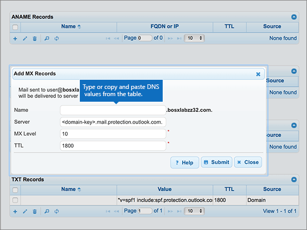
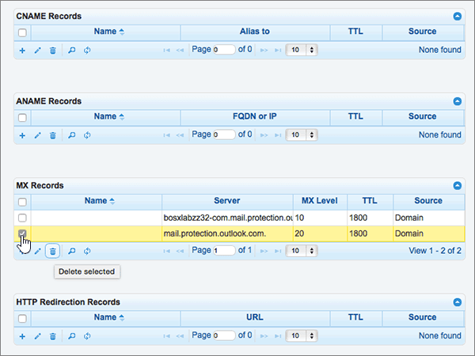
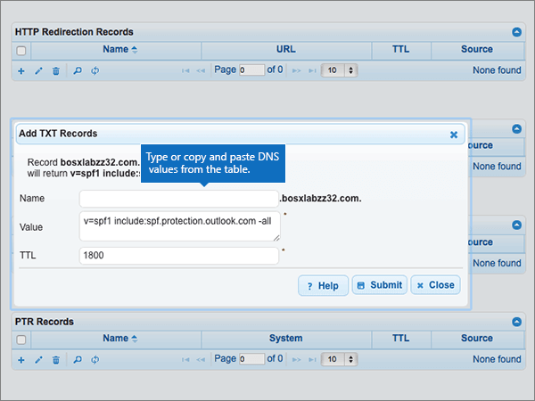

# Criar registros DNS no DNSMadeEasy para o Office 365

 **Caso não encontre o conteúdo que está procurando, [verifique as perguntas frequentes sobre domínios](../setup/domains-faq.md)**. 
  
Se você usa a DNSMadeEasy como provedor de hospedagem DNS, siga as etapas deste artigo para verificar o domínio e configurar registros DNS para o Skype for Business Online, email e outros serviços.
  
Depois que você adicionar esses registros na DNSMadeEasy, o domínio será configurado para funcionar com os serviços do Office 365.
  
Para saber mais sobre hospedagem na Web e DNS para sites com o Office 365, confira [Usar um site público com o Office 365](https://support.office.com/article/choose-a-public-website-3325d50e-d131-403c-a278-7f3296fe33a9).
  
> [!NOTE]
> Typically it takes about 15 minutes for DNS changes to take effect. However, it can occasionally take longer for a change you've made to update across the Internet's DNS system. Se você estiver tendo problemas com o fluxo de emails ou com outros problemas após adicionar registros DNS, consulte [Localizar e corrigir problemas após adicionar seu domínio ou registros DNS no Office 365](../get-help-with-domains/find-and-fix-issues.md). 
  
## Adicionar um registro TXT para verificação

Antes de usar o seu domínio com o Office 365, precisamos verificar se você é o proprietário dele. A capacidade de entrar na conta do seu registrador de domínios e criar o registro DNS prova ao Office 365 que você é o proprietário do domínio.
  
> [!NOTE]
> Esse registro é usado exclusivamente para confirmar se você é o proprietário do domínio; ele não afeta mais nada. É possível excluí-lo mais tarde, se desejar. 
  
> [!IMPORTANT]
> Para contas do DNSMadeEasy, o domínio adicionado foi comprado de um registrador de domínio separado. O DNSMadeEasy não oferece serviços de registro de domínio. Sua capacidade de fazer logon em DNSMadeEasy e criar o registro DNS é uma prova de propriedade suficiente. 
  
1. Para começar, vá para sua página de domínios no DNSMadeEasy usando [este link](https://cp.dnsmadeeasy.com/). Será solicitado que você faça logon primeiro.
    
2. Na página **console de gerenciamento** , na área **domínios atualizados recentemente** , selecione o domínio que você deseja atualizar. 
    
3. Na página **DNS gerenciado** , na área **registros txt** , selecione o controle ( **+**) ( **Adicionar novo**).
    
    (You may have to scroll down.)
    
4. In the **Add TXT Records** area, in the boxes for the new record, type or copy and paste the values from the following table. 
    
    ||||
    |:-----|:-----|:-----|
    |**Nome**   |**Valor**   |**TTL**   |
    |(Deixe este campo vazio.)    |MS = ms *XXXXXXXX*    **Observação:** Este é um exemplo. Use aqui o valor específico de **Destino ou Pontos de Endereçamento**, retirado da tabela em Office 365. [Como faço para encontrar isso?](../get-help-with-domains/information-for-dns-records.md)          |1800    |
   
5. Selecione **Enviar**.
    
6. Aguarde alguns minutos antes de prosseguir para que o registro que você acabou de criar possa ser atualizado na Internet.
    
Now that you've added the record at your domain registrar's site, you'll go back to Office 365 and request Office 365 to look for the record.
  
When Office 365 finds the correct TXT record, your domain is verified.
  
1. No centro de administração, vá para a página de <a href="https://go.microsoft.com/fwlink/p/?linkid=834818" target="_blank">domínios</a> de **configurações** \> .

    
2. Na página **domínios** , selecione o domínio que você está verificando. 
    
3. Na página **configuração** , selecione **Iniciar configuração**.
    
4. Na página **verificar domínio** , selecione **verificar**.
    
> [!NOTE]
> Typically it takes about 15 minutes for DNS changes to take effect. However, it can occasionally take longer for a change you've made to update across the Internet's DNS system. Se você estiver tendo problemas com o fluxo de emails ou com outros problemas após adicionar registros DNS, consulte [Localizar e corrigir problemas após adicionar seu domínio ou registros DNS no Office 365](../get-help-with-domains/find-and-fix-issues.md). 
  
## Adicionar um registro MX para que o email do domínio vá para o Office 365

1. Para começar, vá para sua página de domínios no DNSMadeEasy usando [este link](https://cp.dnsmadeeasy.com/). Será solicitado que você faça logon primeiro.
    
2. Na página **console de gerenciamento** , na área **domínios atualizados recentemente** , selecione o domínio que você deseja atualizar. 
    
    Na página **console de gerenciamento** , na área **domínios atualizados recentemente** , selecione o domínio que você deseja atualizar. 
    
    
  
3. Na página **DNS gerenciado** , na área **registros MX** , selecione o controle **(+)** ( **Adicionar novo**).
    
    (You may have to scroll down.)
    
    
  
4. Na área **Adicionar Registros MX**, nas caixas do novo registro, digite ou copie e cole os valores da tabela a seguir. 
    
    (Pode ser necessário rolar para baixo.)
    
    |**Nome**|**Servidor**|**Nível de MX**|**TTL**|
    |:-----|:-----|:-----|:-----|
    |(Deixe este campo vazio.)    | *\<chave-do-domínio\>*  .mail.protection.outlook.com    **Este valor deve OBRIGATORIAMENTE terminar com um ponto (.)**   **Observação:** Obtenha sua \< *chave* \> de domínio de sua conta do Office 365. [Como faço para encontrar isso?](../get-help-with-domains/information-for-dns-records.md)          |10     Para saber mais sobre prioridade, confira [O que é prioridade MX?](https://support.office.com/article/2784cc4d-95be-443d-b5f7-bb5dd867ba83.aspx)   |1800    |
   
    
  
5. Selecione **Enviar**.
    
    
  
6. Se houver outros registros MX listados na seção **Registros MX**, exclua todos eles selecionando cada um deles. 
    
    
  
7. Quando todos os registros estiverem selecionados, selecione **excluir selecionado**.
    
    
  
8. Na caixa de diálogo **excluir registros MX** , selecione **excluir** para confirmar suas alterações. 
    
    
  
## Adicionar os cinco registros CNAME necessários para o Office 365

1. Para começar, vá para sua página de domínios no DNSMadeEasy usando [este link](https://cp.dnsmadeeasy.com/). Será solicitado que você faça logon primeiro.
    
2. Na página **console de gerenciamento** , na área **domínios atualizados recentemente** , selecione o domínio que você deseja atualizar. 
    
3. Na página **DNS gerenciado** , na área **registros CNAME** , selecione o controle **(+)** ( **Adicionar novo**).
    
    (Pode ser necessário rolar para baixo.)
    
    
  
4. Adicione o primeiro dos cinco registros CNAME.
    
    Na área **Adicionar Registros CNAME**, nas caixas do novo registro, digite ou copie e cole os valores da primeira linha da tabela a seguir. 
    
    |**Nome**|**Alias para**|**TTL**|
    |:-----|:-----|:-----|
    |autodiscover    |autodiscover.outlook.com.    **Este valor deve OBRIGATORIAMENTE terminar com um ponto (.)**   |1800    |
    |sip    |sipdir.online.lync.com.    **Este valor deve OBRIGATORIAMENTE terminar com um ponto (.)**   |1800    |
    |lyncdiscover    |webdir.online.lync.com.    **Este valor deve OBRIGATORIAMENTE terminar com um ponto (.)**   |1800    |
    |enterpriseregistration    |enterpriseregistration.windows.net.    **Este valor deve OBRIGATORIAMENTE terminar com um ponto (.)**   |1800    |
    |enterpriseenrollment    |enterpriseenrollment-s.manage.microsoft.com.    **Este valor deve OBRIGATORIAMENTE terminar com um ponto (.)**   |1800    |
   
    
  
5. Selecione **Enviar**.
    
    
  
6. Adicione cada um dos outros quatro registros CNAME.
    
    Na seção **registros CNAME** , selecione o controle **(+)** ( **Adicionar novo**), crie um registro usando os valores da próxima linha na tabela e, em seguida, selecione **Enviar** para concluir esse registro. 
    
    Repita esse processo até ter criado todos os cinco registros CNAME.
    
## Adicionar registro TXT à SPF para ajudar a evitar spam de email

> [!IMPORTANT]
> You cannot have more than one TXT record for SPF for a domain. If your domain has more than one SPF record, you'll get email errors, as well as delivery and spam classification issues. If you already have an SPF record for your domain, don't create a new one for Office 365. Em vez disso, adicione os valores necessários do Office 365 ao registro atual, de modo que você tenha um  *único*  registro SPF que inclua os dois conjuntos de valores. Precisa de exemplos? Confira estes [registros de sistema de nomes de domínio externo para o Office 365](https://support.office.com/article/c0531a6f-9e25-4f2d-ad0e-a70bfef09ac0). Para validar o registro SPF, você pode usar uma destas[ferramentas de validação de SPF](../setup/domains-faq.md). 
  
1. Para começar, vá para sua página de domínios no DNSMadeEasy usando [este link](https://cp.dnsmadeeasy.com/). Será solicitado que você faça logon primeiro.
    
2. Na página **console de gerenciamento** , na área **domínios atualizados recentemente** , selecione o domínio que você deseja atualizar. 
    
3. Na página **DNS gerenciado** , na área **registros txt** , selecione o controle **(+)** ( **Adicionar novo**).
    
    (Pode ser necessário rolar para baixo.)
    
    
  
4. In the **Add TXT Records** area, in the boxes for the new record, type or copy and paste the values from the following table. 
    
    |**Nome**|**Valor**|**TTL**|
    |:-----|:-----|:-----|
    |(Deixe este campo vazio.)    |v=spf1 include:spf.protection.outlook.com -all    **Observação:** É recomendável copiar e colar essa entrada, para que todo o espaçamento permaneça correto.           |1800    |
   
    
  
5. Selecione **Enviar**.
    
    
  
## Adicionar os dois registros SRV necessários para o Office 365

1. Para começar, vá para sua página de domínios no DNSMadeEasy usando [este link](https://cp.dnsmadeeasy.com/). Será solicitado que você faça logon primeiro.
    
2. Na página **console de gerenciamento** , na área **domínios atualizados recentemente** , selecione o domínio que você deseja atualizar. 
    
3. Na página **DNS gerenciado** , na área **Registros SRV** , selecione o controle **(+)** ( **Adicionar novo**).
    
    Pode ser necessário rolar para baixo.
    
    
  
4. Adicione o primeiro dos dois registros SRV.
    
    Na área **Adicionar Registros SRV**, nas caixas do novo registro, digite ou copie e cole os valores da primeira linha da tabela a seguir. 
    
    |**Nome**|**Prioridade**|**Peso**|**Porta**|**Host**|**TTL**|
    |:-----|:-----|:-----|:-----|:-----|:-----|
    |_sip. _tls    |100    |1    |443    |sipdir.online.lync.com.    **Este valor deve OBRIGATORIAMENTE terminar com um ponto (.)**   |1800    |
    |_sipfederationtls. _tcp    |100    |1    |5061    |sipfed.online.lync.com.    **Este valor deve OBRIGATORIAMENTE terminar com um ponto (.)**   |1800    |
   
    
  
5. Selecione **Enviar**.
    
    
  
6. Adicione o outro registro SRV.
    
    Na seção **Registros SRV** , selecione o controle **(+)** ( **Adicionar novo**), crie um registro usando os valores da próxima linha na tabela e, em seguida, selecione **Enviar** para concluir esse registro. 
    
> [!NOTE]
> Typically it takes about 15 minutes for DNS changes to take effect. However, it can occasionally take longer for a change you've made to update across the Internet's DNS system. Se você estiver tendo problemas com o fluxo de emails ou com outros problemas após adicionar registros DNS, consulte [Localizar e corrigir problemas após adicionar seu domínio ou registros DNS no Office 365](../get-help-with-domains/find-and-fix-issues.md). 
  

