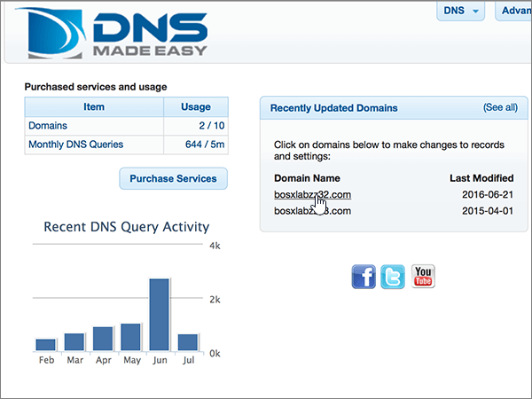
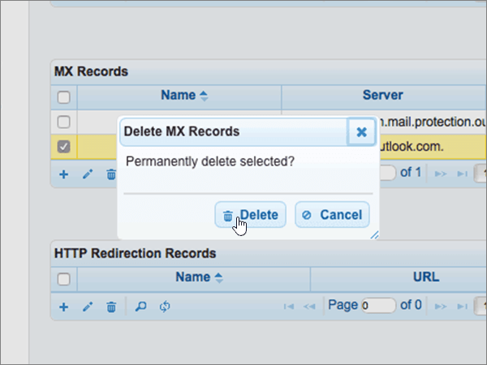
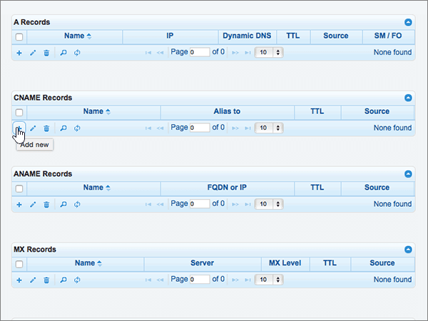
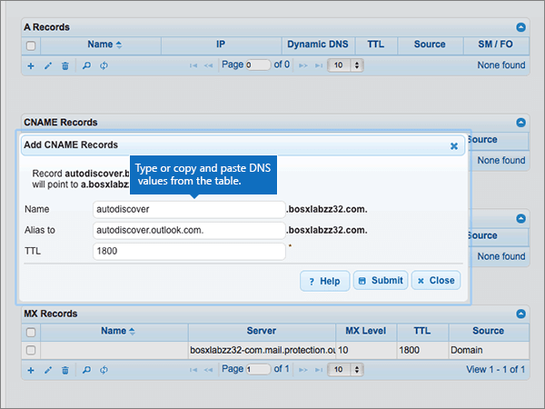

# Criar registros DNS no DNSMadeEasy para MicrosoftCreate DNS records at DNSMadeEasy for Microsoft

 **Caso não encontre o conteúdo que está procurando, [verifique as perguntas frequentes sobre domínios](../setup/domains-faq.md)**.**[Check the Domains FAQ](../setup/domains-faq.md)** if you don't find what you're looking for. 
  
Se você usa a DNSMadeEasy como provedor de hospedagem DNS, siga as etapas deste artigo para verificar o domínio e configurar registros DNS para o Skype for Business Online, email e outros serviços.If DNSMadeEasy is your DNS hosting provider, follow the steps in this article to verify your domain and set up DNS records for email, Skype for Business Online, and so on.
  
Depois que você adicionar esses registros no DNSMadeEasy, o domínio será configurado para funcionar com os serviços da Microsoft.After you add these records at DNSMadeEasy, your domain will be set up to work with Microsoft services.
  

  
> [!NOTE]
> Typically it takes about 15 minutes for DNS changes to take effect.Typically it takes about 15 minutes for DNS changes to take effect. Mas, às vezes, pode ser necessário mais tempo para atualizar uma alteração feita no sistema DNS da Internet.However, it can occasionally take longer for a change you've made to update across the Internet's DNS system. Se você tiver problemas com o fluxo de e-mails ou de outro tipo após adicionar os registros DNS, consulte [Localizar e corrigir problemas ou registros DNS](../get-help-with-domains/find-and-fix-issues.md).If you're having trouble with mail flow or other issues after adding DNS records, see [Find and fix issues after adding your domain or DNS records](../get-help-with-domains/find-and-fix-issues.md). 
  
## Adicionar um registro TXT para verificaçãoAdd a TXT record for verification

Antes de usar o seu domínio com a Microsoft, precisamos verificar se você é o proprietário dele. A capacidade de entrar na conta do seu registrador de domínios e criar o registro de DNS prova à Microsoft que você é o proprietário do domínio.Before you use your domain with Microsoft, we have to make sure that you own it. Your ability to log in to your account at your domain registrar and create the DNS record proves to Microsoft that you own the domain.
  
> [!NOTE]
> Esse registro é usado exclusivamente para confirmar se você é o proprietário do domínio; ele não afeta mais nada. É possível excluí-lo mais tarde, se desejar.This record is used only to verify that you own your domain; it doesn't affect anything else. You can delete it later, if you like. 
  
> [!IMPORTANT]
> Para contas do DNSMadeEasy, o domínio adicionado foi comprado de um registrador de domínio separado.For DNSMadeEasy accounts, the domain you added was purchased from a separate domain registrar. O DNSMadeEasy não oferece serviços de registro de domínio.DNSMadeEasy does not offer domain registration services. Sua capacidade de fazer logon em DNSMadeEasy e criar o registro DNS é uma prova de propriedade suficiente.Your ability to log in at DNSMadeEasy and create the DNS record is sufficient proof of ownership. 
  
1. Para começar, vá para sua página de domínios no DNSMadeEasy usando [este link](https://cp.dnsmadeeasy.com/).To get started, go to your domains page at DNSMadeEasy by using [this link](https://cp.dnsmadeeasy.com/). Será solicitado que você faça logon primeiro.You'll be prompted to login first.
    
2. Na página **console de gerenciamento** , na área **domínios atualizados recentemente** , selecione o domínio que você deseja atualizar.On the **Management Console** page, in the **Recently Updated Domains** area, select the domain that you want to update. 
    
3. Na página **DNS gerenciado** , na área **registros txt** , selecione o **+** controle () ( **Adicionar novo**).On the **Managed DNS** page, in the **TXT Records** area, select the ( **+**) control ( **Add new**).
    
    (Pode ser necessário rolar para baixo.)(You may have to scroll down.)
    
4. In the **Add TXT Records** area, in the boxes for the new record, type or copy and paste the values from the following table.In the **Add TXT Records** area, in the boxes for the new record, type or copy and paste the values from the following table. 
    
    ||||
    |:-----|:-----|:-----|
    |**Nome****Name**   |**Valor****Value**   |**TTL****TTL**   |
    |(Deixe este campo vazio.)(Leave this field empty.)    |MS = ms *XXXXXXXX*MS=ms *XXXXXXXX*    **Observação**: esse é um exemplo.**Note:** This is an example. Use aqui seu valor específico de **Destino ou Pontos de Endereçamento**, retirado da tabela.Use your specific **Destination or Points to Address** value here, from the table. [Como localizo isto?How do I find this?](../get-help-with-domains/information-for-dns-records.md)          |18001800    |
   
5. Selecione **Enviar**.Select **Submit**.
    
6. Aguarde alguns minutos antes de prosseguir para que o registro que você acabou de criar possa ser atualizado na Internet.Wait a few minutes before you continue, so that the record you just created can update across the Internet.
    
Agora que você adicionou o registro no site do seu registrador de domínios, retorne à Microsoft e solicite o registro.Now that you've added the record at your domain registrar's site, you'll go back to Microsoft and request the record.
  
Quando a Microsoft encontrar o registro TXT correto, seu domínio estará verificado.When Microsoft finds the correct TXT record, your domain is verified.
  
1. No centro do administrador da Microsoft, acesse a página **Configurações de** \> <a href="https://go.microsoft.com/fwlink/p/?linkid=834818" target="_blank">domínios</a>.In the Microsoft admin center, go to the **Settings** \> <a href="https://go.microsoft.com/fwlink/p/?linkid=834818" target="_blank">Domains</a> page.

    
2. Na página **Domínios**, clique no domínio que você está verificando.On the **Domains** page, select the domain that you are verifying. 
    
3. Na página **Configuração**, clique em **Iniciar configuração**.On the **Setup** page, select **Start setup**.
    
4. Na página **Verificar domínio**, clique em **Verificar**.On the **Verify domain** page, select **Verify**.
    
> [!NOTE]
> Typically it takes about 15 minutes for DNS changes to take effect.Typically it takes about 15 minutes for DNS changes to take effect. Mas, às vezes, pode ser necessário mais tempo para atualizar uma alteração feita no sistema DNS da Internet.However, it can occasionally take longer for a change you've made to update across the Internet's DNS system. Se você tiver problemas com o fluxo de e-mails ou de outro tipo após adicionar os registros DNS, consulte [Localizar e corrigir problemas ou registros DNS](../get-help-with-domains/find-and-fix-issues.md).If you're having trouble with mail flow or other issues after adding DNS records, see [Find and fix issues after adding your domain or DNS records](../get-help-with-domains/find-and-fix-issues.md). 
  
## Adicione um registro MX para que o email do domínio vá para a Microsoft.Add an MX record so email for your domain will come to Microsoft

1. Para começar, vá para sua página de domínios no DNSMadeEasy usando [este link](https://cp.dnsmadeeasy.com/). Será solicitado que você faça logon primeiro.To get started, go to your domains page at DNSMadeEasy by using [this link](https://cp.dnsmadeeasy.com/). You'll be prompted to login first.
    
2. Na página **console de gerenciamento** , na área **domínios atualizados recentemente** , selecione o domínio que você deseja atualizar.On the **Management Console** page, in the **Recently Updated Domains** area, select the domain that you want to update. 
    
    Na página **console de gerenciamento** , na área **domínios atualizados recentemente** , selecione o domínio que você deseja atualizar.On the **Management Console** page, in the **Recently Updated Domains** area, select the domain that you want to update. 
    
    
  
3. Na página **DNS gerenciado** , na área **registros MX** , selecione o controle **(+)** ( **Adicionar novo**).On the **Managed DNS** page, in the **MX Records** area, select the **(+)** control ( **Add new**).
    
    (Pode ser necessário rolar para baixo.)(You may have to scroll down.)
    
    
  
4. Na área **Adicionar Registros MX**, nas caixas do novo registro, digite ou copie e cole os valores da tabela a seguir.In the **Add MX Records** area, in the boxes for the new record, type or copy and paste the values from the following table. 
    
    (Pode ser necessário rolar para baixo.)(You may have to scroll down.)
    
    |**Nome****Name**|**Servidor****Server**|**Nível de MX****MX Level**|**TTL****TTL**|
    |:-----|:-----|:-----|:-----|
    |(Deixe este campo vazio.)(Leave this field empty.)    | *\<domain-key\>*  .mail.protection.outlook.com*\<domain-key\>*  .mail.protection.outlook.com    **Este valor deve OBRIGATORIAMENTE terminar com um ponto (.)****This value MUST end with a period (.)**   **Observação:** Obtenha a sua \<*domain-key*\> através da sua conta Microsoft.**Note:** Get your \<*domain-key*\> from your Microsoft account. [Como localizo isto?How do I find this?](../get-help-with-domains/information-for-dns-records.md)          |10 10    Para saber mais sobre prioridade, confira [O que é prioridade MX?](https://docs.microsoft.com/microsoft-365/admin/setup/domains-faq)For more information about priority, see [What is MX priority?](https://docs.microsoft.com/microsoft-365/admin/setup/domains-faq)   |18001800    |
   
    
  
5. Selecione **Enviar**.Select **Submit**.
    
    
  
6. Se houver outros registros MX listados na seção **Registros MX**, exclua todos eles selecionando cada um deles.If there are any other MX records listed in the **MX Records** section, delete all of them by selecting each one. 
    
    
  
7. Quando todos os registros estiverem selecionados, selecione **excluir selecionado**.When all records are selected, select **Delete selected**.
    
    
  
8. Na caixa de diálogo **excluir registros MX** , selecione **excluir** para confirmar suas alterações.In the **Delete MX Records** dialog box, select **Delete** to confirm your changes. 
    
    
  
## Adicionar os cinco registros CNAME necessários para a MicrosoftAdd the five CNAME records that are required for Microsoft

1. Para começar, vá para sua página de domínios no DNSMadeEasy usando [este link](https://cp.dnsmadeeasy.com/). Será solicitado que você faça logon primeiro.To get started, go to your domains page at DNSMadeEasy by using [this link](https://cp.dnsmadeeasy.com/). You'll be prompted to login first.
    
2. Na página **console de gerenciamento** , na área **domínios atualizados recentemente** , selecione o domínio que você deseja atualizar.On the **Management Console** page, in the **Recently Updated Domains** area, select the domain that you want to update. 
    
3. Na página **DNS gerenciado** , na área **registros CNAME** , selecione o controle **(+)** ( **Adicionar novo**).On the **Managed DNS** page, in the **CNAME Records** area, select the **(+)** control ( **Add new**).
    
    (Pode ser necessário rolar para baixo.)(You may have to scroll down.)
    
    
  
4. Adicione o primeiro dos cinco registros CNAME.Add the first of the five CNAME records.
    
    Na área **Adicionar Registros CNAME**, nas caixas do novo registro, digite ou copie e cole os valores da primeira linha da tabela a seguir.In the **Add CNAME Records** area, in the boxes for the new record, type or copy and paste the values from the first row in the following table. 
    
    |**Nome****Name**|**Alias para****Alias to**|**TTL****TTL**|
    |:-----|:-----|:-----|
    |autodiscoverautodiscover    |autodiscover.outlook.com.autodiscover.outlook.com.    **Este valor deve OBRIGATORIAMENTE terminar com um ponto (.)****This value MUST end with a period (.)**   |18001800    |
    |sipsip    |sipdir.online.lync.com.sipdir.online.lync.com.    **Este valor deve OBRIGATORIAMENTE terminar com um ponto (.)****This value MUST end with a period (.)**   |18001800    |
    |lyncdiscoverlyncdiscover    |webdir.online.lync.com.webdir.online.lync.com.    **Este valor deve OBRIGATORIAMENTE terminar com um ponto (.)****This value MUST end with a period (.)**   |18001800    |
    |enterpriseregistrationenterpriseregistration    |enterpriseregistration.windows.net.enterpriseregistration.windows.net.    **Este valor deve OBRIGATORIAMENTE terminar com um ponto (.)****This value MUST end with a period (.)**   |18001800    |
    |enterpriseenrollmententerpriseenrollment    |enterpriseenrollment-s.manage.microsoft.com.enterpriseenrollment-s.manage.microsoft.com.    **Este valor deve OBRIGATORIAMENTE terminar com um ponto (.)****This value MUST end with a period (.)**   |18001800    |
   
    
  
5. Selecione **Enviar**.Select **Submit**.
    
    
  
6. Adicione cada um dos outros quatro registros CNAME.Add each of the other four CNAME records.
    
    Na seção **registros CNAME** , selecione o controle **(+)** ( **Adicionar novo**), crie um registro usando os valores da próxima linha na tabela e, em seguida, selecione **Enviar** para concluir esse registro.In the **CNAME Records** section, select the **(+)** control ( **Add new**), create a record by using the values from the next row in the table, and then again select **Submit** to complete that record. 
    
    Repita esse processo até ter criado todos os cinco registros CNAME.Repeat this process until you have created all five CNAME records.
    
## Adicionar o registro TXT à SPF para ajudar a evitar spam de e-mailAdd a TXT record for SPF to help prevent email spam

> [!IMPORTANT]
> Não é possível ter mais de um registro TXT para SPF para um domínio.You cannot have more than one TXT record for SPF for a domain. Se o seu domínio possuir mais de um registro SPF, ocorrerão erros de email, bem como problemas na entrega e na classificação de spam.If your domain has more than one SPF record, you'll get email errors, as well as delivery and spam classification issues. Se você já possui um registro SPF para seu domínio, não crie um novo para a Microsoft.If you already have an SPF record for your domain, don't create a new one for Microsoft. Em vez disso, adicione os valores necessários da Microsoft ao registro atual para que você tenha um  *único*  registro SPF que inclua os dois conjuntos de valores.Instead, add the required Microsoft values to the current record so that you have a  *single*  SPF record that includes both sets of values. Precisa de exemplos?Need examples? Confira os [Registros do Sistema de Nomes de Domínios externos para a Microsoft](https://docs.microsoft.com/microsoft-365/enterprise/external-domain-name-system-records).Check out these [External Domain Name System records for Microsoft](https://docs.microsoft.com/microsoft-365/enterprise/external-domain-name-system-records). Para validar o registro SPF, você pode usar uma destas[ferramentas de validação de SPF](../setup/domains-faq.md).To validate your SPF record, you can use one of these[SPF validation tools](../setup/domains-faq.md). 
  
1. Para começar, vá para sua página de domínios no DNSMadeEasy usando [este link](https://cp.dnsmadeeasy.com/).To get started, go to your domains page at DNSMadeEasy by using [this link](https://cp.dnsmadeeasy.com/). Será solicitado que você faça logon primeiro.You'll be prompted to login first.
    
2. Na página **console de gerenciamento** , na área **domínios atualizados recentemente** , selecione o domínio que você deseja atualizar.On the **Management Console** page, in the **Recently Updated Domains** area, select the domain that you want to update. 
    
3. Na página **DNS gerenciado** , na área **registros txt** , selecione o controle **(+)** ( **Adicionar novo**).On the **Managed DNS** page, in the **TXT Records** area, select the **(+)** control ( **Add new**).
    
    (Pode ser necessário rolar para baixo.)(You may have to scroll down.)
    
    
  
4. In the **Add TXT Records** area, in the boxes for the new record, type or copy and paste the values from the following table.In the **Add TXT Records** area, in the boxes for the new record, type or copy and paste the values from the following table. 
    
    |**Nome****Name**|**Valor****Value**|**TTL****TTL**|
    |:-----|:-----|:-----|
    |(Deixe este campo vazio.)(Leave this field empty.)    |v=spf1 include:spf.protection.outlook.com -allv=spf1 include:spf.protection.outlook.com -all    **Observação:** é recomendável copiar e colar essa entrada para que o espaçamento permaneça correto.**Note:** We recommend copying and pasting this entry, so that all of the spacing stays correct.           |18001800    |
   
    
  
5. Selecione **Enviar**.Select **Submit**.
    
    
  
## Adicionar os dois registros SRV necessários para a MicrosoftAdd the two SRV records that are required for Microsoft

1. Para começar, vá para sua página de domínios no DNSMadeEasy usando [este link](https://cp.dnsmadeeasy.com/). Será solicitado que você faça logon primeiro.To get started, go to your domains page at DNSMadeEasy by using [this link](https://cp.dnsmadeeasy.com/). You'll be prompted to login first.
    
2. Na página **console de gerenciamento** , na área **domínios atualizados recentemente** , selecione o domínio que você deseja atualizar.On the **Management Console** page, in the **Recently Updated Domains** area, select the domain that you want to update. 
    
3. Na página **DNS gerenciado** , na área **Registros SRV** , selecione o controle **(+)** ( **Adicionar novo**).On the **Managed DNS** page, in the **SRV Records** area, select the **(+)** control ( **Add new**).
    
    Pode ser necessário rolar para baixo.(You may have to scroll down)
    
    
  
4. Adicione o primeiro dos dois registros SRV.Add the first of the two SRV records.
    
    Na área **Adicionar Registros SRV**, nas caixas do novo registro, digite ou copie e cole os valores da primeira linha da tabela a seguir.In the **Add SRV Records** area, in the boxes for the new record, type or copy and paste the values from the first row in the following table. 
    
    |**Nome****Name**|**Prioridade****Priority**|**Espessura****Weight**|**Porta****Port**|**Host****Host**|**TTL****TTL**|
    |:-----|:-----|:-----|:-----|:-----|:-----|
    |_sip._tls_sip._tls    |100100    |11    |443443    |sipdir.online.lync.com.sipdir.online.lync.com.    **Este valor deve OBRIGATORIAMENTE terminar com um ponto (.)****This value MUST end with a period (.)**   |18001800    |
    |_sipfederationtls._tcp_sipfederationtls._tcp    |100100    |11    |50615061    |sipfed.online.lync.com.sipfed.online.lync.com.    **Este valor deve OBRIGATORIAMENTE terminar com um ponto (.)****This value MUST end with a period (.)**   |18001800    |
   
    
  
5. Selecione **Enviar**.Select **Submit**.
    
    
  
6. Adicione o outro registro SRV.Add the other SRV record.
    
    Na seção **Registros SRV** , selecione o controle **(+)** ( **Adicionar novo**), crie um registro usando os valores da próxima linha na tabela e, em seguida, selecione **Enviar** para concluir esse registro.In the **SRV Records** section, select the **(+)** control ( **Add new**), create a record by using the values from the next row in the table, and then again select **Submit** to complete that record. 
    
> [!NOTE]
> Typically it takes about 15 minutes for DNS changes to take effect.Typically it takes about 15 minutes for DNS changes to take effect. Mas, às vezes, pode ser necessário mais tempo para atualizar uma alteração feita no sistema DNS da Internet.However, it can occasionally take longer for a change you've made to update across the Internet's DNS system. Se você tiver problemas com o fluxo de e-mails ou de outro tipo após adicionar os registros DNS, consulte [Localizar e corrigir problemas ou registros DNS](../get-help-with-domains/find-and-fix-issues.md).If you're having trouble with mail flow or other issues after adding DNS records, see [Find and fix issues after adding your domain or DNS records](../get-help-with-domains/find-and-fix-issues.md). 
  

