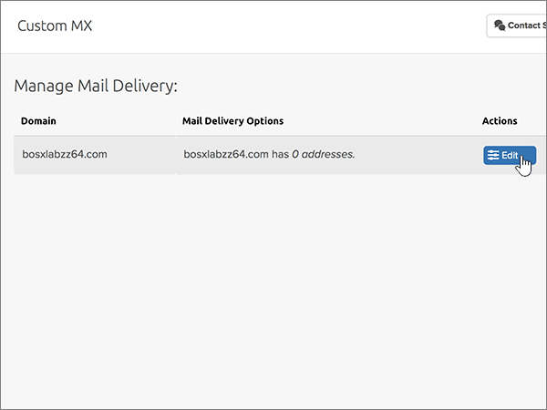
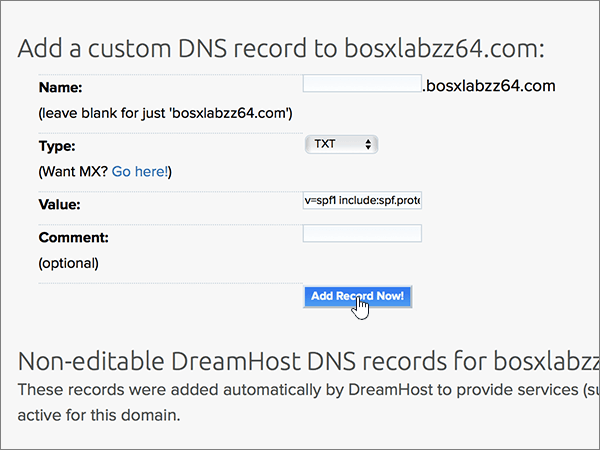

# Criar registros DNS no Dreamhost para Microsoft

 Caso não encontre o conteúdo que está procurando, **[verifique as perguntas frequentes sobre domínios](../setup/domains-faq.md)**. 
  
Se o DreamHost for seu provedor de Hospedagem de DNS, siga as etapas deste artigo para verificar seu domínio e configurar registros DNS para email, Lync e assim por diante.
 
Depois que você adicionar esses registros no DreamHost, o domínio será configurado para funcionar com os serviços da Microsoft.
  
  
> [!NOTE]
> Normalmente, são necessários cerca de 15 minutos para que as alterações de DNS entrem em vigor. Mas, às vezes, pode ser necessário mais tempo para atualizar uma alteração feita no sistema DNS da Internet. Se você tiver problemas com o fluxo de emails ou de outro tipo após adicionar os registros DNS, consulte [Solucionar problemas após alterar o nome de domínio ou registros DNS](../get-help-with-domains/find-and-fix-issues.md). 
  
## Adicionar um registro TXT para verificação

Antes de usar o seu domínio com a Microsoft, precisamos verificar se você é o proprietário dele. A capacidade de entrar na conta do seu registrador de domínios e criar o registro de DNS prova à Microsoft que você é o proprietário do domínio.
  
> [!NOTE]
> Esse registro é usado exclusivamente para confirmar se você é o proprietário do domínio; ele não afeta mais nada. É possível excluí-lo mais tarde, se desejar. 
  
1. Para começar, vá até a sua página de domínios no DreamHost usando [este link](https://panel.dreamhost.com/). Você será solicitado a entrar.
    
    
  
2. Na página **painel** , selecione **domínios**e, em seguida, **gerenciar domínios**.
    
    
  
3. Na página **gerenciar domínios** , na seção **domínio** , selecione **DNS** para o domínio que você deseja editar. 
    
    
  
4. In the **Add a custom DNS record** section, in the boxes for the new record, type or copy and paste the values from the following table. 
    
    (You may have to scroll down.)
    
    (Choose the **Type** value from the drop-down list.) 
    
    |**Nome**|**Tipo**|**Valor**|**Comment**|
    |:-----|:-----|:-----|:-----|
    |(Leave this field empty.)    |TXT    |MS=ms *XXXXXXXX*    **Observação**: esse é um exemplo. Use aqui seu valor específico de **Destino ou Pontos de Endereçamento**, retirado da tabela.           [Como localizo isto?](../get-help-with-domains/information-for-dns-records.md)          |(Esse campo é opcional.)    |
   
   
  
5. Selecione **adicionar registro agora!**
    
    
  
6. Aguarde alguns minutos antes de prosseguir para que o registro que você acabou de criar possa ser atualizado na Internet.
    
Agora que você adicionou o registro no site do seu registrador de domínios, retorne à Microsoft e solicite o registro.
  
Quando a Microsoft encontrar o registro TXT correto, seu domínio estará verificado.
  
1. No centro do administrador da Microsoft, acesse a página **Configurações de** \> <a href="https://go.microsoft.com/fwlink/p/?linkid=834818" target="_blank">domínios</a>.

    
2. Na página **Domínios**, clique no domínio que você está verificando. 
    
    
  
3. Na página **Configuração**, clique em **Iniciar configuração**.
    
    
  
4. Na página **Verificar domínio**, marque **Verificar**.
    
    
  
> [!NOTE]
>  Normalmente, são necessários cerca de 15 minutos para que as alterações de DNS entrem em vigor. Mas, às vezes, pode ser necessário mais tempo para atualizar uma alteração feita no sistema DNS da Internet. Se você tiver problemas com o fluxo de emails ou de outro tipo após adicionar os registros DNS, consulte [Solucionar problemas após alterar o nome de domínio ou registros DNS](../get-help-with-domains/find-and-fix-issues.md). 
  

  
## Adicione um registro MX para que o email do domínio vá para a Microsoft.

Siga as etapas abaixo.
  
1. Para começar, vá até a sua página de domínios no DreamHost usando [este link](https://panel.dreamhost.com/). Você será solicitado a entrar.
    
    
  
2. Na página **painel** , selecione **email**e, em seguida, **personalizado MX**.
    
    
  
3. Na seção **gerenciar entrega de email** , na coluna **ações** , selecione **Editar** para o domínio que você deseja editar. 
    
    
  
4. Na seção **registro MX personalizado** , nas caixas do novo registro, digite ou copie e cole os seguintes valores da tabela a seguir. 
    
    (You may have to scroll down.)
    
    (Se houver outros registros MX existentes, marque os registros a serem excluídos.)
    
    |**Registro MX (obrigatório)**|
    |:-----|
    |0 *\<domain-key\>* . mail.Protection.Outlook.com.    **This value MUST end with a period (.)**   O 0 é o valor de prioridade de MX. Adicione-o ao início do valor de MX, separado do restante do valor por um espaço.    **Observação:** Acesse sua *\<domain-key\>* conta da Microsoft.           [Como localizo isto?](../get-help-with-domains/information-for-dns-records.md)          |
   
    
  
5. Selecione **alterar este domínio para usar registros MX personalizados agora!**
    
    
  
6. Se houver outros registros MX existentes, exclua cada registro selecionando a entrada e pressionando a tecla **delete** no teclado. 
    
    
  
7. Se você tiver excluído qualquer registro, selecione **atualizar seus registros MX personalizados agora!**
    
    

  
## Adicionar os seis registros CNAME necessários para o Microsoft

Siga as etapas abaixo.
  
1. Para começar, vá até a sua página de domínios no DreamHost usando [este link](https://panel.dreamhost.com/). Você será solicitado a entrar.
    
    
  
2. Na página **painel** , selecione **domínios**e, em seguida, **gerenciar domínios**.
    
    
  
3. Na página **gerenciar domínios** , na seção **domínio** , selecione **DNS** para o domínio que você deseja editar. 
    
    
  
4. Na seção **Adicionar um registro DNS personalizado** , nas caixas do novo registro, digite ou copie e cole os valores da primeira linha da tabela a seguir. 
    
    (You may have to scroll down.)
    
    (Choose the **Type** value from the drop-down list.) 
    
    |**Nome**|**Tipo**|**Valor**|**Comment**|
    |:-----|:-----|:-----|:-----|
    |autodiscover    |CNAME    |autodiscover.outlook.com.    **This value MUST end with a period (.)**   |(Esse campo é opcional.)    |
    |sip    |CNAME    |sipdir.online.lync.com.    **This value MUST end with a period (.)**   |(Esse campo é opcional.)    |
    |lyncdiscover    |CNAME    |webdir.online.lync.com.    **This value MUST end with a period (.)**   |(Esse campo é opcional.)    |
    |enterpriseregistration    |CNAME    |enterpriseregistration.windows.net.    **This value MUST end with a period (.)**   |(Esse campo é opcional.)    |
    |enterpriseenrollment    |CNAME    |enterpriseenrollment-s.manage.microsoft.com.    **Este valor deve OBRIGATORIAMENTE terminar com um ponto (.)**   |(Esse campo é opcional.)    |
   
    
  
5. Selecione **adicionar registro agora!**
    
    
  
6. Usando as duas etapas anteriores e os valores das outras cinco linhas na tabela, adicione cada um dos outros cinco registros CNAME.

  
## Adicionar registro TXT à SPF para ajudar a evitar spam de email

> [!IMPORTANT]
> Não é possível ter mais de um registro TXT para SPF para um domínio. Se o seu domínio possuir mais de um registro SPF, ocorrerão erros de email, bem como problemas na entrega e na classificação de spam. Se você já possui um registro SPF para seu domínio, não crie um novo para a Microsoft. Em vez disso, adicione os valores necessários da Microsoft ao registro atual para que você tenha um *único* registro SPF que inclua os dois conjuntos de valores.
  
Siga as etapas abaixo.
  
1. Para começar, vá até a sua página de domínios no DreamHost usando [este link](https://panel.dreamhost.com/). Você será solicitado a entrar.
    
    
  
2. Na página **painel** , selecione **domínios**e, em seguida, **gerenciar domínios**.
    
    
  
3. Na página **gerenciar domínios** , na seção **domínio** , selecione **DNS** para o domínio que você deseja editar. 
    
    
  
4. Na seção **Adicionar um registro DNS personalizado** , nas caixas do novo registro, digite ou copie e cole os valores da primeira linha da tabela a seguir. 
    
    (You may have to scroll down.)
    
    (Choose the **Type** value from the drop-down list.) 
    
    |**Nome**|**Tipo**|**Valor**|**Comment**|
    |:-----|:-----|:-----|:-----|
    |(Leave this field empty.)    |TXT    |v=spf1 include:spf.protection.outlook.com -all    **Observação:** é recomendável copiar e colar essa entrada, para que todo o espaçamento permaneça correto.           |(Esse campo é opcional.)    |
   
   
  
5. Selecione **adicionar registro agora!**
    
    
  
6. Usando as duas etapas anteriores e os valores da segunda linha da tabela, adicione o outro registro SRV.
    
  
## Adicionar os dois registros SRV necessários para a Microsoft

Siga as etapas abaixo.
  
1. Para começar, vá até a sua página de domínios no DreamHost usando [este link](https://panel.dreamhost.com/). Você será solicitado a entrar.
    
    
  
2. Na página **painel** , selecione **domínios**e, em seguida, **gerenciar domínios**.
    
    
  
3. Na página **gerenciar domínios** , na seção **domínio** , selecione **DNS** para o domínio que você deseja editar. 
    
    
  
4. Na seção **Adicionar um registro DNS personalizado** , nas caixas do novo registro, digite ou copie e cole os valores da primeira linha da tabela a seguir. 
    
    (You may have to scroll down.)
    
    (Choose the **Type** value from the drop-down list.) 
    
    |**Nome**|**Tipo**|**Valor**|**Comment**|
    |:-----|:-----|:-----|:-----|
    |_sip. _tls    |SRV    |100 1 443    sipdir.online.lync.com.    **This value MUST end with a period (.)**   |(Esse campo é opcional.)    |
    |_sipfederationtls. _tcp    |SRV    |100 1 5061    sipfed.online.lync.com.    **Este valor deve OBRIGATORIAMENTE terminar com um ponto (.)**   |(Esse campo é opcional.)    |
   
    
  
5. Selecione **adicionar registro agora!**.
    
    
  
6. Usando as duas etapas anteriores e os valores da segunda linha da tabela, adicione o outro registro SRV.
    
> [!NOTE]
>  Normalmente, são necessários cerca de 15 minutos para que as alterações de DNS entrem em vigor. Mas, às vezes, pode ser necessário mais tempo para atualizar uma alteração feita no sistema DNS da Internet. Se você tiver problemas com o fluxo de emails ou de outro tipo após adicionar os registros DNS, consulte [Solucionar problemas após alterar o nome de domínio ou registros DNS](../get-help-with-domains/find-and-fix-issues.md). 

  
