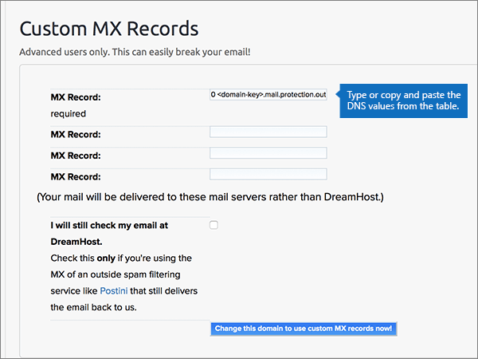
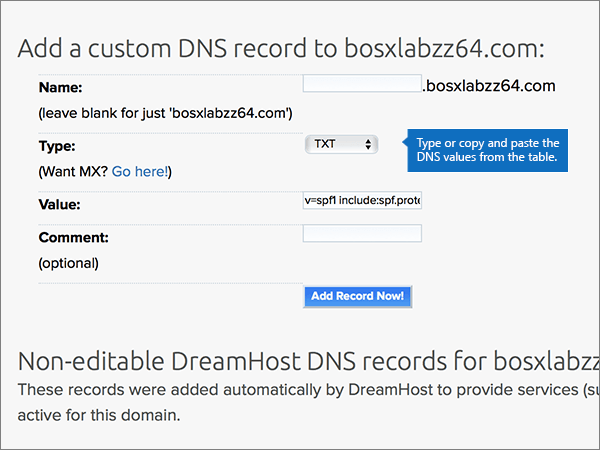
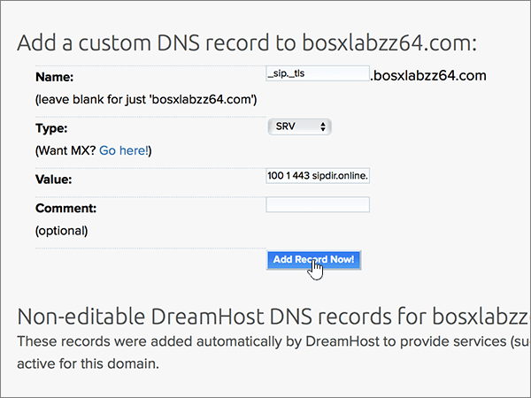

# Criar registros DNS no Dreamhost para MicrosoftCreate DNS records at Dreamhost for Microsoft

 Caso não encontre o conteúdo que está procurando, **[verifique as perguntas frequentes sobre domínios](../setup/domains-faq.md)**.**[Check the Domains FAQ](../setup/domains-faq.md)** if you don't find what you're looking for. 
  
Se o DreamHost for seu provedor de Hospedagem de DNS, siga as etapas deste artigo para verificar seu domínio e configurar registros DNS para email, Lync e assim por diante.If DreamHost is your DNS hosting provider, follow the steps in this article to verify your domain and set up DNS records for email, Lync, and so on.
 
Depois que você adicionar esses registros no DreamHost, o domínio será configurado para funcionar com os serviços da Microsoft.After you add these records at DreamHost, your domain will be set up to work with Microsoft services.
  
Para saber mais sobre o webhosting e o DNS para sites com a Microsoft, confira [usar um site público com a Microsoft](https://support.office.com/article/a8178510-501d-4bd8-9921-b04f2e9517a5.aspx).To learn about webhosting and DNS for websites with Microsoft, see [Use a public website with Microsoft](https://support.office.com/article/a8178510-501d-4bd8-9921-b04f2e9517a5.aspx).
  
> [!NOTE]
> Normalmente, são necessários cerca de 15 minutos para que as alterações de DNS entrem em vigor. Mas, às vezes, pode ser necessário mais tempo para atualizar uma alteração feita no sistema DNS da Internet. Se você tiver problemas com o fluxo de emails ou de outro tipo após adicionar os registros DNS, consulte [Solucionar problemas após alterar o nome de domínio ou registros DNS](../get-help-with-domains/find-and-fix-issues.md).Typically it takes about 15 minutes for DNS changes to take effect. However, it can occasionally take longer for a change you've made to update across the Internet's DNS system. If you're having trouble with mail flow or other issues after adding DNS records, see [Troubleshoot issues after changing your domain name or DNS records](../get-help-with-domains/find-and-fix-issues.md). 
  
## Adicionar um registro TXT para verificaçãoAdd a TXT record for verification

Antes de usar seu domínio com a Microsoft, precisamos garantir que você o tenha.Before you use your domain with Microsoft, we have to make sure that you own it. Sua capacidade de fazer logon em sua conta no registrador de domínios e criar o registro DNS comprova para a Microsoft que você é o proprietário do domínio.Your ability to log in to your account at your domain registrar and create the DNS record proves to Microsoft that you own the domain.
  
> [!NOTE]
> Esse registro é usado exclusivamente para confirmar se você é o proprietário do domínio; ele não afeta mais nada. É possível excluí-lo mais tarde, se desejar.This record is used only to verify that you own your domain; it doesn't affect anything else. You can delete it later, if you like. 
  
1. Para começar, vá até a sua página de domínios no DreamHost usando [este link](https://panel.dreamhost.com/).To get started, go to your domains page at DreamHost by using [this link](https://panel.dreamhost.com/). Você será solicitado a entrar.You'll be prompted to Sign in.
    
    
  
2. Na página **painel** , selecione **domínios**e, em seguida, **gerenciar domínios**.On the **Dashboard** page, select **Domains**, and then **Manage Domains**.
    
    
  
3. Na página **gerenciar domínios** , na seção **domínio** , selecione **DNS** para o domínio que você deseja editar.On the **Manage Domains** page, in the **Domain** section, select **DNS** for the domain that you want to edit. 
    
    
  
4. In the **Add a custom DNS record** section, in the boxes for the new record, type or copy and paste the values from the following table.In the **Add a custom DNS record** section, in the boxes for the new record, type or copy and paste the values from the following table. 
    
    (You may have to scroll down.)(You may have to scroll down.)
    
    (Choose the **Type** value from the drop-down list.)(Choose the **Type** value from the drop-down list.) 
    
    |**Nome****Name**|**Tipo****Type**|**Valor****Value**|**Comentário****Comment**|
    |:-----|:-----|:-----|:-----|
    |(Leave this field empty.)(Leave this field empty.)    |TXTTXT    |MS = ms *XXXXXXXX*MS=ms *XXXXXXXX*    **Observação**: esse é um exemplo.**Note:** This is an example. Use o seu **destino específico ou aponte para** o valor de endereço aqui, a partir da tabela.Use your specific **Destination or Points to Address** value here, from the table.           [Como localizo isto?How do I find this?](../get-help-with-domains/information-for-dns-records.md)          |(Esse campo é opcional.)(This field is optional.)    |
   
   
  
5. Selecione **adicionar registro agora!**Select **Add Record Now!**
    
    
  
6. Aguarde alguns minutos antes de prosseguir para que o registro que você acabou de criar possa ser atualizado na Internet.Wait a few minutes before you continue, so that the record you just created can update across the Internet.
    
Agora que você adicionou o registro no site do seu registrador de domínio, você voltará para a Microsoft e solicitará o registro.Now that you've added the record at your domain registrar's site, you'll go back to Microsoft and request the record.
  
Quando a Microsoft encontrar o registro TXT correto, seu domínio será verificado.When Microsoft finds the correct TXT record, your domain is verified.
  
1. No centro de administração da Microsoft, vá para a página de <a href="https://go.microsoft.com/fwlink/p/?linkid=834818" target="_blank">domínios</a> de **configurações** \> .In the Microsoft admin center, go to the **Settings** \> <a href="https://go.microsoft.com/fwlink/p/?linkid=834818" target="_blank">Domains</a> page.

    
2. Na página **Domínios**, clique no domínio que você está verificando.On the **Domains** page, select the domain that you are verifying. 
    
    
  
3. Na página **Configuração**, clique em **Iniciar configuração**.On the **Setup** page, select **Start setup**.
    
    
  
4. Na página **Verificar domínio**, marque **Verificar**.On the **Verify domain** page, select **Verify**.
    
    
  
> [!NOTE]
>  Normalmente, são necessários cerca de 15 minutos para que as alterações de DNS entrem em vigor. Mas, às vezes, pode ser necessário mais tempo para atualizar uma alteração feita no sistema DNS da Internet. Se você tiver problemas com o fluxo de emails ou de outro tipo após adicionar os registros DNS, consulte [Solucionar problemas após alterar o nome de domínio ou registros DNS](../get-help-with-domains/find-and-fix-issues.md).Typically it takes about 15 minutes for DNS changes to take effect. However, it can occasionally take longer for a change you've made to update across the Internet's DNS system. If you're having trouble with mail flow or other issues after adding DNS records, see [Troubleshoot issues after changing your domain name or DNS records](../get-help-with-domains/find-and-fix-issues.md). 
  

  
## Adicionar um registro MX para que o email do seu domínio seja fornecido para a MicrosoftAdd an MX record so email for your domain will come to Microsoft

Siga as etapas abaixo.Follow the steps below.
  
1. Para começar, vá até a sua página de domínios no DreamHost usando [este link](https://panel.dreamhost.com/).To get started, go to your domains page at DreamHost by using [this link](https://panel.dreamhost.com/). Você será solicitado a entrar.You'll be prompted to Sign in.
    
    
  
2. Na página **painel** , selecione **email**e, em seguida, **personalizado MX**.On the **Dashboard** page, select **Mail**, and then **Custom MX**.
    
    
  
3. Na seção **gerenciar entrega de email** , na coluna **ações** , selecione **Editar** para o domínio que você deseja editar.In the **Manage Mail Delivery** section, in the **Actions** column, select **Edit** for the domain that you want to edit. 
    
    
  
4. Na seção **registro MX personalizado** , nas caixas do novo registro, digite ou copie e cole os seguintes valores da tabela a seguir.In the **Custom MX Record** section, in the boxes for the new record, type or copy and paste the following values from the following table. 
    
    (You may have to scroll down.)(You may have to scroll down.)
    
    (Se houver outros registros MX existentes, marque os registros a serem excluídos.)(If there are any other existing MX records, mark those records to be deleted.)
    
    |**Registro MX (obrigatório)****MX Record (required)**|
    |:-----|
    |0  *\<domain-key\>*  .mail.protection.outlook.com.0  *\<domain-key\>*  .mail.protection.outlook.com.    **Este valor deve OBRIGATORIAMENTE terminar com um ponto (.)****This value MUST end with a period (.)**   O 0 é o valor de prioridade de MX. Adicione-o ao início do valor de MX, separado do restante do valor por um espaço.  The 0 is the MX priority value. Add it to the beginning of the MX value, separated from the remainder of the value by a space.    **Observação:** Obtenha sua \* \<chave\> de domínio\* de sua conta da Microsoft.**Note:** Get your  *\<domain-key\>*  from your Microsoft account.           [Como localizo isto?How do I find this?](../get-help-with-domains/information-for-dns-records.md)          |
   
    
  
5. Selecione **alterar este domínio para usar registros MX personalizados agora!**Select **Change this domain to use custom MX records now!**
    
    
  
6. Se houver outros registros MX existentes, exclua cada registro selecionando a entrada e pressionando a tecla **delete** no teclado.If there are any other existing MX records, delete each record by selecting the entry and then pressing the **Delete** key on your keyboard. 
    
    
  
7. Se você tiver excluído qualquer registro, selecione **atualizar seus registros MX personalizados agora!**If you have deleted any records, select **Update your custom MX records now!**
    
    

  
## Adicionar os seis registros CNAME necessários para o MicrosoftAdd the six CNAME records that are required for Microsoft

Siga as etapas abaixo.Follow the steps below.
  
1. Para começar, vá até a sua página de domínios no DreamHost usando [este link](https://panel.dreamhost.com/).To get started, go to your domains page at DreamHost by using [this link](https://panel.dreamhost.com/). Você será solicitado a entrar.You'll be prompted to Sign in.
    
    
  
2. Na página **painel** , selecione **domínios**e, em seguida, **gerenciar domínios**.On the **Dashboard** page, select **Domains**, and then **Manage Domains**.
    
    
  
3. Na página **gerenciar domínios** , na seção **domínio** , selecione **DNS** para o domínio que você deseja editar.On the **Manage Domains** page, in the **Domain** section, select **DNS** for the domain that you want to edit. 
    
    
  
4. Na seção **Adicionar um registro DNS personalizado** , nas caixas do novo registro, digite ou copie e cole os valores da primeira linha da tabela a seguir.In the **Add a custom DNS record** section, in the boxes for the new record, type or copy and paste the values from the first row in the following table. 
    
    (You may have to scroll down.)(You may have to scroll down.)
    
    (Choose the **Type** value from the drop-down list.)(Choose the **Type** value from the drop-down list.) 
    
    |**Nome****Name**|**Tipo****Type**|**Valor****Value**|**Comentário****Comment**|
    |:-----|:-----|:-----|:-----|
    |autodiscoverautodiscover    |CNAMECNAME    |autodiscover.outlook.com.autodiscover.outlook.com.    **This value MUST end with a period (.)****This value MUST end with a period (.)**   |(Esse campo é opcional.)(This field is optional.)    |
    |sipsip    |CNAMECNAME    |sipdir.online.lync.com.sipdir.online.lync.com.    **This value MUST end with a period (.)****This value MUST end with a period (.)**   |(Esse campo é opcional.)(This field is optional.)    |
    |lyncdiscoverlyncdiscover    |CNAMECNAME    |webdir.online.lync.com.webdir.online.lync.com.    **This value MUST end with a period (.)****This value MUST end with a period (.)**   |(Esse campo é opcional.)(This field is optional.)    |
    |enterpriseregistrationenterpriseregistration    |CNAMECNAME    |enterpriseregistration.windows.net.enterpriseregistration.windows.net.    **This value MUST end with a period (.)****This value MUST end with a period (.)**   |(Esse campo é opcional.)(This field is optional.)    |
    |enterpriseenrollmententerpriseenrollment    |CNAMECNAME    |enterpriseenrollment-s.manage.microsoft.com.enterpriseenrollment-s.manage.microsoft.com.    **This value MUST end with a period (.)****This value MUST end with a period (.)**   |(Esse campo é opcional.)(This field is optional.)    |
   
    
  
5. Selecione **adicionar registro agora!**Select **Add Record Now!**
    
    
  
6. Usando as duas etapas anteriores e os valores das outras cinco linhas na tabela, adicione cada um dos outros cinco registros CNAME.Using the preceding two steps and the values from the other five rows in the table, add each of the other five CNAME records.

  
## Adicionar o registro TXT à SPF para ajudar a evitar spam de e-mailAdd a TXT record for SPF to help prevent email spam

> [!IMPORTANT]
> Não é possível ter mais de um registro TXT para SPF para um domínio.You cannot have more than one TXT record for SPF for a domain. Se o seu domínio possuir mais de um registro SPF, ocorrerão erros de email, bem como problemas na entrega e na classificação de spam.If your domain has more than one SPF record, you'll get email errors, as well as delivery and spam classification issues. Se você já tiver um registro SPF para seu domínio, não crie um novo para a Microsoft.If you already have an SPF record for your domain, don't create a new one for Microsoft. Em vez disso, adicione os valores necessários da Microsoft ao registro atual para que você tenha um *único* registro SPF que inclua os dois conjuntos de valores.Instead, add the required Microsoft values to the current record so that you have a  *single*  SPF record that includes both sets of values.
  
Siga as etapas abaixo.Follow the steps below.
  
1. Para começar, vá até a sua página de domínios no DreamHost usando [este link](https://panel.dreamhost.com/).To get started, go to your domains page at DreamHost by using [this link](https://panel.dreamhost.com/). Você será solicitado a entrar.You'll be prompted to Sign in.
    
    
  
2. Na página **painel** , selecione **domínios**e, em seguida, **gerenciar domínios**.On the **Dashboard** page, select **Domains**, and then **Manage Domains**.
    
    
  
3. Na página **gerenciar domínios** , na seção **domínio** , selecione **DNS** para o domínio que você deseja editar.On the **Manage Domains** page, in the **Domain** section, select **DNS** for the domain that you want to edit. 
    
    
  
4. Na seção **Adicionar um registro DNS personalizado** , nas caixas do novo registro, digite ou copie e cole os valores da primeira linha da tabela a seguir.In the **Add a custom DNS record** section, in the boxes for the new record, type or copy and paste the values from the first row in the following table. 
    
    (You may have to scroll down.)(You may have to scroll down.)
    
    (Choose the **Type** value from the drop-down list.)(Choose the **Type** value from the drop-down list.) 
    
    |**Nome****Name**|**Tipo****Type**|**Valor****Value**|**Comentário****Comment**|
    |:-----|:-----|:-----|:-----|
    |(Leave this field empty.)(Leave this field empty.)    |TXTTXT    |v=spf1 include:spf.protection.outlook.com -allv=spf1 include:spf.protection.outlook.com -all    **Observação:** é recomendável copiar e colar essa entrada para que o espaçamento permaneça correto.**Note:** We recommend copying and pasting this entry, so that all of the spacing stays correct.           |(Esse campo é opcional.)(This field is optional.)    |
   
   
  
5. Selecione **adicionar registro agora!**Select **Add Record Now!**
    
    
  
6. Usando as duas etapas anteriores e os valores da segunda linha da tabela, adicione o outro registro SRV.Using the preceding two steps and the values from the second row in the table, add the other SRV record.
    
  
## Adicionar os dois registros SRV necessários para o MicrosoftAdd the two SRV records that are required for Microsoft

Siga as etapas abaixo.Follow the steps below.
  
1. Para começar, vá até a sua página de domínios no DreamHost usando [este link](https://panel.dreamhost.com/).To get started, go to your domains page at DreamHost by using [this link](https://panel.dreamhost.com/). Você será solicitado a entrar.You'll be prompted to Sign in.
    
    
  
2. Na página **painel** , selecione **domínios**e, em seguida, **gerenciar domínios**.On the **Dashboard** page, select **Domains**, and then **Manage Domains**.
    
    
  
3. Na página **gerenciar domínios** , na seção **domínio** , selecione **DNS** para o domínio que você deseja editar.On the **Manage Domains** page, in the **Domain** section, select **DNS** for the domain that you want to edit. 
    
    
  
4. Na seção **Adicionar um registro DNS personalizado** , nas caixas do novo registro, digite ou copie e cole os valores da primeira linha da tabela a seguir.In the **Add a custom DNS record** section, in the boxes for the new record, type or copy and paste the values from the first row in the following table. 
    
    (You may have to scroll down.)(You may have to scroll down.)
    
    (Choose the **Type** value from the drop-down list.)(Choose the **Type** value from the drop-down list.) 
    
    |**Nome****Name**|**Tipo****Type**|**Valor****Value**|**Comentário****Comment**|
    |:-----|:-----|:-----|:-----|
    |_sip. _tls_sip._tls    |SRVSRV    |100 1 443100 1 443    sipdir.online.lync.com.sipdir.online.lync.com.    **This value MUST end with a period (.)****This value MUST end with a period (.)**   |(Esse campo é opcional.)(This field is optional.)    |
    |_sipfederationtls. _tcp_sipfederationtls._tcp    |SRVSRV    |100 1 5061100 1 5061    sipfed.online.lync.com.sipfed.online.lync.com.    **Este valor deve OBRIGATORIAMENTE terminar com um ponto (.)****This value MUST end with a period (.)**   |(Esse campo é opcional.)(This field is optional.)    |
   
    
  
5. Selecione **adicionar registro agora!**.Select **Add Record Now!**.
    
    
  
6. Usando as duas etapas anteriores e os valores da segunda linha da tabela, adicione o outro registro SRV.Using the preceding two steps and the values from the second row in the table, add the other SRV record.
    
> [!NOTE]
>  Normalmente, são necessários cerca de 15 minutos para que as alterações de DNS entrem em vigor. Mas, às vezes, pode ser necessário mais tempo para atualizar uma alteração feita no sistema DNS da Internet. Se você tiver problemas com o fluxo de emails ou de outro tipo após adicionar os registros DNS, consulte [Solucionar problemas após alterar o nome de domínio ou registros DNS](../get-help-with-domains/find-and-fix-issues.md).Typically it takes about 15 minutes for DNS changes to take effect. However, it can occasionally take longer for a change you've made to update across the Internet's DNS system. If you're having trouble with mail flow or other issues after adding DNS records, see [Troubleshoot issues after changing your domain name or DNS records](../get-help-with-domains/find-and-fix-issues.md). 

  
