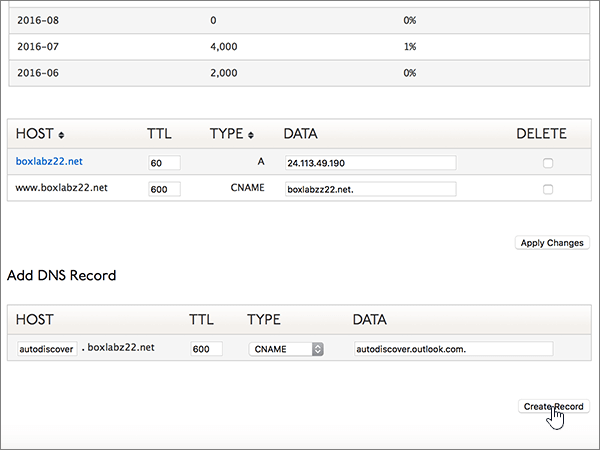

# Criar registros DNS no Dyn.com para a Microsoft

 **[Caso não encontre o conteúdo que está procurando, verifique as perguntas frequentes sobre domínios](../setup/domains-faq.yml)**. 
  
Se você usa a Dyn.com como provedor de hospedagem DNS, siga as etapas deste artigo para verificar o domínio e configurar registros DNS para o Skype for Business Online, email e outros serviços.
 

  
> [!NOTE]
>  Normalmente, são necessários cerca de 15 minutos para que as alterações de DNS entrem em vigor. Mas, às vezes, pode ser necessário mais tempo para atualizar uma alteração feita no sistema DNS da Internet. Se você tiver problemas com o fluxo de emails ou de outro tipo após adicionar os registros DNS, consulte [Solucionar problemas após alterar o nome de domínio ou registros DNS](../get-help-with-domains/find-and-fix-issues.md). 
  
## Adicionar um registro TXT para verificação

1. Para iniciar, vá até a sua página de domínios em Dyn.com usando [este link](https://account.dyn.com/dns/). Você será solicitado a fazer o logon pela primeira vez.
    
    
  
2. Na página **Serviços de Nível de Zona,** selecione **Dyn Standard DNS Service** para o domínio que você deseja editar. 
    
3. Na página **DNS** do seu domínio, selecione **Preferências.**
    
4. Selecione **Habilitar Interface especializada.**
    
5. In the **Add DNS Record** section, in the boxes for the new record, type or copy and paste the values from the following table. 
    
    (Choose the **Type** value from the drop-down list.) 
    
    |**Host**|**TTL**|**Tipo**|**Dados**|
    |:-----|:-----|:-----|:-----|
    |(Leave this field empty.)    |600    |TXT    |MS = ms *XXXXXXXX*    **Observação**: esse é um exemplo. Use aqui seu valor específico de **Destino ou Pontos de Endereçamento**, retirado da tabela.           [Como localizo isto?](../get-help-with-domains/information-for-dns-records.md)          |
       
   
  
6. Selecione **Criar Registro.**
    
    
  
7. Aguarde alguns minutos antes de prosseguir para que o registro que você acabou de criar possa ser atualizado na Internet.
    
Agora que você adicionou o registro no site do seu registrador de domínios, retorne à Microsoft e solicite o registro.
  
Quando a Microsoft encontrar o registro TXT correto, seu domínio estará verificado.
  
1. No centro do administrador da Microsoft, acesse a página **Configurações de** \> <a href="https://go.microsoft.com/fwlink/p/?linkid=834818" target="_blank">domínios</a>.

    
2. Na página **Domínios**, clique no domínio que você está verificando. 
    
    
  
3. Na página **Configuração**, clique em **Iniciar configuração**.
    
    
  
4. Na página **Verificar domínio**, marque **Verificar**.
    
    
  
> [!NOTE]
>  Normalmente, são necessários cerca de 15 minutos para que as alterações de DNS entrem em vigor. Mas, às vezes, pode ser necessário mais tempo para atualizar uma alteração feita no sistema DNS da Internet. Se você tiver problemas com o fluxo de emails ou de outro tipo após adicionar os registros DNS, consulte [Solucionar problemas após alterar o nome de domínio ou registros DNS](../get-help-with-domains/find-and-fix-issues.md). 
  
## Adicione um registro MX para que o email do domínio vá para a Microsoft.

1. Para iniciar, vá até a sua página de domínios em Dyn.com usando [este link](https://account.dyn.com/dns/). Você será solicitado a fazer o logon pela primeira vez.
    
    
  
2. Na página **Serviços de Nível de Zona,** selecione **Dyn Standard DNS Service** para o domínio que você deseja editar. 
    
3. Na página DNS do seu domínio, selecione **Preferências.**
    
4. Selecione **Habilitar Interface especializada.**
    
5. In the **Add DNS Record** section, in the boxes for the new record, type or copy and paste the values from the following table. 
    
    (Choose the **Type** value from the drop-down list.) 
    
    |**Host**|**TTL**|**Tipo**|**Dados**|
    |:-----|:-----|:-----|:-----|
    |(Leave this field empty.)    |600    |MX    |10  *\<domain-key\>*  .mail.protection.outlook.com.    **Este valor deve OBRIGATORIAMENTE terminar com um ponto (.)**   O **10** é o valor de prioridade de MX. Adicione-o ao início do valor de MX, separado do restante do valor por um espaço.    **Observação:** Obter o  *\<domain-key\>*  seu da sua conta da Microsoft.           [Como localizo isto?](../get-help-with-domains/information-for-dns-records.md)           Para saber mais sobre prioridade, confira [O que é prioridade MX?](https://docs.microsoft.com/microsoft-365/admin/setup/domains-faq)   |
   
    
  
6. Selecione **Criar Registro.**
    
    
  
7. Caso haja outros registros MX, remova-os marcando a caixa de seleção de cada um na coluna **Excluir**. 
    
    
  
8. Selecione **Aplicar Alterações.**
    
    
  
## Adicionar os seis registros CNAME necessários para a Microsoft

1. Para iniciar, vá até a sua página de domínios em Dyn.com usando [este link](https://account.dyn.com/dns/). Você será solicitado a fazer o logon pela primeira vez.
    
    
  
2. Na página **Serviços de Nível de Zona,** selecione **Dyn Standard DNS Service** para o domínio que você deseja editar. 
    
3. Na página **DNS** do seu domínio, selecione **Preferências.**
    
4. Selecione **Habilitar Interface especializada.**
    
5. Adicione o primeiro dos seis registros CNAME.
    
    Na seção **Adicionar um Registro DNS**, nas caixas do novo registro, digite ou copie e cole os valores da primeira linha da tabela a seguir. 
    
    (Escolha o valor de **Tipo** na lista suspensa.) 
    
    |**Host**|**TTL**|**Tipo**|**Dados**|
    |:-----|:-----|:-----|:-----|
    |autodiscover    |600    |CNAME    |autodiscover.outlook.com.    **Este valor deve OBRIGATORIAMENTE terminar com um ponto (.)**   |
    |sip    |600    |CNAME    |sipdir.online.lync.com.    **Este valor deve OBRIGATORIAMENTE terminar com um ponto (.)**   |
    |lyncdiscover    |600    |CNAME    |webdir.online.lync.com.    **Este valor deve OBRIGATORIAMENTE terminar com um ponto (.)**   |
    |enterpriseregistration    |600    |CNAME    |enterpriseregistration.windows.net.    **Este valor deve OBRIGATORIAMENTE terminar com um ponto (.)**   |
    |enterpriseenrollment    |600    |CNAME    |enterpriseenrollment-s.manage.microsoft.com.    **Este valor deve OBRIGATORIAMENTE terminar com um ponto (.)**   |
   
    
  
6. Selecione **Criar Registro.**
    
    
  
7. Adicione os cinco registros CNAME restantes.
    
    Na seção **Adicionar Registro DNS,** crie um registro usando os valores da próxima  linha na tabela e selecione Criar Registro novamente para concluir esse registro. 
    
    Repita esse processo até ter criado todos os seis registros CNAME.
    
## Adicionar o registro TXT à SPF para ajudar a evitar spam de e-mail

> [!IMPORTANT]
> Não é possível ter mais de um registro TXT para SPF para um domínio. Se o seu domínio possuir mais de um registro SPF, ocorrerão erros de email, bem como problemas na entrega e na classificação de spam. Se você já possui um registro SPF para seu domínio, não crie um novo para a Microsoft. Em vez disso, adicione os valores necessários da Microsoft ao registro atual para que você tenha um único registro  *SPF*  que inclua ambos os conjuntos de valores.
  
1. Para iniciar, vá até a sua página de domínios em Dyn.com usando [este link](https://account.dyn.com/dns/). Você será solicitado a fazer o logon pela primeira vez.
    
    
  
2. Na página **Serviços de Nível de Zona,** selecione **Dyn Standard DNS Service** para o domínio que você deseja editar. 
    
3. Na página **DNS** do seu domínio, selecione **Preferências.**
    
4. Selecione **Habilitar Interface especializada.**
    
5. In the **Add DNS Record** section, in the boxes for the new record, type or copy and paste the values from the following table. 
    
    (Choose the **Type** value from the drop-down list.) 
    
    |**Host**|**TTL**|**Tipo**|**Dados**|
    |:-----|:-----|:-----|:-----|
    |(Leave this field empty.)    |600    |TXT    |v=spf1 include:spf.protection.outlook.com -all    **Observação:** é recomendável copiar e colar essa entrada para que o espaçamento permaneça correto.           |
   
    
  
6. Selecione **Criar Registro.**
    
    
  
## Adicionar os dois registros SRV necessários para a Microsoft

1. Para iniciar, vá até a sua página de domínios em Dyn.com usando [este link](https://account.dyn.com/dns/). Você será solicitado a fazer logon primeiro 
    
    
  
2. Na página **Serviços de Nível de Zona,** selecione **Dyn Standard DNS Service** para o domínio que você deseja editar. 
    
3. Na página **DNS** do seu domínio, selecione **Preferências.**
    
4. Selecione **Habilitar Interface especializada.**
    
5. Adicione o primeiro dos dois registros SRV.
    
    Na seção **Adicionar um Registro DNS**, nas caixas do novo registro, digite ou copie e cole os valores da primeira linha da tabela a seguir. 
    
    (Escolha o valor de **Tipo** na lista suspensa.) 
    
    |**Host**|**TTL**|**Tipo**|**Dados**|
    |:-----|:-----|:-----|:-----|
    |_sip._tls|600|SRV|100 1 443 sipdir.online.lync.com. **Este valor deve OBRIGATORIAMENTE terminar com um ponto (.)** **Observação:** é recomendável copiar e colar essa entrada para que o espaçamento permaneça correto.           |
    |_sipfederationtls._tcp|600|SRV|100 1 5061 sipfed.online.lync.com. **Este valor deve OBRIGATORIAMENTE terminar com um ponto (.)**  **Observação:** é recomendável copiar e colar essa entrada para que o espaçamento permaneça correto.           |
   
    
  
6. Selecione **Criar Registro.**
    
    
  
7. Adicione o outro registro SRV.
    
    Na seção **Adicionar Registro DNS,** crie um registro usando os valores da segunda  linha na tabela e selecione Criar Registro novamente para concluir esse registro. 
    
> [!NOTE]
>  Normalmente, são necessários cerca de 15 minutos para que as alterações de DNS entrem em vigor. Mas, às vezes, pode ser necessário mais tempo para atualizar uma alteração feita no sistema DNS da Internet. Se você tiver problemas com o fluxo de emails ou de outro tipo após adicionar os registros DNS, consulte [Solucionar problemas após alterar o nome de domínio ou registros DNS](../get-help-with-domains/find-and-fix-issues.md). 
  
