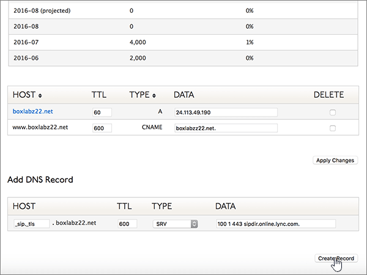

# Criar registros DNS no Dyn.com para MicrosoftCreate DNS records at Dyn.com for Microsoft

 **[Caso não encontre o conteúdo que está procurando, verifique as perguntas frequentes sobre domínios](../setup/domains-faq.md)**.**[Check the Domains FAQ](../setup/domains-faq.md)** if you don't find what you're looking for. 
  
Se você usa a Dyn.com como provedor de hospedagem DNS, siga as etapas deste artigo para verificar o domínio e configurar registros DNS para o Skype for Business Online, email e outros serviços.If Dyn.com is your DNS hosting provider, follow the steps in this article to verify your domain and set up DNS records for email, Skype for Business Online, and so on.
 
Para saber mais sobre o webhosting e o DNS para sites com a Microsoft, confira [usar um site público com a Microsoft](https://support.office.com/article/choose-a-public-website-3325d50e-d131-403c-a278-7f3296fe33a9).To learn about webhosting and DNS for websites with Microsoft, see [Use a public website with Microsoft](https://support.office.com/article/choose-a-public-website-3325d50e-d131-403c-a278-7f3296fe33a9).
  
> [!NOTE]
>  Normalmente, são necessários cerca de 15 minutos para que as alterações de DNS entrem em vigor. Mas, às vezes, pode ser necessário mais tempo para atualizar uma alteração feita no sistema DNS da Internet. Se você tiver problemas com o fluxo de emails ou de outro tipo após adicionar os registros DNS, consulte [Solucionar problemas após alterar o nome de domínio ou registros DNS](../get-help-with-domains/find-and-fix-issues.md).Typically it takes about 15 minutes for DNS changes to take effect. However, it can occasionally take longer for a change you've made to update across the Internet's DNS system. If you're having trouble with mail flow or other issues after adding DNS records, see [Troubleshoot issues after changing your domain name or DNS records](../get-help-with-domains/find-and-fix-issues.md). 
  
## Adicionar um registro TXT para verificaçãoAdd a TXT record for verification

1. Para iniciar, vá até a sua página de domínios em Dyn.com usando [este link](https://account.dyn.com/dns/). Você será solicitado a fazer o logon pela primeira vez.To get started, go to your domains page at Dyn.com by using [this link](https://account.dyn.com/dns/). You'll be prompted to login first.
    
    
  
2. Na página **serviços de nível de zona** , selecione **dyn serviço DNS padrão** para o domínio que você deseja editar.On the **Zone Level Services** page, select **Dyn Standard DNS Service** for the domain that you want to edit. 
    
3. Na página **DNS** do seu domínio, selecione **preferências**.On the **DNS** page for your domain, select **Preferences**.
    
4. Selecione **habilitar interface especializada**.Select **Enable Expert Interface**.
    
5. In the **Add DNS Record** section, in the boxes for the new record, type or copy and paste the values from the following table.In the **Add DNS Record** section, in the boxes for the new record, type or copy and paste the values from the following table. 
    
    (Choose the **Type** value from the drop-down list.)(Choose the **Type** value from the drop-down list.) 
    
    |**Host****Host**|**TTL****TTL**|**Tipo****Type**|**Dados****Data**|
    |:-----|:-----|:-----|:-----|
    |(Leave this field empty.)(Leave this field empty.)    |600600    |TXTTXT    |MS = ms *XXXXXXXX*MS=ms *XXXXXXXX*    **Observação**: esse é um exemplo.**Note:** This is an example. Use o seu **destino específico ou aponte para** o valor de endereço aqui, a partir da tabela.Use your specific **Destination or Points to Address** value here, from the table.           [Como localizo isto?How do I find this?](../get-help-with-domains/information-for-dns-records.md)          |
       
   
  
6. Selecione **criar registro**.Select **Create Record**.
    
    
  
7. Aguarde alguns minutos antes de prosseguir para que o registro que você acabou de criar possa ser atualizado na Internet.Wait a few minutes before you continue, so that the record you just created can update across the Internet.
    
Agora que você adicionou o registro no site do seu registrador de domínio, você voltará para a Microsoft e solicitará o registro.Now that you've added the record at your domain registrar's site, you'll go back to Microsoft and request the record.
  
Quando a Microsoft encontrar o registro TXT correto, seu domínio será verificado.When Microsoft finds the correct TXT record, your domain is verified.
  
1. No centro de administração da Microsoft, vá para a página de <a href="https://go.microsoft.com/fwlink/p/?linkid=834818" target="_blank">domínios</a> de **configurações** \> .In the Microsoft admin center, go to the **Settings** \> <a href="https://go.microsoft.com/fwlink/p/?linkid=834818" target="_blank">Domains</a> page.

    
2. Na página **Domínios**, clique no domínio que você está verificando.On the **Domains** page, select the domain that you are verifying. 
    
    
  
3. Na página **Configuração**, clique em **Iniciar configuração**.On the **Setup** page, select **Start setup**.
    
    
  
4. Na página **Verificar domínio**, marque **Verificar**.On the **Verify domain** page, select **Verify**.
    
    
  
> [!NOTE]
>  Normalmente, são necessários cerca de 15 minutos para que as alterações de DNS entrem em vigor. Mas, às vezes, pode ser necessário mais tempo para atualizar uma alteração feita no sistema DNS da Internet. Se você tiver problemas com o fluxo de emails ou de outro tipo após adicionar os registros DNS, consulte [Solucionar problemas após alterar o nome de domínio ou registros DNS](../get-help-with-domains/find-and-fix-issues.md).Typically it takes about 15 minutes for DNS changes to take effect. However, it can occasionally take longer for a change you've made to update across the Internet's DNS system. If you're having trouble with mail flow or other issues after adding DNS records, see [Troubleshoot issues after changing your domain name or DNS records](../get-help-with-domains/find-and-fix-issues.md). 
  
## Adicionar um registro MX para que o email do seu domínio seja fornecido para a MicrosoftAdd an MX record so email for your domain will come to Microsoft

1. Para iniciar, vá até a sua página de domínios em Dyn.com usando [este link](https://account.dyn.com/dns/). Você será solicitado a fazer o logon pela primeira vez.To get started, go to your domains page at Dyn.com by using [this link](https://account.dyn.com/dns/). You'll be prompted to login first.
    
    
  
2. Na página **serviços de nível de zona** , selecione **dyn serviço DNS padrão** para o domínio que você deseja editar.On the **Zone Level Services** page, select **Dyn Standard DNS Service** for the domain that you want to edit. 
    
3. Na página DNS do seu domínio, selecione **preferências**.On the DNS page for your domain, select **Preferences**.
    
4. Selecione **habilitar interface especializada**.Select **Enable Expert Interface**.
    
5. In the **Add DNS Record** section, in the boxes for the new record, type or copy and paste the values from the following table.In the **Add DNS Record** section, in the boxes for the new record, type or copy and paste the values from the following table. 
    
    (Choose the **Type** value from the drop-down list.)(Choose the **Type** value from the drop-down list.) 
    
    |**Host****Host**|**TTL****TTL**|**Tipo****Type**|**Dados****Data**|
    |:-----|:-----|:-----|:-----|
    |(Leave this field empty.)(Leave this field empty.)    |600600    |MXMX    |10  *\<chave-de-domínio\>*  .mail.protection.outlook.com.10  *\<domain-key\>*  .mail.protection.outlook.com.    **Este valor deve OBRIGATORIAMENTE terminar com um ponto (.)****This value MUST end with a period (.)**   O **10** é o valor de prioridade de MX. Adicione-o ao início do valor de MX, separado do restante do valor por um espaço.  The **10** is the MX priority value. Add it to the beginning of the MX value, separated from the remainder of the value by a space.    **Observação:** Obtenha sua \* \<chave\> de domínio\* de sua conta da Microsoft.**Note:** Get your  *\<domain-key\>*  from your Microsoft account.           [Como faço para encontrar isso?How do I find this?](../get-help-with-domains/information-for-dns-records.md)           Para saber mais sobre prioridade, consulte [O que é prioridade MX?](https://support.office.com/article/2784cc4d-95be-443d-b5f7-bb5dd867ba83.aspx)For more information about priority, see [What is MX priority?](https://support.office.com/article/2784cc4d-95be-443d-b5f7-bb5dd867ba83.aspx)   |
   
    
  
6. Selecione **criar registro**.Select **Create Record**.
    
    
  
7. Caso haja outros registros MX, remova-os marcando a caixa de seleção de cada um na coluna **Excluir**.If there are any other MX records, remove them by selecting the check box for each one in the **Delete** column. 
    
    
  
8. Selecione **aplicar alterações**.Select **Apply Changes**.
    
    
  
## Adicionar os seis registros CNAME necessários para o MicrosoftAdd the six CNAME records that are required for Microsoft

1. Para iniciar, vá até a sua página de domínios em Dyn.com usando [este link](https://account.dyn.com/dns/). Você será solicitado a fazer o logon pela primeira vez.To get started, go to your domains page at Dyn.com by using [this link](https://account.dyn.com/dns/). You'll be prompted to login first.
    
    
  
2. Na página **serviços de nível de zona** , selecione **dyn serviço DNS padrão** para o domínio que você deseja editar.On the **Zone Level Services** page, select **Dyn Standard DNS Service** for the domain that you want to edit. 
    
3. Na página **DNS** do seu domínio, selecione **preferências**.On the **DNS** page for your domain, select **Preferences**.
    
4. Selecione **habilitar interface especializada**.Select **Enable Expert Interface**.
    
5. Adicione o primeiro dos seis registros CNAME.Add the first of the six CNAME records.
    
    Na seção **Adicionar um Registro DNS**, nas caixas do novo registro, digite ou copie e cole os valores da primeira linha da tabela a seguir.In the **Add DNS Record** section, in the boxes for the new record, type or copy and paste the values from the first row of the following table. 
    
    (Escolha o valor de **Tipo** na lista suspensa.)(Choose the **Type** value from the drop-down list.) 
    
    |**Host****Host**|**TTL****TTL**|**Tipo****Type**|**Dados****Data**|
    |:-----|:-----|:-----|:-----|
    |descoberta automáticaautodiscover    |600600    |CNAMECNAME    |autodiscover.outlook.com.autodiscover.outlook.com.    **This value MUST end with a period (.)****This value MUST end with a period (.)**   |
    |sipsip    |600600    |CNAMECNAME    |sipdir.online.lync.com.sipdir.online.lync.com.    **This value MUST end with a period (.)****This value MUST end with a period (.)**   |
    |lyncdiscoverlyncdiscover    |600600    |CNAMECNAME    |webdir.online.lync.com.webdir.online.lync.com.    **This value MUST end with a period (.)****This value MUST end with a period (.)**   |
    |enterpriseregistrationenterpriseregistration    |600600    |CNAMECNAME    |enterpriseregistration.windows.net.enterpriseregistration.windows.net.    **This value MUST end with a period (.)****This value MUST end with a period (.)**   |
    |enterpriseenrollmententerpriseenrollment    |600600    |CNAMECNAME    |enterpriseenrollment-s.manage.microsoft.com.enterpriseenrollment-s.manage.microsoft.com.    **This value MUST end with a period (.)****This value MUST end with a period (.)**   |
   
    
  
6. Selecione **criar registro**.Select **Create Record**.
    
    
  
7. Adicione os cinco registros CNAME restantes.Add the remaining five CNAME records.
    
    Na seção **adicionar registro DNS** , crie um registro usando os valores da próxima linha na tabela e, em seguida, selecione **criar registro** para concluir esse registro.In the **Add DNS Record** section, create a record by using the values from the next row in the table, and then again select **Create Record** to complete that record. 
    
    Repita esse processo até ter criado todos os seis registros CNAME.Repeat this process until you have created all six CNAME records.
    
## Adicionar o registro TXT à SPF para ajudar a evitar spam de e-mailAdd a TXT record for SPF to help prevent email spam

> [!IMPORTANT]
> Não é possível ter mais de um registro TXT para SPF para um domínio.You cannot have more than one TXT record for SPF for a domain. Se o seu domínio possuir mais de um registro SPF, ocorrerão erros de email, bem como problemas na entrega e na classificação de spam.If your domain has more than one SPF record, you'll get email errors, as well as delivery and spam classification issues. Se você já tiver um registro SPF para seu domínio, não crie um novo para a Microsoft.If you already have an SPF record for your domain, don't create a new one for Microsoft. Em vez disso, adicione os valores necessários da Microsoft ao registro atual para que você tenha um *único* registro SPF que inclua os dois conjuntos de valores.Instead, add the required Microsoft values to the current record so that you have a  *single*  SPF record that includes both sets of values.
  
1. Para iniciar, vá até a sua página de domínios em Dyn.com usando [este link](https://account.dyn.com/dns/). Você será solicitado a fazer o logon pela primeira vez.To get started, go to your domains page at Dyn.com by using [this link](https://account.dyn.com/dns/). You'll be prompted to login first.
    
    
  
2. Na página **serviços de nível de zona** , selecione **dyn serviço DNS padrão** para o domínio que você deseja editar.On the **Zone Level Services** page, select **Dyn Standard DNS Service** for the domain that you want to edit. 
    
3. Na página **DNS** do seu domínio, selecione **preferências**.On the **DNS** page for your domain, select **Preferences**.
    
4. Selecione **habilitar interface especializada**.Select **Enable Expert Interface**.
    
5. In the **Add DNS Record** section, in the boxes for the new record, type or copy and paste the values from the following table.In the **Add DNS Record** section, in the boxes for the new record, type or copy and paste the values from the following table. 
    
    (Choose the **Type** value from the drop-down list.)(Choose the **Type** value from the drop-down list.) 
    
    |**Host****Host**|**TTL****TTL**|**Tipo****Type**|**Dados****Data**|
    |:-----|:-----|:-----|:-----|
    |(Leave this field empty.)(Leave this field empty.)    |600600    |TXTTXT    |v=spf1 include:spf.protection.outlook.com -allv=spf1 include:spf.protection.outlook.com -all    **Observação:** é recomendável copiar e colar essa entrada para que o espaçamento permaneça correto.**Note:** We recommend copying and pasting this entry, so that all of the spacing stays correct.           |
   
    
  
6. Selecione **criar registro**.Select **Create Record**.
    
    
  
## Adicionar os dois registros SRV necessários para o MicrosoftAdd the two SRV records that are required for Microsoft

1. Para iniciar, vá até a sua página de domínios em Dyn.com usando [este link](https://account.dyn.com/dns/).To get started, go to your domains page at Dyn.com by using [this link](https://account.dyn.com/dns/). Você será solicitado a fazer logon primeiroYou'll be prompted to login first 
    
    
  
2. Na página **serviços de nível de zona** , selecione **dyn serviço DNS padrão** para o domínio que você deseja editar.On the **Zone Level Services** page, select **Dyn Standard DNS Service** for the domain that you want to edit. 
    
3. Na página **DNS** do seu domínio, selecione **preferências**.On the **DNS** page for your domain, select **Preferences**.
    
4. Selecione **habilitar interface especializada**.Select **Enable Expert Interface**.
    
5. Adicione o primeiro dos dois registros SRV.Add the first of the two SRV records.
    
    Na seção **Adicionar um Registro DNS**, nas caixas do novo registro, digite ou copie e cole os valores da primeira linha da tabela a seguir.In the **Add DNS Record** section, in the boxes for the new record, type or copy and paste the values from the first row of the following table. 
    
    (Escolha o valor de **Tipo** na lista suspensa.)(Choose the **Type** value from the drop-down list.) 
    
    |**Host****Host**|**TTL****TTL**|**Tipo****Type**|**Dados****Data**|
    |:-----|:-----|:-----|:-----|
    |_sip. _tls_sip._tls|600600|SRVSRV|100 1 443 sipdir.online.lync.com.100 1 443 sipdir.online.lync.com. **This value MUST end with a period (.)****This value MUST end with a period (.)** **Observação:** é recomendável copiar e colar essa entrada para que o espaçamento permaneça correto.**Note:** We recommend copying and pasting this entry, so that all of the spacing stays correct.           |
    |_sipfederationtls. _tcp_sipfederationtls._tcp|600600|SRVSRV|100 1 5061 sipfed.online.lync.com.100 1 5061 sipfed.online.lync.com. **This value MUST end with a period (.)****This value MUST end with a period (.)**  **Observação:** é recomendável copiar e colar essa entrada para que o espaçamento permaneça correto.**Note:** We recommend copying and pasting this entry, so that all of the spacing stays correct.           |
   
    
  
6. Selecione **criar registro**.Select **Create Record**.
    
    
  
7. Adicione o outro registro SRV.Add the other SRV record.
    
    Na seção **adicionar registro DNS** , crie um registro usando os valores da segunda linha na tabela e, em seguida, selecione **criar registro** para concluir esse registro.In the **Add DNS Record** section, create a record by using the values from the second row in the table, and then again select **Create Record** to complete that record. 
    
> [!NOTE]
>  Normalmente, são necessários cerca de 15 minutos para que as alterações de DNS entrem em vigor. Mas, às vezes, pode ser necessário mais tempo para atualizar uma alteração feita no sistema DNS da Internet. Se você tiver problemas com o fluxo de emails ou de outro tipo após adicionar os registros DNS, consulte [Solucionar problemas após alterar o nome de domínio ou registros DNS](../get-help-with-domains/find-and-fix-issues.md).Typically it takes about 15 minutes for DNS changes to take effect. However, it can occasionally take longer for a change you've made to update across the Internet's DNS system. If you're having trouble with mail flow or other issues after adding DNS records, see [Troubleshoot issues after changing your domain name or DNS records](../get-help-with-domains/find-and-fix-issues.md). 
  
