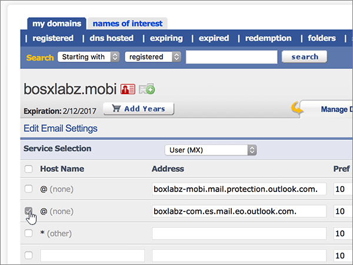
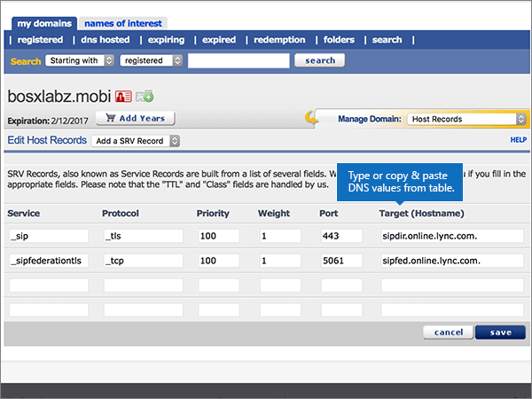

# Criar registros DNS na eNomCentral para a Microsoft

 **Caso não encontre o conteúdo que está procurando, [verifique as perguntas frequentes sobre domínios](../setup/domains-faq.yml)**.

Se você usa a eNomCentral como provedor de hospedagem DNS, siga as etapas neste artigo para verificar o domínio e configurar registros DNS para o Skype for Business Online, email e outros serviços.

Depois que você adicionar esses registros na eNomCentral, seu domínio será definido para funcionar com os serviços Microsoft.

> [!NOTE]
> Normalmente, são necessários cerca de 15 minutos para que as alterações de DNS entrem em vigor. Mas, às vezes, pode ser necessário mais tempo para atualizar uma alteração feita no sistema DNS da Internet. Se você tiver problemas com o fluxo de emails ou de outro tipo após adicionar os registros DNS, consulte [Solucionar problemas após alterar o nome de domínio ou registros DNS](../get-help-with-domains/find-and-fix-issues.md).

## Adicionar um registro TXT para verificação

Antes de usar o seu domínio com a Microsoft, precisamos verificar se você é o proprietário dele. A capacidade de entrar na conta do seu registrador de domínios e criar o registro de DNS prova à Microsoft que você é o proprietário do domínio.

> [!NOTE]
> Esse registro é usado exclusivamente para confirmar se você é o proprietário do domínio; ele não afeta mais nada. É possível excluí-lo mais tarde, se desejar.

Siga as etapas abaixo ou [assista ao vídeo (inicia em 0:46)](https://support.microsoft.com/office/3766a9e8-77dd-4a42-908d-89b076143e7d).

1. Para iniciar, vá até a página do seu domínio no site eNom Central usando [este link](https://www.enomcentral.com/domains/Domain-Manager.aspx?tab=registered). Você será solicitado a fazer o logon.

   

2. Em **meus domínios,** selecione o nome do domínio que você deseja editar.

   

3. Na lista suspensa **Gerenciar Domínio**, escolha **Registros do Host**.

   

4. Nas caixas do novo registro, digite ou copie e cole os valores da seguinte tabela.

   Escolha o **valor de Tipo** de Registro na lista drop-down.

   |Nome de Host|Record Type|Endereço|
   |---|---|---|
   |@|TXT|MS = ms *XXXXXXXX*    **Observação**: esse é um exemplo. Use aqui seu valor específico de **Destino ou Pontos de Endereçamento**, retirado da tabela. [Como localizo isto?](../get-help-with-domains/information-for-dns-records.md)|

   

5. Selecione **salvar**.

   

6. Aguarde alguns minutos antes de prosseguir para que o registro que você acabou de criar possa ser atualizado na Internet.

Agora que você adicionou o registro no site do seu registrador de domínios, retorne ao Microsoft 365 e solicite que o Microsoft 365 procure o registro.

Quando a Microsoft encontrar o registro TXT correto, seu domínio estará verificado.

1. No centro do administrador da Microsoft, acesse a página **Configurações de** \> <a href="https://go.microsoft.com/fwlink/p/?linkid=834818" target="_blank">domínios</a>.

2. Na página **Domínios**, clique no domínio que você está verificando.

3. Na página **Configuração**, clique em **Iniciar configuração**.

4. Na página **Verificar domínio**, marque **Verificar**.

> [!NOTE]
> Normalmente, são necessários cerca de 15 minutos para que as alterações de DNS entrem em vigor. Mas, às vezes, pode ser necessário mais tempo para atualizar uma alteração feita no sistema DNS da Internet. Se você tiver problemas com o fluxo de emails ou de outro tipo após adicionar os registros DNS, consulte [Solucionar problemas após alterar o nome de domínio ou registros DNS](../get-help-with-domains/find-and-fix-issues.md).

## Adicione um registro MX para que o email do domínio vá para a Microsoft.

Siga as etapas abaixo ou [assista ao vídeo (inicia em 3:40)](https://support.microsoft.com/office/3766a9e8-77dd-4a42-908d-89b076143e7d).

1. Para iniciar, vá até a página do seu domínio no site eNom Central usando [este link](https://www.enomcentral.com/domains/Domain-Manager.aspx?tab=registered). Você será solicitado a fazer o logon.

   

2. Em **meus domínios,** selecione o nome do domínio que você deseja editar.

   

3. Na lista suspensa **Gerenciar Domínio**, escolha **Configurações de Email**.

   

4. Na lista suspensa **Seleção de Serviço**, escolha **Usuário (MX)**.

   

5. In the boxes for the new record, type or copy and paste the values from the following table.

   |Nome de Host|Endereço|Pref|
   |---|---|---|
   |@| *\<domain-key\>*  .mail.protection.outlook.com.    **Este valor deve OBRIGATORIAMENTE terminar com um ponto (.)**   **Observação:** Obter o  *\<domain-key\>*  seu da sua conta da Microsoft. [Como faço para encontrar isso?](../get-help-with-domains/information-for-dns-records.md)|10     Para saber mais sobre prioridade, confira [O que é prioridade MX?](https://docs.microsoft.com/microsoft-365/admin/setup/domains-faq)|

   

6. Selecione **salvar**.

   

7. Se houver outros registros MX existentes, marque as caixas de seleção desses registros para escolhê-los.

   

8. Selecione **excluir marcada.**

   

## Adicionar os registros CNAME necessários para a Microsoft

Siga as etapas abaixo ou [assista ao vídeo (inicia em 4:24)](https://support.microsoft.com/office/3766a9e8-77dd-4a42-908d-89b076143e7d).

1. Para iniciar, vá até a página do seu domínio no site eNom Central usando [este link](https://www.enomcentral.com/domains/Domain-Manager.aspx?tab=registered). Você será solicitado a fazer o logon.

   

2. Em **meus domínios,** selecione o nome do domínio que você deseja editar.

   

3. Na lista suspensa **Gerenciar Domínio**, escolha **Registros do Host**.

   

4. Selecione **nova linha.**

   

5. Nas caixas dos seis novos registros, digite ou copie e cole os seguintes valores.

   Escolha o **valor de Tipo** de Registro na lista drop-down.

   |Nome de Host|Record Type|Endereço|
   |---|---|---|
   |descoberta automática|CNAME (Alias)|autodiscover.outlook.com.    **Este valor deve OBRIGATORIAMENTE terminar com um ponto (.)**|
   |sip|CNAME (Alias)|sipdir.online.lync.com.    **Este valor deve OBRIGATORIAMENTE terminar com um ponto (.)**|
   |lyncdiscover|CNAME (Alias)|webdir.online.lync.com.    **Este valor deve OBRIGATORIAMENTE terminar com um ponto (.)**|
   |enterpriseregistration|CNAME (Alias)|enterpriseregistration.windows.net.    **Este valor deve OBRIGATORIAMENTE terminar com um ponto (.)**|
   |enterpriseenrollment|CNAME (Alias)|enterpriseenrollment-s.manage.microsoft.com.    **Este valor deve OBRIGATORIAMENTE terminar com um ponto (.)**|

   

6. Selecione **salvar**.

   

## Adicionar o registro TXT à SPF para ajudar a evitar spam de e-mail

> [!IMPORTANT]
> Não é possível ter mais de um registro TXT para SPF para um domínio. Se o seu domínio possuir mais de um registro SPF, ocorrerão erros de email, bem como problemas na entrega e na classificação de spam. Se você já possui um registro SPF para seu domínio, não crie um novo para a Microsoft. Em vez disso, adicione os valores necessários da Microsoft ao registro atual para que você tenha um único registro  *SPF*  que inclua ambos os conjuntos de valores.

Siga as etapas abaixo ou [assista ao vídeo (inicia em 5:12)](https://support.microsoft.com/office/3766a9e8-77dd-4a42-908d-89b076143e7d).

1. Para iniciar, vá até a página do seu domínio no site eNom Central usando [este link](https://www.enomcentral.com/domains/Domain-Manager.aspx?tab=registered). Você será solicitado a fazer o logon.

   

2. Em **meus domínios,** selecione o nome do domínio que você deseja editar.

   

3. Na lista suspensa **Gerenciar Domínio**, escolha **Registros do Host**.

   

4. Nas caixas do novo registro, digite ou copie e cole os valores da seguinte tabela.

   Escolha o **valor de Tipo** de Registro na lista drop-down.

   |Nome de Host|Record Type|Endereço|
   |---|---|---|
   |@|TXT|v=spf1 include:spf.protection.outlook.com -all   **Observação:** é recomendável copiar e colar essa entrada para que o espaçamento permaneça correto.|

   

5. Selecione **salvar**.

   

## Adicionar os dois registros SRV necessários para a Microsoft

Siga as etapas abaixo ou [assista ao vídeo (inicia em 5:50)](https://support.microsoft.com/office/3766a9e8-77dd-4a42-908d-89b076143e7d).

1. Para iniciar, vá até a página do seu domínio no site eNom Central usando [este link](https://www.enomcentral.com/domains/Domain-Manager.aspx?tab=registered). Você será solicitado a fazer o logon.

   

2. Em **meus domínios,** selecione o nome do domínio que você deseja editar.

   

3. Na lista suspensa **Gerenciar Domínio**, escolha **Registros do Host**.

   

4. À direita da nova **linha, selecione** **adicionar registro SRV ou SPF.**

   

5. Nas caixas dos dois novos registros, digite ou copie e cole os valores da seguinte tabela.

   |Serviço|Protocolo|Priority|Peso|Porta|Destino (Nome do host)|
   |---|---|---|---|---|---|
   |_sip|_tls|100|1 |443|sipdir.online.lync.com.    **Este valor deve OBRIGATORIAMENTE terminar com um ponto (.)**|
   |_sipfederationtls|_tcp|100|1 |5061|sipfed.online.lync.com.    **Este valor deve OBRIGATORIAMENTE terminar com um ponto (.)**|

   

6. Selecionar **salvar**

   

> [!NOTE]
> Normalmente, são necessários cerca de 15 minutos para que as alterações de DNS entrem em vigor. Mas, às vezes, pode ser necessário mais tempo para atualizar uma alteração feita no sistema DNS da Internet. Se você tiver problemas com o fluxo de emails ou de outro tipo após adicionar os registros DNS, consulte [Solucionar problemas após alterar o nome de domínio ou registros DNS](../get-help-with-domains/find-and-fix-issues.md).
