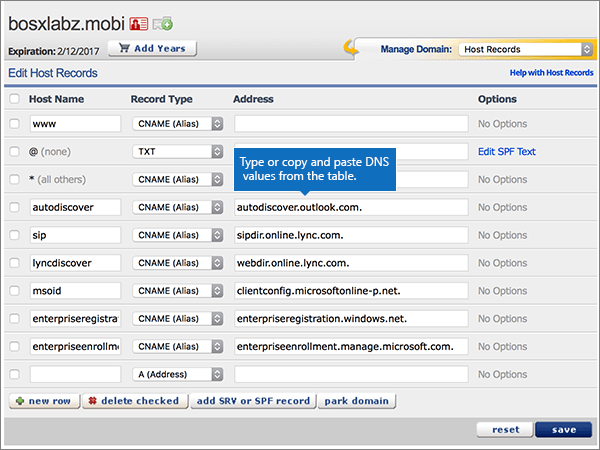

# Criar registros DNS no eNomCentral para a MicrosoftCreate DNS records at eNomCentral for Microsoft

 **Caso não encontre o conteúdo que está procurando, [verifique as perguntas frequentes sobre domínios](../setup/domains-faq.yml)**.**[Check the Domains FAQ](../setup/domains-faq.yml)** if you don't find what you're looking for.

Se você usa a eNomCentral como provedor de hospedagem DNS, siga as etapas neste artigo para verificar o domínio e configurar registros DNS para o Skype for Business Online, email e outros serviços.If eNomCentral is your DNS hosting provider, follow the steps in this article to verify your domain and set up DNS records for email, Skype for Business Online, and so on.

Depois de adicionar esses registros no eNomCentral, seu domínio será definido para funcionar com os serviços da Microsoft.After you add these records at eNomCentral, your domain will be set up to work with Microsoft services.

> [!NOTE]
> Normalmente, são necessários cerca de 15 minutos para que as alterações de DNS entrem em vigor. Mas, às vezes, pode ser necessário mais tempo para atualizar uma alteração feita no sistema DNS da Internet. Se você tiver problemas com o fluxo de emails ou de outro tipo após adicionar os registros DNS, consulte [Solucionar problemas após alterar o nome de domínio ou registros DNS](../get-help-with-domains/find-and-fix-issues.md).Typically it takes about 15 minutes for DNS changes to take effect. However, it can occasionally take longer for a change you've made to update across the Internet's DNS system. If you're having trouble with mail flow or other issues after adding DNS records, see [Troubleshoot issues after changing your domain name or DNS records](../get-help-with-domains/find-and-fix-issues.md).

## Adicionar um registro TXT para verificaçãoAdd a TXT record for verification

Antes de usar o seu domínio com a Microsoft, precisamos verificar se você é o proprietário dele. A capacidade de entrar na conta do seu registrador de domínios e criar o registro de DNS prova à Microsoft que você é o proprietário do domínio.Before you use your domain with Microsoft, we have to make sure that you own it. Your ability to log in to your account at your domain registrar and create the DNS record proves to Microsoft that you own the domain.

> [!NOTE]
> Esse registro é usado exclusivamente para confirmar se você é o proprietário do domínio; ele não afeta mais nada. É possível excluí-lo mais tarde, se desejar.This record is used only to verify that you own your domain; it doesn't affect anything else. You can delete it later, if you like.

Siga as etapas abaixo ou [assista ao vídeo (inicia em 0:46)](https://support.microsoft.com/office/3766a9e8-77dd-4a42-908d-89b076143e7d).Follow the steps below or [watch the video (start at 0:46)](https://support.microsoft.com/office/3766a9e8-77dd-4a42-908d-89b076143e7d).

1. Para iniciar, vá até a página do seu domínio no site eNom Central usando [este link](https://www.enomcentral.com/domains/Domain-Manager.aspx?tab=registered). Você será solicitado a fazer o logon.To get started, go to your domains page at eNom Central by using [this link](https://www.enomcentral.com/domains/Domain-Manager.aspx?tab=registered). You'll be prompted to login.

   

2. Em **meus domínios,** selecione o nome do domínio que você deseja editar.Under **my domains**, select the name of the domain that you want to edit.

   

3. Na lista suspensa **Gerenciar Domínio**, escolha **Registros do Host**.On the **Manage Domain** drop-down list, choose **Host Records**.

   

4. Nas caixas do novo registro, digite ou copie e cole os valores da seguinte tabela.In the boxes for the new record, type or copy and paste the values from the following table.

   Escolha o **valor Tipo** de Registro na lista lista listada.Choose the **Record Type** value from the drop-down list.

   |Nome de HostHost Name|Record TypeRecord Type|EndereçoAddress|
   |---|---|---|
   |@|TXTTXT|MS = ms *XXXXXXXX*MS=ms *XXXXXXXX*    **Observação**: esse é um exemplo.**Note:** This is an example. Use aqui seu valor específico de **Destino ou Pontos de Endereçamento**, retirado da tabela.Use your specific **Destination or Points to Address** value here, from the table. [Como localizo isto?How do I find this?](../get-help-with-domains/information-for-dns-records.md)|

   

5. Selecione **salvar**.Select **save**.

   

6. Aguarde alguns minutos antes de prosseguir para que o registro que você acabou de criar possa ser atualizado na Internet.Wait a few minutes before you continue, so that the record you just created can update across the Internet.

Agora que você adicionou o registro no site do seu registrador de domínios, retorne ao Microsoft 365 e solicite que o Microsoft 365 procure o registro.Now that you've added the record at your domain registrar's site, you'll go back to Microsoft 365 and request Microsoft 365 to look for the record.

Quando a Microsoft encontrar o registro TXT correto, seu domínio estará verificado.When Microsoft finds the correct TXT record, your domain is verified.

1. No centro do administrador da Microsoft, acesse a página **Configurações de** \> <a href="https://go.microsoft.com/fwlink/p/?linkid=834818" target="_blank">domínios</a>.In the Microsoft admin center, go to the **Settings** \> <a href="https://go.microsoft.com/fwlink/p/?linkid=834818" target="_blank">Domains</a> page.

2. Na página **Domínios**, clique no domínio que você está verificando.On the **Domains** page, select the domain that you are verifying.

3. Na página **Configuração**, clique em **Iniciar configuração**.On the **Setup** page, select **Start setup**.

4. Na página **Verificar domínio**, marque **Verificar**.On the **Verify domain** page, select **Verify**.

> [!NOTE]
> Normalmente, são necessários cerca de 15 minutos para que as alterações de DNS entrem em vigor. Mas, às vezes, pode ser necessário mais tempo para atualizar uma alteração feita no sistema DNS da Internet. Se você tiver problemas com o fluxo de emails ou de outro tipo após adicionar os registros DNS, consulte [Solucionar problemas após alterar o nome de domínio ou registros DNS](../get-help-with-domains/find-and-fix-issues.md).Typically it takes about 15 minutes for DNS changes to take effect. However, it can occasionally take longer for a change you've made to update across the Internet's DNS system. If you're having trouble with mail flow or other issues after adding DNS records, see [Troubleshoot issues after changing your domain name or DNS records](../get-help-with-domains/find-and-fix-issues.md).

## Adicione um registro MX para que o email do domínio vá para a Microsoft.Add an MX record so email for your domain will come to Microsoft

Siga as etapas abaixo ou [assista ao vídeo (inicia em 3:40)](https://support.microsoft.com/office/3766a9e8-77dd-4a42-908d-89b076143e7d).Follow the steps below or [watch the video (start at 3:40)](https://support.microsoft.com/office/3766a9e8-77dd-4a42-908d-89b076143e7d).

1. Para iniciar, vá até a página do seu domínio no site eNom Central usando [este link](https://www.enomcentral.com/domains/Domain-Manager.aspx?tab=registered). Você será solicitado a fazer o logon.To get started, go to your domains page at eNom Central by using [this link](https://www.enomcentral.com/domains/Domain-Manager.aspx?tab=registered). You'll be prompted to login.

   

2. Em **meus domínios,** selecione o nome do domínio que você deseja editar.Under **my domains**, select the name of the domain that you want to edit.

   

3. Na lista suspensa **Gerenciar Domínio**, escolha **Configurações de Email**.On the **Manage Domain** drop-down list, choose **Email Settings**.

   

4. Na lista suspensa **Seleção de Serviço**, escolha **Usuário (MX)**.On the **Service Selection** drop-down list, choose **User (MX)**.

   

5. In the boxes for the new record, type or copy and paste the values from the following table.In the boxes for the new record, type or copy and paste the values from the following table.

   |Nome de HostHost Name|EndereçoAddress|PrefPref|
   |---|---|---|
   |@| *\<domain-key\>*  .mail.protection.outlook.com.*\<domain-key\>*  .mail.protection.outlook.com.    **Este valor deve OBRIGATORIAMENTE terminar com um ponto (.)****This value MUST end with a period (.)**   **Observação:** Obter o  *\<domain-key\>*  seu de sua conta da Microsoft.**Note:** Get your  *\<domain-key\>*  from your Microsoft account. [Como faço para encontrar isso?How do I find this?](../get-help-with-domains/information-for-dns-records.md)|10 10    Para saber mais sobre prioridade, confira [O que é prioridade MX?](../setup/domains-faq.yml)For more information about priority, see [What is MX priority?](../setup/domains-faq.yml)|

   

6. Selecione **salvar**.Select **save**.

   

7. Se houver outros registros MX existentes, marque as caixas de seleção desses registros para escolhê-los.If there are any other existing MX records, select the check boxes for those records to select them.

   

8. Selecione **excluir verificado**.Select **delete checked**.

   

## Adicionar os registros CNAME necessários para a MicrosoftAdd the CNAME records that are required for Microsoft

Siga as etapas abaixo ou [assista ao vídeo (inicia em 4:24)](https://support.microsoft.com/office/3766a9e8-77dd-4a42-908d-89b076143e7d).Follow the steps below or [watch the video (start at 4:24)](https://support.microsoft.com/office/3766a9e8-77dd-4a42-908d-89b076143e7d).

1. Para iniciar, vá até a página do seu domínio no site eNom Central usando [este link](https://www.enomcentral.com/domains/Domain-Manager.aspx?tab=registered). Você será solicitado a fazer o logon.To get started, go to your domains page at eNom Central by using [this link](https://www.enomcentral.com/domains/Domain-Manager.aspx?tab=registered). You'll be prompted to login.

   

2. Em **meus domínios,** selecione o nome do domínio que você deseja editar.Under **my domains**, select the name of the domain that you want to edit.

   

3. Na lista suspensa **Gerenciar Domínio**, escolha **Registros do Host**.On the **Manage Domain** drop-down list, choose **Host Records**.

   

4. Selecione **nova linha**.Select **new row**.

   

5. Nas caixas dos seis novos registros, digite ou copie e cole os seguintes valores.In the boxes for the six new records, type or copy and paste the following values.

   Escolha o **valor Tipo** de Registro na lista lista listada.Choose the **Record Type** value from the drop-down list.

   |Nome de HostHost Name|Record TypeRecord Type|EndereçoAddress|
   |---|---|---|
   |descoberta automáticaautodiscover|CNAME (Alias)CNAME (Alias)|autodiscover.outlook.com.autodiscover.outlook.com.    **Este valor deve OBRIGATORIAMENTE terminar com um ponto (.)****This value MUST end with a period (.)**|
   |sipsip|CNAME (Alias)CNAME (Alias)|sipdir.online.lync.com.sipdir.online.lync.com.    **Este valor deve OBRIGATORIAMENTE terminar com um ponto (.)****This value MUST end with a period (.)**|
   |lyncdiscoverlyncdiscover|CNAME (Alias)CNAME (Alias)|webdir.online.lync.com.webdir.online.lync.com.    **Este valor deve OBRIGATORIAMENTE terminar com um ponto (.)****This value MUST end with a period (.)**|
   |enterpriseregistrationenterpriseregistration|CNAME (Alias)CNAME (Alias)|enterpriseregistration.windows.net.enterpriseregistration.windows.net.    **Este valor deve OBRIGATORIAMENTE terminar com um ponto (.)****This value MUST end with a period (.)**|
   |enterpriseenrollmententerpriseenrollment|CNAME (Alias)CNAME (Alias)|enterpriseenrollment-s.manage.microsoft.com.enterpriseenrollment-s.manage.microsoft.com.    **Este valor deve OBRIGATORIAMENTE terminar com um ponto (.)****This value MUST end with a period (.)**|

   

6. Selecione **salvar**.Select **save**.

   

## Adicionar o registro TXT à SPF para ajudar a evitar spam de e-mailAdd a TXT record for SPF to help prevent email spam

> [!IMPORTANT]
> Não é possível ter mais de um registro TXT para SPF para um domínio.You cannot have more than one TXT record for SPF for a domain. Se o seu domínio possuir mais de um registro SPF, ocorrerão erros de email, bem como problemas na entrega e na classificação de spam.If your domain has more than one SPF record, you'll get email errors, as well as delivery and spam classification issues. Se você já possui um registro SPF para seu domínio, não crie um novo para a Microsoft.If you already have an SPF record for your domain, don't create a new one for Microsoft. Em vez disso, adicione os valores necessários da Microsoft ao registro atual para que você tenha um único registro  *SPF*  que inclua ambos os conjuntos de valores.Instead, add the required Microsoft values to the current record so that you have a  *single*  SPF record that includes both sets of values.

Siga as etapas abaixo ou [assista ao vídeo (inicia em 5:12)](https://support.microsoft.com/office/3766a9e8-77dd-4a42-908d-89b076143e7d).Follow the steps below or [watch the video (start at 5:12)](https://support.microsoft.com/office/3766a9e8-77dd-4a42-908d-89b076143e7d).

1. Para iniciar, vá até a página do seu domínio no site eNom Central usando [este link](https://www.enomcentral.com/domains/Domain-Manager.aspx?tab=registered). Você será solicitado a fazer o logon.To get started, go to your domains page at eNom Central by using [this link](https://www.enomcentral.com/domains/Domain-Manager.aspx?tab=registered). You'll be prompted to login.

   

2. Em **meus domínios,** selecione o nome do domínio que você deseja editar.Under **my domains**, select the name of the domain that you want to edit.

   

3. Na lista suspensa **Gerenciar Domínio**, escolha **Registros do Host**.On the **Manage Domain** drop-down list, choose **Host Records**.

   

4. Nas caixas do novo registro, digite ou copie e cole os valores da seguinte tabela.In the boxes for the new record, type or copy and paste the values from the following table.

   Escolha o **valor Tipo** de Registro na lista lista listada.Choose the **Record Type** value from the drop-down list.

   |Nome de HostHost Name|Record TypeRecord Type|EndereçoAddress|
   |---|---|---|
   |@|TXTTXT|v=spf1 include:spf.protection.outlook.com -allv=spf1 include:spf.protection.outlook.com -all   **Observação:** é recomendável copiar e colar essa entrada para que o espaçamento permaneça correto.**Note:** We recommend copying and pasting this entry, so that all of the spacing stays correct.|

   

5. Selecione **salvar**.Select **save**.

   

## Adicionar os dois registros SRV necessários para a MicrosoftAdd the two SRV records that are required for Microsoft

Siga as etapas abaixo ou [assista ao vídeo (inicia em 5:50)](https://support.microsoft.com/office/3766a9e8-77dd-4a42-908d-89b076143e7d).Follow the steps below or [watch the video (start at 5:50)](https://support.microsoft.com/office/3766a9e8-77dd-4a42-908d-89b076143e7d).

1. Para iniciar, vá até a página do seu domínio no site eNom Central usando [este link](https://www.enomcentral.com/domains/Domain-Manager.aspx?tab=registered). Você será solicitado a fazer o logon.To get started, go to your domains page at eNom Central by using [this link](https://www.enomcentral.com/domains/Domain-Manager.aspx?tab=registered). You'll be prompted to login.

   

2. Em **meus domínios,** selecione o nome do domínio que você deseja editar.Under **my domains**, select the name of the domain that you want to edit.

   

3. Na lista suspensa **Gerenciar Domínio**, escolha **Registros do Host**.On the **Manage Domain** drop-down list, choose **Host Records**.

   

4. À direita da nova **linha,** selecione **adicionar registro SRV ou SPF**.To the right of **new row**, select **add SRV or SPF record**.

   

5. Nas caixas dos dois novos registros, digite ou copie e cole os valores da seguinte tabela.In the boxes for the two new records, type or copy and paste the values from the following table.

   |ServiçoService|ProtocoloProtocol|PriorityPriority|PesoWeight|PortaPort|Destino (Nomedo Host)Target (Hostname)|
   |---|---|---|---|---|---|
   |_sip_sip|_tls_tls|100100|11|443443|sipdir.online.lync.com.sipdir.online.lync.com.    **Este valor deve OBRIGATORIAMENTE terminar com um ponto (.)****This value MUST end with a period (.)**|
   |_sipfederationtls_sipfederationtls|_tcp_tcp|100100|11|50615061|sipfed.online.lync.com.sipfed.online.lync.com.    **Este valor deve OBRIGATORIAMENTE terminar com um ponto (.)****This value MUST end with a period (.)**|

   

6. Selecionar **salvar**Select **save**

   

> [!NOTE]
> Normalmente, são necessários cerca de 15 minutos para que as alterações de DNS entrem em vigor. Mas, às vezes, pode ser necessário mais tempo para atualizar uma alteração feita no sistema DNS da Internet. Se você tiver problemas com o fluxo de emails ou de outro tipo após adicionar os registros DNS, consulte [Solucionar problemas após alterar o nome de domínio ou registros DNS](../get-help-with-domains/find-and-fix-issues.md).Typically it takes about 15 minutes for DNS changes to take effect. However, it can occasionally take longer for a change you've made to update across the Internet's DNS system. If you're having trouble with mail flow or other issues after adding DNS records, see [Troubleshoot issues after changing your domain name or DNS records](../get-help-with-domains/find-and-fix-issues.md).