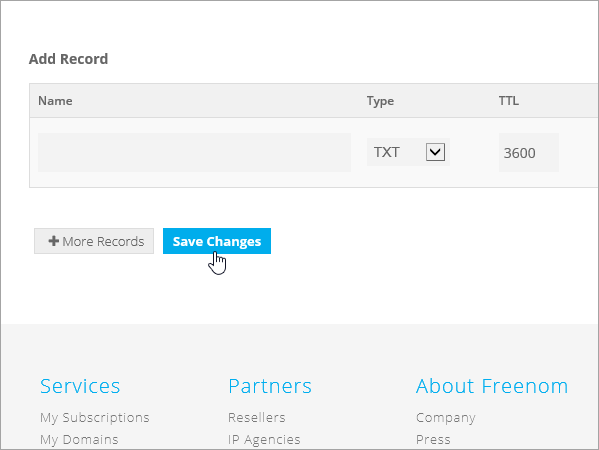
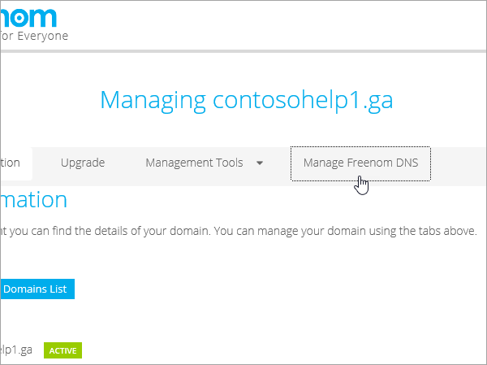

# Criar registros DNS no Freenom para a Microsoft

[Verifique as Perguntas Frequentes de ](../setup/domains-faq.yml) Domínios se você não encontrar o que está procurando. 
  
> [!CAUTION]
> O site do Freenom não dá suporte a registros SRV, o que significa que vários recursos do Skype for Business Online e do Outlook Web App não funcionarão. Não importa qual plano da Microsoft você use, há limitações significativas de serviço e talvez você queira alternar para um provedor de hospedagem DNS diferente. 
  
Se, apesar das limitações de serviço, você optar por gerenciar seus próprios registros DNS da Microsoft no Freenom, siga as etapas deste artigo para verificar seu domínio e configurar registros DNS para email e outros serviços.
  
  
> [!NOTE]
> Normalmente, são necessários cerca de 15 minutos para que as alterações de DNS entrem em vigor. Mas, às vezes, pode ser necessário mais tempo para atualizar uma alteração feita no sistema DNS da Internet. Se você tiver problemas com o fluxo de emails ou de outro tipo após adicionar os registros DNS, consulte [Solucionar problemas após alterar o nome de domínio ou registros DNS](../get-help-with-domains/find-and-fix-issues.md). 
  
## Adicionar um registro TXT para verificação

Antes de usar o seu domínio com a Microsoft, precisamos verificar se você é o proprietário dele. A capacidade de entrar na conta do seu registrador de domínios e criar o registro de DNS prova à Microsoft que você é o proprietário do domínio.
  
> [!NOTE]
> Esse registro é usado exclusivamente para confirmar se você é o proprietário do domínio; ele não afeta mais nada. É possível excluí-lo mais tarde, se desejar. 
  
1. Para começar, vá para sua página de domínios no Freenom usando [este link](https://my.freenom.com/). You'll be prompted to log in.
    
    
  
2. Selecione **Serviços** e selecione **Meus Domínios.**
    
    
  
3. Para o domínio que você deseja editar, selecione **Gerenciar Domínio**.
    
    
  
4. Selecione **Gerenciar DNS do Freenom**.
    
    
  
5. Em **Adicionar Registro**, na coluna **Tipo,** escolha **TXT** no menu. 
    
    
  
6. Nas caixas do novo registro, digite ou copie e cole os valores da seguinte tabela. 
    
    |**Nome**|**Tipo**|**TTL**|**Target**|
    |:-----|:-----|:-----|:-----|
    |(deixar em branco)    |TXT    |3600 (segundos)    |MS=msXXXXXXXX    **Observação**: esse é um exemplo. Use aqui seu valor específico de **Destino ou Pontos de Endereçamento**, retirado da tabela.           [Como localizo isto?](../get-help-with-domains/information-for-dns-records.md)          |
   
    
  
7. Selecione **Salvar Alterações**.
    
    
  
8. Aguarde alguns minutos antes de prosseguir para que o registro que você acabou de criar possa ser atualizado na Internet.
    
Agora que você adicionou o registro no site do seu registrador de domínios, retorne à Microsoft e solicite o registro.
  
Quando a Microsoft encontrar o registro TXT correto, seu domínio estará verificado.
  
1. No centro do administrador da Microsoft, acesse a página **Configurações de** \> <a href="https://go.microsoft.com/fwlink/p/?linkid=834818" target="_blank">domínios</a>.

    
2. Na página **Domínios**, clique no domínio que você está verificando. 
    
    
  
3. Na página **Configuração**, clique em **Iniciar configuração**.
    
    
  
4. Na página **Verificar domínio**, marque **Verificar**.
    
    
  
> [!NOTE]
>  Normalmente, são necessários cerca de 15 minutos para que as alterações de DNS entrem em vigor. Mas, às vezes, pode ser necessário mais tempo para atualizar uma alteração feita no sistema DNS da Internet. Se você tiver problemas com o fluxo de emails ou de outro tipo após adicionar os registros DNS, consulte [Solucionar problemas após alterar o nome de domínio ou registros DNS](../get-help-with-domains/find-and-fix-issues.md). 
  
## Adicione um registro MX para que o email do domínio vá para a Microsoft.

1. Para começar, vá para sua página de domínios no Freenom usando [este link](https://my.freenom.com/). You'll be prompted to log in.
    
    
  
2. Selecione **Serviços** e selecione **Meus Domínios.**
    
    
  
3. Para o domínio que você deseja editar, selecione **Gerenciar Domínio**.
    
    
  
4. De definir o nome serve para o seu domínio para os servidores de nome padrão do Freenom. Selecione **Ferramentas de Gerenciamento** e selecione **Nameservers**.
    
    
  
5. **Certifique-se de usar os nameservers padrão** selecionados e selecione Alterar **Nameservers**.
    
    
  
6. Selecione **Gerenciar DNS do Freenom**.
    
    
  
7. Em **Adicionar Registro**, na coluna **Tipo,** escolha **MX** no menu. 
    
    
  
8. Nas caixas do novo registro, digite ou copie e cole os valores da primeira linha da tabela a seguir. 
    
    |**Nome**|**Tipo**|**TTL**|**Target**|**Prioridade**|
    |:-----|:-----|:-----|:-----|:-----|
    |(deixar em branco)    |Servidor de mensagens (MX)    |3600 (segundos)    |\<domain-key\>.mail.protection.outlook.com    **Observação:** Obter o  *\<domain-key\>*  seu de sua conta da Microsoft.   [Como faço para encontrar isso?](../get-help-with-domains/information-for-dns-records.md)          |10     Para saber mais sobre prioridade, confira [O que é prioridade MX?](../setup/domains-faq.yml)   |
   
   
  
9. Selecione **Salvar Alterações**.
    
    
  
10. Se houver outros registros MX, exclua-os todos. Para cada registro, selecione **Excluir**. Quando a mensagem **Você realmente deseja remover essa entrada?** é exibida, selecione **OK**.
    
## Adicionar os registros CNAME necessários para a Microsoft

1. Para começar, vá para sua página de domínios no Freenom usando [este link](https://my.freenom.com/). You'll be prompted to log in.
    
    
  
2. Selecione **Serviços** e selecione **Meus Domínios.**
    
    
  
3. Para o domínio que você deseja editar, selecione **Gerenciar Domínio**.
    
    
  
4. Selecione **Gerenciar DNS do Freenom**.
    
    
  
5. Em **Adicionar Registro**, na coluna **Tipo,** escolha **CNAME** no menu. 
    
    
  
6. Criar o primeiro registro CNAME. Nas caixas do novo registro, digite ou copie e cole os valores da primeira linha da tabela a seguir. 
    
    |**Nome**|**Tipo de registro**|**TTL**|**Target**|
    |:-----|:-----|:-----|:-----|
    |autodiscover    |CNAME    |3600 (segundos)    |autodiscover.outlook.com    |
    |sip    |CNAME    |3600 (segundos)    |sipdir.online.lync.com    |
    |lyncdiscover    |CNAME    |3600 (segundos)    |webdir.online.lync.com    |
    |enterpriseregistration    |CNAME    |3600 (segundos)    |enterpriseregistration.windows.net    |
    |enterpriseenrollment    |CNAME    |3600 (segundos)    |enterpriseenrollment-s.manage.microsoft.com    |
   
    
  
7. Selecione **Salvar Alterações**.
    
    
  
8. Repita as etapas anteriores para criar os outros cinco registros CNAME. 
    
    Para cada registro, digite ou copie e copie os valores da próxima linha da tabela acima nas caixas desse registro.
    
## Adicionar o registro TXT à SPF para ajudar a evitar spam de e-mail

> [!IMPORTANT]
> Não é possível ter mais de um registro TXT para SPF para um domínio. Se o seu domínio possuir mais de um registro SPF, ocorrerão erros de email, bem como problemas na entrega e na classificação de spam. Se você já possui um registro SPF para seu domínio, não crie um novo para a Microsoft. Em vez disso, adicione os valores necessários da Microsoft ao registro atual para que você tenha um único registro  *SPF*  que inclua ambos os conjuntos de valores. 

1. Para começar, vá para sua página de domínios no Freenom usando [este link](https://my.freenom.com/). You'll be prompted to log in.
    
    
  
2. Selecione **Serviços** e selecione **Meus Domínios.**
    
    
  
3. Para o domínio que você deseja editar, selecione **Gerenciar Domínio**.
    
    
  
4. Selecione **Gerenciar DNS do Freenom**.
    
    
  
5. Em **Adicionar Registro**, na coluna **Tipo,** escolha **TXT** no menu. 
    
    
  
6. In the boxes for the new record, type or copy and paste the following values. 
    
    |**Nome**|**Tipo de registro**|**TTL**|**Target**|
    |:-----|:-----|:-----|:-----|
    |(deixar em branco)    |TXT    |3600 (segundos)    |v=spf1 include:spf.protection.outlook.com -all   **Observação:** é recomendável copiar e colar essa entrada para que o espaçamento permaneça correto.           |
   
    
  
7. Selecione **Salvar Alterações**.
    
    
