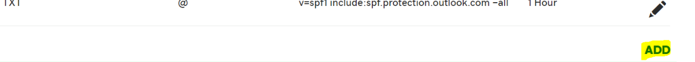

# Criar registros DNS na GoDaddy para o Office 365Create DNS records at GoDaddy for Office 365

 **Caso não encontre o conteúdo que está procurando, [verifique as perguntas frequentes sobre domínios](../setup/domains-faq.md)**.**[Check the Domains FAQ](../setup/domains-faq.md)** if you don't find what you're looking for.

Se você usa a GoDaddy como provedor de hospedagem DNS, realize os procedimentos deste artigo para verificar o domínio e configurar registros DNS para o Skype for Business Online, email e outros serviços.If GoDaddy is your DNS hosting provider, follow the steps in this article to verify your domain and set up DNS records for email, Skype for Business Online, and so on.

Depois que você adicionar esses registros na GoDaddy, o domínio será configurado para funcionar com os serviços do Office 365.After you add these records at GoDaddy, your domain will be set up to work with Office 365 services.

Para saber mais sobre hospedagem na Web e DNS para sites com o Office 365, confira [Usar um site público com o Office 365](https://support.office.com/article/choose-a-public-website-3325d50e-d131-403c-a278-7f3296fe33a9).To learn about webhosting and DNS for websites with Office 365, see [Use a public website with Office 365](https://support.office.com/article/choose-a-public-website-3325d50e-d131-403c-a278-7f3296fe33a9).

> [!NOTE]
> Normalmente, são necessários cerca de 15 minutos para que as alterações de DNS entrem em vigor. Mas, às vezes, pode ser necessário mais tempo para atualizar uma alteração feita no sistema DNS da Internet. Se você tiver problemas com o fluxo de emails ou de outro tipo após adicionar os registros DNS, consulte [Solucionar problemas após alterar o nome de domínio ou registros DNS](../get-help-with-domains/find-and-fix-issues.md).Typically it takes about 15 minutes for DNS changes to take effect. However, it can occasionally take longer for a change you've made to update across the Internet's DNS system. If you're having trouble with mail flow or other issues after adding DNS records, see [Troubleshoot issues after changing your domain name or DNS records](../get-help-with-domains/find-and-fix-issues.md).

## Adicionar um registro TXT para verificaçãoAdd a TXT record for verification

Antes de usar o seu domínio com o Office 365, precisamos verificar se você é o proprietário dele. A capacidade de entrar na conta do seu registrador de domínios e criar o registro DNS prova ao Office 365 que você é o proprietário do domínio.Before you use your domain with Office 365, we have to make sure that you own it. Your ability to log in to your account at your domain registrar and create the DNS record proves to Office 365 that you own the domain.

> [!NOTE]
> Esse registro é usado exclusivamente para confirmar se você é o proprietário do domínio; ele não afeta mais nada. É possível excluí-lo mais tarde, se desejar.This record is used only to verify that you own your domain; it doesn't affect anything else. You can delete it later, if you like.

Siga as etapas abaixo.Follow the steps below.

1. Para iniciar, vá até a sua página de domínios no GoDaddy usando [este link](https://account.godaddy.com/products/?go_redirect=disabled). Você será solicitado a fazer o logon.To get started, go to your domains page at GoDaddy by using [this link](https://account.godaddy.com/products/?go_redirect=disabled). You'll be prompted to log in.

    

2. Em **domínios**, selecione DNS no domínio que você deseja editar.Under **Domains**, select DNS under the domain that you want to edit.

    

3. Clique em **Adicionar**.Select **Add**.

    

4. Escolha o **TXT (texto)** na lista suspensa.Choose **TXT (Text)** from the drop-down list. Nas caixas do novo registro, digite ou copie e cole os valores da seguinte tabela.In the boxes for the new record, type or copy and paste the values from the following table.

    |**Tipo de registro****Record type** |**Host****Host**|**Valor TXT****TXT Value**|**TTL****TTL** |
    |:-----|:-----|:-----|:-----|
    |TXT (Texto)TXT (Text)|@|MS = ms *XXXXXXXX*MS=ms *XXXXXXXX* **Observação**: Este é um exemplo.**Note**: This is an example. Use seu valor específico de **Destinos ou Pontos de Endereçamento** aqui, da tabela no Office 365.Use your specific **Destination or Points to Address** value here, from the table in Office 365. [Como localizo isto?How do I find this?](../get-help-with-domains/information-for-dns-records.md)|1 hora1 hour   (Selecione um valor na lista suspensa.)(Select a value from the drop-down list.)|

      

5. Selecione **Salvar**.Select **Save**.

6. Aguarde alguns minutos antes de prosseguir para que o registro que você acabou de criar possa ser atualizado na Internet.Wait a few minutes before you continue, so that the record you just created can update across the Internet.

Agora que você adicionou o registro no site do seu registrador de domínios, retorne ao Office 365 e solicite que o Office 365 procure o registro.Now that you've added the record at your domain registrar's site, you'll go back to Office 365 and request Office 365 to look for the record.

Quando o Office 365 encontrar o registro TXT correto, o domínio será verificado.When Office 365 finds the correct TXT record, your domain is verified.
  
1. No centro do administrador, acesse a página **Configurações de** \> <a href="https://go.microsoft.com/fwlink/p/?linkid=834818" target="_blank">domínios</a>.In the admin center, go to the **Settings** \> <a href="https://go.microsoft.com/fwlink/p/?linkid=834818" target="_blank">Domains</a> page.

    
2. Na página **Domínios**, clique no domínio que você está verificando.On the **Domains** page, select the domain that you are verifying. 
    
    
  
3. Na página **Configuração**, clique em **Iniciar configuração**.On the **Setup** page, select **Start setup**.

4. Na página **Verificar domínio**, marque **Verificar**.On the **Verify domain** page, select **Verify**.

> [!NOTE]
>  Normalmente, são necessários cerca de 15 minutos para que as alterações de DNS entrem em vigor. Mas, às vezes, pode ser necessário mais tempo para atualizar uma alteração feita no sistema DNS da Internet. Se você tiver problemas com o fluxo de emails ou de outro tipo após adicionar os registros DNS, consulte [Solucionar problemas após alterar o nome de domínio ou registros DNS](../get-help-with-domains/find-and-fix-issues.md).Typically it takes about 15 minutes for DNS changes to take effect. However, it can occasionally take longer for a change you've made to update across the Internet's DNS system. If you're having trouble with mail flow or other issues after adding DNS records, see [Troubleshoot issues after changing your domain name or DNS records](../get-help-with-domains/find-and-fix-issues.md).

## Adicionar um registro MX para que o e-mail do domínio vá para o Office 365Add an MX record so email for your domain will come to Office 365

Siga as etapas abaixo.Follow the steps below.

1. Para iniciar, vá até a sua página de domínios no GoDaddy usando [este link](https://account.godaddy.com/products/?go_redirect=disabled). Você será solicitado a fazer o logon.To get started, go to your domains page at GoDaddy by using [this link](https://account.godaddy.com/products/?go_redirect=disabled). You'll be prompted to log in.

    

2. Em **domínios**, selecione DNS no domínio que você deseja editar.Under **Domains**, select DNS under the domain that you want to edit.

    

3. Clique em **Adicionar**.Select **Add**.

    

4. Escolha **MX (Mail Exchanger)** na lista suspensa.Choose **MX (Mail Exchanger)** from the drop-down list.

    

5. Nas caixas do novo registro, digite ou copie e cole os valores da seguinte tabela.In the boxes for the new record, type or copy and paste the values from the following table.

    (Escolha o valor **TTL** na lista suspensa.)(Choose the **TTL** value from the drop-down list.)

    |**Tipo de registro****Record type**|**Host****Host**|**Pontos de****Points to**|**Prioridade****Priority**|**TTL****TTL**|
    |:-----|:-----|:-----|:-----|:-----|
    |Servidor de mensagens (MX)MX (Mail Exchanger)    |@    | *\<chave-do-domínio\>*  .mail.protection.outlook.com*\<domain-key\>*  .mail.protection.outlook.com    **Observação:** Obtenha sua \* \<chave\> de domínio\* de sua conta do Office 365.**Note:** Get your  *\<domain-key\>*  from your Office 365 account.           [Como faço para encontrar isso?How do I find this?](../get-help-with-domains/information-for-dns-records.md)          |10 10    Para saber mais sobre prioridade, confira [O que é prioridade MX?](https://support.office.com/article/2784cc4d-95be-443d-b5f7-bb5dd867ba83.aspx)For more information about priority, see [What is MX priority?](https://support.office.com/article/2784cc4d-95be-443d-b5f7-bb5dd867ba83.aspx)   |1 hora1 hour    |

6. Selecione **Salvar**.Select **Save**.

## Adicionar os registros CNAME necessários do Office 365Add the CNAME records that are required for Office 365

Siga as etapas abaixo.Follow the steps below.

1. Para iniciar, vá até a sua página de domínios no GoDaddy usando [este link](https://account.godaddy.com/products/?go_redirect=disabled). Você será solicitado a fazer o logon.To get started, go to your domains page at GoDaddy by using [this link](https://account.godaddy.com/products/?go_redirect=disabled). You'll be prompted to log in.

    

2. Em **domínios**, selecione DNS no domínio que você deseja editar.Under **Domains**, select DNS under the domain that you want to edit.

    

3. Clique em **Adicionar**.Select **Add**.

    

4. Escolha **CNAME (alias)** na lista suspensa.Choose **CNAME (Alias)** from the drop-down list.

    

5. Criar o primeiro registro CNAME.Create the first CNAME record.

    Nas caixas do novo registro, digite ou copie e cole os valores da primeira linha da tabela a seguir.In the boxes for the new record, type or copy and paste the values from the first row of the following table.

    (Escolha o valor **TTL** na lista suspensa.)(Choose the **TTL** value from the drop-down list.)

    |**Tipo de registro****Record type**|**Host****Host**|**Pontos de****Points to**|**TTL****TTL**|
    |:-----|:-----|:-----|:-----|
    |CNAME (Alias)CNAME (Alias)    |descoberta automáticaautodiscover    |autodiscover.outlook.comautodiscover.outlook.com    |1 hora1 hour    |
    |CNAME (Alias)CNAME (Alias)    |sipsip    |sipdir.online.lync.comsipdir.online.lync.com    |1 hora1 hour    |
    |CNAME (Alias)CNAME (Alias)    |lyncdiscoverlyncdiscover    |webdir.online.lync.comwebdir.online.lync.com    |1 hora1 hour    |
    |CNAME (Alias)CNAME (Alias)    |enterpriseregistrationenterpriseregistration    |enterpriseregistration.windows.netenterpriseregistration.windows.net    |1 hora1 hour    |
    |CNAME (Alias)CNAME (Alias)    |enterpriseenrollmententerpriseenrollment    |enterpriseenrollment.manage.microsoft.comenterpriseenrollment.manage.microsoft.com    |1 hora1 hour    |

6. Repita essas etapas para adicionar o próximo registro CNAME até ter criado todos os seis registros CNAME.Repeat these steps to add the next CNAME record until you have created all six of the CNAME records.

## Adicionar o registro TXT à SPF para ajudar a evitar spam de e-mailAdd a TXT record for SPF to help prevent email spam

> [!IMPORTANT]
> Não é possível ter mais de um registro TXT para SPF para um domínio.You cannot have more than one TXT record for SPF for a domain. Se o seu domínio possuir mais de um registro SPF, ocorrerão erros de email, bem como problemas na entrega e na classificação de spam.If your domain has more than one SPF record, you'll get email errors, as well as delivery and spam classification issues. If you already have an SPF record for your domain, don't create a new one for Office 365.If you already have an SPF record for your domain, don't create a new one for Office 365. Em vez disso, adicione os valores necessários do Office 365 ao registro atual, de modo que você tenha um  *único*  registro SPF que inclua os dois conjuntos de valores.Instead, add the required Office 365 values to the current record so that you have a  *single*  SPF record that includes both sets of values.

Siga as etapas abaixo.Follow the steps below.

1. Para iniciar, vá até a sua página de domínios no GoDaddy usando [este link](https://account.godaddy.com/products/?go_redirect=disabled). Você será solicitado a fazer o logon.To get started, go to your domains page at GoDaddy by using [this link](https://account.godaddy.com/products/?go_redirect=disabled). You'll be prompted to log in.

    

2. Em **domínios**, selecione DNS no domínio que você deseja editar.Under **Domains**, select DNS under the domain that you want to edit.

    

3. Clique em **Adicionar**.Select **Add**.

    

4. Escolha o **TXT (texto)** na lista suspensa.Choose **TXT (Text)** from the drop-down list.

    

5. Nas caixas do novo registro, digite ou copie e cole os seguintes valores.In the boxes for the new record, type or copy and paste the following values.

    (Escolha o valor **TTL** nas listas suspensas.)(Choose the **TTL** value from the drop-down lists.)

    |**Tipo de registro****Record type**|**Host****Host**|**Valor TXT****TXT Value**|**TTL****TTL**|
    |:-----|:-----|:-----|:-----|
    |TXT (Texto)TXT (Text)    |@    |v=spf1 include:spf.protection.outlook.com -allv=spf1 include:spf.protection.outlook.com -all    **Observação:** é recomendável copiar e colar essa entrada, para que todo o espaçamento permaneça correto.**Note:** We recommend copying and pasting this entry, so that all of the spacing stays correct.           |1 hora1 hour    |

    

6. Selecione **Salvar**.Select **Save**.

## Adicionar os dois registros SRV necessários do Office 365Add the two SRV records that are required for Office 365

Siga as etapas abaixo.Follow the steps below.

1. Para iniciar, vá até a sua página de domínios no GoDaddy usando [este link](https://account.godaddy.com/products/?go_redirect=disabled). Você será solicitado a fazer o logon.To get started, go to your domains page at GoDaddy by using [this link](https://account.godaddy.com/products/?go_redirect=disabled). You'll be prompted to log in.

    

2. Em **domínios**, selecione DNS no domínio que você deseja editar.Under **Domains**, select DNS under the domain that you want to edit.

    

3. Clique em **Adicionar**.Select **Add**.

    

4. Escolha o **SRV (Serviço)** na lista suspensa.Choose **SRV (Service)** from the drop-down list.

    

5. Crie o primeiro registro SRV.Create the first SRV record.

    Nas caixas do novo registro, digite ou copie e cole os valores da primeira linha da tabela a seguir.In the boxes for the new record, type or copy and paste the values from the first row of the following table.

    (Escolha os valores **tipo de registro** e **TTL** nas listas suspensas.)(Choose the **Record type** and **TTL** values from the drop-down lists.)

    |**Tipo de registro****Record type**|**Nome****Name**|**Destino****Target**|**Protocolo****Protocol**|**Serviço****Service**|**Prioridade****Priority**|**Espessura****Weight**|**Porta****Port**|**TTL****TTL**|
    |:-----|:-----|:-----|:-----|:-----|:-----|:-----|:-----|:-----|
    |SRV (Serviço)SRV (Service)    |@    |sipdir.online.lync.comsipdir.online.lync.com    |_tls_tls    |_sip_sip    |100100    |11    |443443    |1 hora1 hour    |
    |SRV (Serviço)SRV (Service)    |@    |sipfed.online.lync.comsipfed.online.lync.com    |_tcp_tcp    |_sipfederationtls_sipfederationtls    |100100    |11    |50615061    |1 hora1 hour    |

    

6. Repita a **etapa 5** para criar o outro registro SRV.Repeat **Step 5** to Create the other SRV record.

7. Selecione **Salvar**.Select **Save**.

> [!NOTE]
> Normalmente, são necessários cerca de 15 minutos para que as alterações de DNS entrem em vigor. Mas, às vezes, pode ser necessário mais tempo para atualizar uma alteração feita no sistema DNS da Internet. Se você tiver problemas com o fluxo de emails ou de outro tipo após adicionar os registros DNS, consulte [Solucionar problemas após alterar o nome de domínio ou registros DNS](../get-help-with-domains/find-and-fix-issues.md).Typically it takes about 15 minutes for DNS changes to take effect. However, it can occasionally take longer for a change you've made to update across the Internet's DNS system. If you're having trouble with mail flow or other issues after adding DNS records, see [Troubleshoot issues after changing your domain name or DNS records](../get-help-with-domains/find-and-fix-issues.md).
