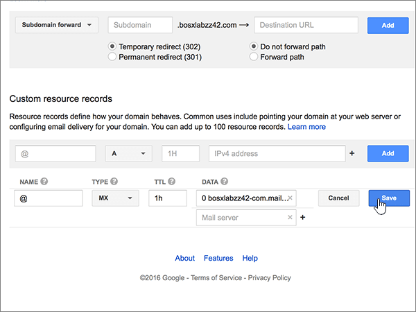

# Criar registros DNS no site Google Domains para a Microsoft

 Caso não encontre o conteúdo que está procurando, **[verifique as perguntas frequentes sobre domínios](../setup/domains-faq.yml)**. 
  
Se você usa o Google Domains como provedor de hospedagem DNS, realize os procedimentos deste artigo para verificar o domínio e configurar registros DNS para email, Lync e outros serviços.
  
Depois que você adicionar esses registros ao Google Domains, o domínio será configurado para funcionar com os serviços Microsoft.
  

  
> [!NOTE]
> Typically it takes about 15 minutes for DNS changes to take effect. Mas, às vezes, pode ser necessário mais tempo para atualizar uma alteração feita no sistema DNS da Internet. Se você tiver problemas com o fluxo de emails ou de outro tipo após adicionar os registros DNS, confira [Localizar e corrigir problemas após alterar o nome de domínio ou registros DNS na Microsoft](../get-help-with-domains/find-and-fix-issues.md). 
  
## Adicionar um registro TXT para verificação

Antes de usar o seu domínio com a Microsoft, precisamos verificar se você é o proprietário dele. A capacidade de entrar na conta do seu registrador de domínios e criar o registro de DNS prova à Microsoft que você é o proprietário do domínio.
  
> [!NOTE]
> Esse registro é usado exclusivamente para confirmar se você é o proprietário do domínio; ele não afeta mais nada. É possível excluí-lo mais tarde, se desejar. 
  
1. Para iniciar, vá até a página do seu domínio no Google Domains usando [este link](https://domains.google.com/registrar). Você será solicitado a entrar. Para fazer isso:
    
1. Selecione **Entrar**.
    
2. Em seguida, insira suas credenciais de login e selecione novamente **Entrar**.
    
2. Na página **Meus domínios**, localize o domínio que você deseja usar com a Microsoft e selecione o link **GERENCIAR** ao lado dele. No painel de navegação esquerdo, selecione **DNS**.
    
3. Na seção **Registros de recursos personalizados**, nas caixas do novo registro, digite ou copie e cole os valores da tabela a seguir. 
    
    (Pode ser necessário rolar para baixo.)
    
    (Selecione o valor **Tipo** na lista suspensa.) 
    
    |||||
    |:-----|:-----|:-----|:-----|
    |**Name**   |**Tipo**   |**TTL**   |**Dados**   |
    |@    |TXT    |1H    |MS=ms *XXXXXXXX*    **Observação**: esse é um exemplo. Use aqui seu valor específico de **Destino ou Pontos de Endereçamento**, retirado da tabela. [Como localizo isto?](../get-help-with-domains/information-for-dns-records.md)          |
   
4. Clique em **Adicionar**.
    
5. Aguarde alguns minutos antes de prosseguir para que o registro que você acabou de criar possa ser atualizado na Internet.
    
Agora que você adicionou o registro no site do seu registrador de domínios, retorne à Microsoft e solicite o registro.
  
Quando a Microsoft encontrar o registro TXT correto, seu domínio estará verificado.
  
1. No centro do administrador da Microsoft, acesse a página **Configurações de** \> <a href="https://go.microsoft.com/fwlink/p/?linkid=834818" target="_blank">domínios</a>.

    
2. Na página **Domínios**, clique no domínio que você está verificando. 
    
3. Na página **Configuração**, clique em **Iniciar configuração**.
    
4. Na página **Verificar domínio**, clique em **Verificar**.
    
> [!NOTE]
> Typically it takes about 15 minutes for DNS changes to take effect. Mas, às vezes, pode ser necessário mais tempo para atualizar uma alteração feita no sistema DNS da Internet. Se você tiver problemas com o fluxo de e-mails ou de outro tipo após adicionar os registros DNS, consulte [Localizar e corrigir problemas ou registros DNS](../get-help-with-domains/find-and-fix-issues.md). 

  
## Adicione um registro MX para que o email do domínio vá para a Microsoft.

1. Para iniciar, vá até a página do seu domínio no Google Domains usando [este link](https://domains.google.com/registrar). Você será solicitado a entrar. Para fazer isso:
    
2. Selecione **Entrar**.
    
3. Em seguida, insira suas credenciais de login e selecione novamente **Entrar**.
4. Na página **Domínios**, na seção **Domínio**, escolha **Configurar DNS** para o domínio que você deseja editar.
    
    > [!IMPORTANT]
    > Se tiver uma conta de email do G Suite, primeiro você deve excluir os registros MX associados a essa conta. Os registros MX do G Suite impedem que você adicione outros registros MX, incluindo aqueles necessários para a Microsoft. Excluir os registros do G Suite não exclui sua conta do G Suite. Para excluir os registros MX do G Suite, siga as etapas a seguir. 
  
5. Na seção **Registros sintéticos**, na área **G Suite**, escolha **Excluir**.
    
    (Pode ser necessário rolar para baixo.)
    
    
  
6. Selecione **Excluir**.
    
    
  
7. Na seção **Registros de recursos personalizados**, nas caixas do novo registro, digite ou copie e cole os valores da tabela a seguir. 
    
    (Pode ser necessário rolar para baixo.)
    
    (Selecione o valor **Tipo** na lista suspensa.) 
    
    |**Name**|**Tipo**|**TTL**|**Dados**|
    |:-----|:-----|:-----|:-----|
    |@    |MX    |1H    |0  *\<domain-key\>*  .mail.protection.outlook.com.    **Este valor deve OBRIGATORIAMENTE terminar com um ponto (.)**   O **0** é o valor de prioridade de MX. Adicione-o ao início do valor de MX, separado do restante do valor por um espaço.    **Observação:** Obtenha a sua \<*domain-key*\> através da sua conta Microsoft.  [Como localizo isto?](../get-help-with-domains/information-for-dns-records.md)          Para saber mais sobre prioridade, confira [O que é prioridade MX?](https://docs.microsoft.com/microsoft-365/admin/setup/domains-faq)   |
   
    
  
5. Clique em **Adicionar**.
    
    
  
6. Se houver outros registros MX personalizados, remova-os.
    
1. Selecione **Editar** na linha do registro MX. 
    
    
  
2. Para cada um dos outros registros MX personalizados, selecione a entrada na caixa **Dados** e pressione a tecla **Delete** do teclado para excluí-los. 
    
    Continue até excluir a entrada **Dados** para cada um dos outros registros MX. 
    
    
  
7. Quando você excluir a entrada **Dados** para cada um dos outros registros MX, selecione **Salvar** para salvar suas alterações. 
    
    
  
## Adicionar os cinco registros CNAME necessários para a Microsoft

1. Para começar, vá até a [página Google Domains] (https://domains.google.com/registrar) e entre nela.
    
2. Na página **Domínios**, na seção **Domínio**, escolha **Configurar DNS** para o domínio que você deseja editar. 
    
3. Adicionar o primeiro registro CNAME.
    
    Na seção **Registros de recursos personalizados**, nas caixas do novo registro, digite ou copie e cole os valores da primeira linha da tabela a seguir. 
    
    (Pode ser necessário rolar para baixo.)
    
    (Selecione o valor **Tipo** na lista suspensa.) 
    
    |**Name**|**Tipo**|**TTL**|**Dados**|
    |:-----|:-----|:-----|:-----|
    |autodiscover    |CNAME    |1H    |autodiscover.outlook.com.    **Este valor deve OBRIGATORIAMENTE terminar com um ponto (.)**   |
    |sip    |CNAME    |1H    |sipdir.online.lync.com.    **Este valor deve OBRIGATORIAMENTE terminar com um ponto (.)**   |
    |lyncdiscover    |CNAME    |1H    |webdir.online.lync.com.    **Este valor deve OBRIGATORIAMENTE terminar com um ponto (.)**   |
    |enterpriseregistration    |CNAME    |1H    |enterpriseregistration.windows.net.    **Este valor deve OBRIGATORIAMENTE terminar com um ponto (.)**   |
    |enterpriseenrollment    |CNAME    |1H    |enterpriseenrollment-s.manage.microsoft.com.    **Este valor deve OBRIGATORIAMENTE terminar com um ponto (.)**   |
   
    
  
4. Clique em **Adicionar**.
    
    
  
5. Adicione os outros quatro registros CNAME.
    
    Na seção **Registros de recursos personalizados**, crie um registro usando os valores da próxima linha na tabela e, em seguida, selecione novamente **Adicionar** para concluir esse registro. 
    
    Repita esse processo até ter criado todos os registros CNAME necessários.
    
## Adicionar registro TXT à SPF para ajudar a evitar spam de email

> [!IMPORTANT]
> Não é possível ter mais de um registro TXT para SPF para um domínio. Se o seu domínio possuir mais de um registro SPF, ocorrerão erros de email, bem como problemas na entrega e na classificação de spam. Se você já possui um registro SPF para seu domínio, não crie um novo para a Microsoft. Em vez disso, adicione os valores necessários da Microsoft ao registro atual para que você tenha um único registro SPF que inclua os dois conjuntos de valores. Precisa de exemplos? Confira os [Registros do Sistema de Nomes de Domínios externos para a Microsoft](https://docs.microsoft.com/microsoft-365/enterprise/external-domain-name-system-records#bkmk_spfrecords). To validate your SPF record, you can use one of these [SPF validation tools](../setup/domains-faq.yml). 
  
1. Para iniciar, vá até a página do seu domínio no Google Domains usando [este link](https://domains.google.com/registrar). Você será solicitado a entrar. Para fazer isso:
    
1. Selecione **Entrar**.
    
2. Em seguida, insira suas credenciais de login e selecione novamente **Entrar**.
    
3. Na página **Domínios**, na seção **Domínio**, escolha **Configurar DNS** para o domínio que você deseja editar. 
    
4. Na seção **Registros de recursos personalizados**, na linha do registro TXT, selecione **Editar**. 
    
    > [!IMPORTANT]
    > O Google Domains armazena registros TXT como um conjunto que pode conter vários registros. Quando tiver pelo menos um outro registro TXT, como o registro TXT que você usou para verificar seu domínio, adicione novos registros TXT para esse conjunto de registros. Qualquer tentativa inserir registros TXT adicionais como entradas separadas resultará em uma mensagem de erro de **registro duplicado** 
  
    
  
5. Selecione o controle **(+)**. 
    
    
  
6. Nas caixas do novo registro, digite ou copie e cole os valores da seguinte tabela.
    
    (Pode ser necessário rolar para baixo.)
    
    |**Dados**|
    |:-----|
    |v=spf1 include:spf.protection.outlook.com -all    

    > [!NOTE]
    > É recomendável copiar e colar essa entrada, para que todo o espaçamento permaneça correto.           
   
   
  
7. Selecione **Salvar**.
    
    
  
## Adicionar os dois registros SRV necessários para a Microsoft

1. Para iniciar, vá até a página do seu domínio no Google Domains usando [este link](https://domains.google.com/registrar). Você será solicitado a entrar. Para fazer isso:
    
2. Selecione **Entrar**.
    
3. Em seguida, insira suas credenciais de login e selecione novamente **Entrar**.
    
4. Na página **Domínios**, na seção **Domínio**, escolha **Configurar DNS** para o domínio que você deseja editar. 
    
5. Adicione o primeiro registro SRV.
    
    Na seção **Registros de recursos personalizados**, nas caixas do novo registro, digite ou copie e cole os valores da tabela a seguir. 
    
    (Pode ser necessário rolar para baixo.)
    
    (Selecione o valor **Tipo** na lista suspensa.) 
    
    |**Name**|**Tipo**|**TTL**|**Dados**|
    |:-----|:-----|:-----|:-----|
    |_sip._tls|SRV|1H|100 1 443 sipdir.online.lync.com. **Este valor deve OBRIGATORIAMENTE terminar com um ponto (.)** **Observação:** é recomendável copiar e colar essa entrada, para que todo o espaçamento permaneça correto.           |
    |_sipfederationtls._tcp|SRV|1H|100 1 5061 sipfed.online.lync.com. **Este valor deve OBRIGATORIAMENTE terminar com um ponto (.)**

    É recomendável copiar e colar essa entrada, para que todo o espaçamento permaneça correto.       
   
    
  
6. Clique em **Adicionar**.
    
    
  
7. Adicione o outro registro SRV.
    
    Na seção **Registros de recursos personalizados**, crie um registro usando os valores da segunda linha na tabela e, em seguida, selecione novamente **Adicionar** para concluir esse registro. 
    
    > [!NOTE]
    > Typically it takes about 15 minutes for DNS changes to take effect. Mas, às vezes, pode ser necessário mais tempo para atualizar uma alteração feita no sistema DNS da Internet. Se você tiver problemas com o fluxo de e-mails ou de outro tipo após adicionar os registros DNS, consulte [Localizar e corrigir problemas ou registros DNS](../get-help-with-domains/find-and-fix-issues.md). 
  
