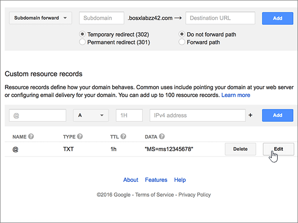

# Criar registros DNS no Google Domains para MicrosoftCreate DNS records at Google Domains for Microsoft

 **Caso não encontre o conteúdo que está procurando, [verifique as perguntas frequentes sobre domínios](../setup/domains-faq.md)**.**[Check the Domains FAQ](../setup/domains-faq.md)** if you don't find what you're looking for. 
  
Se você usa o Google Domains como provedor de hospedagem DNS, realize os procedimentos deste artigo para verificar o domínio e configurar registros DNS para email, Lync e outros serviços.If Google Domains is your DNS hosting provider, follow the steps in this article to verify your domain and set up DNS records for email, Lync, and so on.
  
Depois que você adicionar esses registros no Google Domains, o domínio será configurado para funcionar com os serviços da Microsoft.After you add these records at Google Domains, your domain will be set up to work with Microsoft services.
  

  
> [!NOTE]
> Typically it takes about 15 minutes for DNS changes to take effect.Typically it takes about 15 minutes for DNS changes to take effect. Mas, às vezes, pode ser necessário mais tempo para atualizar uma alteração feita no sistema DNS da Internet.However, it can occasionally take longer for a change you've made to update across the Internet's DNS system. Se você estiver tendo problemas com o fluxo de emails ou com outros problemas após adicionar registros DNS, consulte [Localizar e corrigir problemas após adicionar seu domínio ou registros DNS no Microsoft](../get-help-with-domains/find-and-fix-issues.md).If you're having trouble with mail flow or other issues after adding DNS records, see [Find and fix issues after adding your domain or DNS records in Microsoft](../get-help-with-domains/find-and-fix-issues.md). 
  
## Adicionar um registro TXT para verificaçãoAdd a TXT record for verification

Antes de usar o seu domínio com a Microsoft, precisamos verificar se você é o proprietário dele. A capacidade de entrar na conta do seu registrador de domínios e criar o registro de DNS prova à Microsoft que você é o proprietário do domínio.Before you use your domain with Microsoft, we have to make sure that you own it. Your ability to log in to your account at your domain registrar and create the DNS record proves to Microsoft that you own the domain.
  
> [!NOTE]
> Esse registro é usado exclusivamente para confirmar se você é o proprietário do domínio; ele não afeta mais nada. É possível excluí-lo mais tarde, se desejar.This record is used only to verify that you own your domain; it doesn't affect anything else. You can delete it later, if you like. 
  
1. Para iniciar, vá até a página do seu domínio no Google Domains usando [este link](https://domains.google.com/registrar). Você será solicitado a entrar. Para fazer isso:To get started, go to your domains page at Google Domains by using [this link](https://domains.google.com/registrar). You'll be prompted to sign in. To do so:
    
1. Selecione **entrar**.Select **Sign In**.
    
2. Digite suas credenciais de logon e, em seguida, selecione **entrar**novamente.Enter your login credentials, and then again select **Sign In**.
    
2. Na página **meus domínios** , localize o domínio que você deseja usar com a Microsoft e selecione o link **gerenciar** ao lado dele.On the **My domains** page, find the domain you want to use with Microsoft, and select the **MANAGE** link next to it. No painel de navegação à esquerda, selecione **DNS**.In the left navigation, select **DNS**.
    
3. In the **Custom resource records** section, in the boxes for the new record, type or copy and paste the values from the following table.In the **Custom resource records** section, in the boxes for the new record, type or copy and paste the values from the following table. 
    
    (You may have to scroll down.)(You may have to scroll down.)
    
    (Choose the **Type** value from the drop-down list.)(Choose the **Type** value from the drop-down list.) 
    
    |||||
    |:-----|:-----|:-----|:-----|
    |**Nome****Name**   |**Tipo****Type**   |**TTL****TTL**   |**Dados****Data**   |
    |@    |TXTTXT    |1H1H    |MS = ms *XXXXXXXX*MS=ms *XXXXXXXX*    **Observação**: esse é um exemplo.**Note:** This is an example. Use aqui seu valor específico de **Destino ou Pontos de Endereçamento**, retirado da tabela.Use your specific **Destination or Points to Address** value here, from the table. [Como localizo isto?How do I find this?](../get-help-with-domains/information-for-dns-records.md)          |
   
4. Clique em **Adicionar**.Select **Add**.
    
5. Aguarde alguns minutos antes de prosseguir para que o registro que você acabou de criar possa ser atualizado na Internet.Wait a few minutes before you continue, so that the record you just created can update across the Internet.
    
Agora que você adicionou o registro no site do seu registrador de domínios, retorne à Microsoft e solicite o registro.Now that you've added the record at your domain registrar's site, you'll go back to Microsoft and request the record.
  
Quando a Microsoft encontrar o registro TXT correto, seu domínio estará verificado.When Microsoft finds the correct TXT record, your domain is verified.
  
1. No centro do administrador da Microsoft, acesse a página **Configurações de** \> <a href="https://go.microsoft.com/fwlink/p/?linkid=834818" target="_blank">domínios</a>.In the Microsoft admin center, go to the **Settings** \> <a href="https://go.microsoft.com/fwlink/p/?linkid=834818" target="_blank">Domains</a> page.

    
2. Na página **Domínios**, clique no domínio que você está verificando.On the **Domains** page, select the domain that you are verifying. 
    
3. Na página **Configuração**, clique em **Iniciar configuração**.On the **Setup** page, select **Start setup**.
    
4. Na página **Verificar domínio**, clique em **Verificar**.On the **Verify domain** page, select **Verify**.
    
> [!NOTE]
> Typically it takes about 15 minutes for DNS changes to take effect.Typically it takes about 15 minutes for DNS changes to take effect. Mas, às vezes, pode ser necessário mais tempo para atualizar uma alteração feita no sistema DNS da Internet.However, it can occasionally take longer for a change you've made to update across the Internet's DNS system. Se você tiver problemas com o fluxo de e-mails ou de outro tipo após adicionar os registros DNS, consulte [Localizar e corrigir problemas ou registros DNS](../get-help-with-domains/find-and-fix-issues.md).If you're having trouble with mail flow or other issues after adding DNS records, see [Find and fix issues after adding your domain or DNS records](../get-help-with-domains/find-and-fix-issues.md). 

  
## Adicione um registro MX para que o email do domínio vá para a Microsoft.Add an MX record so email for your domain will come to Microsoft

1. Para iniciar, vá até a página do seu domínio no Google Domains usando [este link](https://domains.google.com/registrar). Você será solicitado a entrar. Para fazer isso:To get started, go to your domains page at Google Domains by using [this link](https://domains.google.com/registrar). You'll be prompted to sign in. To do so:
    
2. Selecione **entrar**.Select **Sign In**.
    
3. Digite suas credenciais de logon e, em seguida, selecione **entrar**novamente.Enter your login credentials, and then again select **Sign In**.
4. Na página **domínios** , na seção **domínio** , selecione **Configurar DNS** para o domínio que você deseja editar.On the **Domains** page, in the **Domain** section, select **Configure DNS** for the domain that you want to edit.
    
    > [!IMPORTANT]
    > Se tiver uma conta de email do G Suite, primeiro você deve excluir os registros MX associados a essa conta.If you have a G Suite email account, you must first delete the MX records associated with that account. Os registros MX do G Suite impedem que você adicione qualquer outro registro MX, incluindo aqueles necessários para a Microsoft.The G Suite MX records prevent you from adding any other MX records, including those required for Microsoft. Excluir os registros do G Suite não exclui sua conta do G Suite.Note that deleting the G Suite records does not delete your G Suite account. Para excluir os registros MX do G Suite, siga as etapas a seguir.To delete your G Suite MX records, use the following steps. 
  
5. Na seção **registros sintéticos** , na área **G Suite** , selecione **excluir**.In the **Synthetic records** section, in the **G Suite** area, select **Delete**.
    
    (You may have to scroll down.)(You may have to scroll down.)
    
    
  
6. Selecione **Excluir**.Select **Delete**.
    
    
  
7. In the **Custom resource records** section, in the boxes for the new record, type or copy and paste the values from the following table.In the **Custom resource records** section, in the boxes for the new record, type or copy and paste the values from the following table. 
    
    (You may have to scroll down.)(You may have to scroll down.)
    
    (Choose the **Type** value from the drop-down list.)(Choose the **Type** value from the drop-down list.) 
    
    |**Nome****Name**|**Tipo****Type**|**TTL****TTL**|**Dados****Data**|
    |:-----|:-----|:-----|:-----|
    |@    |MXMX    |1H1H    |0  *\<chave-de-domínio\>*  .mail.protection.outlook.com.0  *\<domain-key\>*  .mail.protection.outlook.com.    **Este valor deve OBRIGATORIAMENTE terminar com um ponto (.)****This value MUST end with a period (.)**   O **0** é o valor de prioridade de MX. Adicione-o ao início do valor de MX, separado do restante do valor por um espaço.  The **0** is the MX priority value. Add it to the beginning of the MX value, separated from the remainder of the value by a space.    **Observação:** Obtenha a sua \<*chave-de-domínio*\> através da sua conta Microsoft.**Note:** Get your \<*domain-key*\> from your Microsoft account.  [Como faço para encontrar isso?How do I find this?](../get-help-with-domains/information-for-dns-records.md)          Para saber mais sobre prioridade, consulte [O que é prioridade MX?](https://docs.microsoft.com/microsoft-365/admin/setup/domains-faq)For more information about priority, see [What is MX priority?](https://docs.microsoft.com/microsoft-365/admin/setup/domains-faq)   |
   
    
  
5. Selecione **Adicionar**.Select **Add**.
    
    
  
6. Se houver outros registros MX personalizados, remova-os:If there are any other Custom MX records, remove them.
    
1. Selecione **Editar** na linha do registro MX.Select **Edit** in the MX record row. 
    
    
  
2. Para cada um dos outros registros MX personalizados, selecione a entrada na caixa **dados** e, em seguida, pressione a tecla **delete** no teclado para excluir esse registro.For each of the other Custom MX records, select the entry in the **Data** box and then press the **Delete** key on your keyboard to delete that record. 
    
    Continue até excluir a entrada **Dados** para cada um dos outros registros MX.Continue until you have deleted the **Data** entry for each of the other MX records. 
    
    
  
7. Quando tiver excluído a entrada de **dados** de cada um dos outros registros MX, selecione **salvar** para salvar suas alterações.When you have deleted the **Data** entry for each of the other MX records, select **Save** to save your changes. 
    
    
  
## Adicionar os cinco registros CNAME necessários para o MicrosoftAdd the five CNAME records that are required for Microsoft

1. Para começar, vá até a sua página [Google Domains] (https://domains.google.com/registrar) e entre.To get started, go to your [Google Domains page] (https://domains.google.com/registrar) and sign in.
    
2. Na página **domínios** , na seção **domínio** , selecione **Configurar DNS** para o domínio que você deseja editar.On the **Domains** page, in the **Domain** section, select **Configure DNS** for the domain that you want to edit. 
    
3. Adicione o primeiro registro CNAME.Add the first CNAME record.
    
    Na seção **Registros de recursos personalizados**, nas caixas do novo registro, digite ou copie e cole os valores da primeira linha da tabela a seguir.In the **Custom resource records** section, in the boxes for the new record, type or copy and paste the values from first row of the following table. 
    
    (You may have to scroll down.)(You may have to scroll down.)
    
    (Choose the **Type** value from the drop-down list.)(Choose the **Type** value from the drop-down list.) 
    
    |**Nome****Name**|**Tipo****Type**|**TTL****TTL**|**Dados****Data**|
    |:-----|:-----|:-----|:-----|
    |autodiscoverautodiscover    |CNAMECNAME    |1H1H    |autodiscover.outlook.com.autodiscover.outlook.com.    **This value MUST end with a period (.)****This value MUST end with a period (.)**   |
    |sipsip    |CNAMECNAME    |1H1H    |sipdir.online.lync.com.sipdir.online.lync.com.    **This value MUST end with a period (.)****This value MUST end with a period (.)**   |
    |lyncdiscoverlyncdiscover    |CNAMECNAME    |1H1H    |webdir.online.lync.com.webdir.online.lync.com.    **This value MUST end with a period (.)****This value MUST end with a period (.)**   |
    |enterpriseregistrationenterpriseregistration    |CNAMECNAME    |1H1H    |enterpriseregistration.windows.net.enterpriseregistration.windows.net.    **This value MUST end with a period (.)****This value MUST end with a period (.)**   |
    |enterpriseenrollmententerpriseenrollment    |CNAMECNAME    |1H1H    |enterpriseenrollment-s.manage.microsoft.com.enterpriseenrollment-s.manage.microsoft.com.    **This value MUST end with a period (.)****This value MUST end with a period (.)**   |
   
    
  
4. Selecione **Adicionar**.Select **Add**.
    
    
  
5. Adicione os outros quatro registros CNAME.Add the other four CNAME records.
    
    Na seção **registros de recursos personalizados** , crie um registro usando os valores da próxima linha na tabela e, em seguida, selecione **Adicionar** para concluir esse registro.In the **Custom resource records** section, create a record by using the values from the next row in the table, and then again select **Add** to complete that record. 
    
    Repita esse processo até ter criado todos os registros CNAME necessários.Repeat this process until you have created all of the required CNAME records.
    
## Adicionar o registro TXT à SPF para ajudar a evitar spam de e-mailAdd a TXT record for SPF to help prevent email spam

> [!IMPORTANT]
> Não é possível ter mais de um registro TXT para SPF para um domínio.You cannot have more than one TXT record for SPF for a domain. Se o seu domínio possuir mais de um registro SPF, ocorrerão erros de email, bem como problemas na entrega e na classificação de spam.If your domain has more than one SPF record, you'll get email errors, as well as delivery and spam classification issues. Se você já possui um registro SPF para seu domínio, não crie um novo para a Microsoft.If you already have an SPF record for your domain, don't create a new one for Microsoft. Em vez disso, adicione os valores necessários da Microsoft ao registro atual para que você tenha um único registro SPF que inclua os dois conjuntos de valores.Instead, add the required Microsoft values to the current record so that you have a single SPF record that includes both sets of values. Precisa de exemplos?Need examples? Confira os [Registros do Sistema de Nomes de Domínios externos para a Microsoft](https://docs.microsoft.com/office365/enterprise/external-domain-name-system-records#bkmk_spfrecords).Check out these [External Domain Name System records for Microsoft](https://docs.microsoft.com/office365/enterprise/external-domain-name-system-records#bkmk_spfrecords). To validate your SPF record, you can use one of these [SPF validation tools](../setup/domains-faq.md).To validate your SPF record, you can use one of these [SPF validation tools](../setup/domains-faq.md). 
  
1. Para iniciar, vá até a página do seu domínio no Google Domains usando [este link](https://domains.google.com/registrar). Você será solicitado a entrar. Para fazer isso:To get started, go to your domains page at Google Domains by using [this link](https://domains.google.com/registrar). You'll be prompted to sign in. To do so:
    
1. Selecione **entrar**.Select **Sign In**.
    
2. Digite suas credenciais de logon e, em seguida, selecione **entrar**novamente.Enter your login credentials, and then again select **Sign In**.
    
3. Na página **domínios** , na seção **domínio** , selecione **Configurar DNS** para o domínio que você deseja editar.On the **Domains** page, in the **Domain** section, select **Configure DNS** for the domain that you want to edit. 
    
4. Na seção **registros de recursos personalizados** , na linha do registro TXT, selecione **Editar**.In the **Custom resource records** section, on the TXT record row, select **Edit**. 
    
    > [!IMPORTANT]
    > O Google Domains armazena registros TXT como um conjunto que pode conter vários registros. Quando tiver pelo menos um outro registro TXT, como o registro TXT que você usou para verificar seu domínio, adicione novos registros TXT para esse conjunto de registros. Qualquer tentativa inserir registros TXT adicionais como entradas separadas resultará em uma mensagem de erro de **registro duplicado**Google Domains stores TXT records as a set that may contain multiple records. When you have at least one other TXT record, such as the TXT record you used to verify your domain, you must add TXT new records to that record set. Any attempt to enter additional TXT records as separate entries will result in a **Duplicate record** error message. 
  
    
  
5. Selecione o controle **(+)** .Select the **(+)** control. 
    
    
  
6. Nas caixas do novo registro, digite ou copie e cole os valores da seguinte tabela.In the boxes for the new record, type or copy and paste the values from the following table.
    
    (Pode ser necessário rolar para baixo.)(You may have to scroll down.)
    
    |**Dados****Data**|
    |:-----|
    |v=spf1 include:spf.protection.outlook.com -allv=spf1 include:spf.protection.outlook.com -all    

    > [!NOTE]
    > É recomendável copiar e colar essa entrada, para que todo o espaçamento permaneça correto.We recommend copying and pasting this entry, so that all of the spacing stays correct.           
   
   
  
7. Selecione **Salvar**.Select **Save**.
    
    
  
## Adicionar os dois registros SRV necessários para a MicrosoftAdd the two SRV records that are required for Microsoft

1. Para iniciar, vá até a página do seu domínio no Google Domains usando [este link](https://domains.google.com/registrar). Você será solicitado a entrar. Para fazer isso:To get started, go to your domains page at Google Domains by using [this link](https://domains.google.com/registrar). You'll be prompted to sign in. To do so:
    
2. Selecione **entrar**.Select **Sign In**.
    
3. Digite suas credenciais de logon e, em seguida, selecione **entrar**novamente.Enter your login credentials, and then again select **Sign In**.
    
4. Na página **domínios** , na seção **domínio** , selecione **Configurar DNS** para o domínio que você deseja editar.On the **Domains** page, in the **Domain** section, select **Configure DNS** for the domain that you want to edit. 
    
5. Adicione o primeiro registro SRV.Add the first SRV record.
    
    In the **Custom resource records** section, in the boxes for the new record, type or copy and paste the values from the following table.In the **Custom resource records** section, in the boxes for the new record, type or copy and paste the values from the following table. 
    
    (You may have to scroll down.)(You may have to scroll down.)
    
    (Choose the **Type** value from the drop-down list.)(Choose the **Type** value from the drop-down list.) 
    
    |**Nome****Name**|**Tipo****Type**|**TTL****TTL**|**Dados****Data**|
    |:-----|:-----|:-----|:-----|
    |_sip. _tls_sip._tls|SRVSRV|1H1H|100 1 443 sipdir.online.lync.com.100 1 443 sipdir.online.lync.com. **Esse valor deve terminar com um ponto (.)** **Observação:** É recomendável copiar e colar essa entrada, para que todo o espaçamento permaneça correto.**This value MUST end with a period (.)** **Note:** We recommend copying and pasting this entry, so that all of the spacing stays correct.           |
    |_sipfederationtls. _tcp_sipfederationtls._tcp|SRVSRV|1H1H|100 1 5061 sipfed.online.lync.com.100 1 5061 sipfed.online.lync.com. **This value MUST end with a period (.)****This value MUST end with a period (.)**

    É recomendável copiar e colar essa entrada, para que todo o espaçamento permaneça correto.We recommend copying and pasting this entry, so that all of the spacing stays correct.       
   
    
  
6. Selecione **Adicionar**.Select **Add**.
    
    
  
7. Adicione o outro registro SRV.Add the other SRV record.
    
    Na seção **registros de recursos personalizados** , crie um registro usando os valores da segunda linha da tabela e, em seguida, selecione **Adicionar** para concluir esse registro.In the **Custom resource records** section, create a record by using the values from the second row in the table, and then again select **Add** to complete that record. 
    
    > [!NOTE]
    > Typically it takes about 15 minutes for DNS changes to take effect.Typically it takes about 15 minutes for DNS changes to take effect. Mas, às vezes, pode ser necessário mais tempo para atualizar uma alteração feita no sistema DNS da Internet.However, it can occasionally take longer for a change you've made to update across the Internet's DNS system. Se você tiver problemas com o fluxo de e-mails ou de outro tipo após adicionar os registros DNS, consulte [Localizar e corrigir problemas ou registros DNS](../get-help-with-domains/find-and-fix-issues.md).If you're having trouble with mail flow or other issues after adding DNS records, see [Find and fix issues after adding your domain or DNS records](../get-help-with-domains/find-and-fix-issues.md). 
  
