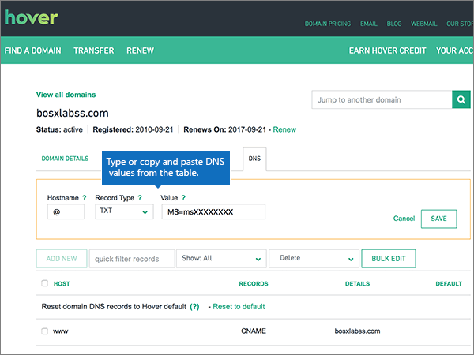
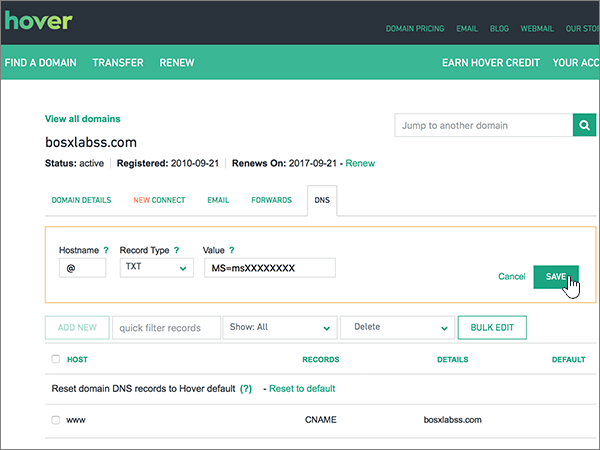
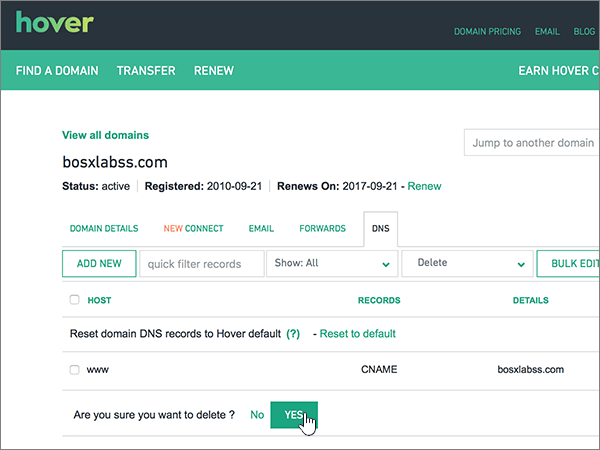

# Criar registros DNS no site Hover para o Office 365Create DNS records at Hover for Office 365

 **Caso não encontre o conteúdo que está procurando, [verifique as perguntas frequentes sobre domínios](../setup/domains-faq.md)**.**[Check the Domains FAQ](../setup/domains-faq.md)** if you don't find what you're looking for. 
  
Se você usa a Hover como provedor de hospedagem DNS, realize os procedimentos deste artigo para verificar o domínio e configurar registros DNS para o Skype for Business Online, email e outros serviços.If Hover is your DNS hosting provider, follow the steps in this article to verify your domain and set up DNS records for email, Skype for Business Online, and so on.
     
Depois que você adicionar esses registros à Hover, o domínio será configurado para funcionar com os serviços do Office 365.After you add these records at Hover, your domain will be set up to work with Office 365 services.
  
Para saber mais sobre hospedagem na Web e DNS para sites com o Office 365, confira [Usar um site público com o Office 365](https://support.office.com/article/choose-a-public-website-3325d50e-d131-403c-a278-7f3296fe33a9).To learn about webhosting and DNS for websites with Office 365, see [Use a public website with Office 365](https://support.office.com/article/choose-a-public-website-3325d50e-d131-403c-a278-7f3296fe33a9).
  
> [!NOTE]
>  Normalmente, são necessários cerca de 15 minutos para que as alterações de DNS entrem em vigor. Mas, às vezes, pode ser necessário mais tempo para atualizar uma alteração feita no sistema DNS da Internet. Se você tiver problemas com o fluxo de emails ou de outro tipo após adicionar os registros DNS, consulte [Solucionar problemas após alterar o nome de domínio ou registros DNS](../get-help-with-domains/find-and-fix-issues.md).Typically it takes about 15 minutes for DNS changes to take effect. However, it can occasionally take longer for a change you've made to update across the Internet's DNS system. If you're having trouble with mail flow or other issues after adding DNS records, see [Troubleshoot issues after changing your domain name or DNS records](../get-help-with-domains/find-and-fix-issues.md). 
  
## Adicionar um registro TXT para verificaçãoAdd a TXT record for verification

Antes de usar o seu domínio com o Office 365, precisamos verificar se você é o proprietário dele. A capacidade de entrar na conta do seu registrador de domínios e criar o registro DNS prova ao Office 365 que você é o proprietário do domínio.Before you use your domain with Office 365, we have to make sure that you own it. Your ability to log in to your account at your domain registrar and create the DNS record proves to Office 365 that you own the domain.
  
> [!NOTE]
> Esse registro é usado exclusivamente para confirmar se você é o proprietário do domínio; ele não afeta mais nada. É possível excluí-lo mais tarde, se desejar.This record is used only to verify that you own your domain; it doesn't affect anything else. You can delete it later, if you like. 
  
Siga as etapas abaixo ou [assista ao vídeo](https://support.office.com/article/Video-Create-DNS-records-at-Hover-for-Office-365-182bd58e-8fe4-4717-9233-3a3546b72ad2?ui=en-US&amp;rs=en-US&amp;ad=US).Follow the steps below or [watch the video](https://support.office.com/article/Video-Create-DNS-records-at-Hover-for-Office-365-182bd58e-8fe4-4717-9233-3a3546b72ad2?ui=en-US&amp;rs=en-US&amp;ad=US).
  
1. Para iniciar, vá até a página do seu domínio em Focalizar usando [este link](https://www.hover.com/domains). Você será solicitado a entrar.To get started, go to your domains page at Hover by using [this link](https://www.hover.com/domains). You'll be prompted to sign in.
    
    
  
2. Em **gerenciar seus domínios**, selecione o nome do domínio que você deseja editar.Under **Manage Your Domains**, select the name of the domain that you want to edit.
    
    
  
3. Selecione a guia **DNS** .Select the **DNS** tab. 
    
    
  
4. Selecione **Adicionar novo**.Select **Add New**.
    
    
  
5. In the boxes for the new record, select **TXT** for the **Record Type**, and then type or copy and paste the values from the following table.In the boxes for the new record, select **TXT** for the **Record Type**, and then type or copy and paste the values from the following table.
    
    ||||
    |:-----|:-----|:-----|
    |Nome do hostHostname    |Tipo de RegistroRecord Type    |ValorValue    |
    |@    |TXTTXT    |MS = ms *XXXXXXXX*MS=ms *XXXXXXXX*    **Observação:** Este é um exemplo.**Note:** This is an example. Use aqui o valor específico de **Destino ou Pontos de Endereçamento**, retirado da tabela em Office 365.Use your specific **Destination or Points to Address** value here, from the table in Office 365.           [Como faço para encontrar isso?How do I find this?](../get-help-with-domains/information-for-dns-records.md)          |
   
    
  
6. Selecione **Salvar**.Select **Save**.
    
    
  
7. Aguarde alguns minutos antes de prosseguir para que o registro que você acabou de criar possa ser atualizado na Internet.Wait a few minutes before you continue, so that the record you just created can update across the Internet.
    
Now that you've added the record at your domain registrar's site, you'll go back to Office 365 and request Office 365 to look for the record.Now that you've added the record at your domain registrar's site, you'll go back to Office 365 and request Office 365 to look for the record.
  
When Office 365 finds the correct TXT record, your domain is verified.When Office 365 finds the correct TXT record, your domain is verified.
  
1. No centro de administração, vá para a página de <a href="https://go.microsoft.com/fwlink/p/?linkid=834818" target="_blank">domínios</a> de **configurações** \> .In the admin center, go to the **Settings** \> <a href="https://go.microsoft.com/fwlink/p/?linkid=834818" target="_blank">Domains</a> page.
    
2. Na página **domínios** , selecione o domínio que você está verificando.On the **Domains** page, select the domain that you are verifying. 
    
    
  
3. Na página **configuração** , selecione **Iniciar configuração**.On the **Setup** page, select **Start setup**.
    
    
  
4. Na página **verificar domínio** , selecione **verificar**.On the **Verify domain** page, select **Verify**.
    
    
  
> [!NOTE]
>  Normalmente, são necessários cerca de 15 minutos para que as alterações de DNS entrem em vigor. Mas, às vezes, pode ser necessário mais tempo para atualizar uma alteração feita no sistema DNS da Internet. Se você tiver problemas com o fluxo de emails ou de outro tipo após adicionar os registros DNS, consulte [Solucionar problemas após alterar o nome de domínio ou registros DNS](../get-help-with-domains/find-and-fix-issues.md).Typically it takes about 15 minutes for DNS changes to take effect. However, it can occasionally take longer for a change you've made to update across the Internet's DNS system. If you're having trouble with mail flow or other issues after adding DNS records, see [Troubleshoot issues after changing your domain name or DNS records](../get-help-with-domains/find-and-fix-issues.md). 
  
## Adicionar um registro MX para que o email do domínio vá para o Office 365Add an MX record so email for your domain will come to Office 365

Siga as etapas abaixo ou [assista ao vídeo](https://support.office.com/article/Video-Create-DNS-records-at-Hover-for-Office-365-182bd58e-8fe4-4717-9233-3a3546b72ad2?ui=en-US&amp;rs=en-US&amp;ad=US).Follow the steps below or [watch the video](https://support.office.com/article/Video-Create-DNS-records-at-Hover-for-Office-365-182bd58e-8fe4-4717-9233-3a3546b72ad2?ui=en-US&amp;rs=en-US&amp;ad=US).
  
1. Para iniciar, vá até a página do seu domínio em Focalizar usando [este link](https://www.hover.com/domains). Você será solicitado a entrar.To get started, go to your domains page at Hover by using [this link](https://www.hover.com/domains). You'll be prompted to sign in.
    
    
  
2. Em **gerenciar seus domínios**, selecione o nome do domínio que você deseja editar.Under **Manage Your Domains**, select the name of the domain that you want to edit.
    
    
  
3. Selecione a guia **DNS** .Select the **DNS** tab. 
    
    
  
4. Selecione **Adicionar novo**.Select **Add New**.
    
    
  
5. Nas caixas do novo registro, selecione **MX** como o **Tipo de Registro** e digite ou copie e cole os valores da tabela a seguir.In the boxes for the new record, select **MX** for the **Record Type**, and then type or copy and paste the values from the following table.
    
    |**Nome do host****Hostname**|**Tipo de Registro****Record Type**|**Prioridade****Priority**|**Nome do host****Hostname**|
    |:-----|:-----|:-----|:-----|
    |@    |MXMX    |,00    Para saber mais sobre prioridade, confira [O que é prioridade MX?](https://support.office.com/article/2784cc4d-95be-443d-b5f7-bb5dd867ba83.aspx)For more information about priority, see [What is MX priority?](https://support.office.com/article/2784cc4d-95be-443d-b5f7-bb5dd867ba83.aspx)   | *\<chave-do-domínio\>*  .mail.protection.outlook.com*\<domain-key\>*  .mail.protection.outlook.com    **Observação:** Obtenha sua \* \<chave\> de domínio\* de sua conta do Office 365.**Note:** Get your  *\<domain-key\>*  from your Office 365 account.           [Como faço para encontrar isso?How do I find this?](../get-help-with-domains/information-for-dns-records.md)          |
   
    
  
6. Selecione **Salvar**.Select **Save**.
    
    
  
7. Se houver outros registros MX, use o processo de duas etapas a seguir para remover cada um deles:If there are any other MX records, use the following two-step process to remove each of them:
    
    Primeiro, passe sobre um registro que você deseja remover, selecione **excluir**.First, mousing over a record that you want to remove, select **Delete**.
    
    
  
    Em segundo lugar, selecione **Sim** para confirmar cada exclusão.Second, select **Yes** to confirm each deletion. 
    
    
  
    Repita esse processo até excluir todos os registros MX, exceto para aquele adicionado anteriormente neste procedimento.Repeat this process until you have deleted all MX records except for the one that you added earlier in this procedure.
    
## Adicionar os registros CNAME necessários para o Office 365Add the CNAME records that are required for Office 365

Siga as etapas abaixo ou [assista ao vídeo](https://support.office.com/article/Video-Create-DNS-records-at-Hover-for-Office-365-182bd58e-8fe4-4717-9233-3a3546b72ad2?ui=en-US&amp;rs=en-US&amp;ad=US).Follow the steps below or [watch the video](https://support.office.com/article/Video-Create-DNS-records-at-Hover-for-Office-365-182bd58e-8fe4-4717-9233-3a3546b72ad2?ui=en-US&amp;rs=en-US&amp;ad=US).
  
1. Para iniciar, vá até a página do seu domínio em Focalizar usando [este link](https://www.hover.com/domains). Você será solicitado a entrar.To get started, go to your domains page at Hover by using [this link](https://www.hover.com/domains). You'll be prompted to sign in.
    
    
  
2. Em **gerenciar seus domínios**, selecione o nome do domínio que você deseja editar.Under **Manage Your Domains**, select the name of the domain that you want to edit.
    
    
  
3. Selecione a guia **DNS** .Select the **DNS** tab. 
    
    
  
4. Adicione o primeiro dos seis registros CNAME.Add the first of the six CNAME records.
    
    Selecione **Adicionar novo**.Select **Add New**.
    
    
  
5. Nas caixas vazias do novo registro, selecione **CNAME** como o **Tipo de Registro** e digite ou copie e cole os valores da tabela a seguir.In the empty boxes for the new record, select **CNAME** for the **Record Type**, and then type or copy and paste the values from the first row in the following table.
    
    |**Nome do host****Hostname**|**Tipo de Registro****Record Type**|**Host de Destino****Target Host**|
    |:-----|:-----|:-----|
    |autodiscoverautodiscover    |CNAMECNAME    |autodiscover.outlook.comautodiscover.outlook.com    |
    |sipsip    |CNAMECNAME    |sipdir.online.lync.comsipdir.online.lync.com    |
    |lyncdiscoverlyncdiscover    |CNAMECNAME    |webdir.online.lync.comwebdir.online.lync.com    |
    |enterpriseregistrationenterpriseregistration    |CNAMECNAME    |enterpriseregistration.windows.netenterpriseregistration.windows.net    |
    |enterpriseenrollmententerpriseenrollment    |CNAMECNAME    |enterpriseenrollment-s.manage.microsoft.comenterpriseenrollment-s.manage.microsoft.com    |
   
    
  
6. Selecione **Salvar**.Select **Save**.
    
    
  
7. Usando as três etapas anteriores e os valores das outras cinco linhas da tabela, adicione cada um dos outros cinco registros CNAME.Using the preceding three steps and the values from the other five rows in the table, add each of the other five CNAME records.
    
## Adicionar registro TXT à SPF para ajudar a evitar spam de emailAdd a TXT record for SPF to help prevent email spam

> [!IMPORTANT]
> You cannot have more than one TXT record for SPF for a domain.You cannot have more than one TXT record for SPF for a domain. If your domain has more than one SPF record, you'll get email errors, as well as delivery and spam classification issues.If your domain has more than one SPF record, you'll get email errors, as well as delivery and spam classification issues. If you already have an SPF record for your domain, don't create a new one for Office 365.If you already have an SPF record for your domain, don't create a new one for Office 365. Em vez disso, adicione os valores necessários do Office 365 ao registro atual, de modo que você tenha um  *único*  registro SPF que inclua os dois conjuntos de valores.Instead, add the required Office 365 values to the current record so that you have a  *single*  SPF record that includes both sets of values. 
  
Siga as etapas abaixo ou [assista ao vídeo](https://support.office.com/article/Video-Create-DNS-records-at-Hover-for-Office-365-182bd58e-8fe4-4717-9233-3a3546b72ad2?ui=en-US&amp;rs=en-US&amp;ad=US).Follow the steps below or [watch the video](https://support.office.com/article/Video-Create-DNS-records-at-Hover-for-Office-365-182bd58e-8fe4-4717-9233-3a3546b72ad2?ui=en-US&amp;rs=en-US&amp;ad=US).
  
1. Para iniciar, vá até a página do seu domínio em Focalizar usando [este link](https://www.hover.com/domains). Você será solicitado a entrar.To get started, go to your domains page at Hover by using [this link](https://www.hover.com/domains). You'll be prompted to sign in.
    
    
  
2. Em **gerenciar seus domínios**, selecione o nome do domínio que você deseja editar.Under **Manage Your Domains**, select the name of the domain that you want to edit.
    
    
  
3. Selecione a guia **DNS** .Select the **DNS** tab. 
    
    
  
4. Selecione **Adicionar novo**.Select **Add New**.
    
    
  
5. In the boxes for the new record, select **TXT** for the **Record Type**, and then type or copy and paste the values from the following table.In the boxes for the new record, select **TXT** for the **Record Type**, and then type or copy and paste the values from the following table.
    
    |**Nome do host****Hostname**|**Tipo de Registro****Record Type**|**Valor****Value**|
    |:-----|:-----|:-----|
    |@    |TXTTXT    |v=spf1 include:spf.protection.outlook.com -allv=spf1 include:spf.protection.outlook.com -all   **Observação:** É recomendável copiar e colar essa entrada, para que todo o espaçamento permaneça correto.**Note:** We recommend copying and pasting this entry, so that all of the spacing stays correct.           |
   
    
  
6. Selecione **Salvar**.Select **Save**.
    
    
  
## Adicionar os dois registros SRV necessários para o Office 365Add the two SRV records that are required for Office 365

Siga as etapas abaixo ou [assista ao vídeo](https://support.office.com/article/Video-Create-DNS-records-at-Hover-for-Office-365-182bd58e-8fe4-4717-9233-3a3546b72ad2?ui=en-US&amp;rs=en-US&amp;ad=US).Follow the steps below or [watch the video](https://support.office.com/article/Video-Create-DNS-records-at-Hover-for-Office-365-182bd58e-8fe4-4717-9233-3a3546b72ad2?ui=en-US&amp;rs=en-US&amp;ad=US).
  
1. Para iniciar, vá até a página do seu domínio em Focalizar usando [este link](https://www.hover.com/domains). Você será solicitado a entrar.To get started, go to your domains page at Hover by using [this link](https://www.hover.com/domains). You'll be prompted to sign in.
    
    
  
2. Em **gerenciar seus domínios**, selecione o nome do domínio que você deseja editar.Under **Manage Your Domains**, select the name of the domain that you want to edit.
    
    
  
3. Selecione a guia **DNS** .Select the **DNS** tab. 
    
    
  
4. Adicione o primeiro dos dois registros SRV.Add the first of the two SRV records.
    
    Selecione **Adicionar novo**.Select **Add New**.
    
    
  
5. Nas caixas vazias do novo registro, selecione **SRV** como o **Tipo de Registro** e digite ou copie e cole os valores da primeira linha na tabela a seguir.In the empty boxes for the new record, select **SRV** for the **Record Type**, and then type or copy and paste the values from the first row in the following table.
    
    |**Nome do host****Hostname**|**Tipo de Registro****Record Type**|**Prioridade****Priority**|**Peso****Weight**|**Porta****Port**|**Destino****Target**|
    |:-----|:-----|:-----|:-----|:-----|:-----|
    |_sip. _tls_sip._tls    |SRVSRV    |100100    |11    |443443    |sipdir.online.lync.comsipdir.online.lync.com    |
    |_sipfederationtls. _tcp_sipfederationtls._tcp    |SRVSRV    |100100    |11    |50615061    |sipfed.online.lync.comsipfed.online.lync.com    |
   
    
  
6. Selecione **Salvar**.Select **Save**.
    
    
  
7. Usando as três etapas anteriores e os valores da segunda linha da tabela, adicione o outro registro SRV.Using the preceding three steps and the values from the second row in the table, add the other SRV record.
    
> [!NOTE]
> Normalmente, são necessários cerca de 15 minutos para que as alterações de DNS entrem em vigor. Mas, às vezes, pode ser necessário mais tempo para atualizar uma alteração feita no sistema DNS da Internet. Se você tiver problemas com o fluxo de emails ou de outro tipo após adicionar os registros DNS, consulte [Solucionar problemas após alterar o nome de domínio ou registros DNS](../get-help-with-domains/find-and-fix-issues.md).Typically it takes about 15 minutes for DNS changes to take effect. However, it can occasionally take longer for a change you've made to update across the Internet's DNS system. If you're having trouble with mail flow or other issues after adding DNS records, see [Troubleshoot issues after changing your domain name or DNS records](../get-help-with-domains/find-and-fix-issues.md). 
  
