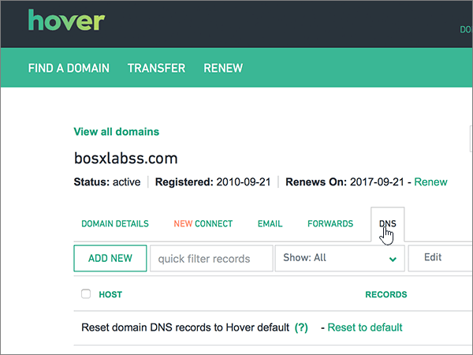

# Criar registros DNS ao focalizar para a Microsoft

 **Caso não encontre o conteúdo que está procurando, [verifique as perguntas frequentes sobre domínios](../setup/domains-faq.md)**. 
  
Se você usa a Hover como provedor de hospedagem DNS, realize os procedimentos deste artigo para verificar o domínio e configurar registros DNS para o Skype for Business Online, email e outros serviços.
     
Depois que você adicionar esses registros ao focalizar, o domínio será configurado para funcionar com os serviços da Microsoft.
  

  
> [!NOTE]
>  Normalmente, são necessários cerca de 15 minutos para que as alterações de DNS entrem em vigor. Mas, às vezes, pode ser necessário mais tempo para atualizar uma alteração feita no sistema DNS da Internet. Se você tiver problemas com o fluxo de emails ou de outro tipo após adicionar os registros DNS, consulte [Solucionar problemas após alterar o nome de domínio ou registros DNS](../get-help-with-domains/find-and-fix-issues.md). 
  
## Adicionar um registro TXT para verificação

Antes de usar o seu domínio com a Microsoft, precisamos verificar se você é o proprietário dele. A capacidade de entrar na conta do seu registrador de domínios e criar o registro de DNS prova à Microsoft que você é o proprietário do domínio.
  
> [!NOTE]
> Esse registro é usado exclusivamente para confirmar se você é o proprietário do domínio; ele não afeta mais nada. É possível excluí-lo mais tarde, se desejar. 
  
Siga as etapas abaixo ou [assista ao vídeo](https://support.office.com/article/Video-Create-DNS-records-at-Hover-for-Office-365-182bd58e-8fe4-4717-9233-3a3546b72ad2?ui=en-US&amp;rs=en-US&amp;ad=US).
  
1. Para iniciar, vá até a página do seu domínio em Focalizar usando [este link](https://www.hover.com/domains). Você será solicitado a entrar.
    
    
  
2. Em **gerenciar seus domínios**, selecione o nome do domínio que você deseja editar.
    
    
  
3. Selecione a guia **DNS** . 
    
    
  
4. Selecione **Adicionar novo**.
    
    
  
5. In the boxes for the new record, select **TXT** for the **Record Type**, and then type or copy and paste the values from the following table.
    
    ||||
    |:-----|:-----|:-----|
    |Nome do host    |Tipo de Registro    |Valor    |
    |@    |TXT    |MS=ms *XXXXXXXX*    **Observação**: esse é um exemplo. Use aqui seu valor específico de **Destino ou Pontos de Endereçamento**, retirado da tabela.           [Como localizo isto?](../get-help-with-domains/information-for-dns-records.md)          |
   
    
  
6. Selecione **Salvar**.
    
    
  
7. Aguarde alguns minutos antes de prosseguir para que o registro que você acabou de criar possa ser atualizado na Internet.
    
Agora que você adicionou o registro no site do seu registrador de domínios, retorne ao Microsoft 365 e solicite que o Microsoft 365 procure o registro.
  
Quando a Microsoft encontrar o registro TXT correto, seu domínio estará verificado.
  
1. No centro do administrador da Microsoft, acesse a página **Configurações de** \> <a href="https://go.microsoft.com/fwlink/p/?linkid=834818" target="_blank">domínios</a>.
    
2. Na página **Domínios**, clique no domínio que você está verificando. 
    
    
  
3. Na página **Configuração**, clique em **Iniciar configuração**.
    
    
  
4. Na página **Verificar domínio**, marque **Verificar**.
    
    
  
> [!NOTE]
>  Normalmente, são necessários cerca de 15 minutos para que as alterações de DNS entrem em vigor. Mas, às vezes, pode ser necessário mais tempo para atualizar uma alteração feita no sistema DNS da Internet. Se você tiver problemas com o fluxo de emails ou de outro tipo após adicionar os registros DNS, consulte [Solucionar problemas após alterar o nome de domínio ou registros DNS](../get-help-with-domains/find-and-fix-issues.md). 
  
## Adicione um registro MX para que o email do domínio vá para a Microsoft.

Siga as etapas abaixo ou [assista ao vídeo](https://support.office.com/article/Video-Create-DNS-records-at-Hover-for-Office-365-182bd58e-8fe4-4717-9233-3a3546b72ad2?ui=en-US&amp;rs=en-US&amp;ad=US).
  
1. Para iniciar, vá até a página do seu domínio em Focalizar usando [este link](https://www.hover.com/domains). Você será solicitado a entrar.
    
    
  
2. Em **gerenciar seus domínios**, selecione o nome do domínio que você deseja editar.
    
    
  
3. Selecione a guia **DNS** . 
    
    
  
4. Selecione **Adicionar novo**.
    
    
  
5. Nas caixas do novo registro, selecione **MX** como o **Tipo de Registro** e digite ou copie e cole os valores da tabela a seguir.
    
    |**Nome do host**|**Tipo de Registro**|**Prioridade**|**Nome do host**|
    |:-----|:-----|:-----|:-----|
    |@    |MX    |,0    Para saber mais sobre prioridade, confira [O que é prioridade MX?](https://support.office.com/article/2784cc4d-95be-443d-b5f7-bb5dd867ba83.aspx)   | *\<chave-do-domínio\>*  .mail.protection.outlook.com    **Observação:** Obtenha sua * \<chave\> de domínio* de sua conta da Microsoft.           [Como localizo isto?](../get-help-with-domains/information-for-dns-records.md)          |
   
    
  
6. Selecione **Salvar**.
    
    
  
7. Se houver outros registros MX, use o processo de duas etapas a seguir para remover cada um deles:
    
    Primeiro, passe sobre um registro que você deseja remover, selecione **excluir**.
    
    
  
    Em segundo lugar, selecione **Sim** para confirmar cada exclusão. 
    
    
  
    Repita esse processo até excluir todos os registros MX, exceto para aquele adicionado anteriormente neste procedimento.
    
## Adicionar os registros CNAME necessários para a Microsoft

Siga as etapas abaixo ou [assista ao vídeo](https://support.office.com/article/Video-Create-DNS-records-at-Hover-for-Office-365-182bd58e-8fe4-4717-9233-3a3546b72ad2?ui=en-US&amp;rs=en-US&amp;ad=US).
  
1. Para iniciar, vá até a página do seu domínio em Focalizar usando [este link](https://www.hover.com/domains). Você será solicitado a entrar.
    
    
  
2. Em **gerenciar seus domínios**, selecione o nome do domínio que você deseja editar.
    
    
  
3. Selecione a guia **DNS** . 
    
    
  
4. Adicione o primeiro dos seis registros CNAME.
    
    Selecione **Adicionar novo**.
    
    
  
5. Nas caixas vazias do novo registro, selecione **CNAME** como o **Tipo de Registro** e digite ou copie e cole os valores da tabela a seguir.
    
    |**Nome do host**|**Tipo de Registro**|**Host de Destino**|
    |:-----|:-----|:-----|
    |autodiscover    |CNAME    |autodiscover.outlook.com    |
    |sip    |CNAME    |sipdir.online.lync.com    |
    |lyncdiscover    |CNAME    |webdir.online.lync.com    |
    |enterpriseregistration    |CNAME    |enterpriseregistration.windows.net    |
    |enterpriseenrollment    |CNAME    |enterpriseenrollment-s.manage.microsoft.com    |
   
    
  
6. Selecione **Salvar**.
    
    
  
7. Usando as três etapas anteriores e os valores das outras cinco linhas da tabela, adicione cada um dos outros cinco registros CNAME.
    
## Adicionar registro TXT à SPF para ajudar a evitar spam de email

> [!IMPORTANT]
> Não é possível ter mais de um registro TXT para SPF para um domínio. Se o seu domínio possuir mais de um registro SPF, ocorrerão erros de email, bem como problemas na entrega e na classificação de spam. Se você já possui um registro SPF para seu domínio, não crie um novo para a Microsoft. Em vez disso, adicione os valores necessários da Microsoft ao registro atual para que você tenha um *único* registro SPF que inclua os dois conjuntos de valores. 
  
Siga as etapas abaixo ou [assista ao vídeo](https://support.office.com/article/Video-Create-DNS-records-at-Hover-for-Office-365-182bd58e-8fe4-4717-9233-3a3546b72ad2?ui=en-US&amp;rs=en-US&amp;ad=US).
  
1. Para iniciar, vá até a página do seu domínio em Focalizar usando [este link](https://www.hover.com/domains). Você será solicitado a entrar.
    
    
  
2. Em **gerenciar seus domínios**, selecione o nome do domínio que você deseja editar.
    
    
  
3. Selecione a guia **DNS** . 
    
    
  
4. Selecione **Adicionar novo**.
    
    
  
5. In the boxes for the new record, select **TXT** for the **Record Type**, and then type or copy and paste the values from the following table.
    
    |**Nome do host**|**Tipo de Registro**|**Valor**|
    |:-----|:-----|:-----|
    |@    |TXT    |v=spf1 include:spf.protection.outlook.com -all   **Observação:** é recomendável copiar e colar essa entrada, para que todo o espaçamento permaneça correto.           |
   
    
  
6. Selecione **Salvar**.
    
    
  
## Adicionar os dois registros SRV necessários para a Microsoft

Siga as etapas abaixo ou [assista ao vídeo](https://support.office.com/article/Video-Create-DNS-records-at-Hover-for-Office-365-182bd58e-8fe4-4717-9233-3a3546b72ad2?ui=en-US&amp;rs=en-US&amp;ad=US).
  
1. Para iniciar, vá até a página do seu domínio em Focalizar usando [este link](https://www.hover.com/domains). Você será solicitado a entrar.
    
    
  
2. Em **gerenciar seus domínios**, selecione o nome do domínio que você deseja editar.
    
    
  
3. Selecione a guia **DNS** . 
    
    
  
4. Adicione o primeiro dos dois registros SRV.
    
    Selecione **Adicionar novo**.
    
    
  
5. Nas caixas vazias do novo registro, selecione **SRV** como o **Tipo de Registro** e digite ou copie e cole os valores da primeira linha na tabela a seguir.
    
    |**Nome do host**|**Tipo de Registro**|**Prioridade**|**Espessura**|**Porta**|**Destino**|
    |:-----|:-----|:-----|:-----|:-----|:-----|
    |_sip. _tls    |SRV    |100    |1    |443    |sipdir.online.lync.com    |
    |_sipfederationtls. _tcp    |SRV    |100    |1    |5061    |sipfed.online.lync.com    |
   
    
  
6. Selecione **Salvar**.
    
    
  
7. Usando as três etapas anteriores e os valores da segunda linha da tabela, adicione o outro registro SRV.
    
> [!NOTE]
> Normalmente, são necessários cerca de 15 minutos para que as alterações de DNS entrem em vigor. Mas, às vezes, pode ser necessário mais tempo para atualizar uma alteração feita no sistema DNS da Internet. Se você tiver problemas com o fluxo de emails ou de outro tipo após adicionar os registros DNS, consulte [Solucionar problemas após alterar o nome de domínio ou registros DNS](../get-help-with-domains/find-and-fix-issues.md). 
  
