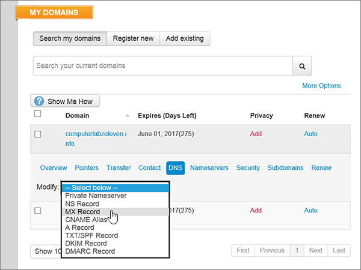
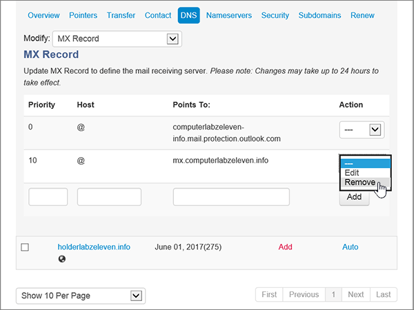
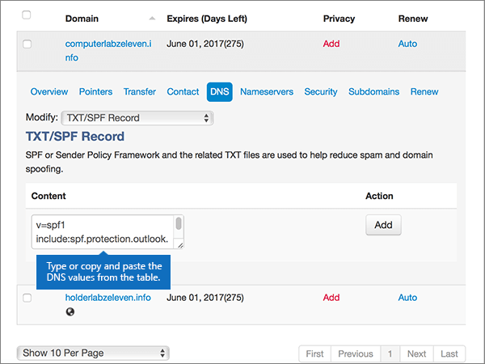

# Criar registros DNS no Meu Domínio para Microsoft

  
 Caso não encontre o conteúdo que está procurando, **[verifique as perguntas frequentes sobre domínios](../setup/domains-faq.yml)**. 
  
> [!CAUTION]
> O site MyDomain não dá suporte a registros SRV, ou seja, vários recursos do Skype for Business Online e do Outlook Web App não funcionarão. Não importa qual plano da Microsoft você utiliza, se você gerenciar seus registros DNS no site Meu Domínio, haverá [limitações de serviço significativas](../setup/domains-faq.yml) e talvez você queira mudar para um provedor de hospedagem de DNS diferente. 
  
Se você quiser gerenciar seus próprios registros DNS da Microsoft na MyDomain apesar das limitações do serviço, siga as etapas deste artigo para configurar os registros DNS para email, Skype for Business Online e assim por diante.
    
Depois que você adicionar esses registros no Meu Domínio, seu domínio será configurado para funcionar com os serviços Microsoft. 
  

  
> [!NOTE]
> Typically it takes about 15 minutes for DNS changes to take effect. Mas, às vezes, pode ser necessário mais tempo para atualizar uma alteração feita no sistema DNS da Internet. Se você tiver problemas com o fluxo de e-mails ou de outro tipo após adicionar os registros DNS, consulte [Localizar e corrigir problemas ou registros DNS](../get-help-with-domains/find-and-fix-issues.md). 
  
## Adicionar um registro TXT para verificação

Antes de usar o seu domínio com a Microsoft, precisamos verificar se você é o proprietário dele. A capacidade de entrar na conta do seu registrador de domínios e criar o registro de DNS prova à Microsoft que você é o proprietário do domínio.
  
> [!NOTE]
> Esse registro é usado exclusivamente para confirmar se você é o proprietário do domínio; ele não afeta mais nada. É possível excluí-lo mais tarde, se desejar. 
  
1. Para começar, vá até a sua página de domínios em MeuDomínio usando [este link](https://www.mydomain.com/controlpanel). Você será solicitado a fazer logon primeiro.
    
2. Na seção **Meus Favoritos**, clique em **Central de domínio**.
    
3. Na opção **Domínio**, clique no nome do domínio que quer editar.
    
4. Na linha **Visão geral**, clique em **DNS**.
    
5. Na lista suspensa **Modificar**, clique em **Registro TXT/SPF**.
    
6. Em **Content**, na caixa do novo registro, digite ou copie e cole os valores da tabela a seguir.
    
    ||
    |:-----|
    |**Conteúdo**   |
    |MS = ms *XXXXXXXX*    **Observação**: esse é um exemplo. Use aqui seu valor específico de **Destino ou Pontos de Endereçamento**, retirado da tabela. [Como localizo isto?](../get-help-with-domains/information-for-dns-records.md)          |
   
7. Clique em **Adicionar**.
    
8. Aguarde alguns minutos antes de prosseguir para que o registro que você acabou de criar possa ser atualizado na Internet.
    
Agora que você adicionou o registro no site do seu registrador de domínios, retorne à Microsoft e solicite o registro.
  
Quando a Microsoft encontrar o registro TXT correto, seu domínio estará verificado.
  
1. No centro do administrador da Microsoft, acesse a página **Configurações de** \> <a href="https://go.microsoft.com/fwlink/p/?linkid=834818" target="_blank">domínios</a>.
    
2. Na página **Domínios**, clique no domínio que você está verificando. 
    
3. Na página **Configuração**, clique em **Iniciar configuração**.
    
4. Na página **Verificar domínio**, clique em **Verificar**.
    
> [!NOTE]
> Typically it takes about 15 minutes for DNS changes to take effect. Mas, às vezes, pode ser necessário mais tempo para atualizar uma alteração feita no sistema DNS da Internet. Se você tiver problemas com o fluxo de e-mails ou de outro tipo após adicionar os registros DNS, consulte [Localizar e corrigir problemas ou registros DNS](../get-help-with-domains/find-and-fix-issues.md). 
  
## Adicione um registro MX para que o email do domínio vá para a Microsoft.

1. Para começar, vá até a sua página de domínios em MeuDomínio usando [este link](https://www.mydomain.com/controlpanel). Você será solicitado a fazer logon primeiro.
    
2. Na seção **Meus Favoritos**, clique em **Central de domínio**.
    
3. Na opção **Domínio**, clique no nome do domínio que quer editar.
    
4. Na linha **Visão geral**, clique em **DNS**.
    
5. Na lista suspensa **Modificar**, escolha **Registro MX**.
    
    
  
6. Nas caixas do novo registro, digite ou copie e cole os valores da seguinte tabela.
    
    |**Prioridade**|**Host**|**Aponta para:**|
    |:-----|:-----|:-----|
    |0    Para saber mais sobre prioridade, confira [O que é prioridade MX?](../setup/domains-faq.yml)   |@    | *\<domain-key\>*  .mail.protection.outlook.com    **Observação:** Obtenha a sua \<*domain-key*\> através da sua conta Microsoft. > [Como localizo isso?](../get-help-with-domains/information-for-dns-records.md)          |
   
    
  
7. Clique em **Adicionar**.
    
    
  
8. Se houver outros registros MX, selecione **Remover** na coluna **Ação** em cada um para excluí-los. 
    
    
  
9. Clique em **OK**.
    
    
  
## Adicionar os registros CNAME necessários para a Microsoft

1. Para começar, vá até a sua página de domínios em MeuDomínio usando [este link](https://www.mydomain.com/controlpanel). Você será solicitado a fazer logon primeiro.
    
2. Na seção **Meus Favoritos**, clique em **Central de domínio**.
    
3. Na opção **Domínio**, clique no nome do domínio que quer editar.
    
4. Na linha **Visão geral**, clique em **DNS**.
    
5. Na lista suspensa **Modificar**, escolha **Alias CNAME**.
    
    
  
6. Adicionar o primeiro registro CNAME.
    
    Nas caixas do novo registro, digite ou copie e cole os valores da primeira linha da tabela a seguir.
    
    |**Host**|**Aponta para:**|
    |:-----|:-----|
    |descoberta automática    |autodiscover.outlook.com    |
    |sip    |sipdir.online.lync.com    |
    |lyncdiscover    |webdir.online.lync.com    |
    |enterpriseregistration    |enterpriseregistration.windows.net    |
    |enterpriseenrollment    |enterpriseenrollment-s.manage.microsoft.com    |
   
    
  
7. Clique em **Adicionar** para adicionar o primeiro registro. 
    
    
  
8. Adicione o segundo registro CNAME.
    
    Use os valores da segunda linha da tabela acima e clique em **Adicionar** para adicionar o segundo registro. 
    
    Adicione os registros restantes da mesma maneira, usando os valores da terceira, quarta, quinta e sexta linhas da tabela.
    
## Adicionar o registro TXT à SPF para ajudar a evitar spam de e-mail

> [!IMPORTANT]
> Não é possível ter mais de um registro TXT para SPF para um domínio. Se o seu domínio possuir mais de um registro SPF, ocorrerão erros de email, bem como problemas na entrega e na classificação de spam. Se você já possui um registro SPF para seu domínio, não crie um novo para a Microsoft. Em vez disso, adicione os valores necessários da Microsoft ao registro atual para que você tenha um único registro SPF que inclua os dois conjuntos de valores. Precisa de exemplos? Confira os [Registros do Sistema de Nomes de Domínios externos para a Microsoft](../../enterprise/external-domain-name-system-records.md#bkmk_spfrecords). To validate your SPF record, you can use one of these [SPF validation tools](../setup/domains-faq.yml). 
  
1. Para começar, vá até a sua página de domínios em MeuDomínio usando [este link](https://www.mydomain.com/controlpanel). Você será solicitado a fazer logon primeiro.
    
2. Na seção **Meus Favoritos**, clique em **Central de domínio**.
    
3. Na opção **Domínio**, clique no nome do domínio que quer editar.
    
4. Na linha **Visão geral**, clique em **DNS**.
    
5. Na lista suspensa **Modificar**, escolha **Registro TXT/SPF**.
    
    
  
6. Em **Content**, na caixa do novo registro, digite ou copie e cole os valores da tabela a seguir.
    
    |**Conteúdo**|
    |:-----|
    |v=spf1 include:spf.protection.outlook.com -all    **Observação:** é recomendável copiar e colar essa entrada para que o espaçamento permaneça correto.           |
   
    
  
7. Clique em **Adicionar**.
    
    
  
## Adicionar os dois registros SRV necessários para a Microsoft

> [!CAUTION]
> O site MyDomain não dá suporte a registros SRV, ou seja, vários recursos do Skype for Business Online e do Outlook Web App não funcionarão. Não importa qual plano da Microsoft você utiliza, se você gerenciar seus registros DNS no site Meu Domínio, haverá [limitações de serviço significativas](../setup/domains-faq.yml) e talvez você queira mudar para um provedor de hospedagem de DNS diferente. 
  
> [!NOTE]
> Typically it takes about 15 minutes for DNS changes to take effect. Mas, às vezes, pode ser necessário mais tempo para atualizar uma alteração feita no sistema DNS da Internet. Se você tiver problemas com o fluxo de e-mails ou de outro tipo após adicionar os registros DNS, consulte [Localizar e corrigir problemas ou registros DNS](../get-help-with-domains/find-and-fix-issues.md). 
