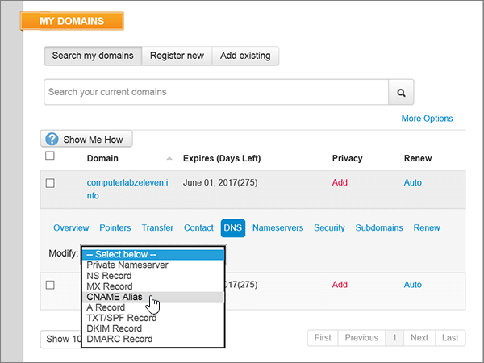

# Criar registros DNS no site Meu Domínio do Office 365Create DNS records at MyDomain for Office 365

  
 Caso não encontre o conteúdo que está procurando, **[verifique as perguntas frequentes sobre domínios](../setup/domains-faq.md)**.**[Check the Domains FAQ](../setup/domains-faq.md)** if you don't find what you're looking for. 
  
> [!CAUTION]
> O site MyDomain não dá suporte a registros SRV, ou seja, vários recursos do Skype for Business Online e do Outlook Web App não funcionarão. Não importa qual plano do Office 365 você utiliza, se você gerenciar seus registros DNS no site MyDomain, haverá [limitações de serviço significativas](https://support.office.com/article/7ae9a655-041d-4724-aa92-60392ee390c2.aspx) e talvez você queira mudar para um provedor de hospedagem de DNS diferente.The MyDomain website doesn't support SRV records, which means several Skype for Business Online and Outlook Web App features won't work. No matter which Office 365 plan you use, if you manage your DNS records at MyDomain, there are [significant service limitations](https://support.office.com/article/7ae9a655-041d-4724-aa92-60392ee390c2.aspx), and you might want to switch to a different DNS hosting provider. 
  
Se você quiser gerenciar seus próprios registros DNS do Office 365 na MyDomain apesar das limitações do serviço, siga as etapas deste artigo para configurar os registros DNS para email, Skype for Business Online e assim por diante.If you choose to manage your own Office 365 DNS records at MyDomain despite the service limitations, follow the steps in this article to set up your DNS records for email, Skype for Business Online, and so on.
    
Depois que você adicionar esses registros na MyDomain, o domínio será configurado para funcionar com os serviços do Office 365.After you add these records at MyDomain, your domain will be set up to work with Office 365 services.
  
Para saber mais sobre hospedagem na Web e DNS para sites com o Office 365, confira [Usar um site público com o Office 365](https://support.office.com/article/choose-a-public-website-3325d50e-d131-403c-a278-7f3296fe33a9).To learn about webhosting and DNS for websites with Office 365, see [Use a public website with Office 365](https://support.office.com/article/choose-a-public-website-3325d50e-d131-403c-a278-7f3296fe33a9).
  
> [!NOTE]
> Typically it takes about 15 minutes for DNS changes to take effect.Typically it takes about 15 minutes for DNS changes to take effect. Mas, às vezes, pode ser necessário mais tempo para atualizar uma alteração feita no sistema DNS da Internet.However, it can occasionally take longer for a change you've made to update across the Internet's DNS system. Se você tiver problemas com o fluxo de e-mails ou de outro tipo após adicionar os registros DNS, consulte [Localizar e corrigir problemas após alterar o nome de domínio ou registros DNS no Office 365](../get-help-with-domains/find-and-fix-issues.md).If you're having trouble with mail flow or other issues after adding DNS records, see [Find and fix issues after adding your domain or DNS records in Office 365](../get-help-with-domains/find-and-fix-issues.md). 
  
## Adicionar um registro TXT para verificaçãoAdd a TXT record for verification

Antes de usar o seu domínio com o Office 365, precisamos verificar se você é o proprietário dele. A capacidade de entrar na conta do seu registrador de domínios e criar o registro DNS prova ao Office 365 que você é o proprietário do domínio.Before you use your domain with Office 365, we have to make sure that you own it. Your ability to log in to your account at your domain registrar and create the DNS record proves to Office 365 that you own the domain.
  
> [!NOTE]
> Esse registro é usado exclusivamente para confirmar se você é o proprietário do domínio; ele não afeta mais nada. É possível excluí-lo mais tarde, se desejar.This record is used only to verify that you own your domain; it doesn't affect anything else. You can delete it later, if you like. 
  
1. Para começar, vá até a sua página de domínios em MeuDomínio usando [este link](https://www.mydomain.com/controlpanel).To get started, go to your domains page at MyDomain by using [this link](https://www.mydomain.com/controlpanel). Será solicitado que você faça logon primeiro.You'll be prompted to log in first.
    
2. Na seção **Meus Favoritos**, clique em **Central de domínio**.In the **My Favorites** section, select **Domain Central**.
    
3. Na opção **Domínio**, clique no nome do domínio que quer editar.Under **Domain**, select the name of the domain that you want to edit.
    
4. Na linha **Visão geral**, clique em **DNS**.In the **Overview** row, select **DNS**.
    
5. Na lista suspensa **Modificar**, clique em **Registro TXT/SPF**.From the **Modify** drop-down list, choose **TXT/SPF Record**.
    
6. Em **Content**, na caixa do novo registro, digite ou copie e cole os valores da tabela a seguir.Under **Content**, in the box for the new record, type or copy and paste the value from the following table.
    
    ||
    |:-----|
    |**Conteúdo****Content**   |
    |MS = ms *XXXXXXXX*MS=ms *XXXXXXXX*    **Observação**: esse é um exemplo.**Note:** This is an example. Use seu valor específico de **Destinos ou Pontos de Endereçamento** aqui, da tabela no Office 365.Use your specific **Destination or Points to Address** value here, from the table in Office 365. [Como localizo isto?How do I find this?](../get-help-with-domains/information-for-dns-records.md)          |
   
7. Clique em **Adicionar**.Select **Add**.
    
8. Aguarde alguns minutos antes de prosseguir para que o registro que você acabou de criar possa ser atualizado na Internet.Wait a few minutes before you continue, so that the record you just created can update across the Internet.
    
Agora que você adicionou o registro no site do seu registrador de domínios, retorne ao Office 365 e solicite que o Office 365 procure o registro.Now that you've added the record at your domain registrar's site, you'll go back to Office 365 and request Office 365 to look for the record.
  
Quando o Office 365 encontrar o registro TXT correto, o domínio será verificado.When Office 365 finds the correct TXT record, your domain is verified.
  
1. No centro do administrador, acesse a página **Configurações de** \> <a href="https://go.microsoft.com/fwlink/p/?linkid=834818" target="_blank">domínios</a>.In the admin center, go to the **Settings** \> <a href="https://go.microsoft.com/fwlink/p/?linkid=834818" target="_blank">Domains</a> page.
    
2. Na página **Domínios**, clique no domínio que você está verificando.On the **Domains** page, select the domain that you are verifying. 
    
3. Na página **Configuração**, clique em **Iniciar configuração**.On the **Setup** page, select **Start setup**.
    
4. Na página **Verificar domínio**, clique em **Verificar**.On the **Verify domain** page, select **Verify**.
    
> [!NOTE]
> Typically it takes about 15 minutes for DNS changes to take effect.Typically it takes about 15 minutes for DNS changes to take effect. Mas, às vezes, pode ser necessário mais tempo para atualizar uma alteração feita no sistema DNS da Internet.However, it can occasionally take longer for a change you've made to update across the Internet's DNS system. Se você tiver problemas com o fluxo de e-mails ou de outro tipo após adicionar os registros DNS, consulte [Localizar e corrigir problemas após alterar o nome de domínio ou registros DNS no Office 365](../get-help-with-domains/find-and-fix-issues.md).If you're having trouble with mail flow or other issues after adding DNS records, see [Find and fix issues after adding your domain or DNS records in Office 365](../get-help-with-domains/find-and-fix-issues.md). 
  
## Adicionar um registro MX para que o e-mail do domínio vá para o Office 365Add an MX record so email for your domain will come to Office 365

1. Para começar, vá até a sua página de domínios em MeuDomínio usando [este link](https://www.mydomain.com/controlpanel). Você será solicitado a fazer logon primeiro.To get started, go to your domains page at MyDomain by using [this link](https://www.mydomain.com/controlpanel). You'll be prompted to log in first.
    
2. Na seção **Meus Favoritos**, clique em **Central de domínio**.In the **My Favorites** section, select **Domain Central**.
    
3. Na opção **Domínio**, clique no nome do domínio que quer editar.Under **Domain**, select the name of the domain that you want to edit.
    
4. Na linha **Visão geral**, clique em **DNS**.In the **Overview** row, select **DNS**.
    
5. Na lista suspensa **Modificar**, escolha **Registro MX**.From the **Modify** drop-down list, choose **MX Record**.
    
    
  
6. Nas caixas do novo registro, digite ou copie e cole os valores da seguinte tabela.In the boxes for the new record, type or copy and paste the values from the following table.
    
    |**Prioridade****Priority**|**Host****Host**|**Aponta para:****Points To:**|
    |:-----|:-----|:-----|
    |00    Para saber mais sobre prioridade, confira [O que é prioridade MX?](https://support.office.com/article/2784cc4d-95be-443d-b5f7-bb5dd867ba83.aspx)For more information about priority, see [What is MX priority?](https://support.office.com/article/2784cc4d-95be-443d-b5f7-bb5dd867ba83.aspx)   |@    | *\<chave-do-domínio\>*  .mail.protection.outlook.com*\<domain-key\>*  .mail.protection.outlook.com    **Observação:** Obtenha a sua \<*chave-de-domínio*\> através da conta do Office 365.**Note:** Get your \<*domain-key*\> from your Office 365 account. > [Como localizo isso?](../get-help-with-domains/information-for-dns-records.md) > [How do I find this?](../get-help-with-domains/information-for-dns-records.md)          |
   
    
  
7. Clique em **Adicionar**.Select **Add**.
    
    
  
8. Se houver outros registros MX, selecione **Remover** na coluna **Ação** em cada um para excluí-los.If there are any other existing MX records, select **Remove** in the **Action** column for each one to delete it. 
    
    
  
9. Clique em **OK**.Select **OK**.
    
    
  
## Adicionar os registros CNAME necessários do Office 365Add the CNAME records that are required for Office 365

1. Para começar, vá até a sua página de domínios em MeuDomínio usando [este link](https://www.mydomain.com/controlpanel). Você será solicitado a fazer logon primeiro.To get started, go to your domains page at MyDomain by using [this link](https://www.mydomain.com/controlpanel). You'll be prompted to log in first.
    
2. Na seção **Meus Favoritos**, clique em **Central de domínio**.In the **My Favorites** section, select **Domain Central**.
    
3. Na opção **Domínio**, clique no nome do domínio que quer editar.Under **Domain**, select the name of the domain that you want to edit.
    
4. Na linha **Visão geral**, clique em **DNS**.In the **Overview** row, select **DNS**.
    
5. Na lista suspensa **Modificar**, escolha **Alias CNAME**.From the **Modify** drop-down list, choose **CNAME Alias**.
    
    
  
6. Adicionar o primeiro registro CNAME.Add the first CNAME record.
    
    Nas caixas do novo registro, digite ou copie e cole os valores da primeira linha da tabela a seguir.In the boxes for the new record, type or copy and paste the values from the first row of the following table.
    
    |**Host****Host**|**Aponta para:****Points To:**|
    |:-----|:-----|
    |descoberta automáticaautodiscover    |autodiscover.outlook.comautodiscover.outlook.com    |
    |sipsip    |sipdir.online.lync.comsipdir.online.lync.com    |
    |lyncdiscoverlyncdiscover    |webdir.online.lync.comwebdir.online.lync.com    |
    |enterpriseregistrationenterpriseregistration    |enterpriseregistration.windows.netenterpriseregistration.windows.net    |
    |enterpriseenrollmententerpriseenrollment    |enterpriseenrollment-s.manage.microsoft.comenterpriseenrollment-s.manage.microsoft.com    |
   
    
  
7. Clique em **Adicionar** para adicionar o primeiro registro.Select **Add** to add the first record. 
    
    
  
8. Adicione o segundo registro CNAME.Add the second CNAME record.
    
    Use os valores da segunda linha da tabela acima e clique em **Adicionar** para adicionar o segundo registro.Use the values from the second row of the table above, and then select **Add** to add the second record. 
    
    Adicione os registros restantes da mesma maneira, usando os valores da terceira, quarta, quinta e sexta linhas da tabela.Add the remaining records in the same way, using the values from the third, fourth, fifth, and sixth rows of the table.
    
## Adicionar o registro TXT à SPF para ajudar a evitar spam de e-mailAdd a TXT record for SPF to help prevent email spam

> [!IMPORTANT]
> Não é possível ter mais de um registro TXT para SPF para um domínio.You cannot have more than one TXT record for SPF for a domain. Se o seu domínio possuir mais de um registro SPF, ocorrerão erros de email, bem como problemas na entrega e na classificação de spam.If your domain has more than one SPF record, you'll get email errors, as well as delivery and spam classification issues. If you already have an SPF record for your domain, don't create a new one for Office 365.If you already have an SPF record for your domain, don't create a new one for Office 365. Em vez disso, adicione os valores necessários do Office 365 ao registro atual, de modo que você tenha um único registro SPF que inclua os dois conjuntos de valores.Instead, add the required Office 365 values to the current record so that you have a single SPF record that includes both sets of values. Precisa de exemplos?Need examples? Confira os [Registros do sistema de nomes de domínios externos do Office 365](https://support.office.com/article/c0531a6f-9e25-4f2d-ad0e-a70bfef09ac0#bkmk_spfrecords). Check out these [External Domain Name System records for Office 365](https://support.office.com/article/c0531a6f-9e25-4f2d-ad0e-a70bfef09ac0#bkmk_spfrecords). To validate your SPF record, you can use one of these [SPF validation tools](../setup/domains-faq.md).To validate your SPF record, you can use one of these [SPF validation tools](../setup/domains-faq.md). 
  
1. Para começar, vá até a sua página de domínios em MeuDomínio usando [este link](https://www.mydomain.com/controlpanel).To get started, go to your domains page at MyDomain by using [this link](https://www.mydomain.com/controlpanel). Será solicitado que você faça logon primeiro.You'll be prompted to log in first.
    
2. Na seção **Meus Favoritos**, clique em **Central de domínio**.In the **My Favorites** section, select **Domain Central**.
    
3. Na opção **Domínio**, clique no nome do domínio que quer editar.Under **Domain**, select the name of the domain that you want to edit.
    
4. Na linha **Visão geral**, clique em **DNS**.In the **Overview** row, select **DNS**.
    
5. Na lista suspensa **Modificar**, escolha **Registro TXT/SPF**.From the **Modify** drop-down list, choose **TXT/SPF Record**.
    
    
  
6. Em **Content**, na caixa do novo registro, digite ou copie e cole os valores da tabela a seguir.Under **Content**, in the box for the new record, type or copy and paste the value from the following table.
    
    |**Conteúdo****Content**|
    |:-----|
    |v=spf1 include:spf.protection.outlook.com -allv=spf1 include:spf.protection.outlook.com -all    **Observação:** é recomendável copiar e colar essa entrada para que o espaçamento permaneça correto.**Note:** We recommend copying and pasting this entry, so that all of the spacing stays correct.           |
   
    
  
7. Clique em **Adicionar**.Select **Add**.
    
    
  
## Adicionar os dois registros SRV necessários do Office 365Add the two SRV records that are required for Office 365

> [!CAUTION]
> O site MyDomain não dá suporte a registros SRV, ou seja, vários recursos do Skype for Business Online e do Outlook Web App não funcionarão. Não importa qual plano do Office 365 você utiliza, se você gerenciar seus registros DNS no site MyDomain, haverá [limitações de serviço significativas](https://support.office.com/article/7ae9a655-041d-4724-aa92-60392ee390c2.aspx) e talvez você queira mudar para um provedor de hospedagem de DNS diferente.The MyDomain website doesn't support SRV records, which means several Skype for Business Online and Outlook Web App features won't work. No matter which Office 365 plan you use, if you manage your DNS records at MyDomain, there are [significant service limitations](https://support.office.com/article/7ae9a655-041d-4724-aa92-60392ee390c2.aspx), and you might want to switch to a different DNS hosting provider. 
  
> [!NOTE]
> Typically it takes about 15 minutes for DNS changes to take effect.Typically it takes about 15 minutes for DNS changes to take effect. Mas, às vezes, pode ser necessário mais tempo para atualizar uma alteração feita no sistema DNS da Internet.However, it can occasionally take longer for a change you've made to update across the Internet's DNS system. Se você tiver problemas com o fluxo de e-mails ou de outro tipo após adicionar os registros DNS, consulte [Localizar e corrigir problemas após alterar o nome de domínio ou registros DNS no Office 365](../get-help-with-domains/find-and-fix-issues.md).If you're having trouble with mail flow or other issues after adding DNS records, see [Find and fix issues after adding your domain or DNS records in Office 365](../get-help-with-domains/find-and-fix-issues.md). 
  
