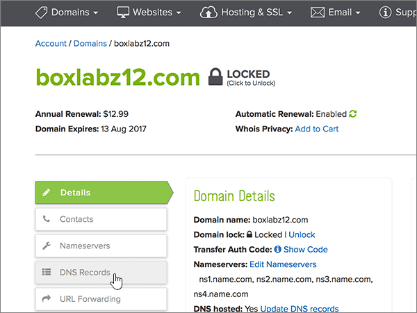
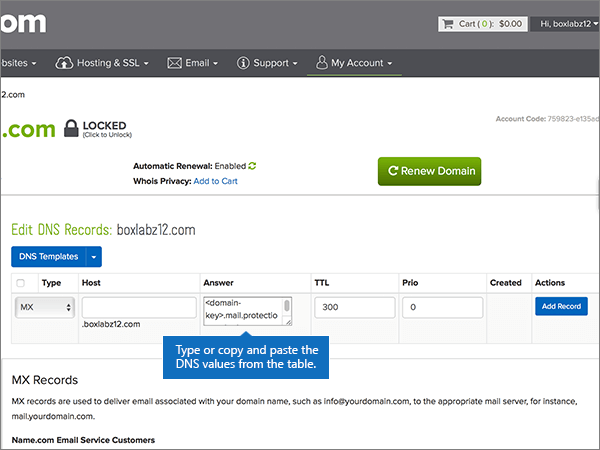
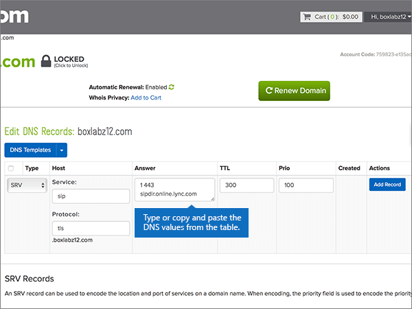

# Criar registros DNS no name.com para Microsoft

 **Caso não encontre o conteúdo que está procurando, [verifique as perguntas frequentes sobre domínios](../setup/domains-faq.md)**. 
  
Se você usa a name.com como provedor de hospedagem DNS, realize os procedimentos deste artigo para verificar o domínio e configurar registros DNS para o Skype for Business Online, email e outros serviços.
  
Depois que você adicionar esses registros no name.com, o domínio será configurado para funcionar com os serviços da Microsoft.

  
> [!NOTE]
> Normalmente, são necessários cerca de 15 minutos para que as alterações de DNS entrem em vigor. Mas, às vezes, pode ser necessário mais tempo para atualizar uma alteração feita no sistema DNS da Internet. Se você tiver problemas com o fluxo de emails ou de outro tipo após adicionar os registros DNS, consulte [Solucionar problemas após alterar o nome de domínio ou registros DNS](../get-help-with-domains/find-and-fix-issues.md). 
  
## Adicionar um registro TXT para verificação

Antes de usar o seu domínio com a Microsoft, precisamos verificar se você é o proprietário dele. A capacidade de entrar na conta do seu registrador de domínios e criar o registro de DNS prova à Microsoft que você é o proprietário do domínio.
  
> [!NOTE]
> Esse registro é usado exclusivamente para confirmar se você é o proprietário do domínio; ele não afeta mais nada. É possível excluí-lo mais tarde, se desejar. 
  
1. Para iniciar, vá para a sua página de domínios em name.com usando [este link](https://www.name.com/account/domain). Você será solicitado a fazer o logon primeiro.
    
    
  
2. Em **meus domínios**, selecione o nome do domínio que você deseja modificar.
    
    
  
3. Na coluna **detalhes** , selecione **registros DNS**. 
    
    
  
4. Nas caixas do novo registro, digite ou copie e cole os valores da seguinte tabela.
    
    (Choose the **Type** value from the drop-down list.) 
    
    |||||
    |:-----|:-----|:-----|:-----|
    |**Tipo**   |**Host**   |**Atender**   |**TTL**   |
    |TXT    |(Leave this field empty.)    |MS=ms *XXXXXXXX*    **Observação**: esse é um exemplo. Use aqui seu valor específico de **Destino ou Pontos de Endereçamento**, retirado da tabela.           [Como localizo isto?](../get-help-with-domains/information-for-dns-records.md)          |Use the default value (300).    |
   
    
  
5. Selecione **adicionar registro**.
    
    
  
6. Aguarde alguns minutos antes de prosseguir para que o registro que você acabou de criar possa ser atualizado na Internet.
    
Agora que você adicionou o registro no site do seu registrador de domínios, retorne à Microsoft e solicite o registro.
  
Quando a Microsoft encontrar o registro TXT correto, seu domínio estará verificado.
  
1. No centro do administrador, acesse a página **Configurações de** \> <a href="https://go.microsoft.com/fwlink/p/?linkid=834818" target="_blank">domínios</a>.
    
2. Na página **Domínios**, clique no domínio que você está verificando. 
    
    
  
3. Na página **Configuração**, clique em **Iniciar configuração**.
    
    
  
4. Na página **Verificar domínio**, marque **Verificar**.
    
    
  
> [!NOTE]
> Normalmente, são necessários cerca de 15 minutos para que as alterações de DNS entrem em vigor. Mas, às vezes, pode ser necessário mais tempo para atualizar uma alteração feita no sistema DNS da Internet. Se você tiver problemas com o fluxo de emails ou de outro tipo após adicionar os registros DNS, consulte [Solucionar problemas após alterar o nome de domínio ou registros DNS](../get-help-with-domains/find-and-fix-issues.md). 
  
## Adicione um registro MX para que o email do domínio vá para a Microsoft.

1. Para iniciar, vá para a sua página de domínios em name.com usando [este link](https://www.name.com/account/domain). Você será solicitado a fazer o logon primeiro.
    
    
  
2. Em **meus domínios**, selecione o nome do domínio que você deseja modificar.
    
    
  
3. Na coluna **detalhes** , selecione **registros DNS**. 
    
    
  
4. Nas caixas do novo registro, digite ou copie e cole os valores da seguinte tabela.
    
    (Choose the **Type** value from the drop-down list.) 
    
    |**Tipo**|**Host**|**Atender**|**TTL**|**Prio**|
    |:-----|:-----|:-----|:-----|:-----|
    |MX    |(Deixe este campo vazio.)    | *\<chave-do-domínio\>*  .mail.protection.outlook.com    **Observação:** Obtenha sua * \<chave\> de domínio* de sua conta da Microsoft.           [Como faço para encontrar isso?](../get-help-with-domains/information-for-dns-records.md)          |Use the default value (300).    |,0    Para saber mais sobre prioridade, confira [O que é prioridade MX?](https://support.office.com/article/2784cc4d-95be-443d-b5f7-bb5dd867ba83.aspx)   |
   
   
  
5. Selecione **adicionar registro**.
    
    
  
6. Se houver outros registros MX, exclua cada um deles, usando o procedimento de duas etapas a seguir:
    
    Para cada registro MX, selecione **excluir** na coluna **ações** . 
    
    
  
    Para confirmar cada exclusão, selecione **excluir** na coluna **ações** novamente. 
    
    
  
    Repita esse procedimento de duas etapas até ter excluído todos os registros MX.
    
## Adicionar os registros CNAME necessários para a Microsoft

1. Para iniciar, vá para a sua página de domínios em name.com usando [este link](https://www.name.com/account/domain). Você será solicitado a fazer o logon primeiro.
    
    
  
2. Em **meus domínios**, selecione o nome do domínio que você deseja modificar.
    
    
  
3. Na coluna **detalhes** , selecione **registros DNS**. 
    
    
  
4. Adicionar o primeiro registro CNAME.
    
    Nas caixas do novo registro, digite ou copie e cole os valores da primeira linha da tabela a seguir.
    
    (Escolha o valor de **Tipo** na lista suspensa.) 
    
    |**Tipo**|**Host**|**Atender**|**TTL**|
    |:-----|:-----|:-----|:-----|
    |CNAME    |descoberta automática    |autodiscover.outlook.com    |Use o valor padrão (300).    |
    |CNAME    |sip    |sipdir.online.lync.com    |Use o valor padrão (300).    |
    |CNAME    |lyncdiscover    |webdir.online.lync.com    |Use o valor padrão (300).    |
    |CNAME    |enterpriseregistration    |enterpriseregistration.windows.net    |Use o valor padrão (300).    |
    |CNAME    |enterpriseenrollment    |enterpriseenrollment-s.manage.microsoft.com    |Use o valor padrão (300).    |
   
   
  
5. Selecione **adicionar registro** para adicionar o primeiro registro. 
    
    
  
6. Adicione o segundo registro CNAME.
    
    Use os valores da segunda linha da tabela acima e, em seguida, selecione **adicionar registro** para adicionar o segundo registro. 
    
    Adicione os registros restantes da mesma maneira, usando os valores da terceira, quarta, quinta e sexta linhas da tabela.
    
## Adicionar o registro TXT à SPF para ajudar a evitar spam de e-mail

> [!IMPORTANT]
> Não é possível ter mais de um registro TXT para SPF para um domínio. Se o seu domínio possuir mais de um registro SPF, ocorrerão erros de email, bem como problemas na entrega e na classificação de spam. Se você já possui um registro SPF para seu domínio, não crie um novo para a Microsoft. Em vez disso, adicione os valores necessários da Microsoft ao registro atual para que você tenha um *único* registro SPF que inclua os dois conjuntos de valores. 
  
1. Para iniciar, vá para a sua página de domínios em name.com usando [este link](https://www.name.com/account/domain). Você será solicitado a fazer o logon primeiro.
    
    
  
2. Em **meus domínios**, selecione o nome do domínio que você deseja modificar.

    
  
3. Na coluna **detalhes** , selecione **registros DNS**. 
    
    
  
4. Nas caixas do novo registro, digite ou copie e cole os valores da seguinte tabela.
    
    (Choose the **Type** value from the drop-down list.) 
    
    |**Tipo**|**Host**|**Atender**|**TTL**|
    |:-----|:-----|:-----|:-----|
    |TXT    |(Leave this field empty.)    |v=spf1 include:spf.protection.outlook.com -all    **Observação:** é recomendável copiar e colar essa entrada, para que todo o espaçamento permaneça correto.           |Use the default value (300).    |
   
   
  
5. Selecione **adicionar registro**.
    
    
  
## Adicionar os dois registros SRV necessários para a Microsoft

1. Para iniciar, vá para a sua página de domínios em name.com usando [este link](https://www.name.com/account/domain). Você será solicitado a fazer o logon primeiro.
    
    
  
2. Em **meus domínios**, selecione o nome do domínio que você deseja modificar.
    
    
  
3. Na coluna **detalhes** , selecione **registros DNS +**. 
    
    
  
4. Adicione o primeiro registro SRV:
    
    Nas caixas do novo registro, digite ou copie e cole os valores da primeira linha da tabela a seguir.
    
    (Escolha o valor de **Tipo** na lista suspensa.) 
    
    |**Tipo**|**Serviço**|**Peso**|**TTL**|**Prio**|**Protocolo**|**Porta**|**Destino**|
    |:-----|:-----|:-----|:-----|:-----|:-----|:-----|:-----|
    |SRV|sip|1|Use o valor padrão (300).|100|tls|443|sipdir.online.lync.com   **Observação:** é recomendável copiar e colar essa entrada, para que todo o espaçamento permaneça correto.           |
    |SRV|sipfederationtls|1|Use o valor padrão (300).|100|tcp|5061|sipfed.online.lync.com  **Observação:** é recomendável copiar e colar essa entrada, para que todo o espaçamento permaneça correto.           |
   
   
  
5. Selecione **adicionar registro**.

    
  
6. Adicione o segundo registro SRV:

Use os valores da próxima linha da tabela acima e, em seguida, selecione **adicionar registro** para adicionar o segundo registro.

>[!NOTE]
>Normalmente, são necessários cerca de 15 minutos para que as alterações de DNS entrem em vigor. Mas, às vezes, pode ser necessário mais tempo para atualizar uma alteração feita no sistema DNS da Internet. Se você tiver problemas com o fluxo de emails ou de outro tipo após adicionar os registros DNS, consulte [Solucionar problemas após alterar o nome de domínio ou registros DNS](../get-help-with-domains/find-and-fix-issues.md).
