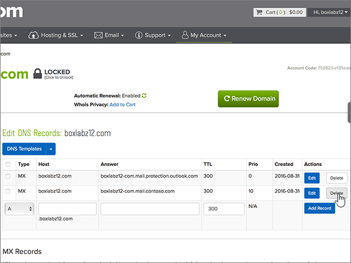

# Criar registros DNS no name.com para a MicrosoftCreate DNS records at name.com for Microsoft

 **Caso não encontre o conteúdo que está procurando, [verifique as perguntas frequentes sobre domínios](../setup/domains-faq.yml)**.**[Check the Domains FAQ](../setup/domains-faq.yml)** if you don't find what you're looking for. 
  
Se você usa a name.com como provedor de hospedagem DNS, realize os procedimentos deste artigo para verificar o domínio e configurar registros DNS para o Skype for Business Online, email e outros serviços.If name.com is your DNS hosting provider, follow the steps in this article to verify your domain and set up DNS records for email, Skype for Business Online, and so on.
  
Depois que você adicionar esses registros name.com, seu domínio será definido para funcionar com os serviços Microsoft.After you add these records at name.com, your domain will be set up to work with Microsoft services.

  
> [!NOTE]
> Normalmente, são necessários cerca de 15 minutos para que as alterações de DNS entrem em vigor. Mas, às vezes, pode ser necessário mais tempo para atualizar uma alteração feita no sistema DNS da Internet. Se você tiver problemas com o fluxo de emails ou de outro tipo após adicionar os registros DNS, consulte [Solucionar problemas após alterar o nome de domínio ou registros DNS](../get-help-with-domains/find-and-fix-issues.md).Typically it takes about 15 minutes for DNS changes to take effect. However, it can occasionally take longer for a change you've made to update across the Internet's DNS system. If you're having trouble with mail flow or other issues after adding DNS records, see [Troubleshoot issues after changing your domain name or DNS records](../get-help-with-domains/find-and-fix-issues.md). 
  
## Adicionar um registro TXT para verificaçãoAdd a TXT record for verification

Antes de usar o seu domínio com a Microsoft, precisamos verificar se você é o proprietário dele. A capacidade de entrar na conta do seu registrador de domínios e criar o registro de DNS prova à Microsoft que você é o proprietário do domínio.Before you use your domain with Microsoft, we have to make sure that you own it. Your ability to log in to your account at your domain registrar and create the DNS record proves to Microsoft that you own the domain.
  
> [!NOTE]
> Esse registro é usado exclusivamente para confirmar se você é o proprietário do domínio; ele não afeta mais nada. É possível excluí-lo mais tarde, se desejar.This record is used only to verify that you own your domain; it doesn't affect anything else. You can delete it later, if you like. 
  
1. Para iniciar, vá para a sua página de domínios em name.com usando [este link](https://www.name.com/account/domain). Você será solicitado a fazer o logon primeiro.To get started, go to your domains page at name.com by using [this link](https://www.name.com/account/domain). You'll be prompted to log in first.
    
    
  
2. Em **Meus Domínios,** selecione o nome do domínio que você deseja modificar.Under **My Domains**, select the name of the domain that you want to modify.
    
    
  
3. Na coluna **Detalhes,** selecione Registros **DNS.**In the **Details** column, select **DNS Records**. 
    
    
  
4. Nas caixas do novo registro, digite ou copie e cole os valores da seguinte tabela.In the boxes for the new record, type or copy and paste the values from the following table.
    
    (Selecione o valor **Tipo** na lista suspensa.)(Choose the **Type** value from the drop-down list.) 
    
    |||||
    |:-----|:-----|:-----|:-----|
    |**Tipo****Type**   |**Host****Host**   |**Atender****Answer**   |**TTL****TTL**   |
    |TXTTXT    |(Leave this field empty.)(Leave this field empty.)    |MS = ms *XXXXXXXX*MS=ms *XXXXXXXX*    **Observação**: esse é um exemplo.**Note:** This is an example. Use aqui seu valor específico de **Destino ou Pontos de Endereçamento**, retirado da tabela.Use your specific **Destination or Points to Address** value here, from the table.           [Como localizo isto?How do I find this?](../get-help-with-domains/information-for-dns-records.md)          |Use o valor padrão (300).Use the default value (300).    |
   
    
  
5. Selecione **Adicionar Registro.**Select **Add Record**.
    
    
  
6. Aguarde alguns minutos antes de prosseguir para que o registro que você acabou de criar possa ser atualizado na Internet.Wait a few minutes before you continue, so that the record you just created can update across the Internet.
    
Agora que você adicionou o registro no site do seu registrador de domínios, retorne à Microsoft e solicite o registro.Now that you've added the record at your domain registrar's site, you'll go back to Microsoft and request the record.
  
Quando a Microsoft encontrar o registro TXT correto, seu domínio estará verificado.When Microsoft finds the correct TXT record, your domain is verified.
  
1. No centro do administrador, acesse a página **Configurações de** \> <a href="https://go.microsoft.com/fwlink/p/?linkid=834818" target="_blank">domínios</a>.In the admin center, go to the **Settings** \> <a href="https://go.microsoft.com/fwlink/p/?linkid=834818" target="_blank">Domains</a> page.
    
2. Na página **Domínios**, clique no domínio que você está verificando.On the **Domains** page, select the domain that you are verifying. 
    
    
  
3. Na página **Configuração**, clique em **Iniciar configuração**.On the **Setup** page, select **Start setup**.
    
    
  
4. Na página **Verificar domínio**, marque **Verificar**.On the **Verify domain** page, select **Verify**.
    
    
  
> [!NOTE]
> Normalmente, são necessários cerca de 15 minutos para que as alterações de DNS entrem em vigor. Mas, às vezes, pode ser necessário mais tempo para atualizar uma alteração feita no sistema DNS da Internet. Se você tiver problemas com o fluxo de emails ou de outro tipo após adicionar os registros DNS, consulte [Solucionar problemas após alterar o nome de domínio ou registros DNS](../get-help-with-domains/find-and-fix-issues.md).Typically it takes about 15 minutes for DNS changes to take effect. However, it can occasionally take longer for a change you've made to update across the Internet's DNS system. If you're having trouble with mail flow or other issues after adding DNS records, see [Troubleshoot issues after changing your domain name or DNS records](../get-help-with-domains/find-and-fix-issues.md). 
  
## Adicione um registro MX para que o email do domínio vá para a Microsoft.Add an MX record so email for your domain will come to Microsoft

1. Para iniciar, vá para a sua página de domínios em name.com usando [este link](https://www.name.com/account/domain). Você será solicitado a fazer o logon primeiro.To get started, go to your domains page at name.com by using [this link](https://www.name.com/account/domain). You'll be prompted to log in first.
    
    
  
2. Em **Meus Domínios,** selecione o nome do domínio que você deseja modificar.Under **My Domains**, select the name of the domain that you want to modify.
    
    
  
3. Na coluna **Detalhes,** selecione Registros **DNS.**In the **Details** column, select **DNS Records**. 
    
    
  
4. Nas caixas do novo registro, digite ou copie e cole os valores da seguinte tabela.In the boxes for the new record, type or copy and paste the values from the following table.
    
    (Selecione o valor **Tipo** na lista suspensa.)(Choose the **Type** value from the drop-down list.) 
    
    |**Tipo****Type**|**Host****Host**|**Atender****Answer**|**TTL****TTL**|**Prio****Prio**|
    |:-----|:-----|:-----|:-----|:-----|
    |MXMX    |(Deixe este campo vazio.)(Leave this field empty.)    | *\<domain-key\>*  .mail.protection.outlook.com*\<domain-key\>*  .mail.protection.outlook.com    **Observação:** Obter o  *\<domain-key\>*  seu da sua conta da Microsoft.**Note:** Get your  *\<domain-key\>*  from your Microsoft account.           [Como faço para encontrar isso?How do I find this?](../get-help-with-domains/information-for-dns-records.md)          |Use o valor padrão (300).Use the default value (300).    |00    Para saber mais sobre prioridade, confira [O que é prioridade MX?](https://docs.microsoft.com/microsoft-365/admin/setup/domains-faq)For more information about priority, see [What is MX priority?](https://docs.microsoft.com/microsoft-365/admin/setup/domains-faq)   |
   
   
  
5. Selecione **Adicionar Registro.**Select **Add Record**.
    
    
  
6. Se houver outros registros MX, exclua cada um deles, usando o procedimento de duas etapas a seguir:If there are any other MX records, delete each of them by using the following two-step procedure:
    
    Para cada outro registro MX, selecione **Excluir** na **coluna** Ações.For each other MX record, select **Delete** in the **Actions** column. 
    
    
  
    Para confirmar cada exclusão, selecione **Excluir** na **coluna** Ações novamente.To confirm each deletion, select **Delete** in the **Actions** column again. 
    
    
  
    Repita esse procedimento de duas etapas até ter excluído todos os registros MX.Repeat this two-step procedure until you have deleted each of the other MX records.
    
## Adicionar os registros CNAME necessários para a MicrosoftAdd the CNAME records that are required for Microsoft

1. Para iniciar, vá para a sua página de domínios em name.com usando [este link](https://www.name.com/account/domain). Você será solicitado a fazer o logon primeiro.To get started, go to your domains page at name.com by using [this link](https://www.name.com/account/domain). You'll be prompted to log in first.
    
    
  
2. Em **Meus Domínios,** selecione o nome do domínio que você deseja modificar.Under **My Domains**, select the name of the domain that you want to modify.
    
    
  
3. Na coluna **Detalhes,** selecione Registros **DNS.**In the **Details** column, select **DNS Records**. 
    
    
  
4. Adicionar o primeiro registro CNAME.Add the first CNAME record.
    
    Nas caixas do novo registro, digite ou copie e cole os valores da primeira linha da tabela a seguir.In the boxes for the new record, type or copy and paste the values from the first row of the following table.
    
    (Escolha o valor de **Tipo** na lista suspensa.)(Choose the **Type** value from the drop-down list.) 
    
    |**Tipo****Type**|**Host****Host**|**Atender****Answer**|**TTL****TTL**|
    |:-----|:-----|:-----|:-----|
    |CNAMECNAME    |descoberta automáticaautodiscover    |autodiscover.outlook.comautodiscover.outlook.com    |Use o valor padrão (300).Use the default value (300).    |
    |CNAMECNAME    |sipsip    |sipdir.online.lync.comsipdir.online.lync.com    |Use o valor padrão (300).Use the default value (300).    |
    |CNAMECNAME    |lyncdiscoverlyncdiscover    |webdir.online.lync.comwebdir.online.lync.com    |Use o valor padrão (300).Use the default value (300).    |
    |CNAMECNAME    |enterpriseregistrationenterpriseregistration    |enterpriseregistration.windows.netenterpriseregistration.windows.net    |Use o valor padrão (300).Use the default value (300).    |
    |CNAMECNAME    |enterpriseenrollmententerpriseenrollment    |enterpriseenrollment-s.manage.microsoft.comenterpriseenrollment-s.manage.microsoft.com    |Use o valor padrão (300).Use the default value (300).    |
   
   
  
5. Selecione **Adicionar Registro** para adicionar o primeiro registro.Select **Add Record** to add the first record. 
    
    
  
6. Adicione o segundo registro CNAME.Add the second CNAME record.
    
    Use os valores da segunda linha da tabela acima e selecione **Adicionar Registro** para adicionar o segundo registro.Use the values from the second row of the table above, and then select **Add Record** to add the second record. 
    
    Adicione os registros restantes da mesma maneira, usando os valores da terceira, quarta, quinta e sexta linhas da tabela.Add the remaining records in the same way, using the values from the third, fourth, fifth, and sixth rows of the table.
    
## Adicionar o registro TXT à SPF para ajudar a evitar spam de e-mailAdd a TXT record for SPF to help prevent email spam

> [!IMPORTANT]
> Não é possível ter mais de um registro TXT para SPF para um domínio.You cannot have more than one TXT record for SPF for a domain. Se o seu domínio possuir mais de um registro SPF, ocorrerão erros de email, bem como problemas na entrega e na classificação de spam.If your domain has more than one SPF record, you'll get email errors, as well as delivery and spam classification issues. Se você já possui um registro SPF para seu domínio, não crie um novo para a Microsoft.If you already have an SPF record for your domain, don't create a new one for Microsoft. Em vez disso, adicione os valores necessários da Microsoft ao registro atual para que você tenha um único registro  *SPF*  que inclua ambos os conjuntos de valores.Instead, add the required Microsoft values to the current record so that you have a  *single*  SPF record that includes both sets of values. 
  
1. Para iniciar, vá para a sua página de domínios em name.com usando [este link](https://www.name.com/account/domain). Você será solicitado a fazer o logon primeiro.To get started, go to your domains page at name.com by using [this link](https://www.name.com/account/domain). You'll be prompted to log in first.
    
    
  
2. Em **Meus Domínios,** selecione o nome do domínio que você deseja modificar.Under **My Domains**, select the name of the domain that you want to modify.

    
  
3. Na coluna **Detalhes,** selecione Registros **DNS.**In the **Details** column, select **DNS Records**. 
    
    
  
4. Nas caixas do novo registro, digite ou copie e cole os valores da seguinte tabela.In the boxes for the new record, type or copy and paste the values from the following table.
    
    (Selecione o valor **Tipo** na lista suspensa.)(Choose the **Type** value from the drop-down list.) 
    
    |**Tipo****Type**|**Host****Host**|**Atender****Answer**|**TTL****TTL**|
    |:-----|:-----|:-----|:-----|
    |TXTTXT    |(Leave this field empty.)(Leave this field empty.)    |v=spf1 include:spf.protection.outlook.com -allv=spf1 include:spf.protection.outlook.com -all    **Observação:** é recomendável copiar e colar essa entrada para que o espaçamento permaneça correto.**Note:** We recommend copying and pasting this entry, so that all of the spacing stays correct.           |Use the default value (300).Use the default value (300).    |
   
   
  
5. Selecione **Adicionar Registro.**Select **Add Record**.
    
    
  
## Adicionar os dois registros SRV necessários para a MicrosoftAdd the two SRV records that are required for Microsoft

1. Para iniciar, vá para a sua página de domínios em name.com usando [este link](https://www.name.com/account/domain). Você será solicitado a fazer o logon primeiro.To get started, go to your domains page at name.com by using [this link](https://www.name.com/account/domain). You'll be prompted to log in first.
    
    
  
2. Em **Meus Domínios,** selecione o nome do domínio que você deseja modificar.Under **My Domains**, select the name of the domain that you want to modify.
    
    
  
3. Na coluna **Detalhes,** selecione **Registros DNS+**.In the **Details** column, select **DNS Records+**. 
    
    
  
4. Adicione o primeiro registro SRV:Add the first SRV record:
    
    Nas caixas do novo registro, digite ou copie e cole os valores da primeira linha da tabela a seguir.In the boxes for the new record, type or copy and paste the values from the first row of the following table.
    
    (Escolha o valor de **Tipo** na lista suspensa.)(Choose the **Type** value from the drop-down list.) 
    
    |**Tipo****Type**|**Serviço****Service**|**Peso****Weight**|**TTL****TTL**|**Prio****Prio**|**Protocolo****Protocol**|**Porta****Port**|**Destino****Target**|
    |:-----|:-----|:-----|:-----|:-----|:-----|:-----|:-----|
    |SRVSRV|sipsip|1 1|Use o valor padrão (300).Use the default value (300).|100100|tlstls|443443|sipdir.online.lync.comsipdir.online.lync.com   **Observação:** é recomendável copiar e colar essa entrada para que o espaçamento permaneça correto.**Note:** We recommend copying and pasting this entry, so that all of the spacing stays correct.           |
    |SRVSRV|sipfederationtlssipfederationtls|1 1|Use o valor padrão (300).Use the default value (300).|100100|tcptcp|50615061|sipfed.online.lync.comsipfed.online.lync.com  **Observação:** é recomendável copiar e colar essa entrada para que o espaçamento permaneça correto.**Note:** We recommend copying and pasting this entry, so that all of the spacing stays correct.           |
   
   
  
5. Selecione **Adicionar Registro.**Select **Add Record**.

    
  
6. Adicione o segundo registro SRV:Add the second SRV record:

Use os valores da próxima linha da tabela acima e selecione **Adicionar Registro** para adicionar o segundo registro.Use the values from the next row of the table above, and then select **Add Record** to add the second record.

>[!NOTE]
>Normalmente, são necessários cerca de 15 minutos para que as alterações de DNS entrem em vigor. Mas, às vezes, pode ser necessário mais tempo para atualizar uma alteração feita no sistema DNS da Internet. Se você tiver problemas com o fluxo de emails ou de outro tipo após adicionar os registros DNS, consulte [Solucionar problemas após alterar o nome de domínio ou registros DNS](../get-help-with-domains/find-and-fix-issues.md).Typically it takes about 15 minutes for DNS changes to take effect. However, it can occasionally take longer for a change you've made to update across the Internet's DNS system. If you're having trouble with mail flow or other issues after adding DNS records, see [Troubleshoot issues after changing your domain name or DNS records](../get-help-with-domains/find-and-fix-issues.md).
