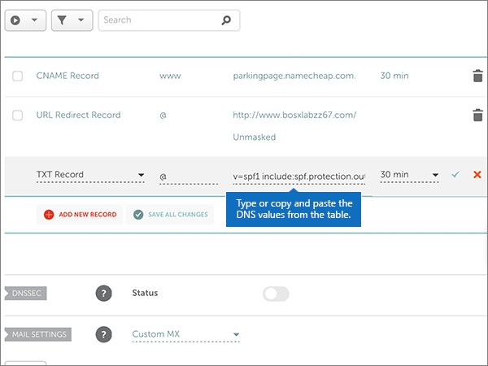
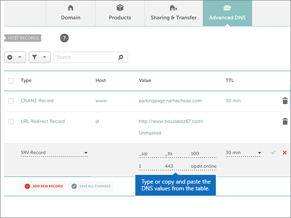

# Criar registros DNS no Namecheap para Microsoft

 Caso não encontre o conteúdo que está procurando, **[verifique as perguntas frequentes sobre domínios](../setup/domains-faq.yml)**. 
  
Se o Namecheap for seu provedor de hospedagem DNS, siga as etapas deste artigo para verificar seu domínio e configurar registros DNS para email, Skype for Business Online e assim por diante.
  
Depois que você adicionar esses registros no Namecheap, o domínio será configurado para funcionar com os serviços da Microsoft.
  
> [!NOTE]
> Normalmente, são necessários cerca de 15 minutos para que as alterações de DNS entrem em vigor. Mas, às vezes, pode ser necessário mais tempo para atualizar uma alteração feita no sistema DNS da Internet. Se você tiver problemas com o fluxo de emails ou de outro tipo após adicionar os registros DNS, consulte [Solucionar problemas após alterar o nome de domínio ou registros DNS](../get-help-with-domains/find-and-fix-issues.md). 
  
## Adicionar um registro TXT para verificação

Antes de usar o seu domínio com a Microsoft, precisamos verificar se você é o proprietário dele. A capacidade de entrar na conta do seu registrador de domínios e criar o registro de DNS prova à Microsoft que você é o proprietário do domínio.
  
> [!NOTE]
> Esse registro é usado exclusivamente para confirmar se você é o proprietário do domínio; ele não afeta mais nada. É possível excluí-lo mais tarde, se desejar. 
  
Siga as etapas abaixo.
  
1. Para começar, vá até a sua página de domínios no Namecheap usando [este link](https://www.namecheap.com/myaccount/login.aspx?ReturnUrl=%2f). Você será solicitado a entrar e continuar.
    
    
  
2. Na página de **aterrissagem** , em **conta**, escolha **lista de domínios** na lista suspensa. 
    
    
  
3. Na página **lista de domínios** , localize o nome do domínio que você deseja editar e, em seguida, selecione **gerenciar**.
    
    
  
4. Selecione **DNS avançado**.
    
    
  
5. Na seção **registros de host** , selecione **Adicionar novo registro**.
    
    
  
6. Na lista suspensa **tipo** , selecione **registro txt**.
    
    > [!NOTE]
    > O menu suspenso **tipo** aparece automaticamente quando você seleciona **Adicionar novo registro**. 
  
    
  
7. Nas caixas do novo registro, digite ou copie e cole os valores da seguinte tabela.
    
    (Escolha o valor **TTL** na lista suspensa.) 
    
    |**Tipo**|**Host**|**Valor**|**TTL**|
    |:-----|:-----|:-----|:-----|
    |TXT    |@    |MS = ms *XXXXXXXX*   **Observação**: esse é um exemplo. Use aqui seu valor específico de **Destino ou Pontos de Endereçamento**, retirado da tabela.  [Como localizo isto?](../get-help-with-domains/information-for-dns-records.md)          |30 min    |
       
    
  
8. Selecione o controle **salvar alterações** (marca de seleção). 
    
    
  
9. Aguarde alguns minutos antes de prosseguir para que o registro que você acabou de criar possa ser atualizado na Internet.
    
Agora que você adicionou o registro no site do seu registrador de domínios, retorne à Microsoft e solicite o registro.
  
Quando a Microsoft encontrar o registro TXT correto, seu domínio estará verificado.
  
1. No centro do administrador, acesse a página **Configurações de** \> <a href="https://go.microsoft.com/fwlink/p/?linkid=834818" target="_blank">domínios</a>.
    
2. Na página **Domínios**, clique no domínio que você está verificando. 
    
    
  
3. Na página **Configuração**, clique em **Iniciar configuração**.
    
    
  
4. Na página **Verificar domínio**, marque **Verificar**.
    
    
  
> [!NOTE]
> Normalmente, são necessários cerca de 15 minutos para que as alterações de DNS entrem em vigor. Mas, às vezes, pode ser necessário mais tempo para atualizar uma alteração feita no sistema DNS da Internet. Se você tiver problemas com o fluxo de emails ou de outro tipo após adicionar os registros DNS, consulte [Solucionar problemas após alterar o nome de domínio ou registros DNS](../get-help-with-domains/find-and-fix-issues.md). 

  
## Adicione um registro MX para que o email do domínio vá para a Microsoft.

Siga as etapas abaixo.
  
1. Para começar, vá até a sua página de domínios no Namecheap usando [este link](https://www.namecheap.com/myaccount/login.aspx?ReturnUrl=%2f). Você será solicitado a entrar e continuar.
    
    
  
2. Na página de **aterrissagem** , em **conta**, escolha **lista de domínios** na lista suspensa. 
    
    
  
3. Na página **lista de domínios** , localize o nome do domínio que você deseja editar e, em seguida, selecione **gerenciar**.
    
    
  
4. Selecione **DNS avançado**.
    
    
  
5. Na seção **configurações de email** , selecione **MX personalizado** na lista suspensa **encaminhamento de email** . 
    
    (Pode ser necessário rolar para baixo.)
    
    
  
6. Selecione **Adicionar novo registro**.
    
    
  
7. Nas caixas do novo registro, digite ou copie e cole os valores da tabela a seguir.
    
    (A caixa **prioridade** é a caixa sem nome à direita da caixa **valor** . Escolha o valor **TTL** na lista suspensa. 
    
    |**Tipo**|**Host**|**Valor**|**Prioridade**|**TTL**|
    |:-----|:-----|:-----|:-----|:-----|
    |Registro MX    |@    |\<*domain-key*\>. mail.protection.outlook.com.    **Este valor deve OBRIGATORIAMENTE terminar com um ponto (.)**   **Observação:** Acesse sua  *\<domain-key\>*  conta da Microsoft.  [Como faço para encontrar isso?](../get-help-with-domains/information-for-dns-records.md)          |,0    Para saber mais sobre prioridade, confira [O que é prioridade MX?](https://docs.microsoft.com/microsoft-365/admin/setup/domains-faq)   |30 min    |
       
    
  
8. Selecione o controle **salvar alterações** (marca de seleção). 
    
    
  
9. Se houver outros registros MX, use o processo de duas etapas a seguir para remover cada um deles:
    
    Primeiro, selecione o **ícone Excluir** (lixeira) para o registro que você deseja remover. 
    
    
  
    Em segundo lugar, selecione **Sim** para confirmar a exclusão. 
    
    
  
    Remova todos os registros MX, exceto aquele que você adicionou anteriormente neste procedimento.

  
## Adicionar os seis registros CNAME necessários para o Microsoft

Siga as etapas abaixo.
  
1. Para começar, vá até a sua página de domínios no Namecheap usando [este link](https://www.namecheap.com/myaccount/login.aspx?ReturnUrl=%2f). Você será solicitado a entrar e continuar.
    
    
  
2. Na página de **aterrissagem** , em **conta**, escolha **lista de domínios** na lista suspensa. 
    
    
  
3. Na página **lista de domínios** , localize o nome do domínio que você deseja editar e, em seguida, selecione **gerenciar**.
    
    
  
4. Selecione **DNS avançado**.
    
    
  
5. Na seção **registros de host** , selecione **Adicionar novo registro**.
    
    
  
6. Na lista suspensa **tipo** , selecione **registro CNAME**.
    
    > [!NOTE]
    > O menu suspenso **tipo** aparece automaticamente quando você seleciona **Adicionar novo registro**. 
  
    
  
7. Nas caixas vazias do novo registro, selecione **CNAME** como o **Tipo de Registro** e digite ou copie e cole os valores da tabela a seguir.
    
    |**Tipo**|**Host**|**Valor**|**TTL**|
    |:-----|:-----|:-----|:-----|
    |CNAME    |autodiscover    |autodiscover.outlook.com.    **Este valor deve OBRIGATORIAMENTE terminar com um ponto (.)**   |3600    |
    |CNAME    |sip    |sipdir.online.lync.com.    **Este valor deve OBRIGATORIAMENTE terminar com um ponto (.)**   |3600    |
    |CNAME    |lyncdiscover    |webdir.online.lync.com.    **Este valor deve OBRIGATORIAMENTE terminar com um ponto (.)**   |3600    |
    |CNAME    |enterpriseregistration    |enterpriseregistration.windows.net.    **Este valor deve OBRIGATORIAMENTE terminar com um ponto (.)**   |3600    |
    |CNAME    |enterpriseenrollment    |enterpriseenrollment-s.manage.microsoft.com.    **Este valor deve OBRIGATORIAMENTE terminar com um ponto (.)**   |3600    |
       
    
  
8. Selecione o controle **salvar alterações** (marca de seleção). 
    
    
  
9. Usando as quatro etapas anteriores e os valores das outras cinco linhas na tabela, adicione cada um dos outros cinco registros CNAME.

  
## Adicionar o registro TXT à SPF para ajudar a evitar spam de e-mail

> [!IMPORTANT]
> Não é possível ter mais de um registro TXT para SPF para um domínio. Se o seu domínio possuir mais de um registro SPF, ocorrerão erros de email, bem como problemas na entrega e na classificação de spam. Se você já possui um registro SPF para seu domínio, não crie um novo para a Microsoft. Em vez disso, adicione os valores necessários da Microsoft ao registro atual para que você tenha um  *único*  registro SPF que inclua os dois conjuntos de valores. 

Siga as etapas abaixo.
  
1. Para começar, vá até a sua página de domínios no Namecheap usando [este link](https://www.namecheap.com/myaccount/login.aspx?ReturnUrl=%2f). Você será solicitado a entrar e continuar.
    
2. Na página de **aterrissagem** , em **conta**, escolha **lista de domínios** na lista suspensa. 
    
    
  
3. Na página **lista de domínios** , localize o nome do domínio que você deseja editar e, em seguida, selecione **gerenciar**.
    
    
  
4. Selecione **DNS avançado**.
    
    
  
5. Na seção **registros de host** , selecione **Adicionar novo registro**.
    
    
  
6. Na lista suspensa **tipo** , selecione **registro txt**.
    
    > [!NOTE]
    > O menu suspenso **tipo** aparece automaticamente quando você seleciona **Adicionar novo registro**. 
  
    
  
7. Nas caixas do novo registro, digite ou copie e cole os seguintes valores da tabela a seguir.
    
    (Escolha o valor **TTL** na lista suspensa.) 
    
    |**Tipo**|**Host**|**Valor**|**TTL**|
    |:-----|:-----|:-----|:-----|
    |TXT    |@    |v=spf1 include:spf.protection.outlook.com -all    **Observação:** é recomendável copiar e colar essa entrada para que o espaçamento permaneça correto.           |30 min    |
       
    
  
8. Selecione o controle **salvar alterações** (marca de seleção). 
    
    
  
## Adicionar os dois registros SRV necessários para a Microsoft

1. Para começar, vá até a sua página de domínios no Namecheap usando [este link](https://www.namecheap.com/myaccount/login.aspx?ReturnUrl=%2f). You'll be prompted to sign in.
    
    
  
2. Na página de **aterrissagem** , em **conta**, escolha **lista de domínios** na lista suspensa. 
    
    
  
3. Na página **lista de domínios** , localize o nome do domínio que você deseja editar e, em seguida, selecione **gerenciar**.
    
    
  
4. Selecione **DNS avançado**.
    
    
  
5. Na seção **registros de host** , selecione **Adicionar novo registro**.
    
    
  
6. Na lista suspensa **tipo** , selecione **registro SRV**.
    
    > [!NOTE]
    > O menu suspenso **tipo** aparece automaticamente quando você seleciona **Adicionar novo registro**. 
  
    
  
7. Nas caixas vazias dos novos registros, digite ou copie e cole os valores da primeira linha da tabela a seguir.
    
    |**Serviço**|**Protocolo**|**Prioridade**|**Espessura**|**Porta**|**Destino**|**TTL**|
    |:-----|:-----|:-----|:-----|:-----|:-----|:-----|
    |_sip    |_tls    |100    |1     |443    |sipdir.online.lync.com.    **Este valor deve OBRIGATORIAMENTE terminar com um ponto (.)**   |30 min    |
    |_sipfederationtls    |_tcp    |100    |1     |5061    |sipfed.online.lync.com.    **Este valor deve OBRIGATORIAMENTE terminar com um ponto (.)**   |30 min    |
       
    
  
8. Selecione o controle **salvar alterações** (marca de seleção). 
    
    
  
9. Usando as quatro etapas anteriores e os valores da segunda linha da tabela, adicione o outro registro SRV.
    
> [!NOTE]
> Normalmente, são necessários cerca de 15 minutos para que as alterações de DNS entrem em vigor. Mas, às vezes, pode ser necessário mais tempo para atualizar uma alteração feita no sistema DNS da Internet. Se você tiver problemas com o fluxo de emails ou de outro tipo após adicionar os registros DNS, consulte [Solucionar problemas após alterar o nome de domínio ou registros DNS](../get-help-with-domains/find-and-fix-issues.md). 
  

  
