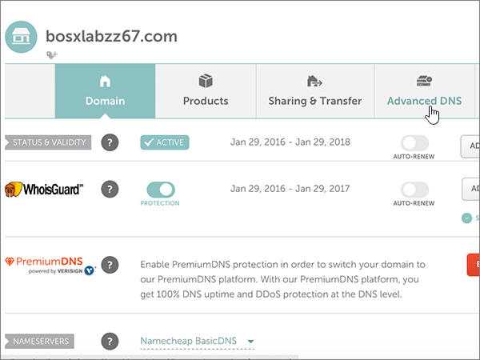
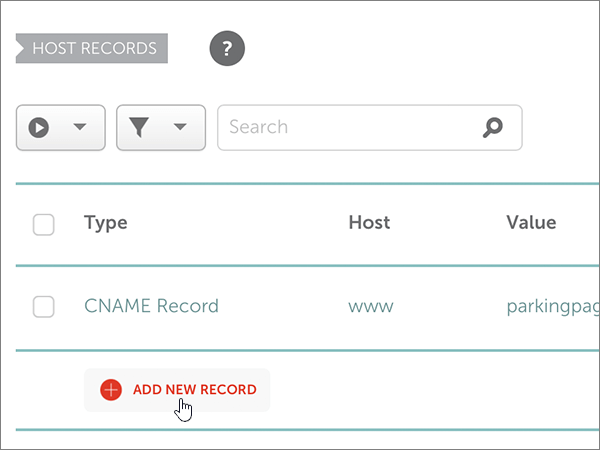

# Criar registros DNS no Namecheap para MicrosoftCreate DNS records at Namecheap for Microsoft

 Caso não encontre o conteúdo que está procurando, **[verifique as perguntas frequentes sobre domínios](../setup/domains-faq.md)**.**[Check the Domains FAQ](../setup/domains-faq.md)** if you don't find what you're looking for. 
  
Se o Namecheap for seu provedor de hospedagem DNS, siga as etapas deste artigo para verificar seu domínio e configurar registros DNS para email, Skype for Business Online e assim por diante.If Namecheap is your DNS hosting provider, follow the steps in this article to verify your domain and set up DNS records for email, Skype for Business Online, and so on.
  
Depois que você adicionar esses registros no Namecheap, o domínio será configurado para funcionar com os serviços da Microsoft.After you add these records at Namecheap, your domain will be set up to work with Microsoft services.
  
> [!NOTE]
> Normalmente, são necessários cerca de 15 minutos para que as alterações de DNS entrem em vigor. Mas, às vezes, pode ser necessário mais tempo para atualizar uma alteração feita no sistema DNS da Internet. Se você tiver problemas com o fluxo de emails ou de outro tipo após adicionar os registros DNS, consulte [Solucionar problemas após alterar o nome de domínio ou registros DNS](../get-help-with-domains/find-and-fix-issues.md).Typically it takes about 15 minutes for DNS changes to take effect. However, it can occasionally take longer for a change you've made to update across the Internet's DNS system. If you're having trouble with mail flow or other issues after adding DNS records, see [Troubleshoot issues after changing your domain name or DNS records](../get-help-with-domains/find-and-fix-issues.md). 
  
## Adicionar um registro TXT para verificaçãoAdd a TXT record for verification

Antes de usar o seu domínio com a Microsoft, precisamos verificar se você é o proprietário dele. A capacidade de entrar na conta do seu registrador de domínios e criar o registro de DNS prova à Microsoft que você é o proprietário do domínio.Before you use your domain with Microsoft, we have to make sure that you own it. Your ability to log in to your account at your domain registrar and create the DNS record proves to Microsoft that you own the domain.
  
> [!NOTE]
> Esse registro é usado exclusivamente para confirmar se você é o proprietário do domínio; ele não afeta mais nada. É possível excluí-lo mais tarde, se desejar.This record is used only to verify that you own your domain; it doesn't affect anything else. You can delete it later, if you like. 
  
Siga as etapas abaixo.Follow the steps below.
  
1. Para começar, vá até a sua página de domínios no Namecheap usando [este link](https://www.namecheap.com/myaccount/login.aspx?ReturnUrl=%2f).To get started, go to your domains page at Namecheap by using [this link](https://www.namecheap.com/myaccount/login.aspx?ReturnUrl=%2f). Você será solicitado a entrar e continuar.You'll be prompted to Sign in and Continue.
    
    
  
2. Na página de **aterrissagem** , em **conta**, escolha **lista de domínios** na lista suspensa.On the **Landing** page, under **Account**, choose **Domain List** from the drop-down list. 
    
    
  
3. Na página **lista de domínios** , localize o nome do domínio que você deseja editar e, em seguida, selecione **gerenciar**.On the **Domain List** page, find the name of the domain that you want to edit, and then select **Manage**.
    
    
  
4. Selecione **DNS avançado**.Select **Advanced DNS**.
    
    
  
5. Na seção **registros de host** , selecione **Adicionar novo registro**.In the **HOST RECORDS** section, select **ADD NEW RECORD**.
    
    
  
6. Na lista suspensa **tipo** , selecione **registro txt**.In the **Type** drop-down, select **TXT Record**.
    
    > [!NOTE]
    > O menu suspenso **tipo** aparece automaticamente quando você seleciona **Adicionar novo registro**.The **Type** drop-down automatically appears when you select **ADD NEW RECORD**. 
  
    
  
7. Nas caixas do novo registro, digite ou copie e cole os valores da seguinte tabela.In the boxes for the new record, type or copy and paste the values from the following table.
    
    (Escolha o valor **TTL** na lista suspensa.)(Choose the **TTL** value from the drop-down list.) 
    
    |**Tipo****Type**|**Host****Host**|**Valor****Value**|**TTL****TTL**|
    |:-----|:-----|:-----|:-----|
    |TXTTXT    |@    |MS = ms *XXXXXXXX*MS=ms *XXXXXXXX*   **Observação**: esse é um exemplo.**Note:** This is an example. Use aqui seu valor específico de **Destino ou Pontos de Endereçamento**, retirado da tabela.Use your specific **Destination or Points to Address** value here, from the table.  [Como localizo isto?How do I find this?](../get-help-with-domains/information-for-dns-records.md)          |30 min30 min    |
       
    
  
8. Selecione o controle **salvar alterações** (marca de seleção).Select the **Save Changes** (check mark) control. 
    
    
  
9. Aguarde alguns minutos antes de prosseguir para que o registro que você acabou de criar possa ser atualizado na Internet.Wait a few minutes before you continue, so that the record you just created can update across the Internet.
    
Agora que você adicionou o registro no site do seu registrador de domínios, retorne à Microsoft e solicite o registro.Now that you've added the record at your domain registrar's site, you'll go back to Microsoft and request the record.
  
Quando a Microsoft encontrar o registro TXT correto, seu domínio estará verificado.When Microsoft finds the correct TXT record, your domain is verified.
  
1. No centro do administrador, acesse a página **Configurações de** \> <a href="https://go.microsoft.com/fwlink/p/?linkid=834818" target="_blank">domínios</a>.In the admin center, go to the **Settings** \> <a href="https://go.microsoft.com/fwlink/p/?linkid=834818" target="_blank">Domains</a> page.
    
2. Na página **Domínios**, clique no domínio que você está verificando.On the **Domains** page, select the domain that you are verifying. 
    
    
  
3. Na página **Configuração**, clique em **Iniciar configuração**.On the **Setup** page, select **Start setup**.
    
    
  
4. Na página **Verificar domínio**, marque **Verificar**.On the **Verify domain** page, select **Verify**.
    
    
  
> [!NOTE]
> Normalmente, são necessários cerca de 15 minutos para que as alterações de DNS entrem em vigor. Mas, às vezes, pode ser necessário mais tempo para atualizar uma alteração feita no sistema DNS da Internet. Se você tiver problemas com o fluxo de emails ou de outro tipo após adicionar os registros DNS, consulte [Solucionar problemas após alterar o nome de domínio ou registros DNS](../get-help-with-domains/find-and-fix-issues.md).Typically it takes about 15 minutes for DNS changes to take effect. However, it can occasionally take longer for a change you've made to update across the Internet's DNS system. If you're having trouble with mail flow or other issues after adding DNS records, see [Troubleshoot issues after changing your domain name or DNS records](../get-help-with-domains/find-and-fix-issues.md). 

  
## Adicione um registro MX para que o email do domínio vá para a Microsoft.Add an MX record so email for your domain will come to Microsoft

Siga as etapas abaixo.Follow the steps below.
  
1. Para começar, vá até a sua página de domínios no Namecheap usando [este link](https://www.namecheap.com/myaccount/login.aspx?ReturnUrl=%2f).To get started, go to your domains page at Namecheap by using [this link](https://www.namecheap.com/myaccount/login.aspx?ReturnUrl=%2f). Você será solicitado a entrar e continuar.You'll be prompted to Sign in and Continue.
    
    
  
2. Na página de **aterrissagem** , em **conta**, escolha **lista de domínios** na lista suspensa.On the **Landing** page, under **Account**, choose **Domain List** from the drop-down list. 
    
    
  
3. Na página **lista de domínios** , localize o nome do domínio que você deseja editar e, em seguida, selecione **gerenciar**.On the **Domain List** page, find the name of the domain that you want to edit, and then select **Manage**.
    
    
  
4. Selecione **DNS avançado**.Select **Advanced DNS**.
    
    
  
5. Na seção **configurações de email** , selecione **MX personalizado** na lista suspensa **encaminhamento de email** .In the **MAIL SETTINGS** section, select **Custom MX** from the **Email Forwarding** drop-down list. 
    
    (Pode ser necessário rolar para baixo.)(You may have to scroll down.)
    
    
  
6. Selecione **Adicionar novo registro**.Select **Add New Record**.
    
    
  
7. Nas caixas do novo registro, digite ou copie e cole os valores da tabela a seguir.In the boxes for the new record, type or copy and paste the values, from the following table.
    
    (A caixa **prioridade** é a caixa sem nome à direita da caixa **valor** .(The **Priority** box is the unnamed box to the right of the **Value** box. Escolha o valor **TTL** na lista suspensa.Choose the **TTL** value from the drop-down list.) 
    
    |**Tipo****Type**|**Host****Host**|**Valor****Value**|**Prioridade****Priority**|**TTL****TTL**|
    |:-----|:-----|:-----|:-----|:-----|
    |Registro MXMX Record    |@    |\<*domain-key*\>. mail.protection.outlook.com.\<*domain-key*\>.mail.protection.outlook.com.    **Este valor deve OBRIGATORIAMENTE terminar com um ponto (.)****This value MUST end with a period (.)**   **Observação:** Acesse sua  *\<domain-key\>*  conta da Microsoft.**Note:** Get your  *\<domain-key\>*  from your Microsoft account.  [Como faço para encontrar isso?How do I find this?](../get-help-with-domains/information-for-dns-records.md)          |,00    Para saber mais sobre prioridade, confira [O que é prioridade MX?](https://docs.microsoft.com/microsoft-365/admin/setup/domains-faq)For more information about priority, see [What is MX priority?](https://docs.microsoft.com/microsoft-365/admin/setup/domains-faq)   |30 min30 min    |
       
    
  
8. Selecione o controle **salvar alterações** (marca de seleção).Select the **Save Changes** (check mark) control. 
    
    
  
9. Se houver outros registros MX, use o processo de duas etapas a seguir para remover cada um deles:If there are any other MX records, use the following two-step process to remove each of them:
    
    Primeiro, selecione o **ícone Excluir** (lixeira) para o registro que você deseja remover.First, select the **Delete icon** (trash can) for the record that you want to remove. 
    
    
  
    Em segundo lugar, selecione **Sim** para confirmar a exclusão.Second, select **Yes** to confirm the deletion. 
    
    
  
    Remova todos os registros MX, exceto aquele que você adicionou anteriormente neste procedimento.Remove all MX records except for the one that you added earlier in this procedure.

  
## Adicionar os seis registros CNAME necessários para o MicrosoftAdd the six CNAME records that are required for Microsoft

Siga as etapas abaixo.Follow the steps below.
  
1. Para começar, vá até a sua página de domínios no Namecheap usando [este link](https://www.namecheap.com/myaccount/login.aspx?ReturnUrl=%2f).To get started, go to your domains page at Namecheap by using [this link](https://www.namecheap.com/myaccount/login.aspx?ReturnUrl=%2f). Você será solicitado a entrar e continuar.You'll be prompted to Sign in and Continue.
    
    
  
2. Na página de **aterrissagem** , em **conta**, escolha **lista de domínios** na lista suspensa.On the **Landing** page, under **Account**, choose **Domain List** from the drop-down list. 
    
    
  
3. Na página **lista de domínios** , localize o nome do domínio que você deseja editar e, em seguida, selecione **gerenciar**.On the **Domain List** page, find the name of the domain that you want to edit, and then select **Manage**.
    
    
  
4. Selecione **DNS avançado**.Select **Advanced DNS**.
    
    
  
5. Na seção **registros de host** , selecione **Adicionar novo registro**.In the **HOST RECORDS** section, select **ADD NEW RECORD**.
    
    
  
6. Na lista suspensa **tipo** , selecione **registro CNAME**.In the **Type** drop-down, select **CNAME Record**.
    
    > [!NOTE]
    > O menu suspenso **tipo** aparece automaticamente quando você seleciona **Adicionar novo registro**.The **Type** drop-down automatically appears when you select **ADD NEW RECORD**. 
  
    
  
7. Nas caixas vazias do novo registro, selecione **CNAME** como o **Tipo de Registro** e digite ou copie e cole os valores da tabela a seguir.In the empty boxes for the new record, select **CNAME** for the **Record Type**, and then type or copy and paste the values from the first row in the following table.
    
    |**Tipo****Type**|**Host****Host**|**Valor****Value**|**TTL****TTL**|
    |:-----|:-----|:-----|:-----|
    |CNAMECNAME    |autodiscoverautodiscover    |autodiscover.outlook.com.autodiscover.outlook.com.    **Este valor deve OBRIGATORIAMENTE terminar com um ponto (.)****This value MUST end with a period (.)**   |36003600    |
    |CNAMECNAME    |sipsip    |sipdir.online.lync.com.sipdir.online.lync.com.    **Este valor deve OBRIGATORIAMENTE terminar com um ponto (.)****This value MUST end with a period (.)**   |36003600    |
    |CNAMECNAME    |lyncdiscoverlyncdiscover    |webdir.online.lync.com.webdir.online.lync.com.    **Este valor deve OBRIGATORIAMENTE terminar com um ponto (.)****This value MUST end with a period (.)**   |36003600    |
    |CNAMECNAME    |enterpriseregistrationenterpriseregistration    |enterpriseregistration.windows.net.enterpriseregistration.windows.net.    **Este valor deve OBRIGATORIAMENTE terminar com um ponto (.)****This value MUST end with a period (.)**   |36003600    |
    |CNAMECNAME    |enterpriseenrollmententerpriseenrollment    |enterpriseenrollment-s.manage.microsoft.com.enterpriseenrollment-s.manage.microsoft.com.    **Este valor deve OBRIGATORIAMENTE terminar com um ponto (.)****This value MUST end with a period (.)**   |36003600    |
       
    
  
8. Selecione o controle **salvar alterações** (marca de seleção).Select the **Save Changes** (check mark) control. 
    
    
  
9. Usando as quatro etapas anteriores e os valores das outras cinco linhas na tabela, adicione cada um dos outros cinco registros CNAME.Using the preceding four steps and the values from the other five rows in the table, add each of the other five CNAME records.

  
## Adicionar o registro TXT à SPF para ajudar a evitar spam de e-mailAdd a TXT record for SPF to help prevent email spam

> [!IMPORTANT]
> Não é possível ter mais de um registro TXT para SPF para um domínio.You cannot have more than one TXT record for SPF for a domain. Se o seu domínio possuir mais de um registro SPF, ocorrerão erros de email, bem como problemas na entrega e na classificação de spam.If your domain has more than one SPF record, you'll get email errors, as well as delivery and spam classification issues. Se você já possui um registro SPF para seu domínio, não crie um novo para a Microsoft.If you already have an SPF record for your domain, don't create a new one for Microsoft. Em vez disso, adicione os valores necessários da Microsoft ao registro atual para que você tenha um  *único*  registro SPF que inclua os dois conjuntos de valores.Instead, add the required Microsoft values to the current record so that you have a  *single*  SPF record that includes both sets of values. 

Siga as etapas abaixo.Follow the steps below.
  
1. Para começar, vá até a sua página de domínios no Namecheap usando [este link](https://www.namecheap.com/myaccount/login.aspx?ReturnUrl=%2f).To get started, go to your domains page at Namecheap by using [this link](https://www.namecheap.com/myaccount/login.aspx?ReturnUrl=%2f). Você será solicitado a entrar e continuar.You'll be prompted to Sign in and Continue.
    
2. Na página de **aterrissagem** , em **conta**, escolha **lista de domínios** na lista suspensa.On the **Landing** page, under **Account**, choose **Domain List** from the drop-down list. 
    
    
  
3. Na página **lista de domínios** , localize o nome do domínio que você deseja editar e, em seguida, selecione **gerenciar**.On the **Domain List** page, find the name of the domain that you want to edit and then select **Manage**.
    
    
  
4. Selecione **DNS avançado**.Select **Advanced DNS**.
    
    
  
5. Na seção **registros de host** , selecione **Adicionar novo registro**.In the **HOST RECORDS** section, select **ADD NEW RECORD**.
    
    
  
6. Na lista suspensa **tipo** , selecione **registro txt**.In the **Type** drop-down, select **TXT Record**.
    
    > [!NOTE]
    > O menu suspenso **tipo** aparece automaticamente quando você seleciona **Adicionar novo registro**.The **Type** drop-down automatically appears when you select **ADD NEW RECORD**. 
  
    
  
7. Nas caixas do novo registro, digite ou copie e cole os seguintes valores da tabela a seguir.In the boxes for the new record, type or copy and paste the following values from the following table.
    
    (Escolha o valor **TTL** na lista suspensa.)(Choose the **TTL** value from the drop-down list.) 
    
    |**Tipo****Type**|**Host****Host**|**Valor****Value**|**TTL****TTL**|
    |:-----|:-----|:-----|:-----|
    |TXTTXT    |@    |v=spf1 include:spf.protection.outlook.com -allv=spf1 include:spf.protection.outlook.com -all    **Observação:** é recomendável copiar e colar essa entrada para que o espaçamento permaneça correto.**Note:** We recommend copying and pasting this entry, so that all of the spacing stays correct.           |30 min30 min    |
       
    
  
8. Selecione o controle **salvar alterações** (marca de seleção).Select the **Save Changes** (check mark) control. 
    
    
  
## Adicionar os dois registros SRV necessários para a MicrosoftAdd the two SRV records that are required for Microsoft

1. Para começar, vá até a sua página de domínios no Namecheap usando [este link](https://www.namecheap.com/myaccount/login.aspx?ReturnUrl=%2f).To get started, go to your domains page at Namecheap by using [this link](https://www.namecheap.com/myaccount/login.aspx?ReturnUrl=%2f). You'll be prompted to sign in.You'll be prompted to sign in.
    
    
  
2. Na página de **aterrissagem** , em **conta**, escolha **lista de domínios** na lista suspensa.On the **Landing** page, under **Account**, choose **Domain List** from the drop-down list. 
    
    
  
3. Na página **lista de domínios** , localize o nome do domínio que você deseja editar e, em seguida, selecione **gerenciar**.On the **Domain List** page, find the name of the domain that you want to edit and then select **Manage**.
    
    
  
4. Selecione **DNS avançado**.Select **Advanced DNS**.
    
    
  
5. Na seção **registros de host** , selecione **Adicionar novo registro**.In the **HOST RECORDS** section, select **ADD NEW RECORD**.
    
    
  
6. Na lista suspensa **tipo** , selecione **registro SRV**.In the **Type** drop-down, select **SRV Record**.
    
    > [!NOTE]
    > O menu suspenso **tipo** aparece automaticamente quando você seleciona **Adicionar novo registro**.The **Type** drop-down automatically appears when you select **ADD NEW RECORD**. 
  
    
  
7. Nas caixas vazias dos novos registros, digite ou copie e cole os valores da primeira linha da tabela a seguir.In the empty boxes for the new records, type or copy and paste the values from the first row in the following table.
    
    |**Serviço****Service**|**Protocolo****Protocol**|**Prioridade****Priority**|**Espessura****Weight**|**Porta****Port**|**Destino****Target**|**TTL****TTL**|
    |:-----|:-----|:-----|:-----|:-----|:-----|:-----|
    |_sip_sip    |_tls_tls    |100100    |11    |443443    |sipdir.online.lync.com.sipdir.online.lync.com.    **Este valor deve OBRIGATORIAMENTE terminar com um ponto (.)****This value MUST end with a period (.)**   |30 min30 min    |
    |_sipfederationtls_sipfederationtls    |_tcp_tcp    |100100    |11    |50615061    |sipfed.online.lync.com.sipfed.online.lync.com.    **Este valor deve OBRIGATORIAMENTE terminar com um ponto (.)****This value MUST end with a period (.)**   |30 min30 min    |
       
    
  
8. Selecione o controle **salvar alterações** (marca de seleção).Select the **Save Changes** (check mark) control. 
    
    
  
9. Usando as quatro etapas anteriores e os valores da segunda linha da tabela, adicione o outro registro SRV.Using the preceding four steps and the values from the second row in the table, add the other SRV record.
    
> [!NOTE]
> Normalmente, são necessários cerca de 15 minutos para que as alterações de DNS entrem em vigor. Mas, às vezes, pode ser necessário mais tempo para atualizar uma alteração feita no sistema DNS da Internet. Se você tiver problemas com o fluxo de emails ou de outro tipo após adicionar os registros DNS, consulte [Solucionar problemas após alterar o nome de domínio ou registros DNS](../get-help-with-domains/find-and-fix-issues.md).Typically it takes about 15 minutes for DNS changes to take effect. However, it can occasionally take longer for a change you've made to update across the Internet's DNS system. If you're having trouble with mail flow or other issues after adding DNS records, see [Troubleshoot issues after changing your domain name or DNS records](../get-help-with-domains/find-and-fix-issues.md). 
  

  
