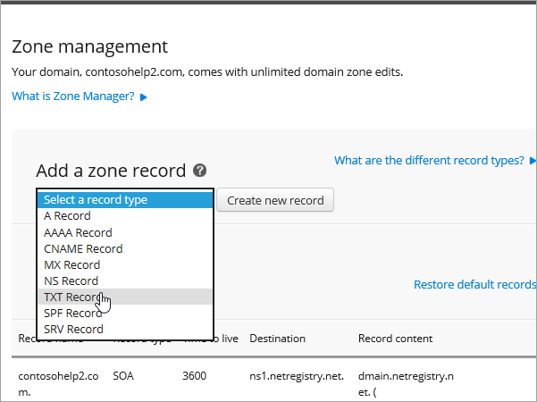

# Criar registros DNS no Netregistry para o Office 365Create DNS records at Netregistry for Office 365

Caso não encontre o conteúdo que está procurando, [verifique as perguntas frequentes sobre domínios](../setup/domains-faq.md).[Check the Domains FAQ](../setup/domains-faq.md) if you don't find what you're looking for. 
  
Se o Netregistry for o seu provedor de hospedagem DNS, siga as etapas deste artigo para verificar seu domínio e configurar registros DNS para email, Skype for Business Online e assim por diante.If Netregistry is your DNS hosting provider, follow the steps in this article to verify your domain and set up DNS records for email, Skype for Business Online, and so on.
  
Estes são os registros principais a adicionar.These are the main records to add.
  
- [Adicionar um registro TXT para verificaçãoAdd a TXT record for verification](#add-a-txt-record-for-verification)
    
- [Adicionar um registro MX para que o email do domínio vá para o Office 365Add an MX record so email for your domain will come to Office 365](#add-an-mx-record-so-email-for-your-domain-will-come-to-office-365)

- [Adicionar os registros CNAME necessários para o Office 365Add the CNAME records that are required for Office 365](#add-the-cname-records-that-are-required-for-office-365)
    
- [Adicionar registro TXT à SPF para ajudar a evitar spam de emailAdd a TXT record for SPF to help prevent email spam](#add-a-txt-record-for-spf-to-help-prevent-email-spam)
    
- [Adicionar os dois registros SRV necessários para o Office 365Add the two SRV records that are required for Office 365](#add-the-two-srv-records-that-are-required-for-office-365)
    
Depois que você adicionar esses registros ao Netregistry, o domínio será configurado para funcionar com os serviços do Office 365.After you add these records at Netregistry, your domain will be set up to work with Office 365 services.
  
Para saber mais sobre hospedagem na Web e DNS para sites com o Office 365, confira [Usar um site público com o Office 365](https://support.office.com/article/a8178510-501d-4bd8-9921-b04f2e9517a5.aspx).To learn about webhosting and DNS for websites with Office 365, see [Use a public website with Office 365](https://support.office.com/article/a8178510-501d-4bd8-9921-b04f2e9517a5.aspx).
  
> [!NOTE]
> Normalmente, são necessários cerca de 15 minutos para que as alterações de DNS entrem em vigor. Mas, às vezes, pode ser necessário mais tempo para atualizar uma alteração feita no sistema DNS da Internet. Se você tiver problemas com o fluxo de emails ou de outro tipo após adicionar os registros DNS, consulte [Solucionar problemas após alterar o nome de domínio ou registros DNS](../get-help-with-domains/find-and-fix-issues.md).Typically it takes about 15 minutes for DNS changes to take effect. However, it can occasionally take longer for a change you've made to update across the Internet's DNS system. If you're having trouble with mail flow or other issues after adding DNS records, see [Troubleshoot issues after changing your domain name or DNS records](../get-help-with-domains/find-and-fix-issues.md). 
  
## Adicionar um registro TXT para verificaçãoAdd a TXT record for verification

Antes de usar o seu domínio com o Office 365, precisamos verificar se você é o proprietário dele. A capacidade de entrar na conta do seu registrador de domínios e criar o registro DNS prova ao Office 365 que você é o proprietário do domínio.Before you use your domain with Office 365, we have to make sure that you own it. Your ability to log in to your account at your domain registrar and create the DNS record proves to Office 365 that you own the domain.
  
> [!NOTE]
> Esse registro é usado exclusivamente para confirmar se você é o proprietário do domínio; ele não afeta mais nada. É possível excluí-lo mais tarde, se desejar.This record is used only to verify that you own your domain; it doesn't affect anything else. You can delete it later, if you like. 
  
1. Para começar, vá até a sua página de domínios no Netregistry usando [este link](https://theconsole.netregistry.com.au/).To get started, go to your domains page in Netregistry by using [this link](https://theconsole.netregistry.com.au/). You'll be prompted to log in.You'll be prompted to log in.
    
    
  
2. Ao lado do domínio que você deseja gerenciar, selecione **gerenciar**.Next to the domain you want to manage, select **Manage**.
    
    
  
3. Selecione **Gerenciador de zona**.Select **Zone Manager**.
    
    
  
4. Em **Adicionar um registro de zona**, escolha **registro txt** na lista e, em seguida, selecione **criar novo registro**.Under **Add a zone record**, choose **TXT Record** from the list, and then select **Create new record**.
    
    
  
    > [!NOTE]
    > Você deve usar aspas antes e depois da entrada na caixa TXT.You must use quotation marks before and after the entry in the TXT box. 
  
    No formulário **novo registro txt** , digite ou copie e cole os valores da tabela a seguir.In the **New TXT Record** form, type or copy and paste the values from the following table. 
    
    |**Nome****Name**|**TTL (SEG)****TTL (SEC)**|**TXT (aponta para endereço ou valor)****TXT (Points to address or value)**|
    |:-----|:-----|:-----|
    |(deixar em branco)(leave blank)    |3600 (segundos)3600 (seconds)    |"MS = msXXXXXXXX""MS=msXXXXXXXX"    **Observação:** Este é um exemplo.**Note:** This is an example. Use aqui o valor específico de **Destino ou Pontos de Endereçamento**, retirado da tabela em Office 365.Use your specific **Destination or Points to Address** value here, from the table in Office 365. [Como faço para encontrar isso?How do I find this?](../get-help-with-domains/information-for-dns-records.md)  |
       
    
  
6. Selecione **adicionar registro**.Select **Add record**.
    
Now that you've added the record at your domain registrar's site, you'll go back to Office 365 and request Office 365 to look for the record.Now that you've added the record at your domain registrar's site, you'll go back to Office 365 and request Office 365 to look for the record.
  
When Office 365 finds the correct TXT record, your domain is verified.When Office 365 finds the correct TXT record, your domain is verified.
  
1. No centro de administração, vá para a página de <a href="https://go.microsoft.com/fwlink/p/?linkid=834818" target="_blank">domínios</a> de **configurações** \> .In the admin center, go to the **Settings** \> <a href="https://go.microsoft.com/fwlink/p/?linkid=834818" target="_blank">Domains</a> page.
    
2. Na página **domínios** , selecione o domínio que você está verificando.On the **Domains** page, select the domain that you are verifying. 
    
    
  
3. Na página **configuração** , selecione **Iniciar configuração**.On the **Setup** page, select **Start setup**.
    
    
  
4. Na página **verificar domínio** , selecione **verificar**.On the **Verify domain** page, select **Verify**.
    
    
  
> [!NOTE]
>  Normalmente, são necessários cerca de 15 minutos para que as alterações de DNS entrem em vigor. Mas, às vezes, pode ser necessário mais tempo para atualizar uma alteração feita no sistema DNS da Internet. Se você tiver problemas com o fluxo de emails ou de outro tipo após adicionar os registros DNS, consulte [Solucionar problemas após alterar o nome de domínio ou registros DNS](../get-help-with-domains/find-and-fix-issues.md).Typically it takes about 15 minutes for DNS changes to take effect. However, it can occasionally take longer for a change you've made to update across the Internet's DNS system. If you're having trouble with mail flow or other issues after adding DNS records, see [Troubleshoot issues after changing your domain name or DNS records](../get-help-with-domains/find-and-fix-issues.md). 
  
## Adicionar um registro MX para que o email do domínio vá para o Office 365Add an MX record so email for your domain will come to Office 365

1. Para começar, vá até a sua página de domínios no Netregistry usando [este link](https://theconsole.netregistry.com.au/).To get started, go to your domains page in Netregistry by using [this link](https://theconsole.netregistry.com.au/). You'll be prompted to log in.You'll be prompted to log in.
    
    
  
2. Ao lado do domínio que você deseja gerenciar, selecione **gerenciar**.Next to the domain you want to manage, select **Manage**.
    
    
  
3. Selecione **Gerenciador de zona**.Select **Zone Manager**.
    
    
  
4. Em **registros de zona atuais**, remova os registros MX padrão selecionando **remover** ao lado de cada registro MX na lista.Under **Current zone records**, remove the default MX records by selecting **Remove** next to each MX record in the list. 
    
    
  
5. Em **Adicionar um registro de zona**, escolha **registro MX** na lista e, em seguida, selecione **criar novo registro**.Under **Add a zone record**, choose **MX Record** from the list, and then select **Create new record**.
    
    
  
6. No formulário **novo registro MX** , digite ou copie e cole os valores da tabela a seguir.In the **New MX Record** form, type or copy and paste the values from the following table. 
    
    |**Nome****Name**|**TTL (SEG)****TTL (SEC)**|**Exchange (aponta para o endereço ou valor)****Exchange (Points to address or value)**|**O host está totalmente qualificado?****Is host fully qualified?**|**Preferência (prioridade)****Preference (Priority)**|
    |:-----|:-----|:-----|:-----|:-----|
    |(deixar em branco)(leave blank)    |3600 (segundos)3600 (seconds)    | *\<chave-do-domínio\>*  .mail.protection.outlook.com*\<domain-key\>*  .mail.protection.outlook.com    **Observação:** Obtenha sua \* \<chave\> de domínio\* de sua conta do Office 365.**Note:** Get your  *\<domain-key\>*  from your Office 365 account.  [Como faço para encontrar isso?How do I find this?](../get-help-with-domains/information-for-dns-records.md)      |(marque a caixa de seleção)(select the checkbox)    |10 10    For more information about priority, see What is MX priority?For more information about priority, see What is MX priority?    |
       
    
  
7. Selecione **adicionar registro**.Select **Add Record**.
    
    
  
## Adicionar os registros CNAME necessários para o Office 365Add the CNAME records that are required for Office 365

1. Para começar, vá até a sua página de domínios no Netregistry usando [este link](https://theconsole.netregistry.com.au/).To get started, go to your domains page in Netregistry by using [this link](https://theconsole.netregistry.com.au/). You'll be prompted to log in.You'll be prompted to log in.
    
    
  
2. Ao lado do domínio que você deseja gerenciar, selecione **gerenciar**.Next to the domain you want to manage, select **Manage**.
    
    
  
3. Selecione **Gerenciador de zona**.Select **Zone Manager**.
    
    
  
4. Em **Adicionar um registro de zona**, escolha **registro CNAME** na lista e, em seguida, selecione **criar novo registro**.Under  **Add a zone record**, choose **CNAME Record** from the list, and then select **Create new record**.
    
    
  
5. In the boxes for the new record, type or copy and paste the values from the following table.In the boxes for the new record, type or copy and paste the values from the following table.
    
    |**Nome****Name**|**Tipo****Type**|**TTL****TTL**|**HOST (aponta para ou valor de endereço)****HOST (Points to or address value)**|
    |:-----|:-----|:-----|:-----|
    |autodiscoverautodiscover    |CNAMECNAME    |3600 (segundos)3600 (seconds)    |autodiscover.outlook.comautodiscover.outlook.com    |
    |sipsip    |CNAMECNAME    |3600 (segundos)3600 (seconds)    |sipdir.online.lync.comsipdir.online.lync.com    |
    |lyncdiscoverlyncdiscover    |CNAMECNAME    |3600 (segundos)3600 (seconds)    |webdir.online.lync.comwebdir.online.lync.com    |
    |enterpriseregistrationenterpriseregistration    |CNAMECNAME    |3600 (segundos)3600 (seconds)    |enterpriseregistration.windows.netenterpriseregistration.windows.net    |
    |enterpriseenrollmententerpriseenrollment    |CNAMECNAME    |3600 (segundos)3600 (seconds)    |enterpriseenrollment-s.manage.microsoft.comenterpriseenrollment-s.manage.microsoft.com    |
       
    
      
6. Selecione **adicionar registro**.Select **Add record**.
    
    
  
7. Repita as etapas anteriores para criar os outros cinco registros CNAME.Repeat the previous steps to create the other five CNAME records.
    
    Para cada registro, digite ou copie e cole os valores da próxima linha da tabela acima nas caixas desse registro.For each record, type or copy and paste the values from the next row of the table above into the boxes for that record.
    
## Adicionar registro TXT à SPF para ajudar a evitar spam de emailAdd a TXT record for SPF to help prevent email spam

> [!IMPORTANT]
> You cannot have more than one TXT record for SPF for a domain.You cannot have more than one TXT record for SPF for a domain. If your domain has more than one SPF record, you'll get email errors, as well as delivery and spam classification issues.If your domain has more than one SPF record, you'll get email errors, as well as delivery and spam classification issues. If you already have an SPF record for your domain, don't create a new one for Office 365.If you already have an SPF record for your domain, don't create a new one for Office 365. Em vez disso, adicione os valores necessários do Office 365 ao registro atual, de modo que você tenha um  *único*  registro SPF que inclua os dois conjuntos de valores.Instead, add the required Office 365 values to the current record so that you have a  *single*  SPF record that includes both sets of values.
  
1. Para começar, vá até a sua página de domínios no Netregistry usando [este link](https://theconsole.netregistry.com.au/).To get started, go to your domains page in Netregistry by using [this link](https://theconsole.netregistry.com.au/). You'll be prompted to log in.You'll be prompted to log in.
    
    
  
2. Ao lado do domínio que você deseja gerenciar, selecione **gerenciar**.Next to the domain you want to manage, select **Manage**.
    
    
  
3. Selecione **Gerenciador de zona**.Select **Zone Manager**.
    
    
  
4. Em **Adicionar um registro de zona**, escolha **registro txt** na lista e, em seguida, selecione **criar novo registro**.Under **Add a zone record**, choose **TXT Record** from the list, and then select **Create new record**.
    
    
  
5. In the boxes for the new record, type or copy and paste the values from the following table.In the boxes for the new record, type or copy and paste the values from the following table. 
    
    > [!NOTE]
    > Você deve usar aspas antes e depois da entrada na caixa TXT.You must use quotation marks before and after the entry in the TXT box. 
  
    |**Nome****Name**|**Tipo****Type**|**TTL****TTL**|**Dados TXT (destino)****TXT Data (Target)**|
    |:-----|:-----|:-----|:-----|
    |(deixar em branco)(leave blank)    |TXTTXT    |3600 (segundos)3600 (seconds)    |"v = spf1 inclui include. Protection. Outlook. com-All""v=spf1 include:spf.protection.outlook.com -all"    **Observação:** É recomendável copiar e colar essa entrada, para que todo o espaçamento permaneça correto.**Note:** We recommend copying and pasting this entry, so that all of the spacing stays correct.           |
   
    
  
6. Selecione **adicionar registro**.Select **Add Record**.
    
    
  
## Adicionar os dois registros SRV necessários para o Office 365Add the two SRV records that are required for Office 365

1. Para começar, vá até a sua página de domínios no Netregistry usando [este link](https://theconsole.netregistry.com.au/).To get started, go to your domains page in Netregistry by using [this link](https://theconsole.netregistry.com.au/). You'll be prompted to log in.You'll be prompted to log in.
    
    
  
2. Ao lado do domínio que você deseja gerenciar, selecione **gerenciar**.Next to the domain you want to manage, select  **Manage**.
    
    
  
3. Selecione **Gerenciador de zona**.Select **Zone Manager**.
    
    
  
4. Em **Adicionar um registro de zona**, escolha **registro SRV** na lista e, em seguida, selecione **criar novo registro**.Under  **Add a zone record**, choose **SRV Record** from the list, and then select **Create new record**.
    
    
  
5. In the boxes for the new record, type or copy and paste the values from the following table.In the boxes for the new record, type or copy and paste the values from the following table.
    
    > [!NOTE]
    > O campo nome é uma combinação do serviço (por exemplo, _sip) e o protocolo (por exemplo, _tls).The Name field is a combination of the service (for example, _sip) and protocol (for example, _tls). 
  
    |**Tipo****Type**|**Nome****Name**|**TTL (SEG)****TTL (SEC)**|**Prioridade****Priority**|**Peso****Weight**|**Porta****Port**|**Destino****Target**|
    |:-----|:-----|:-----|:-----|:-----|:-----|:-----|
    |SRV (serviço)SRV (service)    |_sip. _tls_sip._tls    |3600 (segundos)3600 (seconds)    |100100    |11    |443443    |sipdir.online.lync.comsipdir.online.lync.com    |
    |SRV (serviço)SRV (service)    |_sipfederationtls. _tcp_sipfederationtls._tcp    |3600 (segundos)3600 (seconds)    |100100    |11    |50615061    |sipfed.online.lync.comsipfed.online.lync.com    |
       
    
  
6. Selecione **adicionar registro**.Select **Add Record**.
    
    
  
7. Repita as etapas anteriores para criar o outro registro SRV.Repeat the previous steps to create the other SRV record.
    
    Digite ou copie e cole os valores da segunda linha da tabela acima nas caixas do segundo registro.Type or copy and paste the values from the second row of the table above into the boxes for the second record.
    
> [!NOTE]
> Normalmente, são necessários cerca de 15 minutos para que as alterações de DNS entrem em vigor. Mas, às vezes, pode ser necessário mais tempo para atualizar uma alteração feita no sistema DNS da Internet. Se você tiver problemas com o fluxo de emails ou de outro tipo após adicionar os registros DNS, consulte [Solucionar problemas após alterar o nome de domínio ou registros DNS](../get-help-with-domains/find-and-fix-issues.md).Typically it takes about 15 minutes for DNS changes to take effect. However, it can occasionally take longer for a change you've made to update across the Internet's DNS system. If you're having trouble with mail flow or other issues after adding DNS records, see [Troubleshoot issues after changing your domain name or DNS records](../get-help-with-domains/find-and-fix-issues.md). 
  

