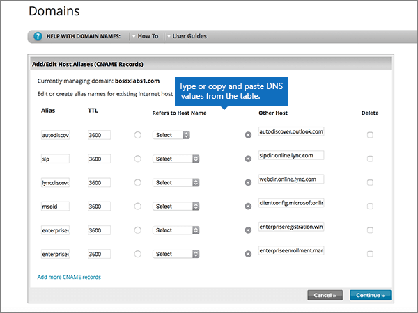
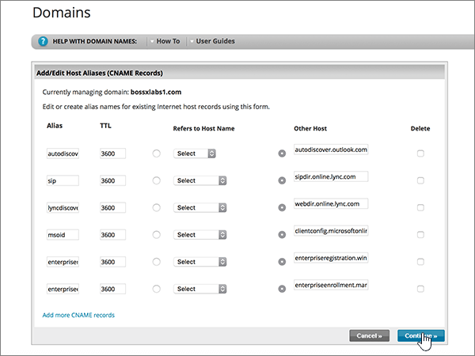
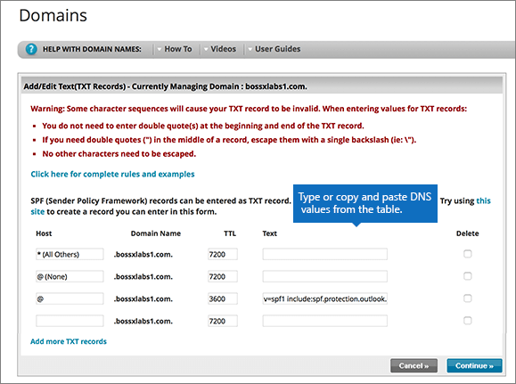

# Criar registros DNS no Network Solutions for Microsoft

 **Caso não encontre o conteúdo que está procurando, [verifique as perguntas frequentes sobre domínios](../setup/domains-faq.md)**. 
  
Se você usa a Network Solutions como provedor de hospedagem DNS, siga as etapas neste artigo para verificar o domínio e configurar registros DNS para o Skype for Business Online, email e outros serviços.
  
Estes são os registros principais a adicionar. Siga as etapas abaixo ou [assista ao vídeo](https://support.microsoft.com/office/c49698c2-6991-47fb-b5ac-18e49a505099). 
  
- [Adicionar um registro TXT para verificação](#add-a-txt-record-for-verification)
    
- [Adicione um registro MX para que o email do domínio vá para a Microsoft.](#add-an-mx-record-so-email-for-your-domain-will-come-to-microsoft)
    
- [Adicionar os registros CNAME necessários para a Microsoft](#add-the-cname-records-that-are-required-for-microsoft)
    
- [Adicionar registro TXT à SPF para ajudar a evitar spam de email](#add-a-txt-record-for-spf-to-help-prevent-email-spam)
    
- [Adicionar os dois registros SRV necessários para a Microsoft](#add-the-two-srv-records-that-are-required-for-microsoft)
    
Depois que você adicionar esses registros às soluções de rede, o domínio será configurado para funcionar com os serviços da Microsoft.
  

  
> [!NOTE]
>  Typically it takes about 15 minutes for DNS changes to take effect. However, it can occasionally take longer for a change you've made to update across the Internet's DNS system. If you're having trouble with mail flow or other issues after adding DNS records, see [Troubleshoot issues after changing your domain name or DNS records](../get-help-with-domains/find-and-fix-issues.md). 
  
## Adicionar um registro TXT para verificação

Before you use your domain with Microsoft, we have to make sure that you own it. Your ability to log in to your account at your domain registrar and create the DNS record proves to Microsoft that you own the domain.
  
> [!NOTE]
> This record is used only to verify that you own your domain; it doesn't affect anything else. You can delete it later, if you like. 
  
Siga as etapas abaixo ou [assista ao vídeo (inicia em 0:47)](https://support.microsoft.com/office/c49698c2-6991-47fb-b5ac-18e49a505099).
  
1. Para iniciar, vá até a página do seu domínio em Network Solutions, usando [este link](https://www.networksolutions.com/manage-it). Você será solicitado a fazer o logon.
    
    > [!IMPORTANT]
    > Antes de selecionar o botão de **login** , primeiro escolha **gerenciar meus nomes de domínio** na lista suspensa **fazer logon em:** . 
  
    
  
2. Selecione a caixa de seleção ao lado do nome do domínio que você está modificando.
    
    
  
3. Selecione **Editar DNS**.
    
    
  
4. Selecione **gerenciar registros de DNS avançados**.
    
    (You may have to scroll down.)
    
    
  
5. Role para baixo até a seção **texto (registros txt)** e selecione **editar registros txt**.
    
    
  
6. Nas caixas do novo registro, digite ou copie e cole os valores na tabela seguinte.
    
    |**Host**|**TTL**|**Texto**|
    |:-----|:-----|:-----|
    |@    (The system will change this value to **@ (None)** when you save the record.)    |3600    |MS=ms *XXXXXXXX*    **Observação**: esse é um exemplo. Use aqui seu valor específico de **Destino ou Pontos de Endereçamento**, retirado da tabela.  [Como localizo isto?](../get-help-with-domains/information-for-dns-records.md)   |
       
    
  
7. Selecione **continuar**.
    
    
  
8. Selecione **salvar alterações**.
    
    
  
9. Aguarde alguns minutos antes de prosseguir para que o registro que você acabou de criar possa ser atualizado na Internet.
    
Agora que você adicionou o registro no site do seu registrador de domínios, retorne à Microsoft e solicite o registro.
  
Quando a Microsoft encontrar o registro TXT correto, seu domínio estará verificado.

1. No centro do administrador, acesse a página **Configurações de** \> <a href="https://go.microsoft.com/fwlink/p/?linkid=834818" target="_blank">domínios</a>.
    
2. Na página **Domínios**, clique no domínio que você está verificando. 
    
    
  
3. Na página **Configuração**, clique em **Iniciar configuração**.
    
    
  
4. Na página **Verificar domínio**, marque **Verificar**.
    
    
  
> [!NOTE]
>  Typically it takes about 15 minutes for DNS changes to take effect. However, it can occasionally take longer for a change you've made to update across the Internet's DNS system. If you're having trouble with mail flow or other issues after adding DNS records, see [Troubleshoot issues after changing your domain name or DNS records](../get-help-with-domains/find-and-fix-issues.md). 
  
## Adicione um registro MX para que o email do domínio vá para a Microsoft.

Siga as etapas abaixo ou [assista ao vídeo (inicia em 3:51)](https://support.microsoft.com/office/c49698c2-6991-47fb-b5ac-18e49a505099).
  
1. Para iniciar, vá até a página do seu domínio em Network Solutions, usando [este link](https://www.networksolutions.com/manage-it). Você será solicitado a fazer o logon.
    
    > [!IMPORTANT]
    > Antes de selecionar o botão de **login** , primeiro escolha **gerenciar meus nomes de domínio** na lista suspensa **fazer logon em:** . 
  
    
  
2. Selecione a caixa de seleção ao lado do nome do domínio que você está modificando.
    
    
  
3. Selecione **Editar DNS**.
    
    
  
4. Selecione **gerenciar registros de DNS avançados**.
    
    (You may have to scroll down.)
    
    
  
5. Role para baixo até a seção **servidores de email (registros MX)** e selecione **editar registros MX**.
    
    
  
6. Nas caixas do novo registro, digite ou copie e cole os valores da seguinte tabela.
    
    |**Prioridade**|**TTL**|**Servidor de Email**|
    |:-----|:-----|:-----|
    |10     Para saber mais sobre prioridade, confira [O que é prioridade MX?](https://docs.microsoft.com/microsoft-365/admin/setup/domains-faq)   |3600    | *\<domain-key\>*. mail.protection.outlook.com.    **This value MUST end with a period (.)**   **Observação:** Acesse sua *\<domain-key\>* conta da Microsoft. [Como localizo isto?](../get-help-with-domains/information-for-dns-records.md)          |
       
    
  
7. Selecione **continuar**.
    
    
  
8. Selecione **salvar alterações**.
    
    
  
9. Se houver outros registros MX, exclua todos escolhendo **Excluir** para cada registro. 
    
    
  
10. Quando estiverem todos selecionados, selecione **continuar**.
    
    
  
11. Selecione **salvar alterações**.
    
    
  
## Adicionar os registros CNAME necessários para a Microsoft

Siga as etapas abaixo ou [assista ao vídeo (inicia em 4:43)](https://support.microsoft.com/office/c49698c2-6991-47fb-b5ac-18e49a505099).
  
1. Para iniciar, vá até a página do seu domínio em Network Solutions, usando [este link](https://www.networksolutions.com/manage-it). Você será solicitado a fazer o logon.
    
    > [!IMPORTANT]
    > Antes de selecionar o botão de **login** , primeiro escolha **gerenciar meus nomes de domínio** na lista suspensa **fazer logon em:** . 
  
    
  
2. Selecione a caixa de seleção ao lado do nome do domínio que você está modificando.
    
    
  
3. Selecione **Editar DNS**.
    
    
  
4. Selecione **gerenciar registros de DNS avançados**.
    
    (You may have to scroll down.)
    
    
  
5. Role para baixo até a seção **aliases de host (registros CNAME)** e selecione **editar registros CNAME**.
    
    
  
6. Nas caixas dos quatro novos registros, digite ou copie e cole os valores da seguinte tabela.
    
    |**Alias**|**TTL**|**Refere-se ao Nome do host**|**Outro Host          (selecione o botão de opção **Outro Host**)**|
    |:-----|:-----|:-----|:-----|
    |autodiscover    |3600    |(Sem configuração)    |autodiscover.outlook.com.    **This value MUST end with a period (.)**   |
    |sip    |3600    |(Sem configuração)    |sipdir.online.lync.com.    **Este valor deve OBRIGATORIAMENTE terminar com um ponto (.)**   |
    |lyncdiscover    |3600    |(Sem configuração)    |webdir.online.lync.com.    **This value MUST end with a period (.)**   |
    |enterpriseregistration    |3600    |(Sem configuração)    |enterpriseregistration.windows.net    **Este valor deve OBRIGATORIAMENTE terminar com um ponto (.)**   |
    |enterpriseenrollment    |3600    |(Sem configuração)    |enterpriseenrollment-s.manage.microsoft.com    **This value MUST end with a period (.)**   |
    
    
  
7. Depois de adicionar todos os registros CNAME necessários, selecione **continuar**.
    
    
  
8. Selecione **salvar alterações**.
    
    
  
## Adicionar registro TXT à SPF para ajudar a evitar spam de email

> [!IMPORTANT]
> Não é possível ter mais de um registro TXT para SPF para um domínio. Se o seu domínio possuir mais de um registro SPF, ocorrerão erros de email, bem como problemas na entrega e na classificação de spam. Se você já possui um registro SPF para seu domínio, não crie um novo para a Microsoft. Em vez disso, adicione os valores necessários da Microsoft ao registro atual para que você tenha um *único* registro SPF que inclua os dois conjuntos de valores. 
  
Siga as etapas abaixo ou [assista ao vídeo (inicia em 5:35)](https://support.microsoft.com/office/c49698c2-6991-47fb-b5ac-18e49a505099).
  
1. Para iniciar, vá até a página do seu domínio em Network Solutions, usando [este link](https://www.networksolutions.com/manage-it). Você será solicitado a fazer o logon.
    
    > [!IMPORTANT]
    > Antes de selecionar o botão de **login** , primeiro escolha **gerenciar meus nomes de domínio** na lista suspensa **fazer logon em:** . 
  
    
  
2. Selecione a caixa de seleção ao lado do nome do domínio que você está modificando.
    
    
  
3. Selecione **Editar DNS**.
    
    
  
4. Selecione **gerenciar registros de DNS avançados**.
    
    (You may have to scroll down.)
    
    
  
5. Role para baixo até a seção **texto (registros txt)** e selecione **editar registros txt**.
    
    
  
6. Nas caixas do novo registro, digite ou copie e cole os seguintes valores.
    
    |**Host**|**TTL**|**Texto**|
    |:-----|:-----|:-----|
    |@    (The system will change this value to **@ (None)** when you save the record.)    |3600    |v=spf1 include:spf.protection.outlook.com -all    **Observação:** é recomendável copiar e colar essa entrada, para que todo o espaçamento permaneça correto. |
       
    
  
7. Selecione **continuar**.
    
    
  
8. Selecione **salvar alterações**.
    
    
  
## Adicionar os dois registros SRV necessários para a Microsoft

Siga as etapas abaixo ou [assista ao vídeo (inicia em 6:18)](https://support.microsoft.com/office/c49698c2-6991-47fb-b5ac-18e49a505099).
  
1. To get started, go to your domains page at Network Solutions by using [this link](https://www.networksolutions.com/manage-it). You'll be prompted to log in.
    
    > [!IMPORTANT]
    > Antes de selecionar o botão de **login** , primeiro escolha **gerenciar meus nomes de domínio** na lista suspensa **fazer logon em:** . 
  
    
  
2. Selecione a caixa de seleção ao lado do nome do domínio que você está modificando.
    
    
  
3. Selecione **Editar DNS**.
    
    
  
4. Selecione **gerenciar registros de DNS avançados**.
    
    (You may have to scroll down.)
    
    
  
5. Role para baixo até a seção **serviço (Registros SRV)** e selecione **Editar Registros SRV**.
    
    
  
6. Nas caixas dos dois novos registros, digite ou copie e cole os valores da seguinte tabela.
    
    Escolha os valores **Serviço** e **Protocolo** nas listas suspensas. 
    
    |**Serviço**|**Protocolo**|**TTL**|**Prioridade**|**Espessura**|**Porta**|**Destino**|
    |:-----|:-----|:-----|:-----|:-----|:-----|:-----|
    |_sip    |_tls    |3600    |100    |1     |443    |sipdir.online.lync.com.    **Este valor deve OBRIGATORIAMENTE terminar com um ponto (.)**   |
    |_sipfederationtls    |_tcp    |3600    |100    |1     |5061    |sipfed.online.lync.com.    **This value MUST end with a period (.)**   |
       
    
  
7. Selecione **continuar**.
    
    
  
8. Selecione **salvar alterações**.
    
    
  
> [!NOTE]
>  Typically it takes about 15 minutes for DNS changes to take effect. However, it can occasionally take longer for a change you've made to update across the Internet's DNS system. If you're having trouble with mail flow or other issues after adding DNS records, see [Troubleshoot issues after changing your domain name or DNS records](../get-help-with-domains/find-and-fix-issues.md). 
  
