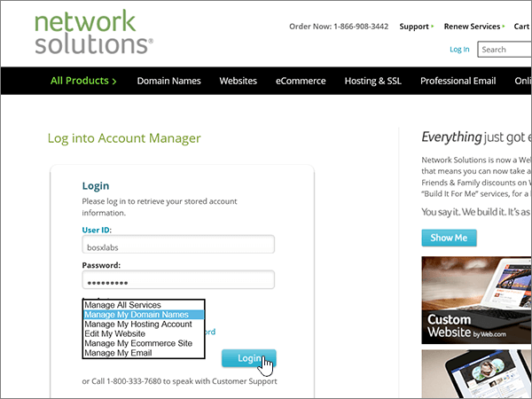

# Criar registros DNS no Network Solutions for MicrosoftCreate DNS records at Network Solutions for Microsoft

 **Caso não encontre o conteúdo que está procurando, [verifique as perguntas frequentes sobre domínios](../setup/domains-faq.md)**.**[Check the Domains FAQ](../setup/domains-faq.md)** if you don't find what you're looking for. 
  
Se você usa a Network Solutions como provedor de hospedagem DNS, siga as etapas neste artigo para verificar o domínio e configurar registros DNS para o Skype for Business Online, email e outros serviços.If Network Solutions is your DNS hosting provider, follow the steps in this article to verify your domain and set up DNS records for email, Skype for Business Online, and so on.
  
Estes são os registros principais a adicionar.These are the main records to add. Siga as etapas abaixo ou [assista ao vídeo](https://support.microsoft.com/office/c49698c2-6991-47fb-b5ac-18e49a505099).Follow the steps below or [watch the video](https://support.microsoft.com/office/c49698c2-6991-47fb-b5ac-18e49a505099). 
  
- [Adicionar um registro TXT para verificaçãoAdd a TXT record for verification](#add-a-txt-record-for-verification)
    
- [Adicione um registro MX para que o email do domínio vá para a Microsoft.Add an MX record so email for your domain will come to Microsoft](#add-an-mx-record-so-email-for-your-domain-will-come-to-microsoft)
    
- [Adicionar os registros CNAME necessários para a MicrosoftAdd the CNAME records that are required for Microsoft](#add-the-cname-records-that-are-required-for-microsoft)
    
- [Adicionar registro TXT à SPF para ajudar a evitar spam de emailAdd a TXT record for SPF to help prevent email spam](#add-a-txt-record-for-spf-to-help-prevent-email-spam)
    
- [Adicionar os dois registros SRV necessários para a MicrosoftAdd the two SRV records that are required for Microsoft](#add-the-two-srv-records-that-are-required-for-microsoft)
    
Depois que você adicionar esses registros às soluções de rede, o domínio será configurado para funcionar com os serviços da Microsoft.After you add these records at Network Solutions, your domain will be set up to work with Microsoft services.
  

  
> [!NOTE]
>  Normalmente, são necessários cerca de 15 minutos para que as alterações de DNS entrem em vigor. Mas, às vezes, pode ser necessário mais tempo para atualizar uma alteração feita no sistema DNS da Internet. Se você tiver problemas com o fluxo de emails ou de outro tipo após adicionar os registros DNS, consulte [Solucionar problemas após alterar o nome de domínio ou registros DNS](../get-help-with-domains/find-and-fix-issues.md).Typically it takes about 15 minutes for DNS changes to take effect. However, it can occasionally take longer for a change you've made to update across the Internet's DNS system. If you're having trouble with mail flow or other issues after adding DNS records, see [Troubleshoot issues after changing your domain name or DNS records](../get-help-with-domains/find-and-fix-issues.md). 
  
## Adicionar um registro TXT para verificaçãoAdd a TXT record for verification

Antes de usar o seu domínio com a Microsoft, precisamos verificar se você é o proprietário dele. A capacidade de entrar na conta do seu registrador de domínios e criar o registro de DNS prova à Microsoft que você é o proprietário do domínio.Before you use your domain with Microsoft, we have to make sure that you own it. Your ability to log in to your account at your domain registrar and create the DNS record proves to Microsoft that you own the domain.
  
> [!NOTE]
> Esse registro é usado exclusivamente para confirmar se você é o proprietário do domínio; ele não afeta mais nada. É possível excluí-lo mais tarde, se desejar.This record is used only to verify that you own your domain; it doesn't affect anything else. You can delete it later, if you like. 
  
Siga as etapas abaixo ou [assista ao vídeo (inicia em 0:47)](https://support.microsoft.com/office/c49698c2-6991-47fb-b5ac-18e49a505099).Follow the steps below or [watch the video (start at 0:47)](https://support.microsoft.com/office/c49698c2-6991-47fb-b5ac-18e49a505099).
  
1. Para iniciar, vá até a página do seu domínio em Network Solutions, usando [este link](https://www.networksolutions.com/manage-it).To get started, go to your domains page at Network Solutions by using [this link](https://www.networksolutions.com/manage-it). Você será solicitado a fazer o logon.You'll be prompted to log in.
    
    > [!IMPORTANT]
    > Antes de selecionar o botão de **login** , primeiro escolha **gerenciar meus nomes de domínio** na lista suspensa **fazer logon em:** .Before you select the **Login** button, first choose **Manage My Domain Names** in the **Log In to:** drop-down list. 
  
    
  
2. Selecione a caixa de seleção ao lado do nome do domínio que você está modificando.Select the check box next to the name of the domain that you are modifying.
    
    
  
3. Selecione **Editar DNS**.Select **Edit DNS**.
    
    
  
4. Selecione **gerenciar registros de DNS avançados**.Select **Manage Advanced DNS Records**.
    
    (You may have to scroll down.)(You may have to scroll down.)
    
    
  
5. Role para baixo até a seção **texto (registros txt)** e selecione **editar registros txt**.Scroll down to the **Text (TXT Records)** section, and then select **Edit TXT Records**.
    
    
  
6. Nas caixas do novo registro, digite ou copie e cole os valores na tabela seguinte.In the boxes for the new record, type or copy and paste the values in the following table.
    
    |**Host****Host**|**TTL****TTL**|**Texto****Text**|
    |:-----|:-----|:-----|
    |@    (The system will change this value to **@ (None)** when you save the record.)(The system will change this value to **@ (None)** when you save the record.)    |36003600    |MS=ms *XXXXXXXX*MS=ms *XXXXXXXX*    **Observação**: esse é um exemplo.**Note:** This is an example. Use aqui seu valor específico de **Destino ou Pontos de Endereçamento**, retirado da tabela.Use your specific **Destination or Points to Address** value here, from the table.  [Como localizo isto?How do I find this?](../get-help-with-domains/information-for-dns-records.md)   |
       
    
  
7. Selecione **continuar**.Select **Continue**.
    
    
  
8. Selecione **salvar alterações**.Select **Save Changes**.
    
    
  
9. Aguarde alguns minutos antes de prosseguir para que o registro que você acabou de criar possa ser atualizado na Internet.Wait a few minutes before you continue, so that the record you just created can update across the Internet.
    
Agora que você adicionou o registro no site do seu registrador de domínios, retorne à Microsoft e solicite o registro.Now that you've added the record at your domain registrar's site, you'll go back to Microsoft and request the record.
  
Quando a Microsoft encontrar o registro TXT correto, seu domínio estará verificado.When Microsoft finds the correct TXT record, your domain is verified.

1. No centro do administrador, acesse a página **Configurações de** \> <a href="https://go.microsoft.com/fwlink/p/?linkid=834818" target="_blank">domínios</a>.In the admin center, go to the **Settings** \> <a href="https://go.microsoft.com/fwlink/p/?linkid=834818" target="_blank">Domains</a> page.
    
2. Na página **Domínios**, clique no domínio que você está verificando.On the **Domains** page, select the domain that you are verifying. 
    
    
  
3. Na página **Configuração**, clique em **Iniciar configuração**.On the **Setup** page, select **Start setup**.
    
    
  
4. Na página **Verificar domínio**, marque **Verificar**.On the **Verify domain** page, select **Verify**.
    
    
  
> [!NOTE]
>  Normalmente, são necessários cerca de 15 minutos para que as alterações de DNS entrem em vigor. Mas, às vezes, pode ser necessário mais tempo para atualizar uma alteração feita no sistema DNS da Internet. Se você tiver problemas com o fluxo de emails ou de outro tipo após adicionar os registros DNS, consulte [Solucionar problemas após alterar o nome de domínio ou registros DNS](../get-help-with-domains/find-and-fix-issues.md).Typically it takes about 15 minutes for DNS changes to take effect. However, it can occasionally take longer for a change you've made to update across the Internet's DNS system. If you're having trouble with mail flow or other issues after adding DNS records, see [Troubleshoot issues after changing your domain name or DNS records](../get-help-with-domains/find-and-fix-issues.md). 
  
## Adicione um registro MX para que o email do domínio vá para a Microsoft.Add an MX record so email for your domain will come to Microsoft

Siga as etapas abaixo ou [assista ao vídeo (inicia em 3:51)](https://support.microsoft.com/office/c49698c2-6991-47fb-b5ac-18e49a505099).Follow the steps below or [watch the video (start at 3:51)](https://support.microsoft.com/office/c49698c2-6991-47fb-b5ac-18e49a505099).
  
1. Para iniciar, vá até a página do seu domínio em Network Solutions, usando [este link](https://www.networksolutions.com/manage-it).To get started, go to your domains page at Network Solutions by using [this link](https://www.networksolutions.com/manage-it). Você será solicitado a fazer o logon.You'll be prompted to log in.
    
    > [!IMPORTANT]
    > Antes de selecionar o botão de **login** , primeiro escolha **gerenciar meus nomes de domínio** na lista suspensa **fazer logon em:** .Before you select the **Login** button, first choose **Manage My Domain Names** in the **Log In to:** drop-down list. 
  
    
  
2. Selecione a caixa de seleção ao lado do nome do domínio que você está modificando.Select the check box next to the name of the domain that you are modifying.
    
    
  
3. Selecione **Editar DNS**.Select **Edit DNS**.
    
    
  
4. Selecione **gerenciar registros de DNS avançados**.Select **Manage Advanced DNS Records**.
    
    (You may have to scroll down.)(You may have to scroll down.)
    
    
  
5. Role para baixo até a seção **servidores de email (registros MX)** e selecione **editar registros MX**.Scroll down to the **Mail Servers (MX Records)** section, and then select **Edit MX Records**.
    
    
  
6. Nas caixas do novo registro, digite ou copie e cole os valores da seguinte tabela.In the boxes for the new record, type or copy and paste the values from the following table.
    
    |**Prioridade****Priority**|**TTL****TTL**|**Servidor de Email****Mail Server**|
    |:-----|:-----|:-----|
    |10 10    Para saber mais sobre prioridade, confira [O que é prioridade MX?](https://docs.microsoft.com/microsoft-365/admin/setup/domains-faq)For more information about priority, see [What is MX priority?](https://docs.microsoft.com/microsoft-365/admin/setup/domains-faq)   |36003600    | *\<domain-key\>*. mail.protection.outlook.com.*\<domain-key\>*  .mail.protection.outlook.com.    **This value MUST end with a period (.)****This value MUST end with a period (.)**   **Observação:** Acesse sua *\<domain-key\>* conta da Microsoft.**Note:** Get your  *\<domain-key\>*  from your Microsoft account. [Como localizo isto?How do I find this?](../get-help-with-domains/information-for-dns-records.md)          |
       
    
  
7. Selecione **continuar**.Select **Continue**.
    
    
  
8. Selecione **salvar alterações**.Select **Save Changes**.
    
    
  
9. Se houver outros registros MX, exclua todos escolhendo **Excluir** para cada registro.If there are any other MX records, delete all of them by selecting **Delete** for each record. 
    
    
  
10. Quando estiverem todos selecionados, selecione **continuar**.When they are all selected, select **Continue**.
    
    
  
11. Selecione **salvar alterações**.Select **Save Changes**.
    
    
  
## Adicionar os registros CNAME necessários para a MicrosoftAdd the CNAME records that are required for Microsoft

Siga as etapas abaixo ou [assista ao vídeo (inicia em 4:43)](https://support.microsoft.com/office/c49698c2-6991-47fb-b5ac-18e49a505099).Follow the steps below or [watch the video (start at 4:43)](https://support.microsoft.com/office/c49698c2-6991-47fb-b5ac-18e49a505099).
  
1. Para iniciar, vá até a página do seu domínio em Network Solutions, usando [este link](https://www.networksolutions.com/manage-it).To get started, go to your domains page at Network Solutions by using [this link](https://www.networksolutions.com/manage-it). Você será solicitado a fazer o logon.You'll be prompted to log in.
    
    > [!IMPORTANT]
    > Antes de selecionar o botão de **login** , primeiro escolha **gerenciar meus nomes de domínio** na lista suspensa **fazer logon em:** .Before you select the **Login** button, first choose **Manage My Domain Names** in the **Log In to:** drop-down list. 
  
    
  
2. Selecione a caixa de seleção ao lado do nome do domínio que você está modificando.Select the check box next to the name of the domain that you are modifying.
    
    
  
3. Selecione **Editar DNS**.Select **Edit DNS**.
    
    
  
4. Selecione **gerenciar registros de DNS avançados**.Select **Manage Advanced DNS Records**.
    
    (You may have to scroll down.)(You may have to scroll down.)
    
    
  
5. Role para baixo até a seção **aliases de host (registros CNAME)** e selecione **editar registros CNAME**.Scroll down to the **Host Aliases (CNAME Records)** section, and then select **Edit CNAME Records**.
    
    
  
6. Nas caixas dos quatro novos registros, digite ou copie e cole os valores da seguinte tabela.In the boxes for the four new records, type or copy and paste the values from the following table.
    
    |**Alias****Alias**|**TTL****TTL**|**Refere-se ao Nome do host****Refers to Host Name**|**Outro Host          (selecione o botão de opção **Outro Host**)****Other Host          (select the **Other Host** option button)**|
    |:-----|:-----|:-----|:-----|
    |autodiscoverautodiscover    |36003600    |(Sem configuração)(No setting)    |autodiscover.outlook.com.autodiscover.outlook.com.    **This value MUST end with a period (.)****This value MUST end with a period (.)**   |
    |sipsip    |36003600    |(Sem configuração)(No setting)    |sipdir.online.lync.com.sipdir.online.lync.com.    **Este valor deve OBRIGATORIAMENTE terminar com um ponto (.)****This value MUST end with a period (.)**   |
    |lyncdiscoverlyncdiscover    |36003600    |(Sem configuração)(No setting)    |webdir.online.lync.com.webdir.online.lync.com.    **This value MUST end with a period (.)****This value MUST end with a period (.)**   |
    |enterpriseregistrationenterpriseregistration    |36003600    |(Sem configuração)(No setting)    |enterpriseregistration.windows.netenterpriseregistration.windows.net    **Este valor deve OBRIGATORIAMENTE terminar com um ponto (.)****This value MUST end with a period (.)**   |
    |enterpriseenrollmententerpriseenrollment    |36003600    |(Sem configuração)(No setting)    |enterpriseenrollment-s.manage.microsoft.comenterpriseenrollment-s.manage.microsoft.com    **This value MUST end with a period (.)****This value MUST end with a period (.)**   |
    
    
  
7. Depois de adicionar todos os registros CNAME necessários, selecione **continuar**.When you have added all of the CNAME records that you need, select **Continue**.
    
    
  
8. Selecione **salvar alterações**.Select **Save Changes**.
    
    
  
## Adicionar registro TXT à SPF para ajudar a evitar spam de emailAdd a TXT record for SPF to help prevent email spam

> [!IMPORTANT]
> Não é possível ter mais de um registro TXT para SPF para um domínio.You cannot have more than one TXT record for SPF for a domain. Se o seu domínio possuir mais de um registro SPF, ocorrerão erros de email, bem como problemas na entrega e na classificação de spam.If your domain has more than one SPF record, you'll get email errors, as well as delivery and spam classification issues. Se você já possui um registro SPF para seu domínio, não crie um novo para a Microsoft.If you already have an SPF record for your domain, don't create a new one for Microsoft. Em vez disso, adicione os valores necessários da Microsoft ao registro atual para que você tenha um *único* registro SPF que inclua os dois conjuntos de valores.Instead, add the required Microsoft values to the current record so that you have a  *single*  SPF record that includes both sets of values. 
  
Siga as etapas abaixo ou [assista ao vídeo (inicia em 5:35)](https://support.microsoft.com/office/c49698c2-6991-47fb-b5ac-18e49a505099).Follow the steps below or [watch the video (start at 5:35)](https://support.microsoft.com/office/c49698c2-6991-47fb-b5ac-18e49a505099).
  
1. Para iniciar, vá até a página do seu domínio em Network Solutions, usando [este link](https://www.networksolutions.com/manage-it).To get started, go to your domains page at Network Solutions by using [this link](https://www.networksolutions.com/manage-it). Você será solicitado a fazer o logon.You'll be prompted to log in.
    
    > [!IMPORTANT]
    > Antes de selecionar o botão de **login** , primeiro escolha **gerenciar meus nomes de domínio** na lista suspensa **fazer logon em:** .Before you select the **Login** button, first choose **Manage My Domain Names** in the **Log In to:** drop-down list. 
  
    
  
2. Selecione a caixa de seleção ao lado do nome do domínio que você está modificando.Select the check box next to the name of the domain that you are modifying.
    
    
  
3. Selecione **Editar DNS**.Select **Edit DNS**.
    
    
  
4. Selecione **gerenciar registros de DNS avançados**.Select **Manage Advanced DNS Records**.
    
    (You may have to scroll down.)(You may have to scroll down.)
    
    
  
5. Role para baixo até a seção **texto (registros txt)** e selecione **editar registros txt**.Scroll down to the **Text (TXT Records)** section, and then select **Edit TXT Records**.
    
    
  
6. Nas caixas do novo registro, digite ou copie e cole os seguintes valores.In the boxes for the new record, type or copy and paste the following values.
    
    |**Host****Host**|**TTL****TTL**|**Texto****Text**|
    |:-----|:-----|:-----|
    |@    (The system will change this value to **@ (None)** when you save the record.)(The system will change this value to **@ (None)** when you save the record.)    |36003600    |v=spf1 include:spf.protection.outlook.com -allv=spf1 include:spf.protection.outlook.com -all    **Observação:** é recomendável copiar e colar essa entrada, para que todo o espaçamento permaneça correto.**Note:** We recommend copying and pasting this entry, so that all of the spacing stays correct. |
       
    
  
7. Selecione **continuar**.Select **Continue**.
    
    
  
8. Selecione **salvar alterações**.Select **Save Changes**.
    
    
  
## Adicionar os dois registros SRV necessários para a MicrosoftAdd the two SRV records that are required for Microsoft

Siga as etapas abaixo ou [assista ao vídeo (inicia em 6:18)](https://support.microsoft.com/office/c49698c2-6991-47fb-b5ac-18e49a505099).Follow the steps below or [watch the video (start at 6:18)](https://support.microsoft.com/office/c49698c2-6991-47fb-b5ac-18e49a505099).
  
1. Para iniciar, vá até a página do seu domínio em Network Solutions, usando [este link](https://www.networksolutions.com/manage-it). Você será solicitado a fazer o logon.To get started, go to your domains page at Network Solutions by using [this link](https://www.networksolutions.com/manage-it). You'll be prompted to log in.
    
    > [!IMPORTANT]
    > Antes de selecionar o botão de **login** , primeiro escolha **gerenciar meus nomes de domínio** na lista suspensa **fazer logon em:** .Before you select the **Login** button, first choose **Manage My Domain Names** in the **Log In to:** drop-down list. 
  
    
  
2. Selecione a caixa de seleção ao lado do nome do domínio que você está modificando.Select the check box next to the name of the domain that you are modifying.
    
    
  
3. Selecione **Editar DNS**.Select **Edit DNS**.
    
    
  
4. Selecione **gerenciar registros de DNS avançados**.Select **Manage Advanced DNS Records**.
    
    (You may have to scroll down.)(You may have to scroll down.)
    
    
  
5. Role para baixo até a seção **serviço (Registros SRV)** e selecione **Editar Registros SRV**.Scroll down to the **Service (SRV Records)** section, and then select **Edit SRV Records**.
    
    
  
6. Nas caixas dos dois novos registros, digite ou copie e cole os valores da seguinte tabela.In the boxes for the two new records, type or copy and paste the values from the following table.
    
    Escolha os valores **Serviço** e **Protocolo** nas listas suspensas.(Choose the **Service** and **Protocol** values from the drop-down lists.) 
    
    |**Serviço****Service**|**Protocolo****Protocol**|**TTL****TTL**|**Prioridade****Priority**|**Espessura****Weight**|**Porta****Port**|**Destino****Target**|
    |:-----|:-----|:-----|:-----|:-----|:-----|:-----|
    |_sip_sip    |_tls_tls    |36003600    |100100    |1 1    |443443    |sipdir.online.lync.com.sipdir.online.lync.com.    **Este valor deve OBRIGATORIAMENTE terminar com um ponto (.)****This value MUST end with a period (.)**   |
    |_sipfederationtls_sipfederationtls    |_tcp_tcp    |36003600    |100100    |1 1    |50615061    |sipfed.online.lync.com.sipfed.online.lync.com.    **This value MUST end with a period (.)****This value MUST end with a period (.)**   |
       
    
  
7. Selecione **continuar**.Select **Continue**.
    
    
  
8. Selecione **salvar alterações**.Select **Save Changes**.
    
    
  
> [!NOTE]
>  Normalmente, são necessários cerca de 15 minutos para que as alterações de DNS entrem em vigor. Mas, às vezes, pode ser necessário mais tempo para atualizar uma alteração feita no sistema DNS da Internet. Se você tiver problemas com o fluxo de emails ou de outro tipo após adicionar os registros DNS, consulte [Solucionar problemas após alterar o nome de domínio ou registros DNS](../get-help-with-domains/find-and-fix-issues.md).Typically it takes about 15 minutes for DNS changes to take effect. However, it can occasionally take longer for a change you've made to update across the Internet's DNS system. If you're having trouble with mail flow or other issues after adding DNS records, see [Troubleshoot issues after changing your domain name or DNS records](../get-help-with-domains/find-and-fix-issues.md). 
  
