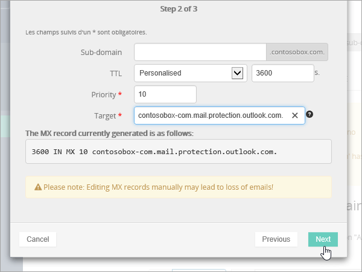
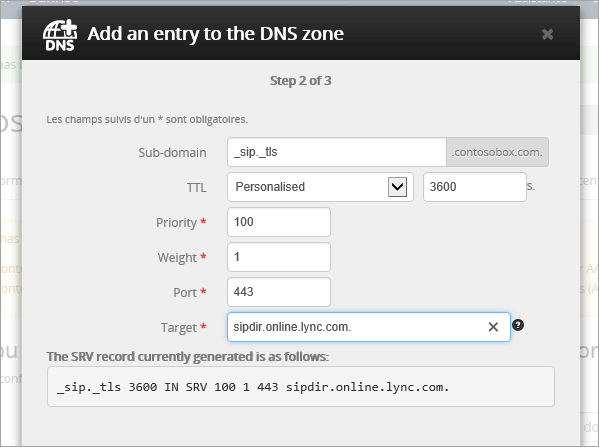

# Criar registros DNS no OVH para Microsoft

Caso não encontre o conteúdo que está procurando, [verifique as perguntas frequentes sobre domínios](../setup/domains-faq.md). 
  
Se o OVH for seu provedor de hospedagem DNS, siga as etapas deste artigo para verificar seu domínio e configurar registros DNS para email, Skype for Business Online e assim por diante.
  
Esses são os principais registros a adicionar. 
  
- [Criar registros DNS no OVH para Microsoft](#create-dns-records-at-ovh-for-microsoft)
    
- [Adicione um registro MX para que o email do domínio vá para a Microsoft.](#add-an-mx-record-so-email-for-your-domain-will-come-to-microsoft)
    
- [Adicionar os registros CNAME necessários para a Microsoft](#add-the-cname-records-that-are-required-for-microsoft)
    
- [Adicionar registro TXT à SPF para ajudar a evitar spam de email](#add-a-txt-record-for-spf-to-help-prevent-email-spam)
    
- [Adicionar os dois registros SRV necessários para a Microsoft](#add-the-two-srv-records-that-are-required-for-microsoft)
    
Depois que você adicionar esses registros no OVH, o domínio será configurado para funcionar com os serviços da Microsoft.

  
> [!NOTE]
>  Normalmente, são necessários cerca de 15 minutos para que as alterações de DNS entrem em vigor. Mas, às vezes, pode ser necessário mais tempo para atualizar uma alteração feita no sistema DNS da Internet. Se você tiver problemas com o fluxo de emails ou de outro tipo após adicionar os registros DNS, consulte [Solucionar problemas após alterar o nome de domínio ou registros DNS](../get-help-with-domains/find-and-fix-issues.md). 
  
## Adicionar um registro TXT para verificação

Antes de usar o seu domínio com a Microsoft, precisamos verificar se você é o proprietário dele. A capacidade de entrar na conta do seu registrador de domínios e criar o registro de DNS prova à Microsoft que você é o proprietário do domínio.
  
> [!NOTE]
> Esse registro é usado exclusivamente para confirmar se você é o proprietário do domínio; ele não afeta mais nada. É possível excluí-lo mais tarde, se desejar. 
  
1. Para começar, vá até a sua página de domínios no OVH usando [este link](https://www.ovh.com/manager/). You'll be prompted to log in.
    
    
  
2. Em **domínios**, selecione o nome do domínio que você deseja editar.
    
    
  
3. Selecione **zona DNS**.
    
    
  
4. Selecione **Adicionar uma entrada**.
    
    
  
5. Selecionar **txt**
    
    
  
6. Nas caixas do novo registro, digite ou copie e cole os valores da seguinte tabela. Para atribuir um valor de TTL, escolha **personalizado** na lista suspensa e digite o valor na caixa de texto. 
    
    |**Tipo de registro**|**Subdomínio**|**TTL**|**Valor**|
    |:-----|:-----|:-----|:-----|
    |TXT    |(deixar em branco)    |3600 (segundos)    |MS = msxxxxxxxx    **Observação**: esse é um exemplo. Use aqui seu valor específico de **Destino ou Pontos de Endereçamento**, retirado da tabela.           [Como localizo isto?](../get-help-with-domains/information-for-dns-records.md)          |
   
7. Selecione **confirmar**. 
    
    
  
8. Aguarde alguns minutos antes de prosseguir para que o registro que você acabou de criar possa ser atualizado na Internet.
    
Agora que você adicionou o registro no site do seu registrador de domínios, retorne à Microsoft e solicite o registro.
  
Quando a Microsoft encontrar o registro TXT correto, seu domínio estará verificado.
  
1. No centro do administrador, acesse a página **Configurações de** \> <a href="https://go.microsoft.com/fwlink/p/?linkid=834818" target="_blank">domínios</a>.
    
2. Na página **Domínios**, clique no domínio que você está verificando. 
    
    
  
3. Na página **Configuração**, clique em **Iniciar configuração**.
    
    
  
4. Na página **Verificar domínio**, marque **Verificar**.
    
    
  
> [!NOTE]
>  Normalmente, são necessários cerca de 15 minutos para que as alterações de DNS entrem em vigor. Mas, às vezes, pode ser necessário mais tempo para atualizar uma alteração feita no sistema DNS da Internet. Se você tiver problemas com o fluxo de emails ou de outro tipo após adicionar os registros DNS, consulte [Solucionar problemas após alterar o nome de domínio ou registros DNS](../get-help-with-domains/find-and-fix-issues.md). 
  
## Adicione um registro MX para que o email do domínio vá para a Microsoft.

1. Para começar, vá até a sua página de domínios no OVH usando [este link](https://www.ovh.com/manager/). You'll be prompted to log in.
    
    
  
2. Em **domínios**, selecione o nome do domínio que você deseja editar.
    
    
  
3. Selecione **zona DNS**.
    
    
  
4. Selecione **Adicionar uma entrada**.
    
    
  
5. Selecione **MX**.
    
    
  
6. Nas caixas do novo registro, digite ou copie e cole os valores da seguinte tabela. Para atribuir um valor de TTL, escolha **personalizado** na lista suspensa e digite o valor na caixa de texto. 
    
    > [!NOTE]
    > Por padrão, o OVH usa notação relativa para o destino, que adiciona o nome de domínio ao final do registro de destino. Para usar a notação absoluta em vez disso, adicione um ponto ao registro de destino conforme mostrado na tabela abaixo. 
  
    |**Tipo de registro**|**Subdomínio**|**TTL**|**Prioridade**|**Target**|
    |:-----|:-----|:-----|:-----|:-----|
    |MX    |(deixar em branco)    |3600 (segundos)    |10     Para saber mais sobre prioridade, confira [O que é prioridade MX?](https://docs.microsoft.com/microsoft-365/admin/setup/domains-faq)   |\<domain-key\>. mail.protection.outlook.com.    **Observação:** Acesse sua *\<domain-key\>* conta da Microsoft.  [Como localizo isto?](../get-help-with-domains/information-for-dns-records.md)  |
   
    
  
7. Selecione **Avançar**.
    
    
  
8. Selecione **confirmar**.
    
    
  
9. Se houver outros registros MX, exclua todos na lista na página **zona DNS** . Selecione cada registro e, na coluna **ações** , selecione o ícone lixeira-pode **excluir** . 
    
    
  
10. Selecione **confirmar**.
    
## Adicionar os registros CNAME necessários para a Microsoft

1. Para começar, vá até a sua página de domínios no OVH usando [este link](https://www.ovh.com/manager/). You'll be prompted to log in.
    
    
  
2. Em **domínios**, selecione o nome do domínio que você deseja editar.
    
    
  
3. Selecione **zona DNS**.
    
    
  
4. Selecione **Adicionar uma entrada**.
    
    
  
5. Selecione **CNAME**.
    
    
  
6. Criar o primeiro registro CNAME.
    
    Nas caixas do novo registro, digite ou copie e cole os valores da primeira linha da tabela a seguir. Para atribuir um valor de TTL, escolha **personalizado** na lista suspensa e digite o valor na caixa de texto. 
    
    |**Tipo de registro**|**Subdomínio**|**Destino**|**TTL**|
    |:-----|:-----|:-----|:-----|
    |CNAME    |autodiscover    |autodiscover.outlook.com.    |3600 segundos    |
    |CNAME    |sip    |sipdir.online.lync.com.    |3600 segundos    |
    |CNAME    |lyncdiscover    |webdir.online.lync.com.    |3600 segundos    |
    |CNAME    |enterpriseregistration    |enterpriseregistration.windows.net.    |3600 segundos    |
    |CNAME    |enterpriseenrollment    |enterpriseenrollment-s.manage.microsoft.com.    |3600 segundos    |
   
    
  
7. Selecione **Avançar**.
    
    
  
8. Selecione **confirmar**.
    
9. Repita as etapas anteriores para criar os outros cinco registros CNAME.
    
    Para cada registro, digite ou copie e cole os valores da próxima linha da tabela acima nas caixas desse registro.
    
## Adicionar registro TXT à SPF para ajudar a evitar spam de email

> [!IMPORTANT]
> Não é possível ter mais de um registro TXT para SPF para um domínio. Se o seu domínio possuir mais de um registro SPF, ocorrerão erros de email, bem como problemas na entrega e na classificação de spam. Se você já possui um registro SPF para seu domínio, não crie um novo para a Microsoft. Em vez disso, adicione os valores necessários da Microsoft ao registro atual para que você tenha um *único* registro SPF que inclua os dois conjuntos de valores. 
  
1. Para começar, vá até a sua página de domínios no OVH usando [este link](https://www.ovh.com/manager/). You'll be prompted to log in.
    
    
  
2. Em **domínios**, selecione o nome do domínio que você deseja editar.
    
    
  
3. Selecione **zona DNS**.
    
    
  
4. Selecione **Adicionar uma entrada**.
    
    
  
5. Selecione **txt**.
    
6. In the boxes for the new record, type or copy and paste the following values.
    
    |**Tipo de registro**|**Subdomínio**|**TTL**|**Valor TXT**|
    |:-----|:-----|:-----|:-----|
    |TXT    |(deixar em branco)    |3600 (segundos)    |v=spf1 include:spf.protection.outlook.com -all    **Observação:** é recomendável copiar e colar essa entrada, para que todo o espaçamento permaneça correto.           |
   
    
  
7. Selecione **Avançar**.
    
    
  
8. Selecione **confirmar**.
    
    
  
## Adicionar os dois registros SRV necessários para a Microsoft

1. Para começar, vá até a sua página de domínios no OVH usando [este link](https://www.ovh.com/manager/). You'll be prompted to log in.
    
    
  
2. Em **domínios**, selecione o nome do domínio que você deseja editar.
    
    
  
3. Selecione **zona DNS**.
    
    
  
4. Selecione **Adicionar uma entrada**.
    
    
  
5. Selecione **SRV**.
    
    
  
6. Crie o primeiro registro SRV.
    
    Nas caixas do novo registro, digite ou copie e cole os valores da primeira linha da tabela a seguir. Para atribuir um valor de TTL, escolha **personalizado** na lista suspensa e digite o valor na caixa de texto. 
    
    |**Tipo de registro**|**Subdomínio**|**Prioridade**|**Espessura**|**Porta**|**TTL**|**Target**|
    |:-----|:-----|:-----|:-----|:-----|:-----|:-----|
    |SRV (Serviço)    |_sip. _tls    |100    |1     |443    |3600 (segundos)    |sipdir.online.lync.com.    |
    |SRV (Serviço)    |_sipfederationtls. _tcp    |100    |1     |5061    |3600 (segundos)    |sipfed.online.lync.com.    |
       
    
  
7. Selecione **Avançar**.
    
    
  
8. Selecione **confirmar**.
    
9. Repita as etapas anteriores para criar o outro registro SRV. Digite ou copie e cole os valores da segunda linha da tabela acima nas caixas do segundo registro.
    
> [!NOTE]
>  Normalmente, são necessários cerca de 15 minutos para que as alterações de DNS entrem em vigor. Mas, às vezes, pode ser necessário mais tempo para atualizar uma alteração feita no sistema DNS da Internet. Se você tiver problemas com o fluxo de emails ou de outro tipo após adicionar os registros DNS, consulte [Solucionar problemas após alterar o nome de domínio ou registros DNS](../get-help-with-domains/find-and-fix-issues.md). 
  
