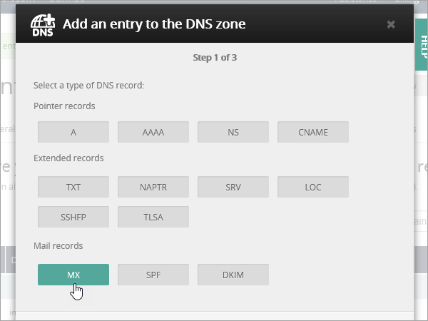

# Criar registros DNS no OVH para MicrosoftCreate DNS records at OVH for Microsoft

Caso não encontre o conteúdo que está procurando, [verifique as perguntas frequentes sobre domínios](../setup/domains-faq.md).[Check the Domains FAQ](../setup/domains-faq.md) if you don't find what you're looking for. 
  
Se o OVH for seu provedor de hospedagem DNS, siga as etapas deste artigo para verificar seu domínio e configurar registros DNS para email, Skype for Business Online e assim por diante.If OVH is your DNS hosting provider, follow the steps in this article to verify your domain and set up DNS records for email, Skype for Business Online, and so on.
  
Esses são os principais registros a adicionar.These are the main records to add. 
  
- [Criar registros DNS no OVH para MicrosoftCreate DNS records at OVH for Microsoft](#create-dns-records-at-ovh-for-microsoft)
    
- [Adicione um registro MX para que o email do domínio vá para a Microsoft.Add an MX record so email for your domain will come to Microsoft](#add-an-mx-record-so-email-for-your-domain-will-come-to-microsoft)
    
- [Adicionar os registros CNAME necessários para a MicrosoftAdd the CNAME records that are required for Microsoft](#add-the-cname-records-that-are-required-for-microsoft)
    
- [Adicionar registro TXT à SPF para ajudar a evitar spam de emailAdd a TXT record for SPF to help prevent email spam](#add-a-txt-record-for-spf-to-help-prevent-email-spam)
    
- [Adicionar os dois registros SRV necessários para a MicrosoftAdd the two SRV records that are required for Microsoft](#add-the-two-srv-records-that-are-required-for-microsoft)
    
Depois que você adicionar esses registros no OVH, o domínio será configurado para funcionar com os serviços da Microsoft.After you add these records at OVH, your domain will be set up to work with Microsoft services.

  
> [!NOTE]
>  Normalmente, são necessários cerca de 15 minutos para que as alterações de DNS entrem em vigor. Mas, às vezes, pode ser necessário mais tempo para atualizar uma alteração feita no sistema DNS da Internet. Se você tiver problemas com o fluxo de emails ou de outro tipo após adicionar os registros DNS, consulte [Solucionar problemas após alterar o nome de domínio ou registros DNS](../get-help-with-domains/find-and-fix-issues.md).Typically it takes about 15 minutes for DNS changes to take effect. However, it can occasionally take longer for a change you've made to update across the Internet's DNS system. If you're having trouble with mail flow or other issues after adding DNS records, see [Troubleshoot issues after changing your domain name or DNS records](../get-help-with-domains/find-and-fix-issues.md). 
  
## Adicionar um registro TXT para verificaçãoAdd a TXT record for verification

Antes de usar o seu domínio com a Microsoft, precisamos verificar se você é o proprietário dele. A capacidade de entrar na conta do seu registrador de domínios e criar o registro de DNS prova à Microsoft que você é o proprietário do domínio.Before you use your domain with Microsoft, we have to make sure that you own it. Your ability to log in to your account at your domain registrar and create the DNS record proves to Microsoft that you own the domain.
  
> [!NOTE]
> Esse registro é usado exclusivamente para confirmar se você é o proprietário do domínio; ele não afeta mais nada. É possível excluí-lo mais tarde, se desejar.This record is used only to verify that you own your domain; it doesn't affect anything else. You can delete it later, if you like. 
  
1. Para começar, vá até a sua página de domínios no OVH usando [este link](https://www.ovh.com/manager/).To get started, go to your domains page in OVH by using [this link](https://www.ovh.com/manager/). You'll be prompted to log in.You'll be prompted to log in.
    
    
  
2. Em **domínios**, selecione o nome do domínio que você deseja editar.Under **Domains**, select the name of the domain that you want edit.
    
    
  
3. Selecione **zona DNS**.Select **DNS zone**.
    
    
  
4. Selecione **Adicionar uma entrada**.Select **Add an entry**.
    
    
  
5. Selecionar **txt**Select **TXT**
    
    
  
6. Nas caixas do novo registro, digite ou copie e cole os valores da seguinte tabela.In the boxes for the new record, type or copy and paste the values from the following table. Para atribuir um valor de TTL, escolha **personalizado** na lista suspensa e digite o valor na caixa de texto.To assign a TTL value, choose **Personalized** from the drop-down list, and then type the value in the text box. 
    
    |**Tipo de registro****Record type**|**Subdomínio****Sub-domain**|**TTL****TTL**|**Valor****Value**|
    |:-----|:-----|:-----|:-----|
    |TXTTXT    |(deixar em branco)(leave blank)    |3600 (segundos)3600 (seconds)    |MS = msxxxxxxxxMS=msxxxxxxxx    **Observação**: esse é um exemplo.**Note:** This is an example. Use aqui seu valor específico de **Destino ou Pontos de Endereçamento**, retirado da tabela.Use your specific **Destination or Points to Address** value here, from the table.           [Como localizo isto?How do I find this?](../get-help-with-domains/information-for-dns-records.md)          |
   
7. Selecione **confirmar**.Select **Confirm**. 
    
    
  
8. Aguarde alguns minutos antes de prosseguir para que o registro que você acabou de criar possa ser atualizado na Internet.Wait a few minutes before you continue, so that the record you just created can update across the Internet.
    
Agora que você adicionou o registro no site do seu registrador de domínios, retorne à Microsoft e solicite o registro.Now that you've added the record at your domain registrar's site, you'll go back to Microsoft and request the record.
  
Quando a Microsoft encontrar o registro TXT correto, seu domínio estará verificado.When Microsoft finds the correct TXT record, your domain is verified.
  
1. No centro do administrador, acesse a página **Configurações de** \> <a href="https://go.microsoft.com/fwlink/p/?linkid=834818" target="_blank">domínios</a>.In the admin center, go to the **Settings** \> <a href="https://go.microsoft.com/fwlink/p/?linkid=834818" target="_blank">Domains</a> page.
    
2. Na página **Domínios**, clique no domínio que você está verificando.On the **Domains** page, select the domain that you are verifying. 
    
    
  
3. Na página **Configuração**, clique em **Iniciar configuração**.On the **Setup** page, select **Start setup**.
    
    
  
4. Na página **Verificar domínio**, marque **Verificar**.On the **Verify domain** page, select **Verify**.
    
    
  
> [!NOTE]
>  Normalmente, são necessários cerca de 15 minutos para que as alterações de DNS entrem em vigor. Mas, às vezes, pode ser necessário mais tempo para atualizar uma alteração feita no sistema DNS da Internet. Se você tiver problemas com o fluxo de emails ou de outro tipo após adicionar os registros DNS, consulte [Solucionar problemas após alterar o nome de domínio ou registros DNS](../get-help-with-domains/find-and-fix-issues.md).Typically it takes about 15 minutes for DNS changes to take effect. However, it can occasionally take longer for a change you've made to update across the Internet's DNS system. If you're having trouble with mail flow or other issues after adding DNS records, see [Troubleshoot issues after changing your domain name or DNS records](../get-help-with-domains/find-and-fix-issues.md). 
  
## Adicione um registro MX para que o email do domínio vá para a Microsoft.Add an MX record so email for your domain will come to Microsoft

1. Para começar, vá até a sua página de domínios no OVH usando [este link](https://www.ovh.com/manager/).To get started, go to your domains page in OVH by using [this link](https://www.ovh.com/manager/). You'll be prompted to log in.You'll be prompted to log in.
    
    
  
2. Em **domínios**, selecione o nome do domínio que você deseja editar.Under **Domains**, select the name of the domain that you want edit.
    
    
  
3. Selecione **zona DNS**.Select **DNS zone**.
    
    
  
4. Selecione **Adicionar uma entrada**.Select **Add an entry**.
    
    
  
5. Selecione **MX**.Select **MX**.
    
    
  
6. Nas caixas do novo registro, digite ou copie e cole os valores da seguinte tabela.In the boxes for the new record, type or copy and paste the values from the following table. Para atribuir um valor de TTL, escolha **personalizado** na lista suspensa e digite o valor na caixa de texto.To assign a TTL value, choose **Personalized** from the drop-down list, and then type the value in the text box. 
    
    > [!NOTE]
    > Por padrão, o OVH usa notação relativa para o destino, que adiciona o nome de domínio ao final do registro de destino.By default OVH uses relative notation for the target, which adds the domain name to the end of the target record. Para usar a notação absoluta em vez disso, adicione um ponto ao registro de destino conforme mostrado na tabela abaixo.To use absolute notation instead, add a dot to the target record as shown in the table below. 
  
    |**Tipo de registro****Record type**|**Subdomínio****Sub-domain**|**TTL****TTL**|**Prioridade****Priority**|**Destino****Target**|
    |:-----|:-----|:-----|:-----|:-----|
    |MXMX    |(deixar em branco)(leave blank)    |3600 (segundos)3600 (seconds)    |10 10    Para saber mais sobre prioridade, confira [O que é prioridade MX?](https://support.office.com/article/2784cc4d-95be-443d-b5f7-bb5dd867ba83.aspx)For more information about priority, see [What is MX priority?](https://support.office.com/article/2784cc4d-95be-443d-b5f7-bb5dd867ba83.aspx)   |\<Domain-Key\>. mail.Protection.Outlook.com.\<domain-key\>.mail.protection.outlook.com.    **Observação:** Obtenha sua \* \<chave\> de domínio\* de sua conta da Microsoft.**Note:** Get your  *\<domain-key\>*  from your Microsoft account.  [Como localizo isto?How do I find this?](../get-help-with-domains/information-for-dns-records.md)  |
   
    
  
7. Selecione **Avançar**.Select **Next**.
    
    
  
8. Selecione **confirmar**.Select **Confirm**.
    
    
  
9. Se houver outros registros MX, exclua todos na lista na página **zona DNS** .If there are any other MX records, delete them all in the list on the **DNS zone** page. Selecione cada registro e, na coluna **ações** , selecione o ícone lixeira-pode **excluir** .Select each record and then, in the **Actions** column, select the trash-can **Delete** icon. 
    
    
  
10. Selecione **confirmar**.Select **Confirm**.
    
## Adicionar os registros CNAME necessários para a MicrosoftAdd the CNAME records that are required for Microsoft

1. Para começar, vá até a sua página de domínios no OVH usando [este link](https://www.ovh.com/manager/).To get started, go to your domains page in OVH by using [this link](https://www.ovh.com/manager/). You'll be prompted to log in.You'll be prompted to log in.
    
    
  
2. Em **domínios**, selecione o nome do domínio que você deseja editar.Under **Domains**, select the name of the domain that you want edit.
    
    
  
3. Selecione **zona DNS**.Select **DNS zone**.
    
    
  
4. Selecione **Adicionar uma entrada**.Select **Add an entry**.
    
    
  
5. Selecione **CNAME**.Select **CNAME**.
    
    
  
6. Criar o primeiro registro CNAME.Create the first CNAME record.
    
    Nas caixas do novo registro, digite ou copie e cole os valores da primeira linha da tabela a seguir.In the boxes for the new record, type or copy and paste the values from the first row of the following table. Para atribuir um valor de TTL, escolha **personalizado** na lista suspensa e digite o valor na caixa de texto.To assign a TTL value, choose **Personalized** from the drop-down list, and then type the value in the text box. 
    
    |**Tipo de registro****Record type**|**Subdomínio****Sub-domain**|**Destino****Target**|**TTL****TTL**|
    |:-----|:-----|:-----|:-----|
    |CNAMECNAME    |autodiscoverautodiscover    |autodiscover.outlook.com.autodiscover.outlook.com.    |3600 segundos3600 seconds    |
    |CNAMECNAME    |sipsip    |sipdir.online.lync.com.sipdir.online.lync.com.    |3600 segundos3600 seconds    |
    |CNAMECNAME    |lyncdiscoverlyncdiscover    |webdir.online.lync.com.webdir.online.lync.com.    |3600 segundos3600 seconds    |
    |CNAMECNAME    |enterpriseregistrationenterpriseregistration    |enterpriseregistration.windows.net.enterpriseregistration.windows.net.    |3600 segundos3600 seconds    |
    |CNAMECNAME    |enterpriseenrollmententerpriseenrollment    |enterpriseenrollment-s.manage.microsoft.com.enterpriseenrollment-s.manage.microsoft.com.    |3600 segundos3600 seconds    |
   
    
  
7. Selecione **Avançar**.Select **Next**.
    
    
  
8. Selecione **confirmar**.Select **Confirm**.
    
9. Repita as etapas anteriores para criar os outros cinco registros CNAME.Repeat the previous steps to create the other five CNAME records.
    
    Para cada registro, digite ou copie e cole os valores da próxima linha da tabela acima nas caixas desse registro.For each record, type or copy and paste the values from the next row of the table above into the boxes for that record.
    
## Adicionar registro TXT à SPF para ajudar a evitar spam de emailAdd a TXT record for SPF to help prevent email spam

> [!IMPORTANT]
> Não é possível ter mais de um registro TXT para SPF para um domínio.You cannot have more than one TXT record for SPF for a domain. Se o seu domínio possuir mais de um registro SPF, ocorrerão erros de email, bem como problemas na entrega e na classificação de spam.If your domain has more than one SPF record, you'll get email errors, as well as delivery and spam classification issues. Se você já possui um registro SPF para seu domínio, não crie um novo para a Microsoft.If you already have an SPF record for your domain, don't create a new one for Microsoft. Em vez disso, adicione os valores necessários da Microsoft ao registro atual para que você tenha um *único* registro SPF que inclua os dois conjuntos de valores.Instead, add the required Microsoft values to the current record so that you have a  *single*  SPF record that includes both sets of values. 
  
1. Para começar, vá até a sua página de domínios no OVH usando [este link](https://www.ovh.com/manager/).To get started, go to your domains page in OVH by using [this link](https://www.ovh.com/manager/). You'll be prompted to log in.You'll be prompted to log in.
    
    
  
2. Em **domínios**, selecione o nome do domínio que você deseja editar.Under **Domains**, select the name of the domain that you want edit.
    
    
  
3. Selecione **zona DNS**.Select **DNS zone**.
    
    
  
4. Selecione **Adicionar uma entrada**.Select **Add an entry**.
    
    
  
5. Selecione **txt**.Select **TXT**.
    
6. In the boxes for the new record, type or copy and paste the following values.In the boxes for the new record, type or copy and paste the following values.
    
    |**Tipo de registro****Record type**|**Subdomínio****Sub-domain**|**TTL****TTL**|**Valor TXT****TXT Value**|
    |:-----|:-----|:-----|:-----|
    |TXTTXT    |(deixar em branco)(leave blank)    |3600 (segundos)3600 (seconds)    |v=spf1 include:spf.protection.outlook.com -allv=spf1 include:spf.protection.outlook.com -all    **Observação:** é recomendável copiar e colar essa entrada, para que todo o espaçamento permaneça correto.**Note:** We recommend copying and pasting this entry, so that all of the spacing stays correct.           |
   
    
  
7. Selecione **Avançar**.Select **Next**.
    
    
  
8. Selecione **confirmar**.Select **Confirm**.
    
    
  
## Adicionar os dois registros SRV necessários para a MicrosoftAdd the two SRV records that are required for Microsoft

1. Para começar, vá até a sua página de domínios no OVH usando [este link](https://www.ovh.com/manager/).To get started, go to your domains page in OVH by using [this link](https://www.ovh.com/manager/). You'll be prompted to log in.You'll be prompted to log in.
    
    
  
2. Em **domínios**, selecione o nome do domínio que você deseja editar.Under **Domains**, select the name of the domain that you want edit.
    
    
  
3. Selecione **zona DNS**.Select **DNS zone**.
    
    
  
4. Selecione **Adicionar uma entrada**.Select **Add an entry**.
    
    
  
5. Selecione **SRV**.Select **SRV**.
    
    
  
6. Crie o primeiro registro SRV.Create the first SRV record.
    
    Nas caixas do novo registro, digite ou copie e cole os valores da primeira linha da tabela a seguir.In the boxes for the new record, type or copy and paste the values from the first row of the following table. Para atribuir um valor de TTL, escolha **personalizado** na lista suspensa e digite o valor na caixa de texto.To assign a TTL value, choose **Personalized** from the drop-down list, and then type the value in the text box. 
    
    |**Tipo de registro****Record type**|**Subdomínio****Sub-domain**|**Prioridade****Priority**|**Espessura****Weight**|**Porta****Port**|**TTL****TTL**|**Destino****Target**|
    |:-----|:-----|:-----|:-----|:-----|:-----|:-----|
    |SRV (Serviço)SRV (Service)    |_sip. _tls_sip._tls    |100100    |11    |443443    |3600 (segundos)3600 (seconds)    |sipdir.online.lync.com.sipdir.online.lync.com.    |
    |SRV (Serviço)SRV (Service)    |_sipfederationtls. _tcp_sipfederationtls._tcp    |100100    |11    |50615061    |3600 (segundos)3600 (seconds)    |sipfed.online.lync.com.sipfed.online.lync.com.    |
       
    
  
7. Selecione **Avançar**.Select **Next**.
    
    
  
8. Selecione **confirmar**.Select **Confirm**.
    
9. Repita as etapas anteriores para criar o outro registro SRV.Repeat the previous steps to create the other SRV record. Digite ou copie e cole os valores da segunda linha da tabela acima nas caixas do segundo registro.Type or copy and paste the values from the second row of the table above into the boxes for the second record.
    
> [!NOTE]
>  Normalmente, são necessários cerca de 15 minutos para que as alterações de DNS entrem em vigor. Mas, às vezes, pode ser necessário mais tempo para atualizar uma alteração feita no sistema DNS da Internet. Se você tiver problemas com o fluxo de emails ou de outro tipo após adicionar os registros DNS, consulte [Solucionar problemas após alterar o nome de domínio ou registros DNS](../get-help-with-domains/find-and-fix-issues.md).Typically it takes about 15 minutes for DNS changes to take effect. However, it can occasionally take longer for a change you've made to update across the Internet's DNS system. If you're having trouble with mail flow or other issues after adding DNS records, see [Troubleshoot issues after changing your domain name or DNS records](../get-help-with-domains/find-and-fix-issues.md). 
  
