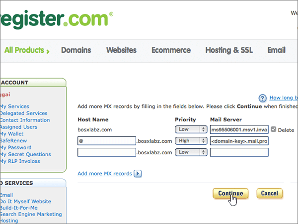
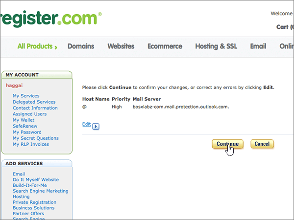
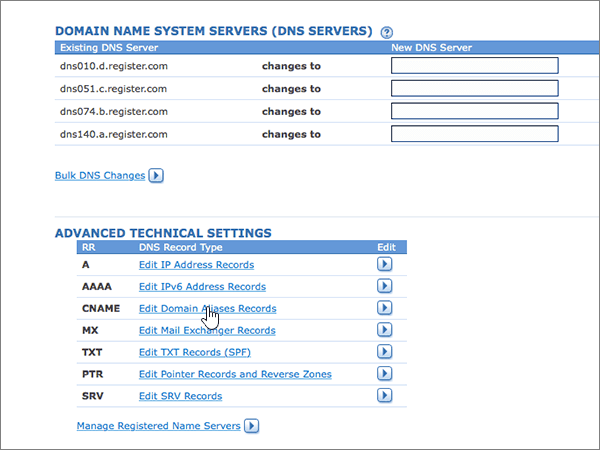
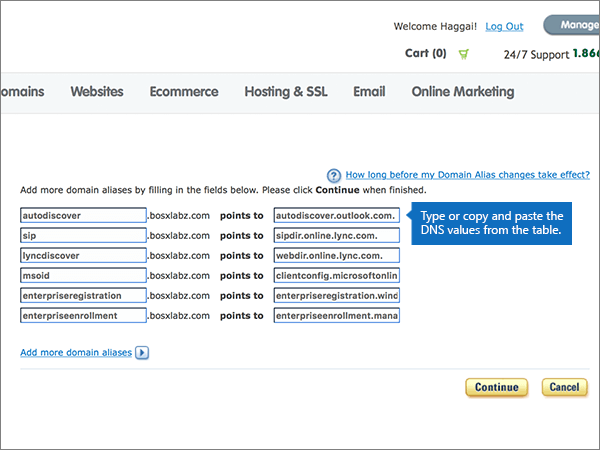
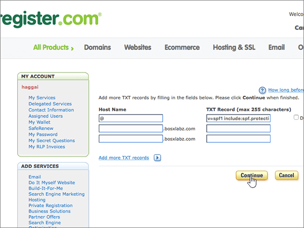
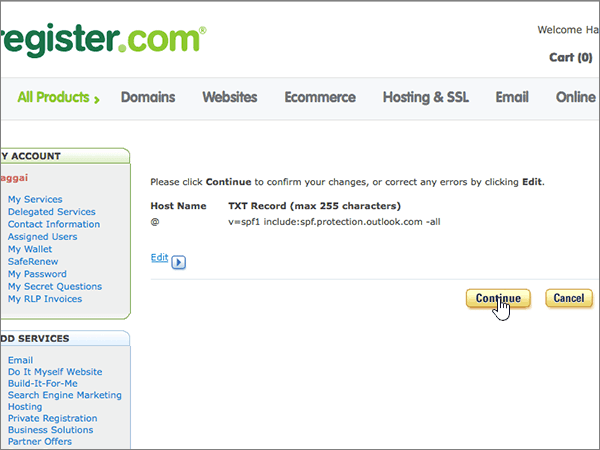
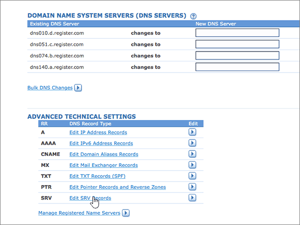

# Criar registros DNS no site Register.com para o Office 365Create DNS records at Register.com for Office 365

 **Caso não encontre o conteúdo que está procurando, [verifique as perguntas frequentes sobre domínios](../setup/domains-faq.md)**.**[Check the Domains FAQ](../setup/domains-faq.md)** if you don't find what you're looking for. 
  
Se você usa a Register.com como provedor de hospedagem DNS, siga as etapas neste artigo para verificar o domínio e configurar registros DNS para o Skype for Business Online, email e outros serviços.If Register.com is your DNS hosting provider, follow the steps in this article to verify your domain and set up DNS records for email, Skype for Business Online, and so on.
  
Estes são os registros principais a adicionar.These are the main records to add. Siga as etapas abaixo ou [assista ao vídeo](https://support.office.com/article/Video-Create-DNS-records-at-Register-com-for-Office-365-7448dd9e-c0e7-4d5e-a7e9-f0e4715433c4?ui=en-US&amp;rs=en-US&amp;ad=US).Follow the steps below or [watch the video](https://support.office.com/article/Video-Create-DNS-records-at-Register-com-for-Office-365-7448dd9e-c0e7-4d5e-a7e9-f0e4715433c4?ui=en-US&amp;rs=en-US&amp;ad=US).
  
- [Adicionar um registro TXT ao Register.com para verificar o proprietário do domínioAdd a TXT record at Register.com to verify that you own the domain](#add-a-txt-record-at-registercom-to-verify-that-you-own-the-domain)
    
- [Adicionar um registro MX para que o email do domínio vá para o Office 365Add an MX record so email for your domain will come to Office 365](#add-an-mx-record-so-email-for-your-domain-will-come-to-office-365)
    
- [Adicionar os registros CNAME necessários para o Office 365Add the CNAME records that are required for Office 365](#add-the-cname-records-that-are-required-for-office-365)
    
- [Adicionar registro TXT à SPF para ajudar a evitar spam de emailAdd a TXT record for SPF to help prevent email spam](#add-a-txt-record-for-spf-to-help-prevent-email-spam)

- [Adicionar os dois registros SRV necessários para o Office 365Add the two SRV records that are required for Office 365](#add-the-two-srv-records-that-are-required-for-office-365)
    
Depois que você adicionar esses registros ao Register.com, o domínio será configurado para funcionar com os serviços do Office 365.After you add these records at Register.com, your domain will be set up to work with Office 365 services.
  
Para saber mais sobre hospedagem na Web e DNS para sites com o Office 365, confira [Usar um site público com o Office 365](https://support.office.com/article/choose-a-public-website-3325d50e-d131-403c-a278-7f3296fe33a9).To learn about webhosting and DNS for websites with Office 365, see [Use a public website with Office 365](https://support.office.com/article/choose-a-public-website-3325d50e-d131-403c-a278-7f3296fe33a9).
  
> [!NOTE]
> Typically it takes about 15 minutes for DNS changes to take effect.Typically it takes about 15 minutes for DNS changes to take effect. Mas, às vezes, pode ser necessário mais tempo para atualizar uma alteração feita no sistema DNS da Internet.However, it can occasionally take longer for a change you've made to update across the Internet's DNS system. Se você tiver problemas com o fluxo de e-mails ou de outro tipo após adicionar os registros DNS, consulte [Localizar e corrigir problemas após alterar o nome de domínio ou registros DNS no Office 365](../get-help-with-domains/find-and-fix-issues.md).If you're having trouble with mail flow or other issues after adding DNS records, see [Find and fix issues after adding your domain or DNS records in Office 365](../get-help-with-domains/find-and-fix-issues.md). 
  
## Adicionar um registro TXT ao Register.com para verificar o proprietário do domínioAdd a TXT record at Register.com to verify that you own the domain

Antes de usar o seu domínio com o Office 365, precisamos verificar se você é o proprietário dele. A capacidade de entrar na conta do seu registrador de domínios e criar o registro DNS prova ao Office 365 que você é o proprietário do domínio.Before you use your domain with Office 365, we have to make sure that you own it. Your ability to log in to your account at your domain registrar and create the DNS record proves to Office 365 that you own the domain.
  
> [!NOTE]
> Esse registro é usado exclusivamente para confirmar se você é o proprietário do domínio; ele não afeta mais nada. É possível excluí-lo mais tarde, se desejar.This record is used only to verify that you own your domain; it doesn't affect anything else. You can delete it later, if you like. 
  
Siga as etapas abaixo ou [assista ao vídeo (inicia em 0:44)](https://support.office.com/article/Video-Create-DNS-records-at-Register-com-for-Office-365-7448dd9e-c0e7-4d5e-a7e9-f0e4715433c4?ui=en-US&amp;rs=en-US&amp;ad=US).Follow the steps below or [watch the video (start at 0:44)](https://support.office.com/article/Video-Create-DNS-records-at-Register-com-for-Office-365-7448dd9e-c0e7-4d5e-a7e9-f0e4715433c4?ui=en-US&amp;rs=en-US&amp;ad=US).
  
1. Para iniciar, vá até a sua página de domínios em Register.com usando [este link](https://www.register.com/myaccount/).To get started, go to your domains page at Register.com by using [this link](https://www.register.com/myaccount/). Você será solicitado a entrar.You'll be prompted to sign in.
    
2. Escolha **Domínios**.Select **Domains**.
    
3. Selecione **gerenciar**.Select **Manage**.
    
4. Localize a linha que contém o nome do domínio que você deseja modificar; e, em seguida, nessa linha, selecione **gerenciar**.Find the row that contains the name of the domain that you want to modify; and then, in that row, select **Manage**.
    
5. Role para baixo até a seção **configurações técnicas avançadas** e selecione **editar registros txt (SPF)**.Scroll down to the **Advanced Technical Settings** section, and then select **Edit TXT Records (SPF)**.
    
6. In the boxes for the new record, type or copy and paste the values from the following table.In the boxes for the new record, type or copy and paste the values from the following table.
    
    |||
    |:-----|:-----|
    |**Host Name****Host Name**   |**TXT Record****TXT Record**   |
    |@    |MS = ms *XXXXXXXX*MS=ms *XXXXXXXX*    **Observação**: esse é um exemplo.**Note:** This is an example. Use seu valor específico de **Destinos ou Pontos de Endereçamento** aqui, da tabela no Office 365.Use your specific **Destination or Points to Address** value here, from the table in Office 365. [Como localizo isto?How do I find this?](../get-help-with-domains/information-for-dns-records.md)          |
   
7. Selecione **continuar**.Select **Continue**.
    
8. Na próxima página, selecione **continuar** novamente para confirmar suas alterações.On the next page, select **Continue** again to confirm your changes. 
    
9. Aguarde alguns minutos antes de prosseguir para que o registro que você acabou de criar possa ser atualizado na Internet.Wait a few minutes before you continue, so that the record you just created can update across the Internet.
    
Agora que você adicionou o registro no site do seu registrador de domínios, retorne ao Office 365 e solicite que o Office 365 procure o registro.Now that you've added the record at your domain registrar's site, you'll go back to Office 365 and request Office 365 to look for the record.
  
Quando o Office 365 encontrar o registro TXT correto, o domínio será verificado.When Office 365 finds the correct TXT record, your domain is verified.
  
1. No centro do administrador, acesse a página **Configurações de** \> <a href="https://go.microsoft.com/fwlink/p/?linkid=834818" target="_blank">domínios</a>.In the admin center, go to the **Settings** \> <a href="https://go.microsoft.com/fwlink/p/?linkid=834818" target="_blank">Domains</a> page.
    
2. Na página **Domínios**, clique no domínio que você está verificando.On the **Domains** page, select the domain that you are verifying. 
    
3. Na página **Configuração**, clique em **Iniciar configuração**.On the **Setup** page, select **Start setup**.
    
4. Na página **Verificar domínio**, clique em **Verificar**.On the **Verify domain** page, select **Verify**.
    
> [!NOTE]
> Typically it takes about 15 minutes for DNS changes to take effect.Typically it takes about 15 minutes for DNS changes to take effect. Mas, às vezes, pode ser necessário mais tempo para atualizar uma alteração feita no sistema DNS da Internet.However, it can occasionally take longer for a change you've made to update across the Internet's DNS system. Se você tiver problemas com o fluxo de e-mails ou de outro tipo após adicionar os registros DNS, consulte [Localizar e corrigir problemas após alterar o nome de domínio ou registros DNS no Office 365](../get-help-with-domains/find-and-fix-issues.md).If you're having trouble with mail flow or other issues after adding DNS records, see [Find and fix issues after adding your domain or DNS records in Office 365](../get-help-with-domains/find-and-fix-issues.md). 
  
## Adicionar um registro MX para que o e-mail do domínio vá para o Office 365Add an MX record so email for your domain will come to Office 365

Siga as etapas abaixo ou [assista ao vídeo (inicia em 3:32)](https://support.office.com/article/Video-Create-DNS-records-at-Register-com-for-Office-365-7448dd9e-c0e7-4d5e-a7e9-f0e4715433c4?ui=en-US&amp;rs=en-US&amp;ad=US).Follow the steps below or [watch the video (start at 3:32)](https://support.office.com/article/Video-Create-DNS-records-at-Register-com-for-Office-365-7448dd9e-c0e7-4d5e-a7e9-f0e4715433c4?ui=en-US&amp;rs=en-US&amp;ad=US).
  
1. Para iniciar, vá até a sua página de domínios em Register.com usando [este link](https://www.register.com/myaccount/).To get started, go to your domains page at Register.com by using [this link](https://www.register.com/myaccount/). Você será solicitado a entrar.You'll be prompted to sign in.
    
2. Escolha **Domínios**.Select **Domains**.
    
3. Selecione **gerenciar**.Select **Manage**.
    
4. Localize a linha que contém o nome do domínio que você deseja modificar; e, em seguida, nessa linha, selecione **gerenciar**.Find the row that contains the name of the domain that you want to modify; and then, in that row, select **Manage**.
    
5. Role até a seção **configurações técnicas avançadas** e, em seguida, selecione **editar registros de servidor de mensagens**.Scroll to the **Advanced Technical Settings** section, and then select **Edit Mail Exchanger Records**.
    
    
  
6. Nas caixas do novo registro, digite ou copie e cole os valores da seguinte tabela.In the boxes for the new record, type or copy and paste the values from the following table.
    
    (Escolha o valor **prioridade** na lista suspensa.)(Choose the **Priority** value from the drop-down list.) 
    
    |\*\*\*\*Nome do host\*\*\*\*\*\*\*\*Host Name\*\*\*\*|\*\*\*\*Prioridade\*\*\*\*\*\*\*\*Priority\*\*\*\*|\*\*\*\*Servidor de Email\*\*\*\*\*\*\*\*Mail Server\*\*\*\*|
    |:-----|:-----|:-----|
    |@    |AltoHigh    Para saber mais sobre prioridade, confira [O que é prioridade MX?](https://support.office.com/article/2784cc4d-95be-443d-b5f7-bb5dd867ba83.aspx)For more information about priority, see [What is MX priority?](https://support.office.com/article/2784cc4d-95be-443d-b5f7-bb5dd867ba83.aspx)   | *\<chave-do-domínio\>*  .mail.protection.outlook.com*\<domain-key\>*  .mail.protection.outlook.com      **Observação:** Obtenha a sua \<*chave-de-domínio*\> através da conta do Office 365.**Note:** Get your \<*domain-key*\> from your Office 365 account.   [Como localizo isto?How do I find this?](../get-help-with-domains/information-for-dns-records.md)          |
   
    
  
7. Se houver outros registros MX já listados, escolha cada um desses registros a serem excluídos.If there were any other MX records already listed, select each of those records to be deleted.
    
    
  
8. Selecione **continuar**.Select **Continue**.
    
    
  
9. Na próxima página, selecione **continuar** novamente para confirmar e salvar as alterações.On the next page, select **Continue** again to confirm and save your changes. 
    
    
  
## Adicionar os registros CNAME necessários do Office 365Add the CNAME records that are required for Office 365

Siga as etapas abaixo ou [assista ao vídeo (inicia em 4:23)](https://support.office.com/article/Video-Create-DNS-records-at-Register-com-for-Office-365-7448dd9e-c0e7-4d5e-a7e9-f0e4715433c4?ui=en-US&amp;rs=en-US&amp;ad=US).Follow the steps below or [watch the video (start at 4:23)](https://support.office.com/article/Video-Create-DNS-records-at-Register-com-for-Office-365-7448dd9e-c0e7-4d5e-a7e9-f0e4715433c4?ui=en-US&amp;rs=en-US&amp;ad=US).
  
1. Para iniciar, vá até a sua página de domínios em Register.com usando [este link](https://www.register.com/myaccount/).To get started, go to your domains page at Register.com by using [this link](https://www.register.com/myaccount/). Você será solicitado a entrar.You'll be prompted to sign in.
    
2. Escolha **Domínios**.Select **Domains**.
    
3. Selecione **gerenciar**.Select **Manage**.
    
4. Localize a linha que contém o nome do domínio que você deseja modificar; e, em seguida, nessa linha, selecione **gerenciar**.Find the row that contains the name of the domain that you want to modify; and then, in that row, select **Manage**.
    
5. Role até a seção **configurações técnicas avançadas** e, em seguida, selecione **editar registros de alias de domínio**.Scroll to the **Advanced Technical Settings** section, and then select **Edit Domain Aliases Records**.
    
    
  
6. Selecione **adicionar mais aliases de domínio**.Select **Add more domain aliases**.
    
    
  
7. Adicione os registros CNAME.Add the required CNAME records.
    
    Nas caixas do novo registro, digite ou copie e cole os valores da primeira linha da tabela a seguir.In the boxes for the new record, type or copy and paste the values from the first row of the following table.
    
    |\*\*\*\*Primeiro campo (sem rótulo)\*\*\*\*\*\*\*\*First field (unlabeled)\*\*\*\*|\*\*\*\*Pontos de\*\*\*\*\*\*\*\*Points to\*\*\*\*|
    |:-----|:-----|
    |descoberta automáticaautodiscover    |autodiscover.outlook.comautodiscover.outlook.com       |
    |sipsip    |sipdir.online.lync.comsipdir.online.lync.com       |
    |lyncdiscoverlyncdiscover    |webdir.online.lync.comwebdir.online.lync.com      |
    |enterpriseregistrationenterpriseregistration    |enterpriseregistration.windows.netenterpriseregistration.windows.net       |
    |enterpriseenrollmententerpriseenrollment    |enterpriseenrollment-s.manage.microsoft.comenterpriseenrollment-s.manage.microsoft.com       |
   
     
  
8. Depois de adicionar todos os registros CNAME necessários, selecione **continuar**.When you have added all of the CNAME records that you need, select **Continue**.
    
    
  
9. Na próxima página, selecione **continuar** novamente para confirmar e salvar as alterações.On the next page, select **Continue** again to confirm and save your changes. 
    
    
  
## Adicionar o registro TXT à SPF para ajudar a evitar spam de e-mailAdd a TXT record for SPF to help prevent email spam

> [!IMPORTANT]
> Não é possível ter mais de um registro TXT para SPF para um domínio.You cannot have more than one TXT record for SPF for a domain. Se o seu domínio possuir mais de um registro SPF, ocorrerão erros de email, bem como problemas na entrega e na classificação de spam.If your domain has more than one SPF record, you'll get email errors, as well as delivery and spam classification issues. If you already have an SPF record for your domain, don't create a new one for Office 365.If you already have an SPF record for your domain, don't create a new one for Office 365. Em vez disso, adicione os valores necessários do Office 365 ao registro atual, de modo que você tenha um único registro SPF que inclua os dois conjuntos de valores.Instead, add the required Office 365 values to the current record so that you have a single SPF record that includes both sets of values.  
  
Siga as etapas abaixo ou [assista ao vídeo (inicia em 5:12)](https://support.office.com/article/Video-Create-DNS-records-at-Register-com-for-Office-365-7448dd9e-c0e7-4d5e-a7e9-f0e4715433c4?ui=en-US&amp;rs=en-US&amp;ad=US).Follow the steps below or [watch the video (start at 5:12)](https://support.office.com/article/Video-Create-DNS-records-at-Register-com-for-Office-365-7448dd9e-c0e7-4d5e-a7e9-f0e4715433c4?ui=en-US&amp;rs=en-US&amp;ad=US).
  
1. Para iniciar, vá até a sua página de domínios em Register.com usando [este link](https://www.register.com/myaccount/).To get started, go to your domains page at Register.com by using [this link](https://www.register.com/myaccount/). Você será solicitado a entrar.You'll be prompted to sign in.
    
2. Escolha **Domínios**.Select **Domains**.
    
3. Selecione **gerenciar**.Select **Manage**.
    
4. Localize a linha que contém o nome do domínio que você deseja modificar; e, em seguida, nessa linha, selecione **gerenciar**.Find the row that contains the name of the domain that you want to modify; and then, in that row, select **Manage**.
    
5. Role até a seção **configurações técnicas avançadas** e selecione **editar registros txt (SPF)**.Scroll to the **Advanced Technical Settings** section, and then select **Edit TXT Records (SPF)**.
    
    
  
6. Nas caixas do novo registro, digite ou copie e cole os valores da seguinte tabela.In the boxes for the new record, type or copy and paste the values from the following table.
    
    |\*\*\*\*Nome do Host\*\*\*\*\*\*\*\*Host Name\*\*\*\*|\*\*\*\*Registro TXT\*\*\*\*\*\*\*\*TXT Record\*\*\*\*|
    |:-----|:-----|
    |@    |v=spf1 include:spf.protection.outlook.com -allv=spf1 include:spf.protection.outlook.com -all    **Observação:** é recomendável copiar e colar essa entrada para que o espaçamento permaneça correto.**Note:** We recommend copying and pasting this entry, so that all of the spacing stays correct.  |
   
     
  
7. Selecione **continuar**.Select **Continue**.
    
    
  
8. Na próxima página, selecione **continuar** novamente para confirmar e salvar as alterações.On the next page, select **Continue** again to confirm and save your changes. 
    
    
  
## Adicionar os dois registros SRV necessários do Office 365Add the two SRV records that are required for Office 365

Siga as etapas abaixo ou [assista ao vídeo (inicia em 5:55)](https://support.office.com/article/Video-Create-DNS-records-at-Register-com-for-Office-365-7448dd9e-c0e7-4d5e-a7e9-f0e4715433c4?ui=en-US&amp;rs=en-US&amp;ad=US).Follow the steps below or [watch the video (start at 5:55)](https://support.office.com/article/Video-Create-DNS-records-at-Register-com-for-Office-365-7448dd9e-c0e7-4d5e-a7e9-f0e4715433c4?ui=en-US&amp;rs=en-US&amp;ad=US).
  
1. Para iniciar, vá até a sua página de domínios em Register.com usando [este link](https://www.register.com/myaccount/). Você será solicitado a entrar.To get started, go to your domains page at Register.com by using [this link](https://www.register.com/myaccount/). You'll be prompted to sign in.
    
2. Escolha **Domínios**.Select **Domains**.
    
3. Selecione **gerenciar**.Select **Manage**.
    
4. Localize a linha que contém o nome do domínio que você deseja modificar; e, em seguida, nessa linha, selecione **gerenciar**.Find the row that contains the name of the domain that you want to modify; and then, in that row, select **Manage**.
    
5. Role até a seção **configurações técnicas avançadas** e selecione **Editar Registros SRV**.Scroll to the **Advanced Technical Settings** section, and then select **Edit SRV Records**.
    
    
  
6. Adicione o primeiro dos dois registros SRV:Add the first of the two SRV records:
    
    Nas caixas do novo registro, digite ou copie e cole os valores da primeira linha da tabela a seguir.In the boxes for the new record, type or copy and paste the values from the first row of the following table.
    
    (Escolha o valor **prioridade** na lista suspensa.)(Choose the **Priority** value from the drop-down list.) 
    
    |\*\*\*\*Serviço\*\*\*\*\*\*\*\*Service\*\*\*\*|\*\*\*\*Proto\*\*\*\*\*\*\*\*Proto\*\*\*\*|\*\*\*\*Nome\*\*\*\*\*\*\*\*Name\*\*\*\*|\*\*\*\*Prioridade\*\*\*\*\*\*\*\*Priority\*\*\*\*|\*\*\*\*Peso\*\*\*\*\*\*\*\*Weight\*\*\*\*|\*\*\*\*Porta\*\*\*\*\*\*\*\*Port\*\*\*\*|\*\*\*\*Destino\*\*\*\*\*\*\*\*Target\*\*\*\*|
    |:-----|:-----|:-----|:-----|:-----|:-----|:-----|
    |_sip_sip    |_tls_tls    |@    |AltaHigh    |11    |443443    |sipdir.online.lync.comsipdir.online.lync.com       |
    |_sipfederationtls_sipfederationtls    |_tcp_tcp    |@    |AltaHigh    |11    |50615061    |sipfed.online.lync.comsipfed.online.lync.com       |
   
    
  
7. Selecione **adicionar mais registros SRV**.Select **Add more SRV records**.
    
    
  
8. Adicione o segundo registro SRV:Add the second SRV record:
    
    Digite ou copie e cole os valores da segunda linha da tabela acima nas caixas do segundo registro.Type or copy and paste the values from the second row of the table above into the boxes for the second record.
    
9. Após adicionar ambos os registros SRV, selecione **continuar**.When you have added both of the SRV records, select **Continue**.
    
    
  
10. Na próxima página, selecione **continuar** novamente para confirmar e salvar as alterações.On the next page, select **Continue** again to confirm and save your changes. 
    
    
  
> [!NOTE]
> Typically it takes about 15 minutes for DNS changes to take effect.Typically it takes about 15 minutes for DNS changes to take effect. Mas, às vezes, pode ser necessário mais tempo para atualizar uma alteração feita no sistema DNS da Internet.However, it can occasionally take longer for a change you've made to update across the Internet's DNS system. Se você tiver problemas com o fluxo de e-mails ou de outro tipo após adicionar os registros DNS, consulte [Localizar e corrigir problemas após alterar o nome de domínio ou registros DNS no Office 365](../get-help-with-domains/find-and-fix-issues.md).If you're having trouble with mail flow or other issues after adding DNS records, see [Find and fix issues after adding your domain or DNS records in Office 365](../get-help-with-domains/find-and-fix-issues.md). 
  
