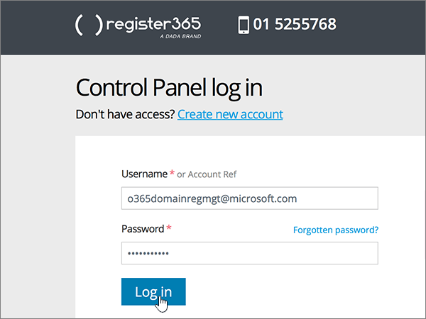

# Criar registros DNS no Register365 para MicrosoftCreate DNS records at Register365 for Microsoft

 **Caso não encontre o conteúdo que está procurando, [verifique as perguntas frequentes sobre domínios](../setup/domains-faq.md)**.**[Check the Domains FAQ](../setup/domains-faq.md)** if you don't find what you're looking for. 
  
Se você usa o Register365 como provedor de hospedagem DNS, realize os procedimentos deste artigo para verificar o domínio e configurar registros DNS para o Skype for Business Online, email e outros serviços.If Register365 is your DNS hosting provider, follow the steps in this article to verify your domain and set up DNS records for email, Skype for Business Online, and so on. 
  
Esses são os principais registros a adicionar.These are the main records to add.  
  
- [Adicionar um registro TXT para verificaçãoAdd a TXT record for verification](#add-a-txt-record-for-verification)
    
- [Adicionar um registro MX para que o email do seu domínio seja fornecido para a MicrosoftAdd an MX record so email for your domain will come to Microsoft](#add-an-mx-record-so-email-for-your-domain-will-come-to-microsoft)
    
- [Adicionar os seis registros CNAME necessários para o MicrosoftAdd the six CNAME records that are required for Microsoft](#add-the-six-cname-records-that-are-required-for-microsoft)
    
- [Adicionar registro TXT à SPF para ajudar a evitar spam de emailAdd a TXT record for SPF to help prevent email spam](#add-a-txt-record-for-spf-to-help-prevent-email-spam)
    
- [Adicionar os dois registros SRV necessários para o MicrosoftAdd the two SRV records that are required for Microsoft](#add-the-two-srv-records-that-are-required-for-microsoft)
    
Depois que você adicionar esses registros à Microsoft, o domínio será configurado para funcionar com os serviços da Microsoft.After you add these records at Microsoft, your domain will be set up to work with Microsoft services.
  
Para saber mais sobre o webhosting e o DNS para sites com a Microsoft, confira [usar um site público com a Microsoft](https://support.office.com/article/choose-a-public-website-3325d50e-d131-403c-a278-7f3296fe33a9).To learn about webhosting and DNS for websites with Microsoft, see [Use a public website with Microsoft](https://support.office.com/article/choose-a-public-website-3325d50e-d131-403c-a278-7f3296fe33a9).
  
> [!NOTE]
>  Normalmente, são necessários cerca de 15 minutos para que as alterações de DNS entrem em vigor. Mas, às vezes, pode ser necessário mais tempo para atualizar uma alteração feita no sistema DNS da Internet. Se você tiver problemas com o fluxo de emails ou de outro tipo após adicionar os registros DNS, consulte [Solucionar problemas após alterar o nome de domínio ou registros DNS](../get-help-with-domains/find-and-fix-issues.md).Typically it takes about 15 minutes for DNS changes to take effect. However, it can occasionally take longer for a change you've made to update across the Internet's DNS system. If you're having trouble with mail flow or other issues after adding DNS records, see [Troubleshoot issues after changing your domain name or DNS records](../get-help-with-domains/find-and-fix-issues.md). 
  
## Adicionar um registro TXT para verificaçãoAdd a TXT record for verification

Antes de usar seu domínio com a Microsoft, precisamos garantir que você o tenha.Before you use your domain with Microsoft, we have to make sure that you own it. Sua capacidade de fazer logon em sua conta no registrador de domínios e criar o registro DNS comprova para a Microsoft que você é o proprietário do domínio.Your ability to log in to your account at your domain registrar and create the DNS record proves to Microsoft that you own the domain.
  
> [!NOTE]
> Esse registro é usado exclusivamente para confirmar se você é o proprietário do domínio; ele não afeta mais nada. É possível excluí-lo mais tarde, se desejar.This record is used only to verify that you own your domain; it doesn't affect anything else. You can delete it later, if you like. 
  
1. Para iniciar, vá até a sua página de domínios em Register365, usando [este link](https://admin.register365.com/dns/). Será solicitado que você faça logon primeiro.To get started, go to your domains page at Register365 by using [this link](https://admin.register365.com/dns/). You'll be prompted to log in first.
    
    
  
2. Na página **Painel**, procure o nome do domínio que será atualizado e escolha **Configurações de DNS**, na lista suspensa.On the **Dashboard** page, find the name of the domain that you're updating, and then choose **DNS Settings** from the drop-down list. 
    
    Pode ser necessário rolar a tela para baixo.(You may have to scroll down.)
    
    
  
3. On the **Add/Modify DNS Zone** page, in the **A, CNAME, AAAA, TXT and NS records** section, in the boxes for the new record, type or copy and paste the values from the following table.On the **Add/Modify DNS Zone** page, in the **A, CNAME, AAAA, TXT and NS records** section, in the boxes for the new record, type or copy and paste the values from the following table. 
    
    (Choose the **Type** value from the drop-down list.)(Choose the **Type** value from the drop-down list.) 
    
    (Se você precisar adicionar uma linha, selecione **adicionar registros a/CNAME (+)**.)(If you need to add a row, select **ADD A/CNAME RECORDS (+)**.)
    
    (You may have to scroll down.)(You may have to scroll down.)
    
    |**Nome do host****Host name**|**Tipo****Type**|**Resultado****Result**|
    |:-----|:-----|:-----|
    |(Leave this field empty.)(Leave this field empty.)    |TXTTXT    |MS = ms *XXXXXXXX*MS=ms *XXXXXXXX*    **Observação**: esse é um exemplo.**Note:** This is an example. Use o seu **destino específico ou aponte para** o valor de endereço aqui, a partir da tabela.Use your specific **Destination or Points to Address** value here, from the table.           [Como localizo isto?How do I find this?](../get-help-with-domains/information-for-dns-records.md)          |
   
    
  
4. Selecione **Salvar**.Select **Save**.
    
    (You may have to scroll down.)(You may have to scroll down.)
    
    
  
5. Aguarde alguns minutos antes de prosseguir para que o registro que você acabou de criar possa ser atualizado na Internet.Wait a few minutes before you continue, so that the record you just created can update across the Internet.
    
Agora que você adicionou o registro no site do seu registrador de domínio, você voltará para a Microsoft e solicitará o registro.Now that you've added the record at your domain registrar's site, you'll go back to Microsoft and request the record.
  
Quando a Microsoft encontrar o registro TXT correto, seu domínio será verificado.When Microsoft finds the correct TXT record, your domain is verified.
  
1. No centro do administrador, acesse a página **Configurações de** \> <a href="https://go.microsoft.com/fwlink/p/?linkid=834818" target="_blank">domínios</a>.In the admin center, go to the **Settings** \> <a href="https://go.microsoft.com/fwlink/p/?linkid=834818" target="_blank">Domains</a> page.
    
2. Na página **Domínios**, clique no domínio que você está verificando.On the **Domains** page, select the domain that you are verifying. 
    
    
  
3. Na página **Configuração**, clique em **Iniciar configuração**.On the **Setup** page, select **Start setup**.
    
    
  
4. Na página **Verificar domínio**, marque **Verificar**.On the **Verify domain** page, select **Verify**.
    
    
  
> [!NOTE]
>  Normalmente, são necessários cerca de 15 minutos para que as alterações de DNS entrem em vigor. Mas, às vezes, pode ser necessário mais tempo para atualizar uma alteração feita no sistema DNS da Internet. Se você tiver problemas com o fluxo de emails ou de outro tipo após adicionar os registros DNS, consulte [Solucionar problemas após alterar o nome de domínio ou registros DNS](../get-help-with-domains/find-and-fix-issues.md).Typically it takes about 15 minutes for DNS changes to take effect. However, it can occasionally take longer for a change you've made to update across the Internet's DNS system. If you're having trouble with mail flow or other issues after adding DNS records, see [Troubleshoot issues after changing your domain name or DNS records](../get-help-with-domains/find-and-fix-issues.md). 
  
## Adicionar um registro MX para que o email do seu domínio seja fornecido para a MicrosoftAdd an MX record so email for your domain will come to Microsoft

1. Para iniciar, vá até a sua página de domínios em Register365, usando [este link](https://admin.register365.com/dns/). Será solicitado que você faça logon primeiro.To get started, go to your domains page at Register365 by using [this link](https://admin.register365.com/dns/). You'll be prompted to log in first.
    
    
  
2. Na página **Painel**, procure o nome do domínio que será atualizado e escolha **Configurações de DNS**, na lista suspensa.On the **Dashboard** page, find the name of the domain that you're updating, and then choose **DNS Settings** from the drop-down list. 
    
    Pode ser necessário rolar a tela para baixo.(You may have to scroll down.)
    
    
  
3. Na página **Adicionar/Modificar Zona DNS**, na seção **Registros MX**, digite ou copie e cole os valores nas caixas do novo registro, a partir da tabela a seguir.On the **Add/Modify DNS Zone** page, in the **Mail exchange records** section, in the boxes for the new record, type or copy and paste the values from the following table. 
    
    (Pode ser necessário rolar para baixo.)(You may have to scroll down.)
    
    |**Nome do host****Host name**|**Prioridade****Priority**|**Resultado****Result**|
    |:-----|:-----|:-----|
    |(Deixe este campo vazio.)(Leave this field empty.)    |11    Para saber mais sobre prioridade, confira [O que é prioridade MX?](https://support.office.com/article/2784cc4d-95be-443d-b5f7-bb5dd867ba83.aspx)For more information about priority, see [What is MX priority?](https://support.office.com/article/2784cc4d-95be-443d-b5f7-bb5dd867ba83.aspx)   | *\<chave-do-domínio\>*  .mail.protection.outlook.com*\<domain-key\>*  .mail.protection.outlook.com    **Observação:** Obtenha sua \* \<chave\> de domínio\* de sua conta da Microsoft.**Note:** Get your  *\<domain-key\>*  from your Microsoft account.  [Como localizo isto?How do I find this?](../get-help-with-domains/information-for-dns-records.md)     |
   
    
  
4. Selecione **Salvar**.Select **Save**.
    
    (You may have to scroll down.)(You may have to scroll down.)
    
    
  
5. Se houver outros registros MX na seção **Registros MX**, selecione cada um deles e pressione a tecla **Delete** no teclado para excluí-los.If there are any other MX records in the **Mail exchange records** section, delete each one by selecting it and then pressing the **Delete** key on your keyboard. 
    
    
  
6. Selecione **Salvar**.Select **Save**.
    
    (You may have to scroll down.)(You may have to scroll down.)
    
    
  
## Adicionar os seis registros CNAME necessários para o MicrosoftAdd the six CNAME records that are required for Microsoft

1. Para iniciar, vá até a sua página de domínios em Register365, usando [este link](https://admin.register365.com/dns/). Será solicitado que você faça logon primeiro.To get started, go to your domains page at Register365 by using [this link](https://admin.register365.com/dns/). You'll be prompted to log in first.
    
    
  
2. Na página **Painel**, procure o nome do domínio que será atualizado e escolha **Configurações de DNS**, na lista suspensa.On the **Dashboard** page, find the name of the domain that you're updating, and then choose **DNS Settings** from the drop-down list. 
    
    Pode ser necessário rolar a tela para baixo.(You may have to scroll down.)
    
    
  
3. Na página **Adicionar/Modificar Zona DNS**, na seção **Registros A, CNAME, AAAA, TXT e NS**, digite ou copie e cole os valores nas caixas dos novos registros, a partir da tabela a seguir.On the **Add/Modify DNS Zone** page, in the **A, CNAME, AAAA, TXT and NS records** section, in the boxes for the new records, type or copy and paste the values from the following table. 
    
    (Choose the **Type** value from the drop-down list.)(Choose the **Type** value from the drop-down list.) 
    
    (Se você precisar adicionar uma linha, selecione **adicionar registros a/CNAME (+)**.)(If you need to add a row, select **ADD A/CNAME RECORDS (+)**.)
    
    (Pode ser necessário rolar para baixo.)(You may have to scroll down.)
    
    |\*\*\*\*Nome do host\*\*\*\*\*\*\*\*Host name\*\*\*\*|\*\*\*\*Tipo\*\*\*\*\*\*\*\*Type\*\*\*\*|\*\*\*\*Resultado\*\*\*\*\*\*\*\*Result\*\*\*\*|
    |:-----|:-----|:-----|
    |autodiscoverautodiscover    |CNAMECNAME    |autodiscover.outlook.comautodiscover.outlook.com    |
    |sipsip    |CNAMECNAME    |sipdir.online.lync.comsipdir.online.lync.com    |
    |lyncdiscoverlyncdiscover    |CNAMECNAME    |webdir.online.lync.comwebdir.online.lync.com    |
    |enterpriseregistrationenterpriseregistration    |CNAMECNAME    |enterpriseregistration.windows.netenterpriseregistration.windows.net    |
    |enterpriseenrollmententerpriseenrollment    |CNAMECNAME    |enterpriseenrollment-s.manage.microsoft.comenterpriseenrollment-s.manage.microsoft.com    |
   
    
  
4. Selecione **Salvar**.Select **Save**.
    
    
  
## Adicionar o registro TXT à SPF para ajudar a evitar spam de e-mailAdd a TXT record for SPF to help prevent email spam

> [!IMPORTANT]
> Não é possível ter mais de um registro TXT para SPF para um domínio.You cannot have more than one TXT record for SPF for a domain. Se o seu domínio possuir mais de um registro SPF, ocorrerão erros de email, bem como problemas na entrega e na classificação de spam.If your domain has more than one SPF record, you'll get email errors, as well as delivery and spam classification issues. Se você já tiver um registro SPF para seu domínio, não crie um novo para a Microsoft.If you already have an SPF record for your domain, don't create a new one for Microsoft. Em vez disso, adicione os valores necessários da Microsoft ao registro atual para que você tenha um *único* registro SPF que inclua os dois conjuntos de valores.Instead, add the required Microsoft values to the current record so that you have a  *single*  SPF record that includes both sets of values. 
  
1. Para iniciar, vá até a sua página de domínios em Register365, usando [este link](https://admin.register365.com/dns/). Será solicitado que você faça logon primeiro.To get started, go to your domains page at Register365 by using [this link](https://admin.register365.com/dns/). You'll be prompted to log in first.
    
    
  
2. Na página **Painel**, procure o nome do domínio que será atualizado e escolha **Configurações de DNS**, na lista suspensa.On the **Dashboard** page, find the name of the domain that you're updating, and then choose **DNS Settings** from the drop-down list. 
    
    Pode ser necessário rolar a tela para baixo.(You may have to scroll down.)
    
    
  
3. On the **Add/Modify DNS Zone** page, in the **A, CNAME, AAAA, TXT and NS records** section, in the boxes for the new record, type or copy and paste the values from the following table.On the **Add/Modify DNS Zone** page, in the **A, CNAME, AAAA, TXT and NS records** section, in the boxes for the new record, type or copy and paste the values from the following table. 
    
    (Choose the **Type** value from the drop-down list.)(Choose the **Type** value from the drop-down list.) 
    
    (Se você precisar adicionar uma linha, selecione **adicionar registros a/CNAME (+)**.)(If you need to add a row, select **ADD A/CNAME RECORDS (+)**.)
    
    (You may have to scroll down.)(You may have to scroll down.)
    
    |**Nome do host****Host name**|**Tipo****Type**|**Resultado****Result**|
    |:-----|:-----|:-----|
    |(Leave this field empty.)(Leave this field empty.)    |TXTTXT    |v=spf1 include:spf.protection.outlook.com -allv=spf1 include:spf.protection.outlook.com -all   **Observação:** é recomendável copiar e colar essa entrada para que o espaçamento permaneça correto.**Note:** We recommend copying and pasting this entry, so that all of the spacing stays correct.           |
   
    
  
4. Selecione **Salvar**.Select **Save**.
    
    (You may have to scroll down.)(You may have to scroll down.)
    
    
  
## Adicionar os dois registros SRV necessários para o MicrosoftAdd the two SRV records that are required for Microsoft

1. Para iniciar, vá até a sua página de domínios em Register365, usando [este link](https://admin.register365.com/dns/). Será solicitado que você faça logon primeiro.To get started, go to your domains page at Register365 by using [this link](https://admin.register365.com/dns/). You'll be prompted to log in first.
    
    
  
2. Na página **Painel**, procure o nome do domínio que será atualizado e escolha **Configurações de DNS**, na lista suspensa.On the **Dashboard** page, find the name of the domain that you're updating, and then choose **DNS Settings** from the drop-down list. 
    
    Pode ser necessário rolar a tela para baixo.(You may have to scroll down.)
    
    
  
3. Na página **Adicionar/Modificar Zona DNS**, na seção **Registros de serviço**, digite ou copie e cole os valores nas caixas dos novos registros, a partir da tabela a seguir.On the **Add/Modify DNS Zone** page, in the **Service records** section, in the boxes for the new records, type or copy and paste the values from the following table. 
    
    (Pode ser necessário rolar para baixo.)(You may have to scroll down.)
    
    |**Nome****Name**|**Prioridade****Priority**|**Espessura****Weight**|**Porta****Port**|**Resultado****Result**|
    |:-----|:-----|:-----|:-----|:-----|
    |_sip. _tls_sip._tls    |100100    |11    |443443    |sipdir.online.lync.comsipdir.online.lync.com    |
    |_sipfederationtls. _tcp_sipfederationtls._tcp    |100100    |11    |50615061    |sipfed.online.lync.comsipfed.online.lync.com    |
   
    
  
4. Selecione **Salvar**.Select **Save**.
    
    (You may have to scroll down.)(You may have to scroll down.)
    
    
  
> [!NOTE]
>  Normalmente, são necessários cerca de 15 minutos para que as alterações de DNS entrem em vigor. Mas, às vezes, pode ser necessário mais tempo para atualizar uma alteração feita no sistema DNS da Internet. Se você tiver problemas com o fluxo de emails ou de outro tipo após adicionar os registros DNS, consulte [Solucionar problemas após alterar o nome de domínio ou registros DNS](../get-help-with-domains/find-and-fix-issues.md).Typically it takes about 15 minutes for DNS changes to take effect. However, it can occasionally take longer for a change you've made to update across the Internet's DNS system. If you're having trouble with mail flow or other issues after adding DNS records, see [Troubleshoot issues after changing your domain name or DNS records](../get-help-with-domains/find-and-fix-issues.md). 
  
