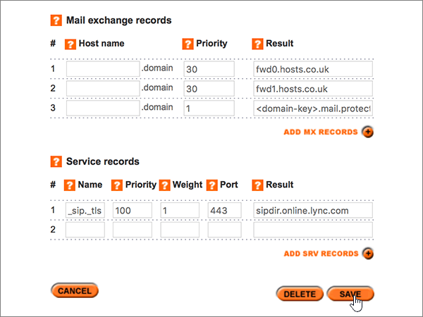

# Criar registros DNS no site Register365 para a Microsoft

 **Caso não encontre o conteúdo que está procurando, [verifique as perguntas frequentes sobre domínios](../setup/domains-faq.yml)**. 
  
Se você usa o Register365 como provedor de hospedagem DNS, realize os procedimentos deste artigo para verificar o domínio e configurar registros DNS para o Skype for Business Online, email e outros serviços. 
  
Esses são os principais registros a adicionar.  
  
- [Adicionar um registro TXT para verificação](#add-a-txt-record-for-verification)
    
- [Adicione um registro MX para que o email do domínio vá para a Microsoft.](#add-an-mx-record-so-email-for-your-domain-will-come-to-microsoft)
    
- [Adicionar os seis registros CNAME necessários para a Microsoft](#add-the-six-cname-records-that-are-required-for-microsoft)
    
- [Adicionar registro TXT à SPF para ajudar a evitar spam de email](#add-a-txt-record-for-spf-to-help-prevent-email-spam)
    
- [Adicionar os dois registros SRV necessários para a Microsoft](#add-the-two-srv-records-that-are-required-for-microsoft)
    
Depois que você adicionar esses registros à Microsoft, seu domínio será definido para funcionar com os serviços Microsoft.
  
> [!NOTE]
>  Normalmente, são necessários cerca de 15 minutos para que as alterações de DNS entrem em vigor. Mas, às vezes, pode ser necessário mais tempo para atualizar uma alteração feita no sistema DNS da Internet. Se você tiver problemas com o fluxo de emails ou de outro tipo após adicionar os registros DNS, consulte [Solucionar problemas após alterar o nome de domínio ou registros DNS](../get-help-with-domains/find-and-fix-issues.md). 
  
## Adicionar um registro TXT para verificação

Antes de usar o seu domínio com a Microsoft, precisamos verificar se você é o proprietário dele. A capacidade de entrar na conta do seu registrador de domínios e criar o registro de DNS prova à Microsoft que você é o proprietário do domínio.
  
> [!NOTE]
> Esse registro é usado exclusivamente para confirmar se você é o proprietário do domínio; ele não afeta mais nada. É possível excluí-lo mais tarde, se desejar. 
  
1. Para iniciar, vá até a sua página de domínios em Register365, usando [este link](https://admin.register365.com/dns/). Será solicitado que você faça logon primeiro.
    
    
  
2. Na página **Painel**, procure o nome do domínio que será atualizado e escolha **Configurações de DNS**, na lista suspensa. 
    
    Pode ser necessário rolar a tela para baixo.
    
    
  
3. On the **Add/Modify DNS Zone** page, in the **A, CNAME, AAAA, TXT and NS records** section, in the boxes for the new record, type or copy and paste the values from the following table. 
    
    (Selecione o valor **Tipo** na lista suspensa.) 
    
    (Se você precisar adicionar uma linha, selecione **ADICIONAR REGISTROS A/CNAME (+)**.)
    
    (Pode ser necessário rolar para baixo.)
    
    |**Nome do host**|**Tipo**|**Resultado**|
    |:-----|:-----|:-----|
    |(Leave this field empty.)    |TXT    |MS = ms *XXXXXXXX*    **Observação**: esse é um exemplo. Use aqui seu valor específico de **Destino ou Pontos de Endereçamento**, retirado da tabela.           [Como localizo isto?](../get-help-with-domains/information-for-dns-records.md)          |
   
    
  
4. Selecione **Salvar**.
    
    (Pode ser necessário rolar para baixo.)
    
    
  
5. Aguarde alguns minutos antes de prosseguir para que o registro que você acabou de criar possa ser atualizado na Internet.
    
Agora que você adicionou o registro no site do seu registrador de domínios, retorne à Microsoft e solicite o registro.
  
Quando a Microsoft encontrar o registro TXT correto, seu domínio estará verificado.
  
1. No centro do administrador, acesse a página **Configurações de** \> <a href="https://go.microsoft.com/fwlink/p/?linkid=834818" target="_blank">domínios</a>.
    
2. Na página **Domínios**, clique no domínio que você está verificando. 
    
    
  
3. Na página **Configuração**, clique em **Iniciar configuração**.
    
    
  
4. Na página **Verificar domínio**, marque **Verificar**.
    
    
  
> [!NOTE]
>  Normalmente, são necessários cerca de 15 minutos para que as alterações de DNS entrem em vigor. Mas, às vezes, pode ser necessário mais tempo para atualizar uma alteração feita no sistema DNS da Internet. Se você tiver problemas com o fluxo de emails ou de outro tipo após adicionar os registros DNS, consulte [Solucionar problemas após alterar o nome de domínio ou registros DNS](../get-help-with-domains/find-and-fix-issues.md). 
  
## Adicione um registro MX para que o email do domínio vá para a Microsoft.

1. Para iniciar, vá até a sua página de domínios em Register365, usando [este link](https://admin.register365.com/dns/). Será solicitado que você faça logon primeiro.
    
    
  
2. Na página **Painel**, procure o nome do domínio que será atualizado e escolha **Configurações de DNS**, na lista suspensa. 
    
    Pode ser necessário rolar a tela para baixo.
    
    
  
3. Na página **Adicionar/Modificar Zona DNS**, na seção **Registros MX**, digite ou copie e cole os valores nas caixas do novo registro, a partir da tabela a seguir. 
    
    (Pode ser necessário rolar para baixo.)
    
    |**Nome do host**|**Prioridade**|**Resultado**|
    |:-----|:-----|:-----|
    |(Deixe este campo vazio.)    |1     Para saber mais sobre prioridade, confira [O que é prioridade MX?](https://docs.microsoft.com/microsoft-365/admin/setup/domains-faq)   | *\<domain-key\>*  .mail.protection.outlook.com    **Observação:** Obter o  *\<domain-key\>*  seu da sua conta da Microsoft.  [Como localizo isto?](../get-help-with-domains/information-for-dns-records.md)     |
   
    
  
4. Selecione **Salvar**.
    
    (Pode ser necessário rolar para baixo.)
    
    
  
5. Se houver outros registros MX na seção **Registros MX**, selecione cada um deles e pressione a tecla **Delete** no teclado para excluí-los. 
    
    
  
6. Selecione **Salvar**.
    
    (Pode ser necessário rolar para baixo.)
    
    
  
## Adicionar os seis registros CNAME necessários para a Microsoft

1. Para iniciar, vá até a sua página de domínios em Register365, usando [este link](https://admin.register365.com/dns/). Será solicitado que você faça logon primeiro.
    
    
  
2. Na página **Painel**, procure o nome do domínio que será atualizado e escolha **Configurações de DNS**, na lista suspensa. 
    
    Pode ser necessário rolar a tela para baixo.
    
    
  
3. Na página **Adicionar/Modificar Zona DNS**, na seção **Registros A, CNAME, AAAA, TXT e NS**, digite ou copie e cole os valores nas caixas dos novos registros, a partir da tabela a seguir. 
    
    (Selecione o valor **Tipo** na lista suspensa.) 
    
    (Se você precisar adicionar uma linha, selecione **ADICIONAR REGISTROS A/CNAME (+)**.)
    
    (Pode ser necessário rolar para baixo.)
    
    |****Nome do host****|****Tipo****|****Resultado****|
    |:-----|:-----|:-----|
    |autodiscover    |CNAME    |autodiscover.outlook.com    |
    |sip    |CNAME    |sipdir.online.lync.com    |
    |lyncdiscover    |CNAME    |webdir.online.lync.com    |
    |enterpriseregistration    |CNAME    |enterpriseregistration.windows.net    |
    |enterpriseenrollment    |CNAME    |enterpriseenrollment-s.manage.microsoft.com    |
   
    
  
4. Selecione **Salvar**.
    
    
  
## Adicionar o registro TXT à SPF para ajudar a evitar spam de e-mail

> [!IMPORTANT]
> Não é possível ter mais de um registro TXT para SPF para um domínio. Se o seu domínio possuir mais de um registro SPF, ocorrerão erros de email, bem como problemas na entrega e na classificação de spam. Se você já possui um registro SPF para seu domínio, não crie um novo para a Microsoft. Em vez disso, adicione os valores necessários da Microsoft ao registro atual para que você tenha um único registro  *SPF*  que inclua ambos os conjuntos de valores. 
  
1. Para iniciar, vá até a sua página de domínios em Register365, usando [este link](https://admin.register365.com/dns/). Será solicitado que você faça logon primeiro.
    
    
  
2. Na página **Painel**, procure o nome do domínio que será atualizado e escolha **Configurações de DNS**, na lista suspensa. 
    
    Pode ser necessário rolar a tela para baixo.
    
    
  
3. On the **Add/Modify DNS Zone** page, in the **A, CNAME, AAAA, TXT and NS records** section, in the boxes for the new record, type or copy and paste the values from the following table. 
    
    (Selecione o valor **Tipo** na lista suspensa.) 
    
    (Se você precisar adicionar uma linha, selecione **ADICIONAR REGISTROS A/CNAME (+)**.)
    
    (Pode ser necessário rolar para baixo.)
    
    |**Nome do host**|**Tipo**|**Resultado**|
    |:-----|:-----|:-----|
    |(Leave this field empty.)    |TXT    |v=spf1 include:spf.protection.outlook.com -all   **Observação:** é recomendável copiar e colar essa entrada para que o espaçamento permaneça correto.           |
   
    
  
4. Selecione **Salvar**.
    
    (Pode ser necessário rolar para baixo.)
    
    
  
## Adicionar os dois registros SRV necessários para a Microsoft

1. Para iniciar, vá até a sua página de domínios em Register365, usando [este link](https://admin.register365.com/dns/). Será solicitado que você faça logon primeiro.
    
    
  
2. Na página **Painel**, procure o nome do domínio que será atualizado e escolha **Configurações de DNS**, na lista suspensa. 
    
    Pode ser necessário rolar a tela para baixo.
    
    
  
3. Na página **Adicionar/Modificar Zona DNS**, na seção **Registros de serviço**, digite ou copie e cole os valores nas caixas dos novos registros, a partir da tabela a seguir. 
    
    (Pode ser necessário rolar para baixo.)
    
    |**Nome**|**Prioridade**|**Espessura**|**Porta**|**Resultado**|
    |:-----|:-----|:-----|:-----|:-----|
    |_sip._tls    |100    |1     |443    |sipdir.online.lync.com    |
    |_sipfederationtls._tcp    |100    |1     |5061    |sipfed.online.lync.com    |
   
    
  
4. Selecione **Salvar**.
    
    (Pode ser necessário rolar para baixo.)
    
    
  
> [!NOTE]
>  Normalmente, são necessários cerca de 15 minutos para que as alterações de DNS entrem em vigor. Mas, às vezes, pode ser necessário mais tempo para atualizar uma alteração feita no sistema DNS da Internet. Se você tiver problemas com o fluxo de emails ou de outro tipo após adicionar os registros DNS, consulte [Solucionar problemas após alterar o nome de domínio ou registros DNS](../get-help-with-domains/find-and-fix-issues.md). 
  
