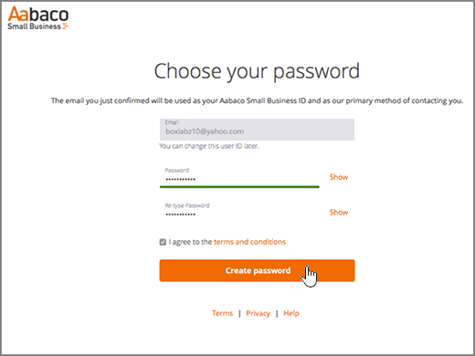

# Criar registros DNS no Yahoo! Small Business para o Office 365

 **Caso não encontre o conteúdo que está procurando, [verifique as perguntas frequentes sobre domínios](../setup/domains-faq.md)**. 
  
Se o Yahoo! Small Business tiver sido seu provedor de hospedagem DNS, você deve estar ciente de que seu provedor agora é a Aabaco Small Business.
  
Siga as etapas neste artigo para criar uma conta na Aabaco, onde você pode fazer alterações de DNS e renovar seus domínios.
  
Você deve criar sua conta do Aabaco antes de poder [criar registros DNS](../get-help-with-domains/create-dns-records-at-any-dns-hosting-provider.md).

  
## Criar uma conta na Aabaco Small Business

1. Para começar, vá até a sua página de domínios no Aabaco usando [este link](https://www.luminate.com/services/)e selecione **configurar sua conta do Aabaco Small Business**.
    
    
  
2. Forneça o Email/ID do Yahoo do Yahoo! Small Business **email/yahoo ID**e, em seguida, **não sou um robô**.
    
    
  
3. Selecione **introdução**.
    
    
  
4. Entre na sua conta de email do Yahoo! Small Business e abra o novo email da Aabaco Small Business.
    
    > [!NOTE]
    > Reenvie a mensagem, se necessário, escolhendo a opção **Reenviar o link de email** na página **Você tem email**. 
  
    
  
5. No Aabaco **confirmar seu endereço de email para continuar** a mensagem de email de instalação, selecione **confirmar email**.
    
    
  
6. Na página **Escolha sua senha**, digite ou copie e cole a senha que você deseja usar para sua conta da Aabaco. 
    
    > [!NOTE]
    > Você pode usar a mesma senha usada na conta do Yahoo! Small Business. 
  
    
  
7. Selecione **eu concordo com os termos e condições**e selecione **criar senha**.
    
    
  
8. Entre na sua conta de email do Yahoo! Small Business e, em seguida, abra o novo email da Aabaco Small Business.
    
    > [!NOTE]
    > Reenvie a mensagem, se necessário, escolhendo a opção **Reenviar o link de email** na página **Está quase acabando!**. 
  
    
  
9. Na Aabaco **você estiver quase lá** , selecione **Ativar minha conta**.
    
    
  
10. Entre na conta da Aabaco Small Business.
    
    
  
Agora que você tem uma conta da Aabaco, já pode [Criar registros DNS na Aabaco Small Business para Office 365](../get-help-with-domains/create-dns-records-at-any-dns-hosting-provider.md).
  
