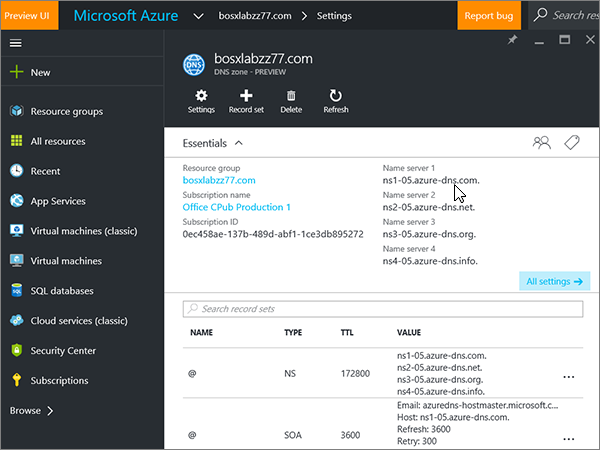
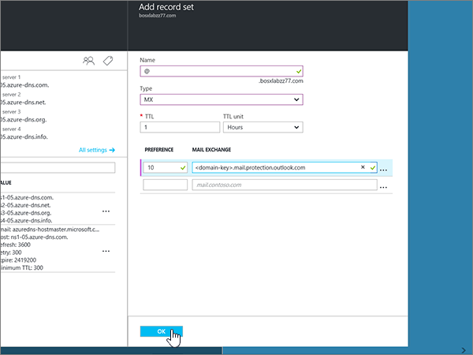
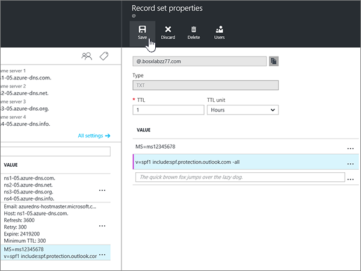

# Criar registros DNS para zonas DNS do Azure

 Caso não encontre o conteúdo que está procurando, **[verifique as perguntas frequentes sobre domínios](../setup/domains-faq.md)**. 
  
Se o Azure for o seu provedor de hospedagem DNS, siga as etapas deste artigo para verificar seu domínio e configurar registros DNS para email, Skype for Business Online e assim por diante.
  
Esses são os principais registros a adicionar. 
  
- [Alterar os registros de nameserver (NS) de seu domínio](#change-your-domains-nameserver-ns-records)
    
- [Adicionar um registro TXT para verificação](#add-a-txt-record-for-verification)

- [Adicionar um registro MX para que o email do seu domínio seja fornecido para a Microsoft](#add-an-mx-record-so-email-for-your-domain-will-come-to-microsoft)
    
- [Adicionar os quatro registros CNAME necessários para o Microsoft](#add-the-four-cname-records-that-are-required-for-microsoft)
    
- [Adicionar registro TXT à SPF para ajudar a evitar spam de email](#add-a-txt-record-for-spf-to-help-prevent-email-spam)
    
- [Adicionar os dois registros SRV necessários para o Microsoft](#add-the-two-srv-records-that-are-required-for-microsoft)
    
Depois que você adicionar esses registros no Azure, o domínio será configurado para funcionar com os serviços da Microsoft.
  
> [!NOTE]
> Normalmente, são necessários cerca de 15 minutos para que as alterações de DNS entrem em vigor. Mas, às vezes, pode ser necessário mais tempo para atualizar uma alteração feita no sistema DNS da Internet. Se você tiver problemas com o fluxo de emails ou de outro tipo após adicionar os registros DNS, consulte [Solucionar problemas após alterar o nome de domínio ou registros DNS](../get-help-with-domains/find-and-fix-issues.md). 
  
## Alterar os registros de nameserver (NS) de seu domínio

> [!IMPORTANT]
> Você deve executar este procedimento no registrador de domínios onde você comprou e registrou seu domínio. 
  
Ao se inscrever no Azure, você criou um grupo de recursos dentro de uma zona DNS e, em seguida, atribuiu o nome de domínio a esse grupo de recursos. Esse nome de domínio é registrado em um registrador de domínio externo; O Azure não oferece serviços de registro de domínio.
  
Para verificar e criar registros DNS para o seu domínio na Microsoft, primeiro você precisa alterar os nameservers no seu registrador de domínio para que eles usem os nameservers do Azure atribuídos ao seu grupo de recursos.
  
Para mudar os servidores de nomes do seu domínio por conta própria no site do registrador de domínios, siga essas etapas.
  
1. Localize a área no site do registrador de domínios na qual você pode editar os servidores de nomes do seu domínio.
    
2. Crie dois registros de nameserver usando os valores na tabela a seguir ou edite os registros de nameserver existentes para que eles correspondam a esses valores. Um exemplo de nameservers atribuídos ao Azure é mostrado abaixo.
    

**Primeiro nameserver:** Use o valor do servidor de nomes atribuído pelo Azure.  
**Segundo nameserver:** Use o valor do servidor de nomes atribuído pelo Azure.  

  
> [!TIP]
> You should use at least two name server records. Se houver outros servidores de nomes listados no site do registrador de domínio, exclua-os. 
  
3. Salve suas alterações.
    
> [!NOTE]
> Your nameserver record updates may take up to several hours to update across the Internet's DNS system. Em seguida, seu email da Microsoft e outros serviços serão configurados para funcionar com seu domínio. 
  
## Adicionar um registro TXT para verificação

Antes de usar seu domínio com a Microsoft, precisamos garantir que você o tenha. Sua capacidade de fazer logon em sua conta no registrador de domínios e criar o registro DNS comprova para a Microsoft que você é o proprietário do domínio.
  
> [!NOTE]
> Esse registro é usado exclusivamente para confirmar se você é o proprietário do domínio; ele não afeta mais nada. É possível excluí-lo mais tarde, se desejar. 
  
1. Para começar, vá até a sua página de domínios no Azure usando [este link](https://portal.azure.com ). Será solicitado que você faça logon primeiro.
    
    
  
2. Usando a **barra de pesquisa** na página do **painel** , digite as **zonas DNS**. Na exibição de resultados, selecione **zonas DNS** na parte de **Serviços** . Depois de Redirecionado, selecione o domínio que você deseja atualizar.
    
    
  
3. Na página **configurações** do seu domínio, na área **zona DNS** , selecione **+ conjunto de registros**.
    
    
  
4. Na área **Adicionar conjunto de registros** , nas caixas do novo conjunto de registros, selecione os valores da tabela a seguir. 
    
    (Escolha o **tipo** e os valores da **unidade TTL** nas listas suspensas.) 
    
    |**Nome**|**Tipo**|**TTL**|**Unidade TTL**|**Valor**|
    |:-----|:-----|:-----|:-----|:-----|
    |@    |TXT    |1    |Horas    |MS = ms *XXXXXXXX*    **Observação**: esse é um exemplo. Use o seu **destino específico ou aponte para** o valor de endereço aqui, a partir da tabela.           [Como localizo isto?](../get-help-with-domains/information-for-dns-records.md)          |
   
    
  
5. Clique em **OK**.
  
6. Aguarde alguns minutos antes de prosseguir para que o registro que você acabou de criar possa ser atualizado na Internet.
    
Agora que você adicionou o registro no site do seu registrador de domínio, você voltará para a Microsoft e solicitará o registro.
  
Quando a Microsoft encontrar o registro TXT correto, seu domínio será verificado.
  
1. No centro do administrador, acesse a página **Configurações de** \> <a href="https://go.microsoft.com/fwlink/p/?linkid=834818" target="_blank">domínios</a>.
    
2. Na página **Domínios**, clique no domínio que você está verificando. 
    
    
  
3. Na página **Configuração**, clique em **Iniciar configuração**.
    
    
  
4. Na página **Verificar domínio**, marque **Verificar**.
    
    
  
> [!NOTE]
>  Normalmente, são necessários cerca de 15 minutos para que as alterações de DNS entrem em vigor. Mas, às vezes, pode ser necessário mais tempo para atualizar uma alteração feita no sistema DNS da Internet. Se você tiver problemas com o fluxo de emails ou de outro tipo após adicionar os registros DNS, consulte [Solucionar problemas após alterar o nome de domínio ou registros DNS](../get-help-with-domains/find-and-fix-issues.md). 
  
## Adicionar um registro MX para que o email do seu domínio seja fornecido para a Microsoft

1. Para começar, vá até a sua página de domínios no Azure usando [este link](https://portal.azure.com ). Será solicitado que você faça logon primeiro.
    
    
  
2. Na página **painel** , na área **todos os recursos** , selecione o domínio que você deseja atualizar. 
    
    
  
3. Na página **configurações** do seu domínio, na área **zona DNS** , selecione **+ conjunto de registros**.
    
    
  
4. Na área **Adicionar conjunto de registros** , nas caixas do novo conjunto de registros, selecione os valores da tabela a seguir. 
    
    (Escolha o **tipo** e os valores da **unidade TTL** nas listas suspensas.) 
    
    |**Nome**|**Tipo**|**TTL**|**Unidade TTL**|**Preferência**|**Troca de emails**|
    |:-----|:-----|:-----|:-----|:-----|:-----|
    |@    |MX    |1    |Horas    |10     Para saber mais sobre prioridade, confira [O que é prioridade MX?](https://support.office.com/article/2784cc4d-95be-443d-b5f7-bb5dd867ba83.aspx)   | *\<chave-do-domínio\>*  .mail.protection.outlook.com    **Observação:** Obtenha sua * \<chave\> de domínio* de sua conta da Microsoft.   [Como localizo isto?](../get-help-with-domains/information-for-dns-records.md)  
   
    
  
5. Clique em **OK**.
    
    
  
6. Se houver outros registros MX listados na seção **registros MX** , você deverá excluí-los. 
    
    Primeiro, na área **zona DNS** , selecione o **conjunto de registros MX**.
    
    
  
    Em seguida, selecione o registro MX que você deseja excluir.
    
    
  
7. Selecione o **menu de contexto (...)** e, em seguida, escolha **remover**.
    
    
  
8. Selecione **Salvar**.
    
    
  
## Adicionar os quatro registros CNAME necessários para o Microsoft

1. Para começar, vá até a sua página de domínios no Azure usando [este link](https://portal.azure.com ). Será solicitado que você faça logon primeiro.
    
    
  
2. Na página **painel** , na área **todos os recursos** , selecione o domínio que você deseja atualizar. 
    
    
  
3. Na página **configurações** do seu domínio, na área **zona DNS** , selecione **+ conjunto de registros**.
    
    
  
4. Adicione o primeiro dos quatro registros CNAME.
    
    Na área **Adicionar conjunto de registros** , nas caixas do novo conjunto de registros, digite ou copie e cole os valores da primeira linha na tabela a seguir. 
    
    (Escolha o **tipo** e os valores da **unidade TTL** nas listas suspensas.) 
    
    |**Nome**|**Tipo**|**TTL**|**Unidade TTL**|**Alias**|
    |:-----|:-----|:-----|:-----|:-----|
    |descoberta automática    |CNAME    |1    |Horas    |autodiscover.outlook.com    |
    |sip    |CNAME    |1    |Horas    |sipdir.online.lync.com    |
    |lyncdiscover    |CNAME    |1    |Horas    |webdir.online.lync.com    |
    
   
    
  
5. Clique em **OK**.
    
    
  
6. Adicione cada um dos outros três registros CNAME.
    
    Na área **zona DNS** , selecione **+ conjunto de registros**. Em seguida, no conjunto de registros vazio, crie um registro usando os valores da próxima linha na tabela e, em seguida, selecione **OK** para concluir esse registro. 
    
    Repita esse processo até ter criado todos os quatro registros CNAME.
    
7.  Opcion Adicionar dois registros CNAME para MDM.

> [!IMPORTANT]
> Se você tiver o gerenciamento de dispositivo móvel (MDM) para a Microsoft, deverá criar dois registros CNAME adicionais. Siga o procedimento que você usou para os outros quatro registros CNAME, mas forneça os valores da tabela a seguir. Se você não tiver o MDM, ignore esta etapa. 
  
|**Nome**|**Tipo**|**TTL**|**Unidade TTL**|**Alias**|
|:-----|:-----|:-----|:-----|:-----|
|enterpriseregistration    |CNAME    |1    |Horas    |enterpriseregistration.windows.net    |
|enterpriseenrollment    |CNAME    |1    |Horas    |enterpriseenrollment-s.manage.microsoft.com    |
   
## Adicionar o registro TXT à SPF para ajudar a evitar spam de e-mail

> [!IMPORTANT]
> Não é possível ter mais de um registro TXT para SPF para um domínio. Se o seu domínio possuir mais de um registro SPF, ocorrerão erros de email, bem como problemas na entrega e na classificação de spam. Se você já tiver um registro SPF para seu domínio, não crie um novo para a Microsoft. Em vez disso, adicione os valores necessários da Microsoft ao registro atual para que você tenha um *único* registro SPF que inclua os dois conjuntos de valores. 
  
1. Para começar, vá até a sua página de domínios no Azure usando [este link](https://portal.azure.com ). Será solicitado que você faça logon primeiro.
    
    
  
2. Na página **painel** , na área **todos os recursos** , selecione o domínio que você deseja atualizar. 
    
    
  
3. Na área **zona DNS** , selecione o **conjunto de registros txt**.
    
    
  
4. Na área **Propriedades do conjunto de registros** , nas caixas do novo conjunto de registros, selecione os valores da tabela a seguir. 
    
    (Escolha o **tipo** e os valores da **unidade TTL** nas listas suspensas.) 
    
    |**Nome**|**Tipo**|**TTL**|**Unidade TTL**|**Valor**|
    |:-----|:-----|:-----|:-----|:-----|
    |@    |TXT    |1    |Horas    |v=spf1 include:spf.protection.outlook.com -all    **Observação:** é recomendável copiar e colar essa entrada para que o espaçamento permaneça correto.           

    
  
5. Selecione **Salvar**.
    
    
  
## Adicionar os dois registros SRV necessários para o Microsoft

1. Para começar, vá até a sua página de domínios no Azure usando [este link](https://portal.azure.com ). Será solicitado que você faça logon primeiro.
    
    
  
2. Na página **painel** , na área **todos os recursos** , selecione o domínio que você deseja atualizar. 
    
    
  
3. Na página **configurações** do seu domínio, na área **zona DNS** , selecione **+ conjunto de registros**.
    
    
  
4. Adicione o primeiro dos dois registros SRV.
    
    Na área **Adicionar conjunto de registros** , nas caixas do novo conjunto de registros, selecione os valores da primeira linha da tabela a seguir. 
    
    (Escolha o **tipo** e os valores da **unidade TTL** nas listas suspensas.) 
    
    |**Nome**|**Tipo**|**TTL**|**Unidade TTL**|**Prioridade**|**Espessura**|**Porta**|**Destino**|
    |:-----|:-----|:-----|:-----|:-----|:-----|:-----|:-----|
    |_sip. _tls    |SRV    |1    |Horas    |100    |1    |443    |sipdir.online.lync.com    |
    |_sipfederationtls. _tcp    |SRV    |1    |Horas    |100    |1    |5061    |sipfed.online.lync.com    

    
  
5. Clique em **OK**.
    
    
  
6. Adicione o outro registro SRV.
    
    Nas caixas do novo registro, digite ou copie e cole os valores da segunda linha da tabela.
    
> [!NOTE]
> Normalmente, são necessários cerca de 15 minutos para que as alterações de DNS entrem em vigor. Mas, às vezes, pode ser necessário mais tempo para atualizar uma alteração feita no sistema DNS da Internet. Se você tiver problemas com o fluxo de emails ou de outro tipo após adicionar os registros DNS, consulte [Solucionar problemas após alterar o nome de domínio ou registros DNS](../get-help-with-domains/find-and-fix-issues.md). 
  
