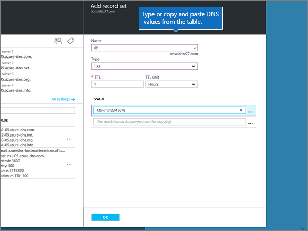

# Criar registros DNS para zonas DNS do AzureCreate DNS records for Azure DNS zones

 Caso não encontre o conteúdo que está procurando, **[verifique as perguntas frequentes sobre domínios](../setup/domains-faq.yml)**.**[Check the Domains FAQ](../setup/domains-faq.yml)** if you don't find what you're looking for. 
  
Se o Azure for seu provedor de hospedagem DNS, siga as etapas deste artigo para verificar seu domínio e configurar registros DNS para o Skype for Business Online, email e outros serviços.If Azure is your DNS hosting provider, follow the steps in this article to verify your domain and set up DNS records for email, Skype for Business Online, and so on.
  
Esses são os principais registros a adicionar.These are the main records to add. 
  
- [Alterar os registros de nameserver (NS) de seu domínioChange your domain's nameserver (NS) records](#change-your-domains-nameserver-ns-records)
    
- [Adicionar um registro TXT para verificaçãoAdd a TXT record for verification](#add-a-txt-record-for-verification)

- [Adicione um registro MX para que o email do domínio vá para a Microsoft.Add an MX record so email for your domain will come to Microsoft](#add-an-mx-record-so-email-for-your-domain-will-come-to-microsoft)
    
- [Adicionar os quatro registros CNAME necessários para a MicrosoftAdd the four CNAME records that are required for Microsoft](#add-the-four-cname-records-that-are-required-for-microsoft)
    
- [Adicionar registro TXT à SPF para ajudar a evitar spam de emailAdd a TXT record for SPF to help prevent email spam](#add-a-txt-record-for-spf-to-help-prevent-email-spam)
    
- [Adicionar os dois registros SRV necessários para a MicrosoftAdd the two SRV records that are required for Microsoft](#add-the-two-srv-records-that-are-required-for-microsoft)
    
Depois que você adicionar esses registros no Azure, seu domínio será definido para funcionar com os serviços Microsoft.After you add these records at Azure, your domain will be set up to work with Microsoft services.
  
> [!NOTE]
> Normalmente, são necessários cerca de 15 minutos para que as alterações de DNS entrem em vigor. Mas, às vezes, pode ser necessário mais tempo para atualizar uma alteração feita no sistema DNS da Internet. Se você tiver problemas com o fluxo de emails ou de outro tipo após adicionar os registros DNS, consulte [Solucionar problemas após alterar o nome de domínio ou registros DNS](../get-help-with-domains/find-and-fix-issues.md).Typically it takes about 15 minutes for DNS changes to take effect. However, it can occasionally take longer for a change you've made to update across the Internet's DNS system. If you're having trouble with mail flow or other issues after adding DNS records, see [Troubleshoot issues after changing your domain name or DNS records](../get-help-with-domains/find-and-fix-issues.md). 
  
## Alterar os registros de nameserver (NS) de seu domínioChange your domain's nameserver (NS) records

> [!IMPORTANT]
> Você deve executar este procedimento no registrador de domínios onde você comprou e registrou seu domínio.You must perform this procedure at the domain registrar where you purchased and registered your domain. 
  
Quando você se inscreveu no Azure, criou um grupo de recursos em uma zona DNS e atribuiu seu nome de domínio a esse grupo de recursos.When you signed up for Azure, you created a resource group within a DNS zone, and then assigned your domain name to that resource group. Esse nome de domínio está registrado em um registrador de domínio externo; O Azure não oferece serviços de registro de domínio.That domain name is registered to an external domain registrar; Azure does not offer domain registration services.
  
Para verificar e criar registros DNS para seu domínio na Microsoft, primeiro você precisa alterar os nameservers no registrador de domínios para que eles usem os nameservers do Azure atribuídos ao seu grupo de recursos.To verify and create DNS records for your domain in Microsoft, you first need to change the nameservers at your domain registrar so that they use the Azure nameservers assigned to your resource group.
  
Para mudar os servidores de nomes do seu domínio por conta própria no site do registrador de domínios, siga essas etapas.To change your domain's name servers at your domain registrar's website yourself, follow these steps.
  
1. Localize a área no site do registrador de domínios na qual você pode editar os servidores de nomes do seu domínio.Find the area on the domain registrar's website where you can edit the nameservers for your domain.
    
2. Crie dois registros de nameserver usando os valores da tabela a seguir ou edite os registros de nameserver existentes para que eles corresponderem a esses valores.Either create two nameserver records by using the values in the following table, or edit the existing nameserver records so that they match these values. Um exemplo de nameservers atribuídos ao Azure é mostrado abaixo.An example of Azure assigned nameservers is shown below.
    

**Primeiro nameserver:** Use o valor do servidor de nomes atribuído pelo Azure.**First nameserver:** Use the name server value assigned by Azure.  
**Segundo nameserver:** Use o valor do servidor de nomes atribuído pelo Azure.**Second nameserver:** Use the name server value assigned by Azure.  

  
> [!TIP]
> You should use at least two name server records.You should use at least two name server records. Se houver outros servidores de nomes listados no site do registrador de domínios, exclua-os.If there are any other name servers listed at your domain registrar's website, you should delete them. 
  
3. Salve suas alterações.Save your changes.
    
> [!NOTE]
> Your nameserver record updates may take up to several hours to update across the Internet's DNS system.Your nameserver record updates may take up to several hours to update across the Internet's DNS system. Em seguida, seu email da Microsoft e outros serviços serão definidos para funcionar com seu domínio.Then your Microsoft email and other services will be all set to work with your domain. 
  
## Adicionar um registro TXT para verificaçãoAdd a TXT record for verification

Antes de usar o seu domínio com a Microsoft, precisamos verificar se você é o proprietário dele. A capacidade de entrar na conta do seu registrador de domínios e criar o registro de DNS prova à Microsoft que você é o proprietário do domínio.Before you use your domain with Microsoft, we have to make sure that you own it. Your ability to log in to your account at your domain registrar and create the DNS record proves to Microsoft that you own the domain.
  
> [!NOTE]
> Esse registro é usado exclusivamente para confirmar se você é o proprietário do domínio; ele não afeta mais nada. É possível excluí-lo mais tarde, se desejar.This record is used only to verify that you own your domain; it doesn't affect anything else. You can delete it later, if you like. 
  
1. To get started, go to your domains page at Azure by using [this link](https://portal.azure.com ).To get started, go to your domains page at Azure by using [this link](https://portal.azure.com ). Será solicitado que você faça logon primeiro.You'll be prompted to log in first.
    
    
  
2. Usando a **barra de pesquisa** na página **Painel,** digite **zonas DNS.**Using the **search bar** on the **Dashboard** page, type in **DNS zones**. Na exibição de resultados, selecione **zonas DNS** na parte **Serviços.**In the results display, select **DNS zones** under the **Services** portion. Depois que você foi redirecionado, selecione o domínio que deseja atualizar.Once you've been redirected, select the domain that you want to update.
    
    
  
3. Na página **Configurações** do seu domínio, na área de **zona DNS,** selecione **+ Conjunto de registros.**On the **Settings** page for your domain, in the **DNS zone** area, select **+ Record set**.
    
    
  
4. Na área **Adicionar conjunto de registros,** nas caixas do novo conjunto de registros, selecione os valores da tabela a seguir.In the **Add record set** area, in the boxes for the new record set, select the values from the following table. 
    
    (Escolha os **valores de unidade** de Tipo e **TTL** nas listas listadas.)(Choose the **Type** and **TTL unit** values from the drop-down lists.) 
    
    |**Nome****Name**|**Tipo****Type**|**TTL****TTL**|**Unidade TTL****TTL unit**|**Valor****Value**|
    |:-----|:-----|:-----|:-----|:-----|
    |@    |TXTTXT    |1 1    |HorasHours    |MS = ms *XXXXXXXX*MS=ms *XXXXXXXX*    **Observação**: esse é um exemplo.**Note:** This is an example. Use aqui seu valor específico de **Destino ou Pontos de Endereçamento**, retirado da tabela.Use your specific **Destination or Points to Address** value here, from the table.           [Como localizo isto?How do I find this?](../get-help-with-domains/information-for-dns-records.md)          |
   
    
  
5. Selecione **OK**.Select **OK**.
  
6. Aguarde alguns minutos antes de prosseguir para que o registro que você acabou de criar possa ser atualizado na Internet.Wait a few minutes before you continue, so that the record you just created can update across the Internet.
    
Agora que você adicionou o registro no site do seu registrador de domínios, retorne à Microsoft e solicite o registro.Now that you've added the record at your domain registrar's site, you'll go back to Microsoft and request the record.
  
Quando a Microsoft encontrar o registro TXT correto, seu domínio estará verificado.When Microsoft finds the correct TXT record, your domain is verified.
  
1. No centro do administrador, acesse a página **Configurações de** \> <a href="https://go.microsoft.com/fwlink/p/?linkid=834818" target="_blank">domínios</a>.In the admin center, go to the **Settings** \> <a href="https://go.microsoft.com/fwlink/p/?linkid=834818" target="_blank">Domains</a> page.
    
2. Na página **Domínios**, clique no domínio que você está verificando.On the **Domains** page, select the domain that you are verifying. 
    
    
  
3. Na página **Configuração**, clique em **Iniciar configuração**.On the **Setup** page, select **Start setup**.
    
    
  
4. Na página **Verificar domínio**, marque **Verificar**.On the **Verify domain** page, select **Verify**.
    
    
  
> [!NOTE]
>  Normalmente, são necessários cerca de 15 minutos para que as alterações de DNS entrem em vigor. Mas, às vezes, pode ser necessário mais tempo para atualizar uma alteração feita no sistema DNS da Internet. Se você tiver problemas com o fluxo de emails ou de outro tipo após adicionar os registros DNS, consulte [Solucionar problemas após alterar o nome de domínio ou registros DNS](../get-help-with-domains/find-and-fix-issues.md).Typically it takes about 15 minutes for DNS changes to take effect. However, it can occasionally take longer for a change you've made to update across the Internet's DNS system. If you're having trouble with mail flow or other issues after adding DNS records, see [Troubleshoot issues after changing your domain name or DNS records](../get-help-with-domains/find-and-fix-issues.md). 
  
## Adicione um registro MX para que o email do domínio vá para a Microsoft.Add an MX record so email for your domain will come to Microsoft

1. To get started, go to your domains page at Azure by using [this link](https://portal.azure.com ).To get started, go to your domains page at Azure by using [this link](https://portal.azure.com ). Será solicitado que você faça logon primeiro.You'll be prompted to log in first.
    
    
  
2. Na página **Painel,** na área **Todos os** recursos, selecione o domínio que você deseja atualizar.On the **Dashboard** page, in the **All resources** area, select the domain that you want to update. 
    
    
  
3. Na página **Configurações** do seu domínio, na área de **zona DNS,** selecione **+ Conjunto de registros.**On the **Settings** page for your domain, in the **DNS zone** area, select **+ Record set**.
    
    
  
4. Na área **Adicionar conjunto de registros,** nas caixas do novo conjunto de registros, selecione os valores da tabela a seguir.In the **Add record set** area, in the boxes for the new record set, select the values from the following table. 
    
    (Escolha os **valores de** unidade de Tipo **e TTL** nas listas listadas.)(Choose the **Type** and **TTL unit** values from the drop-down lists.) 
    
    |**Nome****Name**|**Tipo****Type**|**TTL****TTL**|**Unidade TTL****TTL unit**|**Preferência****Preference**|**Mail Exchange****Mail Exchange**|
    |:-----|:-----|:-----|:-----|:-----|:-----|
    |@    |MXMX    |1 1    |HorasHours    |10 10    Para saber mais sobre prioridade, confira [O que é prioridade MX?](https://docs.microsoft.com/microsoft-365/admin/setup/domains-faq)For more information about priority, see [What is MX priority?](https://docs.microsoft.com/microsoft-365/admin/setup/domains-faq)   | *\<domain-key\>*  .mail.protection.outlook.com*\<domain-key\>*  .mail.protection.outlook.com    **Observação:** Obter o  *\<domain-key\>*  seu da sua conta da Microsoft.**Note:** Get your  *\<domain-key\>*  from your Microsoft account.   [Como localizo isto?How do I find this?](../get-help-with-domains/information-for-dns-records.md)  
   
    
  
5. Selecione **OK**.Select **OK**.
    
    
  
6. Se houver outros registros MX listados na seção **Registros MX,** você deverá excluí-los.If there are any other MX records listed in the **MX Records** section, you must delete them. 
    
    Primeiro, na área **de zona DNS,** selecione o conjunto **de Registros MX.**First, in the **DNS zone** area, select the **MX Record set**.
    
    
  
    Em seguida, selecione o registro MX que você deseja excluir.Next, select the MX record you want to delete.
    
    
  
7. Selecione o **menu contexto (...)** e, em seguida, escolha **Remover**.Select the **Context menu (…)**, and then choose **Remove**.
    
    
  
8. Selecione **Salvar**.Select **Save**.
    
    
  
## Adicionar os quatro registros CNAME necessários para a MicrosoftAdd the four CNAME records that are required for Microsoft

1. To get started, go to your domains page at Azure by using [this link](https://portal.azure.com ).To get started, go to your domains page at Azure by using [this link](https://portal.azure.com ). Será solicitado que você faça logon primeiro.You'll be prompted to log in first.
    
    
  
2. Na página **Painel,** na área **Todos os** recursos, selecione o domínio que você deseja atualizar.On the **Dashboard** page, in the **All resources** area, select the domain that you want to update. 
    
    
  
3. Na página **Configurações** do seu domínio, na área de **zona DNS,** selecione **+ Conjunto de registros.**On the **Settings** page for your domain, in the **DNS zone** area, select **+ Record set**.
    
    
  
4. Adicione o primeiro dos quatro registros CNAME.Add the first of the four CNAME records.
    
    In the **Add record set** area, in the boxes for the new record set, type or copy and paste the values from the first row in the following table.In the **Add record set** area, in the boxes for the new record set, type or copy and paste the values from the first row in the following table. 
    
    (Escolha os **valores de unidade** de Tipo e **TTL** nas listas listadas.)(Choose the **Type** and **TTL unit** values from the drop-down lists.) 
    
    |**Nome****Name**|**Tipo****Type**|**TTL****TTL**|**Unidade TTL****TTL unit**|**Alias****Alias**|
    |:-----|:-----|:-----|:-----|:-----|
    |autodiscoverautodiscover    |CNAMECNAME    |1 1    |HorasHours    |autodiscover.outlook.comautodiscover.outlook.com    |
    |sipsip    |CNAMECNAME    |1 1    |HorasHours    |sipdir.online.lync.comsipdir.online.lync.com    |
    |lyncdiscoverlyncdiscover    |CNAMECNAME    |1 1    |HorasHours    |webdir.online.lync.comwebdir.online.lync.com    |
    
   
    
  
5. Selecione **OK**.Select **OK**.
    
    
  
6. Adicione cada um dos outros três registros CNAME.Add each of the other three CNAME records.
    
    Na área **de zona DNS,** selecione **+ Conjunto de registros.**In the **DNS zone** area, select **+ Record set**. Em seguida, no conjunto de registros vazio, crie um registro usando os valores da próxima linha na tabela e selecione **NOVAMENTE OK** para concluir esse registro.Then, in the empty record set, create a record by using the values from the next row in the table, and again select **OK** to complete that record. 
    
    Repita esse processo até ter criado todos os quatro registros CNAME.Repeat this process until you have created all four CNAME records.
    
7.  (Opcional) Adicione 2 registros CNAME para MDM.(Optional) Add 2 CNAME records for MDM.

> [!IMPORTANT]
> Se você tiver o Gerenciamento de Dispositivo Móvel (MDM) para a Microsoft, deverá criar dois registros CNAME adicionais.If you have Mobile Device Management (MDM) for Microsoft, then you must create two additional CNAME records. Siga o procedimento que você usou para os outros quatro registros CNAME, mas forneça os valores da tabela a seguir.Follow the procedure that you used for the other four CNAME records, but supply the values from the following table. (Se você não tiver o MDM, ignore esta etapa.)(If you do not have MDM, you can skip this step.) 
  
|**Nome****Name**|**Tipo****Type**|**TTL****TTL**|**Unidade TTL****TTL unit**|**Alias****Alias**|
|:-----|:-----|:-----|:-----|:-----|
|enterpriseregistrationenterpriseregistration    |CNAMECNAME    |1 1    |HorasHours    |enterpriseregistration.windows.netenterpriseregistration.windows.net    |
|enterpriseenrollmententerpriseenrollment    |CNAMECNAME    |1 1    |HorasHours    |enterpriseenrollment-s.manage.microsoft.comenterpriseenrollment-s.manage.microsoft.com    |
   
## Adicionar o registro TXT à SPF para ajudar a evitar spam de e-mailAdd a TXT record for SPF to help prevent email spam

> [!IMPORTANT]
> Não é possível ter mais de um registro TXT para SPF para um domínio.You cannot have more than one TXT record for SPF for a domain. Se o seu domínio possuir mais de um registro SPF, ocorrerão erros de email, bem como problemas na entrega e na classificação de spam.If your domain has more than one SPF record, you'll get email errors, as well as delivery and spam classification issues. Se você já possui um registro SPF para seu domínio, não crie um novo para a Microsoft.If you already have an SPF record for your domain, don't create a new one for Microsoft. Em vez disso, adicione os valores necessários da Microsoft ao registro atual para que você tenha um único registro  *SPF*  que inclua ambos os conjuntos de valores.Instead, add the required Microsoft values to the current record so that you have a  *single*  SPF record that includes both sets of values. 
  
1. To get started, go to your domains page at Azure by using [this link](https://portal.azure.com ).To get started, go to your domains page at Azure by using [this link](https://portal.azure.com ). Será solicitado que você faça logon primeiro.You'll be prompted to log in first.
    
    
  
2. Na página **Painel,** na área **Todos os** recursos, selecione o domínio que você deseja atualizar.On the **Dashboard** page, in the **All resources** area, select the domain that you want to update. 
    
    
  
3. Na área **de zona DNS,** selecione o **conjunto de registros TXT.**In the **DNS zone** area, select the **TXT record set**.
    
    
  
4. Na área **Propriedades do conjunto de** registros, nas caixas do novo conjunto de registros, selecione os valores da tabela a seguir.In the **Record set properties** area, in the boxes for the new record set, select the values from the following table. 
    
    (Escolha os **valores de unidade** de Tipo e **TTL** nas listas listadas.)(Choose the **Type** and **TTL unit** values from the drop-down lists.) 
    
    |**Nome****Name**|**Tipo****Type**|**TTL****TTL**|**Unidade TTL****TTL unit**|**Valor****Value**|
    |:-----|:-----|:-----|:-----|:-----|
    |@    |TXTTXT    |1 1    |HorasHours    |v=spf1 include:spf.protection.outlook.com -allv=spf1 include:spf.protection.outlook.com -all    **Observação:** é recomendável copiar e colar essa entrada para que o espaçamento permaneça correto.**Note:** We recommend copying and pasting this entry, so that all of the spacing stays correct.           

    
  
5. Selecione **Salvar**.Select **Save**.
    
    
  
## Adicionar os dois registros SRV necessários para a MicrosoftAdd the two SRV records that are required for Microsoft

1. To get started, go to your domains page at Azure by using [this link](https://portal.azure.com ).To get started, go to your domains page at Azure by using [this link](https://portal.azure.com ). Será solicitado que você faça logon primeiro.You'll be prompted to log in first.
    
    
  
2. Na página **Painel,** na área **Todos os** recursos, selecione o domínio que você deseja atualizar.On the **Dashboard** page, in the **All resources** area, select the domain that you want to update. 
    
    
  
3. Na página **Configurações** do seu domínio, na área de **zona DNS,** selecione **+ Conjunto de registros.**On the **Settings** page for your domain, in the **DNS zone** area, select **+ Record set**.
    
    
  
4. Adicione o primeiro dos dois registros SRV.Add the first of the two SRV records.
    
    Na área **Adicionar conjunto de** registros, nas caixas do novo conjunto de registros, selecione os valores da primeira linha da tabela a seguir.In the **Add record set** area, in the boxes for the new record set, select the values from the first row in the following table. 
    
    (Escolha os **valores de unidade** de Tipo e **TTL** nas listas listadas.)(Choose the **Type** and **TTL unit** values from the drop-down lists.) 
    
    |**Nome****Name**|**Tipo****Type**|**TTL****TTL**|**Unidade TTL****TTL unit**|**Prioridade****Priority**|**Espessura****Weight**|**Porta****Port**|**Destino****Target**|
    |:-----|:-----|:-----|:-----|:-----|:-----|:-----|:-----|
    |_sip._tls_sip._tls    |SRVSRV    |1 1    |HorasHours    |100100    |1 1    |443443    |sipdir.online.lync.comsipdir.online.lync.com    |
    |_sipfederationtls._tcp_sipfederationtls._tcp    |SRVSRV    |1 1    |HorasHours    |100100    |1 1    |50615061    |sipfed.online.lync.comsipfed.online.lync.com    

    
  
5. Selecione **OK**.Select **OK**.
    
    
  
6. Adicione o outro registro SRV.Add the other SRV record.
    
    Nas caixas do novo registro, digite ou copie e copie e copie os valores da segunda linha da tabela.In the boxes for the new record, type or copy and paste the values from the second row of the table.
    
> [!NOTE]
> Normalmente, são necessários cerca de 15 minutos para que as alterações de DNS entrem em vigor. Mas, às vezes, pode ser necessário mais tempo para atualizar uma alteração feita no sistema DNS da Internet. Se você tiver problemas com o fluxo de emails ou de outro tipo após adicionar os registros DNS, consulte [Solucionar problemas após alterar o nome de domínio ou registros DNS](../get-help-with-domains/find-and-fix-issues.md).Typically it takes about 15 minutes for DNS changes to take effect. However, it can occasionally take longer for a change you've made to update across the Internet's DNS system. If you're having trouble with mail flow or other issues after adding DNS records, see [Troubleshoot issues after changing your domain name or DNS records](../get-help-with-domains/find-and-fix-issues.md). 
  
