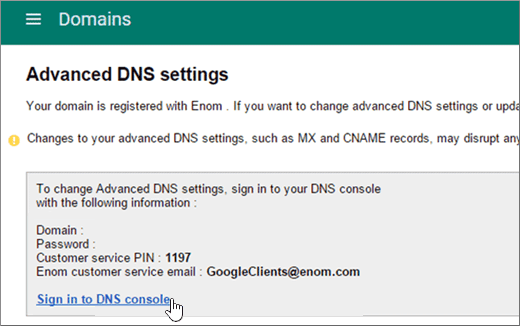
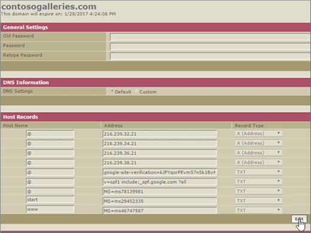

# Criar registros DNS quando o domínio for gerenciado pelo Google (eNom)Create DNS records when your domain is managed by Google (eNom)

 **Caso não encontre o conteúdo que está procurando, [verifique as perguntas frequentes sobre domínios](../setup/domains-faq.md)**.**[Check the Domains FAQ](../setup/domains-faq.md)** if you don't find what you're looking for. 
  
Para migrar suas contas de email para o Office 365, você precisa criar um registro DNS em seu registrador de domínio.To migrate your mail accounts to Office 365, you need to create a DNS record at your domain registrar.
  
Se você comprou seu domínio pelo Google ao se inscrever para sua conta do **Google Apps for Work** , seus registros DNS são gerenciados pelo Google, mas registrados com o eNom.If you purchased your domain through Google while signing up for your **Google Apps for Work** account, your DNS records are managed by Google but registered with eNom. 
  
Você pode acessar o eNom e criar o DNS, através da página de **domínios** do Google.You can access eNom, and create DNS, through the Google **Domains** page. Siga as etapas descritas neste artigo.Just follow the steps in this article. 
  
## Criar o registro DNSCreate the DNS record

1. No [console de administração do Google](https://www.google.com/work/apps/business), selecione **entrar**.At the [Google Admin console](https://www.google.com/work/apps/business), select **Sign In**.
    
    
  
2. Insira seu nome de domínio e selecione **ir**.Enter your domain name, and then select **Go**.
    
    
  
3. Na parte inferior da página, selecione **mais controles**.At the bottom of the page, select **More controls**.
    
    
  
4. Escolha **Domínios**.Select **Domains**.
    
    
  
5. Na página **domínios** , selecione **Adicionar/remover domínios**.On the **Domains** page, select **Add/remove domains**.
    
    
  
6. Na página **domínios** , selecione **Configurações avançadas de DNS**.On the **Domains** page, select **Advanced DNS settings**.
    
    > [!NOTE]
    > Se você não adquiriu um nome de domínio pelo Google ao se inscrever para sua conta do **Google Apps for Work**, você não tem **Configurações Avançadas de DNS** na sua página **Domínios**.If you didn't purchase a domain name through Google while signing up for your **Google Apps for Work** account, you won't have **Advanced DNS settings** on your **Domains** page. Em vez disso, você precisa ir diretamente para o site da Web do seu host de domínio para acessar suas configurações de DNS e realizar isso e as etapas a seguir.Instead, you must go directly to your domain host's web site to access your DNS settings and to perform this and the following steps. Confira [acessar as configurações de domínio do G Suite](https://support.google.com/a/answer/54693?hl=en) para obter mais informações.See [Access your G Suite domain settings](https://support.google.com/a/answer/54693?hl=en) for more information. 
  
    
  
7. Na página **configurações de DNS avançadas** , selecione **entrar no console DNS**.On the **Advanced DNS settings** page, select **Sign in to DNS Console**. Anote as informações de **Nome de entrada** e **Senha**.Note the **Sign-in name** and **Password** information. Você precisará delas na próxima etapa.You'll need it in the next step. 
    
    
  
8. Entre no **Gerenciador de Domínios** do Google usando o **Nome de entrada** e a **Senha** da página **Configurações de DNS avançadas**.Log in to the Google **Domain Manager** using the **Sign-in name** and **Password** from the **Advanced DNS settings** page. 
    
    
  
9. Na página ***domain_name*** , na seção **registros de host** , selecione **Editar**.On the ***domain_name*** page, in the **Host Records** section, select **Edit**.
    
    
  
10. Na seção **registros de host** , selecione **Adicionar novo**.In the **Host Records** section, select **Add New**.
    
    
  
11. Nas caixas do novo registro, digite ou copie e cole os valores da seguinte tabela.In the boxes for the new record, type or copy and paste the values from the following table.
    
    |**HOST****HOST**|**TXT VALUE****TXT VALUE**|**TIPO DE REGISTRO****RECORD TYPE**|
    |:-----|:-----|:-----|
    |@    ||TXTTXT    |

    > [!NOTE]
    > This is an example.This is an example. Use seu valor específico de **Destinos ou Pontos de Endereçamento** aqui, da tabela no Office 365.Use your specific **Destination or Points to Address** value here, from the table in Office 365. 
  
    [Como localizo isto?How do I find this?](../get-help-with-domains/information-for-dns-records.md)
  
12. Selecione **Salvar**.Select **Save**.
    
    
  
13. Selecione **salvar alterações**.Select **Save Changes**.
    
    
  
> [!NOTE]
>  Normalmente, são necessários cerca de 15 minutos para que as alterações de DNS entrem em vigor. Mas, às vezes, pode ser necessário mais tempo para atualizar uma alteração feita no sistema DNS da Internet. Se você tiver problemas com o fluxo de emails ou de outro tipo após adicionar os registros DNS, consulte [Solucionar problemas após alterar o nome de domínio ou registros DNS](../get-help-with-domains/find-and-fix-issues.md).Typically it takes about 15 minutes for DNS changes to take effect. However, it can occasionally take longer for a change you've made to update across the Internet's DNS system. If you're having trouble with mail flow or other issues after adding DNS records, see [Troubleshoot issues after changing your domain name or DNS records](../get-help-with-domains/find-and-fix-issues.md). 
  
