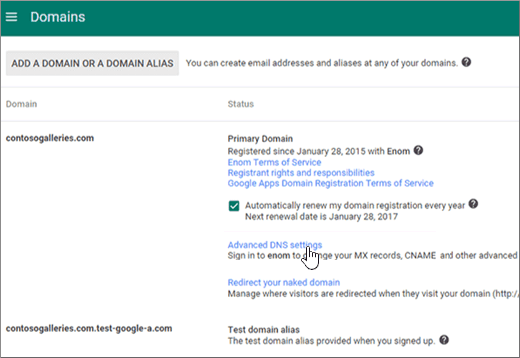
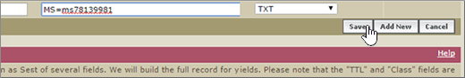

# Criar registros DNS quando o domínio for gerenciado pelo Google (eNom)

 Caso não encontre o conteúdo que está procurando, **[verifique as perguntas frequentes sobre domínios](../setup/domains-faq.yml)**. 
  
Para migrar suas contas de email para a Microsoft, você precisa criar um registro DNS no seu registrador de domínio.
  
Se você comprou seu domínio pelo Google ao se inscrever para sua conta do **Google Apps for Work** , seus registros DNS são gerenciados pelo Google, mas registrados com o eNom. 
  
Você pode acessar o eNom e criar o DNS, através da página de **domínios** do Google. Siga as etapas descritas neste artigo. 
  
## Criar o registro DNS

1. No [console de administração do Google](https://www.google.com/work/apps/business), selecione **entrar**.
    
    
  
2. Insira seu nome de domínio e selecione **ir**.
    
    
  
3. Na parte inferior da página, selecione **mais controles**.
    
    
  
4. Escolha **Domínios**.
    
    
  
5. Na página **domínios** , selecione **Adicionar/remover domínios**.
    
    
  
6. Na página **domínios** , selecione **Configurações avançadas de DNS**.
    
    > [!NOTE]
    > Se você não adquiriu um nome de domínio pelo Google ao se inscrever para sua conta do **Google Apps for Work**, você não tem **Configurações Avançadas de DNS** na sua página **Domínios**. Em vez disso, você precisa ir diretamente para o site da Web do seu host de domínio para acessar suas configurações de DNS e realizar isso e as etapas a seguir. Confira [acessar as configurações de domínio do G Suite](https://support.google.com/a/answer/54693?hl=en) para obter mais informações. 
  
    
  
7. Na página **configurações de DNS avançadas** , selecione **entrar no console DNS**. Anote as informações de **Nome de entrada** e **Senha**. Você precisará delas na próxima etapa. 
    
    
  
8. Entre no **Gerenciador de Domínios** do Google usando o **Nome de entrada** e a **Senha** da página **Configurações de DNS avançadas**. 
    
    
  
9. Na página **_domain_name_*_, na seção _* registros do host** , selecione **Editar**.
    
    
  
10. Na seção **registros de host** , selecione **Adicionar novo**.
    
    
  
11. Nas caixas do novo registro, digite ou copie e cole os valores da seguinte tabela.
    
    |**HOST**|**TXT VALUE**|**TIPO DE REGISTRO**|
    |:-----|:-----|:-----|
    |@    ||TXT    |

    > [!NOTE]
    > This is an example. Use aqui seu valor específico de **Destino ou Pontos de Endereçamento**, retirado da tabela. 
  
    [Como localizo isto?](../get-help-with-domains/information-for-dns-records.md)
  
12. Selecione **Salvar**.
    
    
  
13. Selecione **salvar alterações**.
    
    
  
> [!NOTE]
>  Normalmente, são necessários cerca de 15 minutos para que as alterações de DNS entrem em vigor. Mas, às vezes, pode ser necessário mais tempo para atualizar uma alteração feita no sistema DNS da Internet. Se você tiver problemas com o fluxo de emails ou de outro tipo após adicionar os registros DNS, consulte [Solucionar problemas após alterar o nome de domínio ou registros DNS](../get-help-with-domains/find-and-fix-issues.md). 
  
