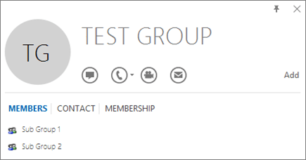

# <a name="determine-if-centralized-deployment-of-add-ins-works-for-your-organization"></a><span data-ttu-id="d1422-103">Determinar se a implantação centralizada de suplementos funciona para a sua organização</span><span class="sxs-lookup"><span data-stu-id="d1422-103">Determine if Centralized Deployment of add-ins works for your organization</span></span>

<span data-ttu-id="d1422-104">A Implantação Centralizada é a forma recomendada e com recursos mais avançados que a maioria dos clientes usa para implantar suplementos do Office para usuários e grupos na sua organização do Office 365.</span><span class="sxs-lookup"><span data-stu-id="d1422-104">Centralized Deployment is the recommended and most feature-rich way for most customers to deploy Office add-ins to users and groups within your Office 365 organization.</span></span> <span data-ttu-id="d1422-105">Se você for um administrador, use este guia para determinar se o locatário e os usuários atendem aos requisitos para que você possa usar a implantação centralizada.</span><span class="sxs-lookup"><span data-stu-id="d1422-105">If you're an admin, use this guidance to determine if your tenant and users meet the requirements so that you can use Centralized Deployment.</span></span>
<span data-ttu-id="d1422-106">A implantação centralizada oferece suporte a Windows, Mac, iOS, Android e aplicativos do Office Online.</span><span class="sxs-lookup"><span data-stu-id="d1422-106">Centralized Deployment supports Windows, Mac, iOS, Android and Online Office apps.</span></span>
<span data-ttu-id="d1422-107">Pode levar até 12 horas para que um suplemento seja exibido para o cliente para todos os usuários.</span><span class="sxs-lookup"><span data-stu-id="d1422-107">It can take up to 12 hours for an add-in to show up for client for all users.</span></span>
  
## <a name="requirements"></a><span data-ttu-id="d1422-108">Requisitos</span><span class="sxs-lookup"><span data-stu-id="d1422-108">Requirements</span></span>

<span data-ttu-id="d1422-109">A implantação centralizada de suplementos exige que os usuários estejam usando o Office 365 ProPlus (e estejam conectados ao Office usando a respectiva ID organizacional) e tenham o Exchange Online e caixas de correio ativas do Exchange Online.</span><span class="sxs-lookup"><span data-stu-id="d1422-109">Centralized deployment of add-ins requires that the users are using Office 365 ProPlus (and are signed into Office using their Organizational ID), and have Exchange Online and active Exchange Online mailboxes.</span></span> <span data-ttu-id="d1422-110">O diretório da sua assinatura deve ser ou federado no Azure Active Directory.</span><span class="sxs-lookup"><span data-stu-id="d1422-110">Your subscription'd directory must either be in, or federated to Azure Active Directory.</span></span>
<span data-ttu-id="d1422-111">Você pode exibir requisitos específicos para o Office e o Exchange abaixo ou usar o [Verificador de compatibilidade de implantação centralizada do office 365](https://docs.microsoft.com/office365/admin/manage/centralized-deployment-of-add-ins?view=o365-worldwide#office-365-centralized-deployment-compatibility-checker).</span><span class="sxs-lookup"><span data-stu-id="d1422-111">You can view specific requirements for Office and Exchange below, or use the [Office 365 Centralized Deployment Compatibility Checker](https://docs.microsoft.com/office365/admin/manage/centralized-deployment-of-add-ins?view=o365-worldwide#office-365-centralized-deployment-compatibility-checker).</span></span>

<span data-ttu-id="d1422-112">A Implantação Centralizada não é compatível com:</span><span class="sxs-lookup"><span data-stu-id="d1422-112">Centralized Deployment doesn't support the following:</span></span>
  
- <span data-ttu-id="d1422-113">Suplementos que visam o Word, Excel ou o PowerPoint no Office 2013</span><span class="sxs-lookup"><span data-stu-id="d1422-113">Add-ins that target Word, Excel, or PowerPoint in Office 2013</span></span>
    
- <span data-ttu-id="d1422-114">Um serviço de diretório local</span><span class="sxs-lookup"><span data-stu-id="d1422-114">An on-premises directory service</span></span>
    
- <span data-ttu-id="d1422-115">Implantação de suplemento no SharePoint</span><span class="sxs-lookup"><span data-stu-id="d1422-115">Add-in deployment to SharePoint</span></span>  

- <span data-ttu-id="d1422-116">Aplicativos do teams</span><span class="sxs-lookup"><span data-stu-id="d1422-116">Teams apps</span></span>
   
- <span data-ttu-id="d1422-117">Implantação de suplementos do COM (Component Object Model) ou VSTO (Visual Studio Tools para Office)</span><span class="sxs-lookup"><span data-stu-id="d1422-117">Deployment of Component Object Model (COM) or Visual Studio Tools for Office (VSTO) add-ins</span></span>
    
- <span data-ttu-id="d1422-118">Implantações do Office 365 que não incluem o Exchange, como o Office 365 Business</span><span class="sxs-lookup"><span data-stu-id="d1422-118">Deployments of Office 365 that do not include Exchange such as Office 365 Business</span></span>

### <a name="office-requirements"></a><span data-ttu-id="d1422-119">Requisitos do Office</span><span class="sxs-lookup"><span data-stu-id="d1422-119">Office Requirements</span></span>

- <span data-ttu-id="d1422-120">Para suplementos do Word, Excel e PowerPoint, seus usuários devem estar usando um dos seguintes:</span><span class="sxs-lookup"><span data-stu-id="d1422-120">For Word, Excel, and PowerPoint add-ins, your users must be using one of the following:</span></span>
  - <span data-ttu-id="d1422-121">Em um dispositivo do Windows, versão 1704 ou posterior do Office 365 ProPlus.</span><span class="sxs-lookup"><span data-stu-id="d1422-121">On a Windows device, Version 1704 or later of Office 365 ProPlus.</span></span>
  - <span data-ttu-id="d1422-122">Em um Mac, versão 15,34 ou posterior.</span><span class="sxs-lookup"><span data-stu-id="d1422-122">On a Mac, Version 15.34 or later.</span></span>
      - <span data-ttu-id="d1422-123">No iOS (somente iPad), a versão 2.9.18010804 ou posterior.</span><span class="sxs-lookup"><span data-stu-id="d1422-123">On iOS (iPad only), Version 2.9.18010804 or later.</span></span>
- <span data-ttu-id="d1422-124">Para o Outlook, seus usuários devem estar usando um dos seguintes:</span><span class="sxs-lookup"><span data-stu-id="d1422-124">For Outlook, your users must be using one of the following:</span></span> 
  - <span data-ttu-id="d1422-125">Versão 1701 ou posterior do Office 365 ProPlus.</span><span class="sxs-lookup"><span data-stu-id="d1422-125">Version 1701 or later of Office 365 ProPlus.</span></span>
  - <span data-ttu-id="d1422-126">Versão 1808 ou posterior do Office Professional Plus 2019 ou Office Standard 2019.</span><span class="sxs-lookup"><span data-stu-id="d1422-126">Version 1808 or later of Office Professional Plus 2019 or Office Standard 2019.</span></span>
  - <span data-ttu-id="d1422-127">Versão 16.0.4494.1000 ou posterior do Office Professional Plus 2016 (MSI) ou Office Standard 2016 (MSI)\*</span><span class="sxs-lookup"><span data-stu-id="d1422-127">Version 16.0.4494.1000 or later of Office Professional Plus 2016 (MSI) or Office Standard 2016 (MSI)\*</span></span>
  - <span data-ttu-id="d1422-128">Versão 15.0.4937.1000 ou posterior do Office Professional Plus 2013 (MSI) ou Office Standard 2013 (MSI)\*</span><span class="sxs-lookup"><span data-stu-id="d1422-128">Version 15.0.4937.1000 or later of Office Professional Plus 2013 (MSI) or Office Standard 2013 (MSI)\*</span></span>
  - <span data-ttu-id="d1422-129">Versão 16.0.9318.1000 ou posterior do Office 2016 para Mac</span><span class="sxs-lookup"><span data-stu-id="d1422-129">Version 16.0.9318.1000 or later of Office 2016 for Mac</span></span> 
- <span data-ttu-id="d1422-130">Versão 2.75.0 ou posterior do Outlook Mobile para iOS</span><span class="sxs-lookup"><span data-stu-id="d1422-130">Version 2.75.0 or later of Outlook mobile for iOS</span></span> 
- <span data-ttu-id="d1422-131">Versão 2.2.145 ou posterior do Outlook Mobile para Android</span><span class="sxs-lookup"><span data-stu-id="d1422-131">Version 2.2.145 or later of Outlook mobile for Android</span></span> 
    
    <span data-ttu-id="d1422-132">\* As versões MSI do Outlook mostram os suplementos instalados pelo administrador na faixa de opções do Outlook apropriada, e não na seção "meus suplementos".</span><span class="sxs-lookup"><span data-stu-id="d1422-132">\*MSI versions of Outlook show admin-installed add-ins in the appropriate Outlook ribbon, not the "My add-ins" section.</span></span>
    

#### <a name="find-out-if-office-365-proplus-is-installed"></a><span data-ttu-id="d1422-133">Verificar se o Office 365 ProPlus está instalado</span><span class="sxs-lookup"><span data-stu-id="d1422-133">Find out if Office 365 ProPlus is installed</span></span>

<span data-ttu-id="d1422-134">Para usar o Office 365 ProPlus, um usuário deve ter uma conta do Office 365 e deve ter uma licença atribuída.</span><span class="sxs-lookup"><span data-stu-id="d1422-134">To use Office 365 ProPlus, a user must have an Office 365 account and must have been assigned a license.</span></span> <span data-ttu-id="d1422-135">Confira mais informações em [Visão geral do Office 365 ProPlus](https://go.microsoft.com/fwlink/p/?linkid=846328).</span><span class="sxs-lookup"><span data-stu-id="d1422-135">For more information, see [Overview of Office 365 ProPlus](https://go.microsoft.com/fwlink/p/?linkid=846328).</span></span>

<span data-ttu-id="d1422-136">A maneira mais simples de detectar se um usuário tem o Office 365 ProPlus instalado e o está usando recentemente é usar o relatório de ativações do Microsoft Office, que está disponível no centro de administração do Microsoft 365.</span><span class="sxs-lookup"><span data-stu-id="d1422-136">The simplest way to detect if a user has Office 365 ProPlus installed and has been using it recently is to use the Microsoft Office Activations report, which is available in the Microsoft 365 admin center.</span></span> <span data-ttu-id="d1422-137">Ele fornece uma lista de todos os usuários que ativaram o Office 365 ProPlus nos últimos 7, 30, 90 ou 180 dias.</span><span class="sxs-lookup"><span data-stu-id="d1422-137">The report provides a list of all users who have activated Office 365 ProPlus within the last 7 days, 30 days, 90 days, or 180 days.</span></span> <span data-ttu-id="d1422-138">Para fins de implantação centralizada, as ativações da área de trabalho para Windows ou Mac são as colunas importantes no relatório.</span><span class="sxs-lookup"><span data-stu-id="d1422-138">For centralized deployment purposes, the desktop activations for Windows or Mac are the important columns in the report.</span></span> <span data-ttu-id="d1422-139">É possível exportar o relatório para Excel.</span><span class="sxs-lookup"><span data-stu-id="d1422-139">You can export the report to Excel.</span></span> <span data-ttu-id="d1422-140">Veja mais informações sobre o relatório em [Relatórios do Office 365 no Centro de Administração - Ativações do Microsoft Office](../activity-reports/microsoft-office-activations.md).</span><span class="sxs-lookup"><span data-stu-id="d1422-140">For more information about the report, see [Office 365 Reports in the Admin Center - Microsoft Office activations](../activity-reports/microsoft-office-activations.md).</span></span>
  
<span data-ttu-id="d1422-141">Se não quiser usar o relatório de ativações, você pode pedir a um usuário para abrir um aplicativo do Office, como o Word, em sua máquina e, em seguida, escolher **conta**de **arquivo** \> .</span><span class="sxs-lookup"><span data-stu-id="d1422-141">If you don't want to use the Activations report, you can ask a user to open an Office application such as Word on their machine, and then choose **File** \> **Account**.</span></span> <span data-ttu-id="d1422-142">Em **Informações do Produto** deve haver **Produto de Assinatura** e **Microsoft Office 365 ProPlus**, como mostra a imagem a seguir.</span><span class="sxs-lookup"><span data-stu-id="d1422-142">Under **Product Information**, you should see **Subscription Product** and **Microsoft Office 365 ProPlus**, as shown in the following image.</span></span>


  
<span data-ttu-id="d1422-144">Encontre ajuda para o Office 365 ProPlus em [Dicas de solução de problemas para o Office 365 ProPlus](https://go.microsoft.com/fwlink/p/?linkid=846339).</span><span class="sxs-lookup"><span data-stu-id="d1422-144">For help with Office 365 ProPlus, see [Troubleshooting tips for Office 365 ProPlus](https://go.microsoft.com/fwlink/p/?linkid=846339).</span></span>


### <a name="exchange-online-requirements"></a><span data-ttu-id="d1422-145">Requisitos do Exchange Online</span><span class="sxs-lookup"><span data-stu-id="d1422-145">Exchange Online requirements</span></span>

<span data-ttu-id="d1422-146">O Microsoft Exchange armazena os manifestos do suplemento no locatário da sua organização.</span><span class="sxs-lookup"><span data-stu-id="d1422-146">Microsoft Exchange stores the add-in manifests within your organization's tenant.</span></span> <span data-ttu-id="d1422-147">Os suplementos de implantação de administrador e os usuários que recebem esses suplementos devem estar em uma versão do Exchange Online que oferece suporte à autenticação OAuth.</span><span class="sxs-lookup"><span data-stu-id="d1422-147">The admin deploying add-ins and the users receiving those add-ins must be on a version of Exchange Online that supports OAuth authentication.</span></span>
  
<span data-ttu-id="d1422-p107">Fale com o administrador do Exchange da sua organização para saber qual configuração está sendo usada. Para verificar a conectividade por usuário do OAuth, use o cmdlet do PowerShell [Test-OAuthConnectivity](https://go.microsoft.com/fwlink/p/?linkid=846351).</span><span class="sxs-lookup"><span data-stu-id="d1422-p107">Check with your organization's Exchange admin to find out which configuration is in use. OAuth connectivity per user can be verified by using the [Test-OAuthConnectivity](https://go.microsoft.com/fwlink/p/?linkid=846351) PowerShell cmdlet.</span></span> 


### <a name="office-365-centralized-deployment-compatibility-checker"></a><span data-ttu-id="d1422-150">Verificador de Compatibilidade para Implantação Centralizada do Office 365</span><span class="sxs-lookup"><span data-stu-id="d1422-150">Office 365 Centralized Deployment Compatibility Checker</span></span>

<span data-ttu-id="d1422-p108">Com o Verificador de Compatibilidade para Implantação Centralizada do Office 365, você pode verificar se configurou os usuários no locatário para usar a Implantação Centralizada para Word, Excel e PowerPoint. O Verificador de Compatibilidade não é necessário para o suporte do Outlook. Baixe o verificador de compatibilidade [aqui](https://aka.ms/officeaddindeploymentorgcompatibilitychecker).</span><span class="sxs-lookup"><span data-stu-id="d1422-p108">Using the Office 365 Centralized Deployment Compatibility Checker, you can verify whether the users on your tenant are set up to use Centralized Deployment for Word, Excel and PowerPoint. The Compatibility Checker is not required for Outlook support. Download the compatibility checker [here](https://aka.ms/officeaddindeploymentorgcompatibilitychecker).</span></span>
  
#### <a name="run-the-compatibility-checker"></a><span data-ttu-id="d1422-154">Executar o verificador de compatibilidade</span><span class="sxs-lookup"><span data-stu-id="d1422-154">Run the compatibility checker</span></span>
  
1. <span data-ttu-id="d1422-155">Inicie uma janela do PowerShell. exe com privilégios elevados.</span><span class="sxs-lookup"><span data-stu-id="d1422-155">Start an elevated PowerShell.exe window.</span></span>
    
2. <span data-ttu-id="d1422-156">Execute o seguinte comando:</span><span class="sxs-lookup"><span data-stu-id="d1422-156">Run the following command:</span></span>

```powershell
Import-Module O365CompatibilityChecker
```
    
3. <span data-ttu-id="d1422-157">Execute o comando **Invoke-CompatabilityCheck** :</span><span class="sxs-lookup"><span data-stu-id="d1422-157">Run the **Invoke-CompatabilityCheck** command:</span></span>

```powershell
Invoke-CompatibilityCheck
```
   <span data-ttu-id="d1422-158">que solicita *_TenantDomain_* (por exemplo, *TailspinToysIncorporated. onmicrosoft.</span> com*) e *_TenantAdmin_* credenciais (use suas credenciais de administrador global) e, em seguida, solicitações de consentimento.</span><span class="sxs-lookup"><span data-stu-id="d1422-158">which prompts you for  *_TenantDomain_* (for example, *TailspinToysIncorporated.onmicrosoft.</span>com*) and  *_TenantAdmin_* credentials (use your global admin credentials), and then requests consent.</span></span>
    
> [!NOTE]
> <span data-ttu-id="d1422-159">O verificador pode ser concluído em minutos ou horas, dependendo da quantidade de usuários no locatário.</span><span class="sxs-lookup"><span data-stu-id="d1422-159">Depending on the number of users in your tenant, the checker could complete in minutes or hours.</span></span> 
  
<span data-ttu-id="d1422-160">Quando a ferramenta conclui a execução, ela gera um arquivo de saída no formato .csv.</span><span class="sxs-lookup"><span data-stu-id="d1422-160">When the tool finishes running, it produces an output file in comma-separated (.csv) format.</span></span> <span data-ttu-id="d1422-161">O arquivo é salvo em **C:\Windows\System32** por padrão.</span><span class="sxs-lookup"><span data-stu-id="d1422-161">The file is saved to **C:\windows\system32** by default.</span></span> <span data-ttu-id="d1422-162">O arquivo de saída contém as seguintes informações:</span><span class="sxs-lookup"><span data-stu-id="d1422-162">The output file contains the following information:</span></span>
  
- <span data-ttu-id="d1422-163">Nome de usuário</span><span class="sxs-lookup"><span data-stu-id="d1422-163">User Name</span></span>
    
- <span data-ttu-id="d1422-164">ID de usuário (o endereço de email do usuário)</span><span class="sxs-lookup"><span data-stu-id="d1422-164">User ID (User's email address)</span></span>
    
- <span data-ttu-id="d1422-165">Implantação Centralizada pronta, se os itens restantes forem verdadeiros</span><span class="sxs-lookup"><span data-stu-id="d1422-165">Centralized Deployment ready - If the remaining items are true</span></span>
    
- <span data-ttu-id="d1422-166">Plano do Office – o plano do Office para o qual eles estão licenciados</span><span class="sxs-lookup"><span data-stu-id="d1422-166">Office plan - The plan of Office they are licensed for</span></span>
    
- <span data-ttu-id="d1422-167">Office ativado - Se ele ativou o Office</span><span class="sxs-lookup"><span data-stu-id="d1422-167">Office Activated - If they have activated Office</span></span>
    
- <span data-ttu-id="d1422-168">Caixa de correio com suporte - Se ele usa uma caixa de correio habilitada para OAuth</span><span class="sxs-lookup"><span data-stu-id="d1422-168">Supported Mailbox - If they are on an OAuth-enabled mailbox</span></span>


  
## <a name="user-and-group-assignments"></a><span data-ttu-id="d1422-169">Atribuições de usuário e grupo</span><span class="sxs-lookup"><span data-stu-id="d1422-169">User and group assignments</span></span>

<span data-ttu-id="d1422-170">Atualmente, o recurso Implantação Centralizada oferece suporte à maioria dos grupos com suporte do Azure Active Directory, como Grupos do Office 365, listas de distribuição e grupos de segurança.</span><span class="sxs-lookup"><span data-stu-id="d1422-170">The Centralized Deployment feature currently supports the majority of groups supported by Azure Active Directory, including Office 365 Groups, distribution lists, and security groups.</span></span>
  
> [!NOTE]
> <span data-ttu-id="d1422-171">Os grupos de segurança não habilitados por email não têm suporte no momento.</span><span class="sxs-lookup"><span data-stu-id="d1422-171">Non-mail enabled security groups are not currently supported.</span></span> 
  
<span data-ttu-id="d1422-172">A implantação centralizada oferece suporte a atribuições para usuários individuais, grupos e todos no locatário.</span><span class="sxs-lookup"><span data-stu-id="d1422-172">Centralized Deployment supports assignments to individual users, groups, and everyone in the tenant.</span></span> <span data-ttu-id="d1422-173">A Implantação Centralizada é compatível com usuários em grupos de nível superior ou grupos sem grupos-pai, mas não é compatível com usuários em grupos aninhados ou grupos com grupos-pai.</span><span class="sxs-lookup"><span data-stu-id="d1422-173">Centralized Deployment supports users in top-level groups or groups without parent groups, but not users in nested groups or groups that have parent groups.</span></span>
   
<span data-ttu-id="d1422-p111">Examine o exemplo a seguir em que Sara, Maria Eduarda e o grupo do Departamento de Vendas são atribuídos a um suplemento. Como o Departamento de Vendas da Costa Oeste é um grupo aninhado, Humberto e Fábio não estão atribuídos a um suplemento.</span><span class="sxs-lookup"><span data-stu-id="d1422-p111">Take a look at the following example where Sandra, Sheila, and the Sales Department group are assigned to an add-in. Because the West Coast Sales Department is a nested group, Bert and Fred aren't assigned to an add-in.</span></span>
  


   
### <a name="find-out-if-a-group-contains-nested-groups"></a><span data-ttu-id="d1422-177">Determinar se um grupo contém grupos aninhados</span><span class="sxs-lookup"><span data-stu-id="d1422-177">Find out if a group contains nested groups</span></span>

<span data-ttu-id="d1422-178">A maneira mais fácil de detectar se um grupo contém grupos aninhados é exibir o cartão de visita do grupo no Outlook.</span><span class="sxs-lookup"><span data-stu-id="d1422-178">The easiest way to detect if a group contains nested groups is to view the group contact card within Outlook.</span></span> <span data-ttu-id="d1422-179">Se você inserir o nome do grupo no campo **para** de um email e selecionar o nome do grupo quando ele resolver, ele mostrará se ele contém usuários ou grupos aninhados.</span><span class="sxs-lookup"><span data-stu-id="d1422-179">If you enter the group name within the **To** field of an email and then select the group name when it resolves, it will show you if it contains users or nested groups.</span></span> <span data-ttu-id="d1422-180">No exemplo abaixo, a guia **Membros** do cartão de visita do Outlook para o Grupo de Teste não mostra usuários nem grupos, apenas dois subgrupos.</span><span class="sxs-lookup"><span data-stu-id="d1422-180">In the example below, the **Members** tab of the Outlook contact card for the Test Group shows no users and only two sub groups.</span></span> 
  

  
<span data-ttu-id="d1422-p113">É possível fazer a consulta inversa resolvendo o grupo para ver se ele é membro de algum grupo. No exemplo abaixo, na guia **Associação** do cartão de visita do Outlook, é possível ver que o Subgrupo 1 é membro do Grupo de Teste.</span><span class="sxs-lookup"><span data-stu-id="d1422-p113">You can do the opposite query by resolving the group to see if it's a member of any group. In the example below, you can see under the **Membership** tab of the Outlook contact card that Sub Group 1 is a member of the Test Group.</span></span> 
  

  
<span data-ttu-id="d1422-p114">Se preferir, use a API do Graph do Azure Active Directory para executar consultas para localizar a lista de grupos dentro de um grupo. Para saber mais, veja [Operações em grupos | Referência da API do Graph](https://go.microsoft.com/fwlink/p/?linkid=846342).</span><span class="sxs-lookup"><span data-stu-id="d1422-p114">Alternately, you can use the Azure Active Directory Graph API to run queries to find the list of groups within a group. For more information, see [Operations on groups | Graph API reference](https://go.microsoft.com/fwlink/p/?linkid=846342).</span></span>
  
### <a name="contacting-microsoft-for-support"></a><span data-ttu-id="d1422-187">Entrar em contato com a Microsoft para obter suporte</span><span class="sxs-lookup"><span data-stu-id="d1422-187">Contacting Microsoft for support</span></span>

<span data-ttu-id="d1422-188">Se você ou seus usuários encontrarem problemas ao carregar o suplemento durante o uso dos aplicativos do Office para a Web (Word, Excel, etc.), que foram implantados centralmente, talvez seja necessário entrar em contato com o suporte da Microsoft ([saiba como](../contact-support-for-business-products.md)).</span><span class="sxs-lookup"><span data-stu-id="d1422-188">If you or your users encounter problems loading the add-in while using Office apps for the web (Word, Excel, etc.), which were centrally deployed, you may need to contact Microsoft support ([learn how](../contact-support-for-business-products.md)).</span></span> <span data-ttu-id="d1422-189">Forneça as informações a seguir sobre o ambiente do Office 365 no tíquete de suporte.</span><span class="sxs-lookup"><span data-stu-id="d1422-189">Provide the following information about your Office 365 environment in the support ticket.</span></span>
  
|<span data-ttu-id="d1422-190">**Plataforma**</span><span class="sxs-lookup"><span data-stu-id="d1422-190">**Platform**</span></span>|<span data-ttu-id="d1422-191">**Informações de depuração**</span><span class="sxs-lookup"><span data-stu-id="d1422-191">**Debug information**</span></span>|
|:-----|:-----|
|<span data-ttu-id="d1422-192">Office</span><span class="sxs-lookup"><span data-stu-id="d1422-192">Office</span></span>  <br/> | <span data-ttu-id="d1422-193">Registros de Charles/Fiddler</span><span class="sxs-lookup"><span data-stu-id="d1422-193">Charles/Fiddler logs</span></span>  <br/>  <span data-ttu-id="d1422-194">ID do locatário ( [saiba como](https://support.office.com/article/6891b561-a52d-4ade-9f39-b492285e2c9b.aspx))</span><span class="sxs-lookup"><span data-stu-id="d1422-194">Tenant ID ( [learn how](https://support.office.com/article/6891b561-a52d-4ade-9f39-b492285e2c9b.aspx))</span></span>  <br/>  <span data-ttu-id="d1422-195">CorrelationID.</span><span class="sxs-lookup"><span data-stu-id="d1422-195">CorrelationID.</span></span> <span data-ttu-id="d1422-196">Exibir a origem de uma das páginas do Office e procurar o valor de ID de correlação e enviá-lo ao suporte:</span><span class="sxs-lookup"><span data-stu-id="d1422-196">View the source of one of the office pages and look for the Correlation ID value and send it to support:</span></span>  <br/>`<input name=" **wdCorrelationId**" type="hidden" value=" **{BC17079E-505F-3000-C177-26A8E27EB623}**">`  <br/>  `<input name="user_id" type="hidden" value="1003bffd96933623"></form>`  <br/> |
|<span data-ttu-id="d1422-197">Clientes avançados (Windows, Mac)</span><span class="sxs-lookup"><span data-stu-id="d1422-197">Rich clients (Windows, Mac)</span></span>  <br/> | <span data-ttu-id="d1422-198">Registros de Charles/Fiddler</span><span class="sxs-lookup"><span data-stu-id="d1422-198">Charles/Fiddler logs</span></span>  <br/>  <span data-ttu-id="d1422-199">Números de compilação do aplicativo cliente (preferencialmente como captura de tela de **arquivo/conta**)</span><span class="sxs-lookup"><span data-stu-id="d1422-199">Build numbers of the client app (preferably as a screenshot from **File/Account**)</span></span>  <br/> |
   

