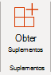

# Gerenciar suplementos no centro de administração

::: moniker range="o365-21vianet"

> [!NOTE]
> O centro de administração está mudando. Se a sua experiência não corresponder aos detalhes apresentados aqui, consulte [Sobre o novo centro de administração do Microsoft 365](https://docs.microsoft.com/microsoft-365/admin/microsoft-365-admin-center-preview?view=o365-21vianet).

::: moniker-end

Os suplementos do Office ajudam você a personalizar seus documentos e simplificar a forma como você acessa as informações na Web (Confira [começar a usar o suplemento do Office](https://support.microsoft.com/office/82e665c4-6700-4b56-a3f3-ef5441996862)). 

Depois que um administrador implanta suplementos para usuários em uma organização, o administrador pode ativar ou desativar os suplementos, editar, excluir e gerenciar o acesso aos suplementos.

Para obter mais informações sobre como instalar suplementos no centro de administração, consulte [implantar suplementos no centro de administração](https://docs.microsoft.com/microsoft-365/admin/manage/manage-deployment-of-add-ins).
  
## Estados de suplementos

Um suplemento pode estar no estado **ativado** ou **desativado** .
  
|**State**|**Como o estado ocorre**|**Impacto**|
|:-----|:-----|:-----|
|**Active**    |O administrador carregou o suplemento e o atribuiu a usuários ou grupos.    |Os usuários e grupos atribuídos ao suplemento o vêem nos clientes relevantes.    |
|**Desativado**    |O administrador desativou o suplemento.    |Os usuários e grupos atribuídos ao suplemento não têm mais acesso a ele.    Se o estado do suplemento for alterado para ativo, os usuários e grupos terão acesso a ele novamente.    |
|**Excluído**    |O administrador excluiu o suplemento.    |Os usuários e grupos atribuídos ao suplemento não têm mais acesso a ele.    |
   
Considere a possibilidade de excluir um suplemento se ninguém estiver usando mais um. Por exemplo, a desativação de um suplemento pode fazer sentido se um suplemento é usado somente durante horários específicos do ano.

## Excluir um suplemento

Você também pode excluir um suplemento implantado.

1. No centro de administração, vá para a página **configurações**de  >  **&** de suplementos.

2. Selecione o suplemento implantado.

3. Clique em **excluir suplemento**. Remova o botão do suplemento no canto inferior direito.

4. Valide suas seleções e escolha **remover suplemento**.

## Editar acesso de suplemento

Pós-implantação, os administradores também podem gerenciar o acesso do usuário a suplementos.

1. No centro de administração, vá para a página **configurações**de  >  **&** de suplementos.

2. Selecione o suplemento implantado.

3. Clique em **Editar** em **quem tem acesso**.

4. Salve as alterações.

## Impedir downloads de suplementos desativando a Office Store em todos os clientes (exceto Outlook)

> [!NOTE]
> A instalação do suplemento do Outlook é gerenciada por um [processo diferente](https://technet.microsoft.com/library/jj943754%28v=exchg.150%29.aspx).

Como uma organização, talvez você queira impedir o download de novos suplementos do Office da Office Store. Isso pode ser usado em conjunto com a implantação centralizada para garantir que apenas os suplementos aprovados pela organização sejam implantados para os usuários da sua organização.
  
**Para desativar a aquisição de suplementos**
  
1. No centro de administração, vá para a página **Configurações** \> [Serviços&amp; suplementos](https://go.microsoft.com/fwlink/p/?linkid=2053743).
    
3. Selecione **aplicativos e serviços de Propriedade do usuário**.
    
4. Desmarque a opção para permitir que os usuários acessem a Office Store.

Isso impedirá que todos os usuários adquiram os seguintes suplementos do repositório.
  
- Suplementos para Word, Excel e PowerPoint 2016 de:
    
  - Windows
    
  - Mac
    
  - Office
    
    
- Aquisições começando no **AppSource**
    
- Suplementos no Microsoft 365
    
Um usuário que tentar acessar o repositório verá a seguinte mensagem: o **Microsoft 365 foi configurado para impedir a aquisição individual de suplementos da Office Store.**
  
O suporte à desativação da Office Store está disponível nas seguintes versões:
  
- Windows: 16.0.9001-disponível no momento.
    
- Mac: 16.10.18011401-disponível no momento.
    
- iOS: 2.9.18010804-disponível no momento.
    
- A Web-disponível no momento.
    
Isso não impede que um administrador use a implantação centralizada para atribuir um suplemento da Office Store.
  
Para impedir que um usuário entre com uma conta da Microsoft, você pode restringir o logon para usar apenas a conta organizacional. Para obter mais informações, consulte [identidade, autenticação e autorização no Office 2016](https://technet.microsoft.com/library/jj683102%28v=office.16%29.aspx).  

## Saiba mais sobre a experiência do usuário final com suplementos

Depois de implantar um suplemento, os usuários finais podem começar a usá-lo em seus aplicativos do Office (Confira [começar a usar o suplemento do Office](https://support.microsoft.com/office/82e665c4-6700-4b56-a3f3-ef5441996862)). O suplemento aparece em todas as plataformas compatíveis com o suplemento.
  
Se o suplemento suportar comandos de suplemento, os comandos serão exibidos na faixa de opções do Office. No exemplo a seguir, a **citação de pesquisa** de comando aparece para o suplemento de **citações** . 

  
Se o suplemento implantado não oferecer suporte a comandos de suplemento ou se você quiser exibir todos os suplementos implantados, poderá exibi-los por meio **de meus**suplementos. 
  
### No Word 2016, no Excel 2016 ou no PowerPoint 2016

1. Selecione **Inserir \> meus**suplementos. 
    
2. Selecione a guia **Administração gerenciada** na janela suplementos do Office. 
    
3. Clique duas vezes no suplemento que você implantou anteriormente (neste exemplo, **citações** ).  
  
### No Outlook

1. Na faixa de opções **página inicial** , selecione **obter suplementos**. 
  
2. Selecione **Administração gerenciada** no painel de navegação esquerdo. 

## Saiba mais

[Implantar suplementos no centro de administração](https://docs.microsoft.com/microsoft-365/admin/manage/manage-deployment-of-add-ins)

Saiba mais sobre a criação e [a criação de suplementos do Office](https://go.microsoft.com/fwlink/p/?linkid=846362).
  
[Use cmdlets do PowerShell de implantação centralizada para gerenciar suplementos](https://docs.microsoft.com/office365/enterprise/use-the-centralized-deployment-powershell-cmdlets-to-manage-add-ins).
  
[Solução de problemas: o usuário não está vendo suplementos](https://docs.microsoft.com/office365/troubleshoot/access-management/user-not-seeing-add-ins)

[Menores e adquirir suplementos da Microsoft Store](https://docs.microsoft.com/microsoft-365/admin/manage/minors-and-acquiring-addins-from-the-store)