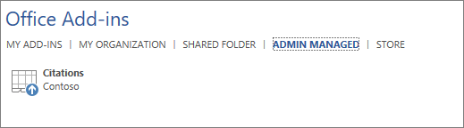

# Gerenciar suplementos no centro de administraçãoManage add-ins in the admin center

Office os complementos ajudam você a personalizar seus documentos e a simplificar a maneira como você acessa informações na Web (consulte [Start using your Office add-in](https://support.microsoft.com/office/82e665c4-6700-4b56-a3f3-ef5441996862)).Office add-ins help you personalize your documents and streamline the way you access information on the web (see [Start using your Office add-in](https://support.microsoft.com/office/82e665c4-6700-4b56-a3f3-ef5441996862)). 

Depois que um administrador implanta os complementos para usuários em uma organização, o administrador pode desativar ou ativar os complementos, editar, excluir e gerenciar o acesso aos complementos.After an admin deploys add-ins for users in an organization, the admin can turn add-ins off or on, edit, delete, and manage access to the add-ins.

Para obter mais informações sobre como instalar os complementos do centro de administração, consulte [Deploy add-ins in the admin center](./manage-deployment-of-add-ins.md).For more information about installing add-ins from the admin center, see [Deploy add-ins in the admin center](./manage-deployment-of-add-ins.md).
  
## Estados de complementosAdd-in states

Um complemento pode estar no estado **On** ou **Off.**An add-in can be in either the **On** or **Off** state.
  
| EstadoState | Como o estado ocorreHow the state occurs | ImpactoImpact |
|:-----|:-----|:-----|
|**Ativo****Active**    |O administrador carregou o complemento e o atribuiu a usuários ou grupos.Admin uploaded the add-in and assigned it to users or groups.    |Os usuários e grupos atribuídos ao complemento o veem nos clientes relevantes.Users and groups assigned to the add-in see it in the relevant clients.    |
|**Desativado****Turned off**    |O administrador desativou o suplemento.Admin turned off the add-in.    |Os usuários e grupos atribuídos ao complemento não têm mais acesso a ele.Users and groups assigned to the add-in no longer have access to it.    Se o estado do add-in for alterado para Ativo, os usuários e grupos terão acesso a ele novamente.If the add-in state is changed to Active, the users and groups will have access to it again.    |
|**Excluído****Deleted**    |O administrador excluiu o suplemento.Admin deleted the add-in.    |Os usuários e grupos atribuídos ao complemento não têm mais acesso a ele.Users and groups assigned the add-in no longer have access to it.    |
   
Considere a exclusão de um complemento se ninguém o estiver usando mais.Consider deleting an add-in if no one is using it anymore. Por exemplo, desligar um complemento pode fazer sentido se um add-in for usado somente durante períodos específicos do ano.For example, turning off an add-in might make sense if an add-in is used only during specific times of the year.

## Excluir um complementoDelete an add-in

Você também pode excluir um complemento que foi implantado.You can also delete an add-in that was deployed.

1. No centro de administração, vá para **a** página Configurações  >  **Serviços & de complementos.**In the admin center, go to the **Settings** > **Services & add-ins** page.

    > [!NOTE]
    > O centro de administração está sendo atualizado para a experiência de implantação com Aplicativos Integrados.The admin center is getting updated to deployment experience with Integrated Apps . Se você não vir as etapas acima, vá para a seção Implantação Centralizada indo para Configurações  >  **aplicativos integrados.**If you don't see the above steps, go to Centralized Deployment section by going to **Settings** > **Integrated apps**. Na parte superior da página **Aplicativos integrados,** escolha **Complementos**.On the top of the **Integrated apps** page, choose **Add-ins**.

2. Selecione o complemento implantado.Select the deployed add-in.

3. Clique em **Excluir Add-In**.Click on **Delete Add-In**. Remova o botão Adicionar no canto inferior direito.Remove the Add-in button on the bottom-right corner.

4. Valide suas seleções e escolha **Remover complemento**.Validate your selections, and choose **Remove add-in**.

## Editar acesso ao complementoEdit add-in access

Após a implantação, os administradores também podem gerenciar o acesso do usuário aos complementos.Post deployment, admins can also manage user access to add-ins.

1. No centro de administração, vá para **a** página Configurações  >  **Serviços & de complementos.**In the admin center, go to the **Settings** > **Services & add-ins** page.

    > [!NOTE]
    > O centro de administração está sendo atualizado para a experiência de implantação com Aplicativos Integrados.The admin center is getting updated to deployment experience with Integrated Apps . Se você não vir as etapas acima, vá para a seção Implantação Centralizada indo para Configurações  >  **aplicativos integrados.**If you don't see the above steps, go to Centralized Deployment section by going to **Settings** > **Integrated apps**. Na parte superior da página **Aplicativos integrados,** escolha **Complementos**.On the top of the **Integrated apps** page, choose **Add-ins**.

2. Selecione o complemento implantado.Select the deployed add-in.

3. Clique em **Editar** em **Who tem Access**.Click on **Edit** under **Who has Access**.

4. Salve as alterações.Save the changes.

## Impedir downloads de complementos ao desligar o Office Store em todos os clientes (exceto Outlook)Prevent add-in downloads by turning off the Office Store across all clients (Except Outlook)

> [!NOTE]
> Outlook instalação do add-in é gerenciada por um [processo diferente.](/exchange/clients-and-mobile-in-exchange-online/add-ins-for-outlook/specify-who-can-install-and-manage-add-ins)Outlook add-in installation is managed by a [different process](/exchange/clients-and-mobile-in-exchange-online/add-ins-for-outlook/specify-who-can-install-and-manage-add-ins).

Como uma organização, você pode querer impedir o download de novos Office de Office Store.As an organization you may wish to prevent the download of new Office add-ins from the Office Store. Isso pode ser usado em conjunto com a Implantação Centralizada para garantir que apenas os complementos aprovados pela organização sejam implantados para usuários em sua organização.This can be used in conjunction with Centralized Deployment to ensure that only organization-approved add-ins are deployed to users within your organization.
  
**Para desativar a aquisição de um complemento****To turn off add-in acquisition**
  
1. No centro de administração, vá para a página **Configurações** \> [Serviços&amp; suplementos](https://go.microsoft.com/fwlink/p/?linkid=2053743).In the admin center, go to the **Settings** \> [Services &amp; add-ins](https://go.microsoft.com/fwlink/p/?linkid=2053743) page.

    > [!NOTE]
    > O centro de administração está sendo atualizado para a experiência de implantação com Aplicativos Integrados.The admin center is getting updated to deployment experience with Integrated Apps. Se você não vir as etapas acima, vá para a seção Implantação Centralizada indo para Configurações  >  **aplicativos integrados.**If you don't see the above steps, go to Centralized Deployment section by going to **Settings** > **Integrated apps**. Na parte superior da página **Aplicativos integrados,** escolha **Complementos**.On the top of the **Integrated apps** page, choose **Add-ins**.
    
3. Selecione **Aplicativos e serviços de propriedade do usuário**.Select **User owned apps and services**.
    
4. Desmarque a opção de permitir que os usuários acessem a Office Store.Clear the option to let users access the Office store.

    Isso impedirá que todos os usuários adquiram os seguintes complementos da loja.This will prevent all users from acquiring the following add-ins from the store.
      
    - Os complementos para Word, Excel e PowerPoint 2016 de:Add-ins for Word, Excel, and PowerPoint 2016 from:
        
      - WindowsWindows
      - MacMac
      - OfficeOffice
        
        
    - Aquisições começando no **AppSource**Acquisitions starting within **AppSource**
        
    - Os complementos no Microsoft 365Add-ins within Microsoft 365
        
    Um usuário que tentar acessar o armazenamento verá a seguinte mensagem: Desculpe, Microsoft 365 foi configurada para impedir a aquisição individual de Office **Desempregos da Loja.**A user who tries to access the store will see the following message: **Sorry, Microsoft 365 has been configured to prevent individual acquisition of Office Store add-ins.**
  
O suporte para desligar o Office Store está disponível nas seguintes versões:Support for turning off the Office Store is available in the following versions:
  
- Windows: 16.0.9001 - Disponível no momento.Windows: 16.0.9001 - Currently available.
    
- Mac: 16.10.18011401 - Disponível no momento.Mac: 16.10.18011401 - Currently available.
    
- iOS: 2.9.18010804 - Disponível no momento.iOS: 2.9.18010804 - Currently available.
    
- A Web - Disponível no momento.The web - Currently available.
    
Isso não impede que um administrador use a Implantação Centralizada para atribuir um Office Store.This does not prevent an administrator from using Centralized Deployment to assign an add-in from the Office Store.

> [!NOTE] 
> Os Visio, Bing Mapas e Pessoas Graph ainda aparecerão na faixa de opções, mesmo que um administrador tenha desabilitado a Loja.Add-ins such as Visio Data Visualizer, Bing Maps, and People Graph will still show up in the ribbon, even if an admin has disabled the Store. Para remover esses links, os administradores devem desabilitar a Loja por meio do Objeto de Política de Grupo (GPO).To remove these links, administrators must disable the Store through Group Policy Object (GPO).
  
Para impedir que um usuário entre com uma conta da Microsoft, você pode restringir o logon para usar apenas a conta organizacional.To prevent a user from signing in with a Microsoft account, you can restrict logon to use only the organizational account. Para obter mais informações, [consulte Identity, authentication, and authorization in Office 2016](/DeployOffice/security/identity-authentication-and-authorization-in-office).For more information, see [Identity, authentication, and authorization in Office 2016](/DeployOffice/security/identity-authentication-and-authorization-in-office).  

> [!NOTE] 
> Impedir que os usuários acessem o office store também os impedirá de fazer sideload Office de complementos para testes de um [compartilhamento de rede.](/office/dev/add-ins/testing/create-a-network-shared-folder-catalog-for-task-pane-and-content-add-ins)Preventing users from accessing the office store will also prevent them from [Sideloading Office Add-ins for testing from a network share](/office/dev/add-ins/testing/create-a-network-shared-folder-catalog-for-task-pane-and-content-add-ins).

## Mais sobre a experiência do usuário final com os complementosMore about the end-user experience with add-ins

Depois de implantar um add-in, os usuários finais podem começar a usá-lo em seus aplicativos Office de Office (consulte [Start using your Office Add-in](https://support.microsoft.com/office/82e665c4-6700-4b56-a3f3-ef5441996862)).After you deploy an add-in, your end users can start using it in their Office applications (see [Start using your Office Add-in](https://support.microsoft.com/office/82e665c4-6700-4b56-a3f3-ef5441996862)). O complemento aparece em todas as plataformas que o complemento oferece suporte.The add-in appears on all platforms that the add-in supports.
  
Se o complemento for compatível com comandos de complemento, os comandos aparecerão na faixa Office faixa de opções.If the add-in supports add-in commands, the commands appear on the Office ribbon. No exemplo a seguir, o comando **Search Citation** é exibido para o complemento **Citações.**In the following example, the command **Search Citation** appears for the **Citations** add-in. 

  
Se o complemento implantado não dá suporte a comandos de add-in ou se você quiser exibir todos os complementos implantados, poderá **exibi-los** por meio de Meus Complementos .If the deployed add-in doesn't support add-in commands or if you want to view all deployed add-ins, you can view them via **My Add-ins**. 
  
### Nos aplicativos Word 2016, Excel 2016 ou PowerPoint 2016In Word 2016, Excel 2016, or PowerPoint 2016

1. Selecione **Inserir \> Meus Complementos**.Select **Insert \> My Add-ins**. 
    
2. Selecione a **guia Admin Managed** na janela Office Desem seguida.Select the **Admin Managed** tab in the Office Add-ins window. 
    
3. Clique duas vezes no complemento implantado anteriormente (neste exemplo, **Citações**).Double-click the add-in you deployed earlier (in this example, **Citations**).

    
  
### No OutlookIn Outlook

1. Na faixa **de opções** Home, selecione **Obter Complementos**.On the **Home** ribbon, select **Get Add-ins**.

    
  
2. Selecione **Gerenciados pelo Administrador** no painel de administração à esquerda.Select **Admin-managed** in the left nav. 

## Conteúdo relacionadoRelated content

[Implantar os complementos no centro de administração](./manage-deployment-of-add-ins.md) (artigo)[Deploy add-ins in the admin center](./manage-deployment-of-add-ins.md) (article)\
Saiba mais sobre como criar e [criar Office -ins](/office/dev/add-ins/overview/office-add-ins) (artigo)Learn more about creating and building [Office Add-ins](/office/dev/add-ins/overview/office-add-ins) (article)\
[Usar cmdlets do PowerShell de](../../enterprise/use-the-centralized-deployment-powershell-cmdlets-to-manage-add-ins.md) Implantação Centralizada para gerenciar os complementos (artigo)[Use Centralized Deployment PowerShell cmdlets to manage add-ins](../../enterprise/use-the-centralized-deployment-powershell-cmdlets-to-manage-add-ins.md) (article)\
[Solução de problemas: o usuário não está vendo os complementos](/office365/troubleshoot/access-management/user-not-seeing-add-ins) (artigo)[Troubleshoot: User not seeing add-ins](/office365/troubleshoot/access-management/user-not-seeing-add-ins) (article)\
[Secundárias e aquisição de complementos do Microsoft Store](./minors-and-acquiring-addins-from-the-store.md) (artigo)[Minors and acquiring add-ins from the Microsoft Store](./minors-and-acquiring-addins-from-the-store.md) (article)
