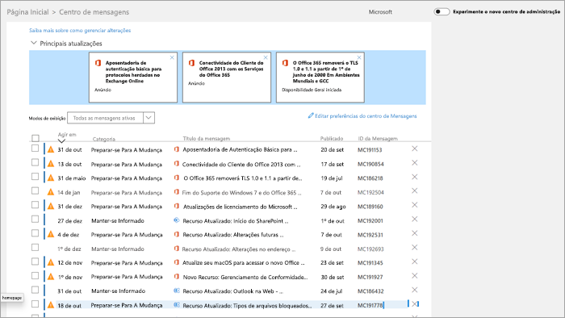

# Gerenciar mensagens no Centro de MensagensManage messages in Message center

As postagens do centro de mensagens são anúncios importantes sobre recursos novos e alterados.Message center posts are important announcements about new and changed features. Este artigo fornece mais informações sobre o que você pode fazer com as mensagens para ajudar no gerenciamento de alterações em sua organização.This article provides more information about the things you can do with messages to help with change management in your organization.
  
## Ler uma mensagemRead a message

To go to the Message center, go to the [admin center](https://go.microsoft.com/fwlink/p/?linkid=2024339), and select **Health**  >  **Message center**.To go to the Message center, go to the [admin center](https://go.microsoft.com/fwlink/p/?linkid=2024339), and select **Health** > **Message center**. 

Selecione um título de mensagem para abri-lo no painel de leitura.Select a message title to open it in the reading pane. Cada mensagem contém um resumo da alteração, uma instrução de como a alteração pode afetá-lo, informações sobre como você pode preparar sua organização para a alteração e (na maioria dos casos) um link de informações adicionais onde você pode saber mais.Every message contains a summary of the change, a statement of how the change may affect you, information about how you can prepare your organization for the change, and (in most cases) an additional information link where you can learn more. As informações adicionais continuam disponíveis, mesmo depois que uma mensagem expira.The additional information continues to be available, even after a message expires.

## Filtrar e classificarFilter and sort

::: moniker range="o365-worldwide"

Use **o** menu suspenso Filtro para selecionar uma exibição filtrada de mensagens.Use the **Filter** drop-down menu to select a filtered view of messages.

Você pode selecionar qualquer título de coluna para classificar mensagens em ordem crescente ou decrescente.You can select any column heading to sort messages in ascending or descending order. Por exemplo, neste diagrama, as mensagens são ordenadas na **Lei por** data.For example, in this diagram the messages are sorted on the **Act by** date.

::: moniker-end

::: moniker range="o365-germany"

Use o menu **suspenso** Exibições para selecionar uma exibição filtrada de mensagens.Use the **Views** drop-down menu to select a filtered view of messages. 
 
Você pode selecionar qualquer título de coluna para classificar mensagens em ordem crescente ou decrescente.You can select any column heading to sort messages in ascending or descending order. Por exemplo, nesta ilustração, as mensagens são ordenadas na **Lei por** data.For example, in this illustration the messages are sorted on the **Act by** date.

::: moniker-end

::: moniker range="o365-21vianet"

Use o menu **suspenso** Exibições para selecionar uma exibição filtrada de mensagens.Use the **Views** drop-down menu to select a filtered view of messages. 
 
Você pode selecionar qualquer título de coluna para classificar mensagens em ordem crescente ou decrescente.You can select any column heading to sort messages in ascending or descending order. Por exemplo, nesta ilustração, as mensagens são ordenadas na **Lei por** data.For example, in this illustration the messages are sorted on the **Act by** date.

::: moniker-end

## Fazer comentários sobre uma postagemGive feedback on a post

No Centro de mensagens, você pode selecionar uma mensagem para ver detalhes.In the Message center, you can select a message to see details.

Se você quiser fornecer comentários sobre a  mensagem, selecione o ícone Like ou **Dislike** e forneça comentários na caixa de texto exibida.If you want to provide feedback on the message, select either the **Like** or **Dislike** icon and provide feedback in the text box that appears. Não forneça informações pessoais.Do not provide any personal information. Opcionalmente, você pode selecionar Não há problema em entrar em contato **comigo sobre esse comentário** e, em seguida, selecionar **Enviar.**You can optionally select **It's OK to contact me about this feedback** and then select **Send**.

## Compartilhar uma mensagemShare a message

Vê uma mensagem em que outra pessoa precisa agir?See a message that someone else needs to act on? Você pode compartilhar o conteúdo da mensagem com qualquer usuário por email:You can share the contents of the message with any user by email:
  
1. Selecione a mensagem para abri-la e, em seguida, selecione **Compartilhar**.Select the message to open it, and then select **Share**.
  
2. Para compartilhar a mensagem, insira até dois endereços de email separados por dois-pontos.To share the message, enter up to two email addresses separated by a colon. Você pode enviar para endereços de email individuais e de grupo.You can send to individual and to group email addresses. Opcionalmente, você pode optar por receber uma cópia da mensagem por email (a mensagem irá para seu endereço de email principal) ou adicionar uma mensagem pessoal para fornecer aos destinatários mais contexto.Optionally, you can choose to receive a copy of the message in email (the message will go to your primary email address) or add a personal message to provide recipients with more context.
  
3. Selecione **Compartilhar** para enviar o email.Select **Share** to send the email.
    
## Obter um linkGet a link

Precisa acompanhar outro administrador para garantir que ele esteja ciente de uma alteração e tomar medidas?Need to follow up with another admin to make sure they're aware of a change and taking action? Você pode gerar um link para compartilhar no email ou no sistema de mensagens instantâneas, por exemplo, que conectará o usuário diretamente a essa mensagem.You can generate a link to share in email or instant messaging, for example, that will connect the user directly to that message. A pessoa com quem você compartilha o link deve ser um administrador no Microsoft 365 para sua organização ou ela não terá acesso à mensagem vinculada.The person you share the link with has to be an admin in Microsoft 365 for your organization or they won't have access to the linked message.

::: moniker range="o365-worldwide"

1. Selecione a mensagem para abri-la.Select the message to open it.

2. Selecione o **link Copiar para o ícone da Área de** Transferência (link).Select the **Copy link to Clipboard** (link) icon.

3. Permita que a página da Web acesse sua Área de Transferência.Allow the webpage to access your Clipboard. Um link direto é copiado para a área de transferência.A direct link is copied to your Clipboard.

4. Use Ctrl+V ou clique com o botão direito do mouse e selecione **Colar** para inserir o link.Use Ctrl+V or right-click and select **Paste** to insert the link.

::: moniker-end

::: moniker range="o365-germany"

1. Selecione a mensagem para abri-la.Select the message to open it.

2. Choose **More** \> **Get a link** from the action bar.Choose **More** \> **Get a link** from the action bar.

3. Permita que a página da Web acesse sua Área de Transferência.Allow the webpage to access your Clipboard. Um link direto é copiado para a área de transferência.A direct link is copied to your Clipboard.

4. Use Ctrl+V ou clique com o botão direito do mouse e selecione **Colar** para inserir o link.Use Ctrl+V or right-click and select **Paste** to insert the link.

::: moniker-end

::: moniker range="o365-21vianet"

1. Selecione a mensagem para abri-la.Select the message to open it.

2. Choose **More** \> **Get a link** from the action bar.Choose **More** \> **Get a link** from the action bar.

3. Permita que a página da Web acesse sua Área de Transferência.Allow the webpage to access your Clipboard. Um link direto é copiado para a área de transferência.A direct link is copied to your Clipboard.

4. Use Ctrl+V ou clique com o botão direito do mouse e selecione **Colar** para inserir o link.Use Ctrl+V or right-click and select **Paste** to insert the link.

::: moniker-end

## Estados lidos e não lidosRead and unread states

Qualquer mensagem no Centro de mensagens não lida aparecerá em negrito.Any message in Message center that is unread will appear in bold. Abrir uma mensagem marca como lida.Opening a message marks it as read. Você pode marcar uma mensagem como não lida.You can mark a message as unread.

::: moniker range="o365-worldwide"

1. Na página principal do centro de mensagens, selecione uma mensagem.On the main page of the message center, select a message.

2. Selecione o **ícone Marcar como não** lido (envelope) na parte superior da mensagem.Select the **Mark as unread** (envelope) icon at the top of the message.
  
::: moniker-end

::: moniker range="o365-germany"

1. Selecione a mensagem para abri-la.Select the message to open it.

2. Selecione **Mais** \> **Marca como não lida.**Select **More** \> **Mark as unread**.

3. Feche a mensagem.Close the message.

::: moniker-end

::: moniker range="o365-21vianet"

1. Selecione a mensagem para abri-la.Select the message to open it.

2. Selecione **Mais** \> **Marca como não lida.**Select **More** \> **Mark as unread**.

3. Feche a mensagem.Close the message.

::: moniker-end

## Arquivar e restaurarArchive and restore

Se você vir uma mensagem que não pertence a você, ou talvez você já atuou nele, poderá arquivar a mensagem para removê-la da exibição centro de mensagens.If you see a message that doesn't pertain to you, or maybe you've already acted on it, you can archive the message to remove it from the Message center view. O modo de exibição que você vê no Centro de mensagens é específico para sua conta de usuário, portanto, arquiva-la do seu modo de exibição não afeta outros administradores.The view that you see in the Message center is specific to your user account, so archiving it from your view doesn't affect other admins.

::: moniker range="o365-worldwide"

- Na página principal do Centro de mensagens, selecione uma mensagem e, em seguida, selecione **Arquivar** acima da lista de mensagens.On the main page of the Message center, select a message, and then select **Archive** above the list of messages.

- Abra a mensagem e selecione **Arquivar** na parte inferior da mensagem.Open the message, and then select **Archive** at the bottom of the message.

Precisa receber uma mensagem arquivada de volta?Need to get a archived message back? Não há problema.No problem.
  
1. Selecione a **guia Mensagens Arquivadas** na parte superior do Centro de Mensagens.Select the **Archived messages** tab at the top of the Message center. Uma lista de mensagens arquivadas é exibida.A list of archived messages appears. 

2. Selecione a mensagem, selecione **Restaurar** e a mensagem será restaurada para mensagens ativas.Select the message, select **Restore**, and the message is restored to active messages.

::: moniker-end

::: moniker range="o365-germany"

Há duas maneiras de arquivar uma mensagem.There are two ways to archive a message.
  
- Selecione o X que aparece à direita da ID da Mensagem.Select the X that appears to the right of the Message ID. A mensagem foi removida da sua lista.The message is removed from your list. Ou,Or,

- Abra a mensagem e selecione **Arquivar** na parte superior da mensagem.Open the message, and then select **Archive** at the top of the message.

Precisa receber uma mensagem descartada de volta?Need to get a dismissed message back? Não há problema.No problem.
  
1. Selecione o **filtro de mensagens arquivadas** **no** menu suspenso Exibições.Select the **Archived messages** filter from the **Views** drop-down menu. Uma lista de mensagens arquivadas é exibida.A list of archived messages appears.

2. Selecione **Restaurar** à direita da ID da Mensagem e a mensagem será restaurada para as mensagens ativas.Select **Restore** to the right of the Message ID, and the message is restored to active messages.

::: moniker-end

::: moniker range="o365-21vianet"

Há duas maneiras de arquivar uma mensagem.There are two ways to archive a message.
  
- Selecione o X que aparece à direita da ID da Mensagem.Select the X that appears to the right of the Message ID. A mensagem foi removida da sua lista.The message is removed from your list. Ou,Or,

- Abra a mensagem e selecione **Arquivar** na parte superior da mensagem.Open the message, and then select **Archive** at the top of the message.

Precisa receber uma mensagem arquivada de volta?Need to get a archived message back? Não há problema.No problem.
  
1. Selecione o **filtro de mensagens arquivadas** **no** menu suspenso Exibições.Select the **Archived messages** filter from the **Views** drop-down menu. Uma lista de mensagens arquivadas é exibida.A list of archived messages appears.

2. Selecione **Restaurar** à direita da ID da Mensagem e a mensagem será restaurada para as mensagens ativas.Select **Restore** to the right of the Message ID, and the message is restored to active messages.

::: moniker-end

## Acompanhe o centro de mensagens no PlannerTrack your message center tasks in Planner

Uma grande quantidade de informações acionáveis sobre as alterações nos serviços do Microsoft 365 chega no centro de mensagens da Microsoft 365.A lot of actionable information about changes to Microsoft 365 services arrives in the Microsoft 365 message center. Pode ser difícil acompanhar quais alterações exigem que as tarefas sejam feitas, quando e por quem, e rastrear cada tarefa até a conclusão.It can be difficult to keep track of which changes require tasks to be done, when, and by whom, and to track each task to completion. Você também pode querer fazer uma anotação de algo e marcá-la para que seja verificada depois.You also might want to make a note of something and tag it to check on later. Você pode fazer tudo isso e muito mais ao sincronizar suas mensagens do Centro de administração do Microsoft 365 para o Microsoft Planner.You can do all this and more when you sync your messages from the Microsoft 365 admin center to Microsoft Planner. Para saber mais, confira [Controlar as tarefas do centro de mensagens no Planner.](https://docs.microsoft.com/office365/planner/track-message-center-tasks-planner)For more information, see [Track your message center tasks in Planner](https://docs.microsoft.com/office365/planner/track-message-center-tasks-planner).

Para ter uma visão geral do Centro de mensagens, confira [Centro de mensagens no Microsoft 365.](message-center.md)For an overview of Message center, see [Message center in Microsoft 365](message-center.md). Ou, para saber como definir suas preferências de idioma para habilitar a tradução automática para postagens do Centro de mensagens, consulte Tradução de idioma para [postagens do Centro de mensagens.](language-translation-for-message-center-posts.md)Or, to learn how to set your language preferences to enable machine translation for Message center posts, see [Language translation for Message center posts](language-translation-for-message-center-posts.md). Se você quiser programar uma maneira alternativa de obter informações de saúde do serviço em tempo real e comunicações do Centro de Mensagens, faça referência à Visão Geral da API de Comunicações do Serviço do [Microsoft 365.](https://go.microsoft.com/fwlink/p/?linkid=848507)If you'd like to program an alternative way to get real-time service health information and Message Center communications, please reference [Microsoft 365 Service Communications API Overview](https://go.microsoft.com/fwlink/p/?linkid=848507).
  
