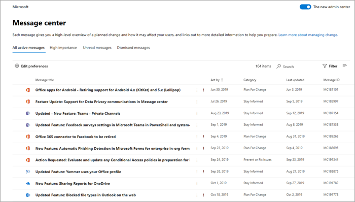

# Gerenciar mensagens no Centro de mensagens

As postagens do Centro de mensagens são comunicados importantes sobre novos recursos e os alterados. Este artigo traz mais informações sobre o que pode ser feito com as mensagens para ajudar no gerenciamento de alterações em sua organização.
  
## Ler uma mensagem

Para acessar o Centro de mensagens, vá para o [Centro de administração](https://go.microsoft.com/fwlink/p/?linkid=2024339)e selecione **Integridade** > **Centro de mensagens**.

Selecione um título de mensagem para abri-lo no painel de leitura. Cada mensagem contém um resumo da alteração, uma declaração de como a alteração pode afetar você, informações sobre como você pode preparar sua organização para a alteração, e (na maioria dos casos) um link de informação adicional para saber mais. As informações adicionais continuarão disponíveis, mesmo após uma mensagem expirar.

## Filtrar e classificar

::: moniker range="o365-worldwide"

Use os menus suspensos **Serviço**, **Rótulo** e **estado da Mensagem**  para selecionar uma exibição filtrada das mensagens. Por exemplo, neste diagrama, as mensagens estão rotuladas com o rótulo de **impacto de Administrador**.

Você pode selecionar qualquer título de coluna, exceto **Serviço** e **Rótulo**,  para classificar as mensagens em ordem crescente ou decrescente.

:::image type="content" source="../../media/message-center-admin-impact1.png" alt-text="Exibição da central de mensagens classificada por impacto de Administrador":::

::: moniker-end

::: moniker range="o365-germany"

Use o menu suspenso **Filtrar** para selecionar uma exibição filtrada das mensagens.

Você pode selecionar qualquer título de coluna para classificar as mensagens em ordem crescente ou decrescente. Por exemplo, nesta ilustração, as mensagens são classificadas como **Agir por** data.

::: moniker-end

::: moniker range="o365-21vianet"

Use os menus suspensos **Serviço**, **Rótulo** e **estado da Mensagem**  para selecionar uma exibição filtrada das mensagens. Por exemplo, neste diagrama, as mensagens estão rotuladas com o **impacto de Administrador**.

Você pode selecionar qualquer título de coluna, exceto **Serviço** e **Rótulos**,  para classificar as mensagens em ordem crescente ou decrescente.

::: moniker-end

## Deixar comentários sobre uma postagem

No Centro de mensagens, selecione uma mensagem para ver os detalhes.

Se você deixar comentários sobre a mensagem, no painel de detalhes, selecione o ícone **Gostar** ou **Não gostar** na parte inferior do painel de detalhes da mensagem e deixe comentários opcionais na caixa de texto exibida. Não forneça informações pessoais. Selecione opcionalmente **Podem me contatar a respeito desse comentário** e, em seguida, selecione **Enviar**.

## Compartilhar uma mensagem

Está vendo uma mensagem pedindo a ação de outra pessoa? Você pode compartilhar o conteúdo da mensagem com qualquer usuário por email:
  
1. Selecione a mensagem para abri-la e, em seguida, selecione **Compartilhar**.
  
2. Para compartilhar a mensagem, insira até dois endereços de email separados por dois-pontos. Você pode enviar para endereços de email individuais e de grupos. Opcionalmente, você pode optar por receber uma cópia da mensagem por email (a mensagem será enviada para seu endereço de email principal) ou adicionar uma mensagem pessoal para fornecer mais contexto aos destinatários.
  
3. Selecione **Compartilhar** para enviar o email.

## Obter um link

Precisa acompanhar com outro administrador para garantir que eles estão cientes de uma alteração e que estão agindo? Você pode gerar um link para compartilhar por email ou mensagens instantâneas, por exemplo, que conectará o usuário diretamente à mensagem. A pessoa com quem você compartilha o link deve ter acesso ao Centro de mensagens. Para obter mais informações, consulte [funções de administrador que não têm acesso ao Centro de mensagens](message-center.md#admin-roles-that-dont-have-access-to-the-message-center).

::: moniker range="o365-worldwide"

1. Selecione a mensagem para abri-la.

2. Selecione **Copiar link**.

3. Use Ctrl+V ou clique com o botão direito e selecione **Colar** para inserir o link para qualquer documento que você desejar.

::: moniker-end

::: moniker range="o365-germany"

1. Selecione a mensagem para abri-la.

2. Escolha **Mais** \> **Obter um link** na barra de ações.

3. Permitir que a página da Web acesse sua Área de Transferência. Um link direto é copiado para sua Área de Transferência.

4. Use Ctrl+V ou clique com o botão direito e selecione **Colar** para inserir o link.

::: moniker-end

::: moniker range="o365-21vianet"

1. Selecione a mensagem para abri-la.

2. Selecione **Copiar link**.

3. Use Ctrl+V ou clique com o botão direito e selecione **Colar** para inserir o link para qualquer documento que você desejar.

::: moniker-end

## Estados lidos e não lidos

Qualquer mensagem não lida do Centro de mensagens será exibida em negrito. Abrir uma mensagem a marcará como lida. Você pode marcar uma mensagem como não lida.

::: moniker range="o365-worldwide"

- Na página principal do Centro de mensagens, selecione as reticências **Mais opções** ao lado de uma mensagem e, em seguida, selecione **Marcar como não lida**.

Você também pode abrir uma mensagem e marcá-la como não lida no painel de detalhes.
  
::: moniker-end

::: moniker range="o365-germany"

1. Selecione a mensagem para abri-la.

2. Selecione **Mais** \> **Marcar como não lida**.

3. Feche a mensagem.

::: moniker-end

::: moniker range="o365-21vianet"

- Na página principal do Centro de mensagens, selecione as reticências **Mais opções** ao lado de uma mensagem e, em seguida, selecione **Marcar como não lida**.

::: moniker-end

## Arquivar e restaurar

Se você vir uma mensagem que não pertence a você, ou talvez já fez alguma ação nela, você pode arquivar a mensagem para removê-la da caixa de entrada. A exibição que você vê no Centro de mensagens é específica para sua conta de usuário, portanto, arquivá-la da sua exibição não afetará outros administradores. Há duas maneiras de arquivar uma mensagem.

- Na página principal do Centro de mensagens, selecione uma mensagem e, em seguida, selecione **Arquivo** acima da lista de mensagens.

- Abra a mensagem e selecione **Arquivar** na parte superior do painel de mensagens.

Precisa arquivar novamente uma mensagem? Não tem problema.
  
1. Selecione a guia **Arquivar** na parte superior do Centro de mensagens. Uma lista de mensagens arquivadas será exibida.

2. Escolha a mensagem, selecione **Restaurar** e a mensagem será restaurada para a caixa de entrada.

## Mensagens favoritas

Para marcar uma mensagem como favorita, passe o mouse sobre o título da mensagem e você verá uma estrela de **Favorito** :::image type="icon" source="../../media/favorite-star.png" border="false"::: que pode ser selecionada logo após as reticências **Mais opções**. Depois de marcar as mensagens como favoritas, você também pode classificá-las e filtrá-las.

## Rolar as mensagens no painel de mensagens

Ao abrir uma mensagem em um painel de leitura, você pode usar as setas **Para cima** e **Para baixo** :::image type="icon" source="../../media/updownarrows.png" border="false"::: na parte superior do painel para mover para a próxima mensagem ou para a anterior na lista.

## Acompanhe o centro de mensagens no Planner

Uma grande quantidade de informações acionáveis sobre as alterações nos serviços do Microsoft 365 chega no centro de mensagens da Microsoft 365. Pode ser difícil acompanhar quais alterações requerem tarefas a serem concluídas, quando e por quem, e acompanhar a conclusão de cada tarefa. Você também pode querer fazer uma anotação de algo e marcá-la para que seja verificada depois. Você pode fazer tudo isso e muito mais ao sincronizar suas mensagens do Centro de administração do Microsoft 365 para o Microsoft Planner. Para mais informações, confira [Acompanhe as tarefas do centro de mensagens no Planner](/office365/planner/track-message-center-tasks-planner).

Para uma visão geral do Centro de mensagens, confira [Centro de mensagens no Microsoft 365](message-center.md). Ou para saber como definir suas preferências de idioma e permitir a tradução automática das postagens do Centro de mensagens, confira [Tradução de idioma para postagens do Centro de mensagens](language-translation-for-message-center-posts.md). Se você quiser programar uma maneira alternativa de obter informações em tempo real sobre a integridade do serviço e sobre as comunicações do Centro de Mensagens, confira [Visão geral da API de Comunicações de Serviço do Microsoft 365](/previous-versions/office/developer/o365-enterprise-developers/jj984343(v=office.15)).