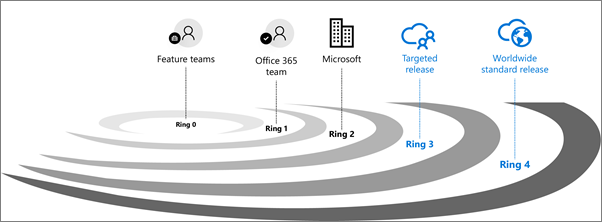

# Configurar as opções de versão Padrão ou Direcionada

> [!IMPORTANT]
> As atualizações do Microsoft 365 descritas neste artigo se aplicam ao Microsoft 365, SharePoint Online e Exchange Online. Essas opções de versão são direcionadas, melhores maneiras de lançar alterações no Microsoft 365, mas não podem ser garantidas em todos os momentos ou para todas as atualizações. Eles não se aplicam ao Microsoft 365 Apps, Skype for Business, Microsoft Teams e serviços relacionados. Para obter informações sobre opções de versão para Aplicativos do Microsoft 365, consulte [Overview of update channels for Microsoft 365 Apps](/deployoffice/overview-update-channels).

Com o Microsoft 365, você recebe novas atualizações de produtos e recursos à medida que elas se tornam disponíveis em vez de fazer atualizações de custo a cada poucos anos. Você pode gerenciar como sua organização recebe essas atualizações. Por exemplo, você pode se inscrever para uma versão antecipada para que sua organização receba atualizações primeiro. Você pode designar que apenas determinados indivíduos recebam as atualizações. Ou, você pode permanecer no cronograma de lançamento padrão e receber as atualizações posteriormente. Este artigo explica as diferentes opções de versão e como você pode usá-las para sua organização.

## Como funciona - validação de versão

Qualquer nova versão é primeiro testada e validada pela equipe de recursos e, em seguida, por toda a equipe de recursos do Microsoft 365, seguida por toda a Microsoft. Depois de testes internos e validação, a próxima etapa é um **lançamento direcionado** (conhecido anteriormente como Primeiro Lançamento) para clientes que aceitarem. Em cada anel de lançamento, a Microsoft coleta comentários e valida mais a qualidade ao monitorar métricas de utilização importantes. Esta série de processos progressivos de validação serve para garantir que a versão mundial seja o mais robusta possível. As versões são ilustradas na figura a seguir. 
  

  
Para atualizações significativas, os clientes são notificados inicialmente pelo Roteiro do [Microsoft 365](https://products.office.com/business/office-365-roadmap). À medida que uma atualização fica mais próxima de ser implantada, ela é comunicada por meio do centro de mensagens do [Microsoft 365.](https://admin.microsoft.com/Adminportal/Home?source=applauncher#/MessageCenter)

> [!NOTE]
> Você precisa de uma conta do Microsoft 365 ou do Azure AD para acessar seu Centro de Mensagens por meio do [centro de administração.](/office365/admin/admin-overview/about-the-admin-center) Os usuários do plano 1 do Microsoft 365 não têm um centro de administração.

## Lançamento padrão

Essa é a opção padrão em que você e seus usuários recebem as atualizações mais recentes quando são lançadas amplamente para todos os clientes.
  
Uma boa prática é deixar a  maioria dos usuários em Versão padrão e profissionais de IT e usuários de energia em **Versão** direcionada para avaliar novos recursos e preparar equipes para dar suporte a usuários e executivos de negócios. 
  
> [!NOTE]
> Caso mude do lançamento direcionado para o padrão, seus usuários podem perder o acesso aos recursos que ainda não chegaram ao lançamento padrão. 
  
## Lançamento direcionado

Com esta opção, você e seus usuários podem ser os primeiros a conferir as atualizações mais recentes e ajudar no ajuste do produto, fornecendo comentários antecipadamente. Você pode optar que algumas pessoas ou que toda a organização receba as atualizações antecipadamente.
  
> [!IMPORTANT]
> As atualizações grandes ou complexas podem demorar mais do que as outras, portanto, nenhum usuário é afetado negativamente. Não há garantia quanto à linha do tempo exata de uma versão. 
  
### Lançamento direcionado para toda a organização

Se você [configurar a opção de versão no](#set-up-the-release-option-in-the-admin-center) centro de administração para essa opção, todos os usuários obterão a experiência de versão direcionada. Para organizações com mais de 300 usuários, recomendamos usar uma assinatura de teste para essa opção. Para obter informações sobre a assinatura de teste, fale com seu contato da Microsoft. 
  
### Lançamento direcionado para usuários selecionados

Se você [configurar a opção de](#set-up-the-release-option-in-the-admin-center) versão no centro de administração para essa opção, poderá definir usuários específicos, geralmente usuários de energia, para receber acesso antecipado aos recursos e funcionalidades. 
  
## Benefícios do lançamento direcionado

A versão direcionada permite que os administradores, gerentes de alterações ou qualquer outra pessoa responsável pelas atualizações do Microsoft 365 se preparem para as próximas alterações, permitindo que eles:
  
- Testem e validem novas atualizações antes de elas serem lançadas para todos os usuários da organização.
    
- Preparem a notificação para os usuários e a documentação antes que as atualizações sejam lançadas para todo o mundo.
    
- Preparem uma central de ajuda interna para as alterações futuras.
    
- Analisem as revisões de segurança e conformidade.
    
- Usem controles de recursos, quando aplicável, para controlar o lançamento das atualizações para os usuários finais.
    
## Configurar a opção de versão no centro de administração

Você pode alterar como sua organização recebe atualizações do Microsoft 365 seguindo estas etapas. Você precisa ser um administrador global no Microsoft 365 para entrar.
  
> [!IMPORTANT]
> Pode levar até 24 horas para que as alterações abaixo entre em vigor no Microsoft 365. Se você optar por cancelar o lançamento direcionado depois de ativá-lo, os usuários poderão perder o acesso aos recursos que ainda não chegaram ao lançamento padrão. 
  
1. No centro de administração, vá para a **Configuração** da Organização de Configurações e, na guia Perfil da  >  Organização, escolha **Preferências de versão.** 

5. Para desabilitar a versão direcionada, selecione **Versão padrão** e, em seguida, selecione **Salvar alterações**. 
    
6. Para habilitar a versão direcionada para todos os usuários em sua organização, selecione **Liberar direcionado para todos** e, em seguida, selecione Salvar **alterações**. 
    
7. Para habilitar a versão direcionada para algumas pessoas em sua organização, selecione **Lançamento** direcionado para usuários selecionados e, em seguida, **selecione Salvar alterações**. 
    
8. Escolha **Selecionar usuários** para adicionar usuários um de cada vez ou Carregar **usuários** para adicioná-los em massa.
    
9. Quando terminar de adicionar usuários, selecione **Salvar alterações**.

  
## Saiba mais

Descubra como gerenciar [mensagens no](/office365/admin/manage/message-center) centro de mensagens do [Microsoft 365](https://admin.microsoft.com/Adminportal/Home?source=applauncher#/MessageCenter) para receber notificações sobre as próximas atualizações e versões do Microsoft 365.

## Artigos relacionados

[Office Insider](https://insider.office.com/join/windows)
