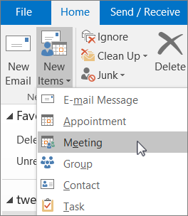
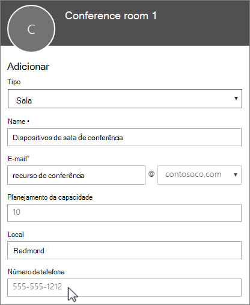

# Caixas de correio de salas e equipamentos

Se você tiver uma sala de conferência, um carro da empresa ou equipamento que todos precisem usar, precisará encontrar uma maneira de tornar que esses recursos reserváveis por todos. A melhor maneira de fazer isso é criar uma caixa de correio da sala ou do equipamento no Microsoft 365 para cada recurso. Você pode criar uma para sua sala de conferência no primeiro andar, para o equipamento de mídia ou para um caminhão de mudanças.
  
Depois de criar uma caixa de correio de sala ou equipamento, todos na empresa poderão reservá-lo para reuniões ou eventos usando o Outlook. Saiba **como usá-lo** e **como configurá-lo** nas duas próximas guias. Aqui estão algumas perguntas comuns sobre caixas de correio de salas e equipamento. 
  
## Usar caixas de correio de equipamentos e salas

Para usar caixas de correio de sala ou equipamento, abra o Outlook em seu computador ou entre no Outlook na Web. Agende uma nova reunião e adicione a sala ou o equipamento à solicitação de reunião como faria ao convidar outros funcionários ou clientes. Agora você fez a reserva.
  
1. Abra o **Outlook** em seu computador. 
    
2. Na guia **Página Inicial**, escolha **Novos Itens** \> **Reunião**.  Ou, em seu calendário, basta escolher **Nova Reunião**.
    
3. No campo Para, digite o nome da sala de conferência ou equipamento que você deseja reservar, além dos participantes que deseja convidar. Ou então, clique em **Para** e clique duas vezes na sala de conferência ou no equipamento na lista. Selecione **OK**. 
  
4. Na linha **Assunto**, digite o objetivo da reserva ou reunião. 
    
5. Altere o valor de **Local** ou deixe-o como está. 
    
6. Altere a **Hora de início** e a **Hora de término**. Ou marque **o dia inteiro**. Para fazer com que a reunião ou reserva seja repetida, selecione, **Recorrência** na parte superior. 
  
7. Digite uma mensagem para descrever o propósito e anexe arquivos, se necessário.
    
8. Para permitir que outras pessoas ingressem online ou liguem para a reunião, selecione **Reunião do Skype**.
    
9. Para garantir que a sala, o equipamento e as pessoas que você convidou estejam disponíveis, clique em **Assistente de Agendamento** na parte superior. Selecione um horário disponível no calendário.   Dica: No calendário do agendamento, azul significa que a sala ou o equipamento está reservado ou ocupado. Selecione a área em branco ou livre no calendário. 
  
10. Quando concluir, selecione **enviar**.
    
## Configurar caixas de correio de equipamento e sala

Para configurar uma caixa de correio de sala ou equipamento, acesse o centro de administração do Microsoft 365. (Você precisará ter permissão de administrador para fazer isso.) Crie a caixa de correio e informe a todos que podem começar a reservá-la para reuniões e eventos.
  
1. No centro de administração, vá para a página **recursos** \> [salas &amp; equipamento](https://go.microsoft.com/fwlink/p/?linkid=2067334).
  
2. Selecione **Adicionar**.
    
3. Preencha os campos de sala ou equipamento:  
  
  - **Sala** ou **Equipamento**: o tipo de caixa de correio que você deseja criar.
    
  - **Nome**: um nome amigável ou até mesmo uma breve descrição.
    
  - **Email**: o alias de email da sala ou equipamento. Isso é necessário para enviar uma solicitação de reunião para a sala ou o equipamento.
    
  - **Capacidade**: o número de pessoas que cabem na sala ou podem usar o equipamento ao mesmo tempo.
    
  - **Local**: o número ou o local da sala em um prédio ou região.
    
  - **Número de telefone**: o número da sala em si. Isso é diferente do número de telefone da reunião gerado ao usar o Skype for Business.
    
4. Selecione **Adicionar**.
    
5. Selecione a caixa de correio de sala ou equipamento que você criou para ver ou editar os detalhes.
  
6. Se você fez alterações, selecione **Salvar** e em seguida **Fechar**.

> [!Note]
> Para manter as suas caixas de correio de salas e equipamentos seguras, bloqueie as suas caixas de correio. Para saber mais, confira [bloquear entrada para a conta de caixa de correio compartilhada](https://docs.microsoft.com/office365/admin/email/create-a-shared-mailbox?view=o365-worldwide#block-sign-in-for-the-shared-mailbox-account).

## Aqui estão algumas perguntas comuns sobre caixas de correio de salas e equipamento.

### Como saber quando a sala ou o equipamento está disponível?

Abra o Outlook e crie uma nova reunião. Adicione a sala ou o equipamento à solicitação de reunião, como se fosse uma pessoa, e escolha **Assistente de Agendamento** para ver uma exibição de calendário ao vivo da disponibilidade da sala ou do equipamento. Se o intervalo de tempo estiver desmarcado, isso indicará que está disponível. Se estiver azul, está reservado. 
  
### Como cancelar uma solicitação de sala ou equipamento?

Abra a reunião agendada por você no Outlook e, em seguida, remova a sala ou o equipamento da reunião como faria com um participante. Isso liberará a sala para ser reservada por outras pessoas.
  
### Alguém precisa aceitar ou recusar cada solicitação de sala ou equipamento?

 Não, ninguém precisa aceitar ou recusar solicitações. Você pode decidir se deseja permitir que a sala ou o equipamento seja automaticamente reservado ou gerenciado por alguém de sua empresa. 
  
### Uma caixa de correio de sala ou de equipamento precisa de uma licença de produto?

Não. Embora a maioria das pessoas em sua organização precise de uma licença para usar o Microsoft 365, você não precisa atribuir uma licença para uma caixa de correio de sala ou para uma caixa de correio de equipamento.
  
### Preciso de um proprietário responsável pela reserva de salas ou equipamento?

 Não, você não precisa de um responsável pela caixa de correio de sala ou pela caixa de correio de equipamento. 
