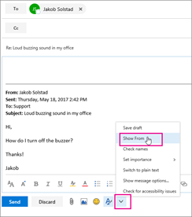
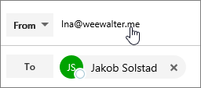

# Enviar email como uma lista de distribuiçãoSend email as a distribution list

No Microsoft 365, você pode enviar emails como uma lista de distribuição.In Microsoft 365, you can send email as a distribution list. Quando uma pessoa que é membro da lista de distribuição responde a uma mensagem enviada à lista de distribuição, o email parece ser da lista de distribuição, não do usuário individual.When a person who is a member of the distribution list replies to a message sent to the distribution list, the email appears to be from the distribution list, not from the individual user. Este tópico mostra como fazer isso.This topic shows you how to do this.
  
## Enviar email como uma lista de distribuiçãoSend email as a distribution list

Antes de executar essas etapas, certifique-se de ter sido adicionado a uma lista de distribuição do Microsoft 365 e você recebeu a permissão Enviar como permissão.Before you perform these steps, make sure you've been added to a Microsoft 365 distribution list and you've have been granted Send as permission on it.
  
 **Administradores**: certifique-se de ter seguido as etapas nos tópicos Adicionar um usuário ou contato do [Microsoft 365 a](../email/add-user-or-contact-to-distribution-list.md) uma lista e Permitir que os membros enviem emails como um grupo do [Microsoft 365](../../solutions/allow-members-to-send-as-or-send-on-behalf-of-group.md#allow-members-to-send-email-as-a-group) e adicionem as pessoas corretas à lista de distribuição.**Admins**: Make sure you've followed the steps in the [Add a Microsoft 365 user or contact to a list](../email/add-user-or-contact-to-distribution-list.md) and [Allow members to send email as a Microsoft 365 Group](../../solutions/allow-members-to-send-as-or-send-on-behalf-of-group.md#allow-members-to-send-email-as-a-group) topics, and added the correct people to the distribution list.
  
## Outlook na WebOutlook on the web

1. Abra o Outlook na Web e vá para sua caixa de entrada.Open Outlook on the web and go to your inbox. 
    
2. Abra uma mensagem que foi enviada para a lista de distribuição.Open a message that was sent to the distribution list. 
    
3. Selecione **Responder**.Select **Reply**. 
    
4. Na parte inferior da mensagem, selecione **Mais** \> **Mostrar de**.At the bottom of the message, select **More** \> **Show from**.  
  
5. Clique com o botão direito do mouse no endereço De - como `Ina@weewalter.me` - e escolha **Remover**.Right-click on the From address - such as `Ina@weewalter.me` - and choose **Remove**.  
  
6. Em seguida, digite o endereço da lista de distribuição como support@contoso.com e envie a mensagem.Then type the distribution list address such as support@contoso.com, and send the message. Na próxima vez que você responder da lista de distribuição, seu endereço aparecerá como uma opção na **lista De.**The next time you reply from the distribution list, its address will appear as an option in the **From** list. 

## OutlookOutlook

1. Abra o cliente da área de trabalho do Outlook.Open Outlook desktop client.

2. Componha um novo email.Compose a New Email. Clique no **campo De** e selecione Outro endereço **de email**.Click the **From** field and select **Other email address**. Se você não vir o campo De, navegue até **Opções** e selecione **De** na seção Mostrar campos.If you do not see the From field, navigate to **Options** and select **From** in the Show fields section.

3. Selecione o **endereço da Lista** de Distribuição na Lista de Endereços Global.Select the **Distribution List** address from the Global Address List.

4. Envie o email.Send the email.
