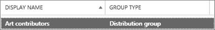

# <a name="upgrade-distribution-lists-to-microsoft-365-groups-in-outlook"></a><span data-ttu-id="15f60-103">Atualizar listas de distribuição para grupos do Microsoft 365 no Outlook</span><span class="sxs-lookup"><span data-stu-id="15f60-103">Upgrade distribution lists to Microsoft 365 Groups in Outlook</span></span>

<span data-ttu-id="15f60-104">Você pode atualizar listas de distribuição para grupos do Microsoft 365 no Outlook.</span><span class="sxs-lookup"><span data-stu-id="15f60-104">You can upgrade distribution lists to Microsoft 365 Groups in Outlook.</span></span> <span data-ttu-id="15f60-105">Essa é uma ótima maneira de dar à sua organização listas de todos os recursos e funcionalidades dos Grupos do Microsoft 365.</span><span class="sxs-lookup"><span data-stu-id="15f60-105">This is a great way to give your organization's distribution lists all the features and functionality of Microsoft 365 Groups.</span></span> [<span data-ttu-id="15f60-106">Por que você deve atualizar suas listas de distribuição para grupos no Outlook</span><span class="sxs-lookup"><span data-stu-id="15f60-106">Why you should upgrade your distribution lists to groups in Outlook</span></span>](https://support.microsoft.com/office/7fb3d880-593b-4909-aafa-950dd50ce188)

<span data-ttu-id="15f60-107">Você pode atualizar DLs uma de cada vez ou várias ao mesmo tempo.</span><span class="sxs-lookup"><span data-stu-id="15f60-107">You can upgrade DLs one at a time, or several at the same time.</span></span>

## <a name="upgrade-one-or-many-distribution-list-groups-to-microsoft-365-groups-in-outlook"></a><span data-ttu-id="15f60-108">Atualizar um ou muitos grupos de lista de distribuição para grupos do Microsoft 365 no Outlook</span><span class="sxs-lookup"><span data-stu-id="15f60-108">Upgrade one or many distribution list groups to Microsoft 365 Groups in Outlook</span></span>

<span data-ttu-id="15f60-109">Você deve ser um administrador global ou administrador do Exchange para atualizar um grupo de lista de distribuição.</span><span class="sxs-lookup"><span data-stu-id="15f60-109">You must be a global admin or Exchange admin to upgrade a distribution list group.</span></span> <span data-ttu-id="15f60-110">Para atualizar para grupos do Microsoft 365, o grupo de lista de distribuição deve ter um proprietário com uma caixa de correio.</span><span class="sxs-lookup"><span data-stu-id="15f60-110">To upgrade to Microsoft 365 Groups, the distribution list group must have an owner with a mailbox.</span></span>

### <a name="use-the-new-eac-to-upgrade-one-or-many-distribution-list-groups-to-microsoft-365-groups-in-outlook"></a><span data-ttu-id="15f60-111">Usar o novo EAC para atualizar um ou vários grupos de lista de distribuição para grupos do Microsoft 365 no Outlook</span><span class="sxs-lookup"><span data-stu-id="15f60-111">Use the new EAC to upgrade one or many distribution list groups to Microsoft 365 Groups in Outlook</span></span>

1. <span data-ttu-id="15f60-112">Vá para o novo [centro de administração do Exchange](https://admin.exchange.microsoft.com)e navegue até Grupos de **Destinatários.** \> </span><span class="sxs-lookup"><span data-stu-id="15f60-112">Go to the new [Exchange admin center](https://admin.exchange.microsoft.com), and navigate to **Recipients** \> **Groups**.</span></span>

2. <span data-ttu-id="15f60-113">Selecione o grupo de lista de distribuição (também chamado de grupo de distribuição **)** que você deseja atualizar para o grupo do Microsoft 365 na página **Grupos.**</span><span class="sxs-lookup"><span data-stu-id="15f60-113">Select the distribution list group (also called a **distribution group**) that you want to upgrade to Microsoft 365 group from the **Groups** page.</span></span>

3. <span data-ttu-id="15f60-114">Selecione o **grupo De atualização de distribuição** na barra de ferramentas.</span><span class="sxs-lookup"><span data-stu-id="15f60-114">Select the **Upgrade distribution group** from the tool bar.</span></span>

4. <span data-ttu-id="15f60-115">Na caixa de diálogo **Pronto para atualizar?**, clique em **Atualizar**.</span><span class="sxs-lookup"><span data-stu-id="15f60-115">In the dialog box **Ready to upgrade?**, click **Upgrade**.</span></span> <span data-ttu-id="15f60-116">O processo começa imediatamente.</span><span class="sxs-lookup"><span data-stu-id="15f60-116">The process begins immediately.</span></span> <span data-ttu-id="15f60-117">Dependendo do tamanho e do número de grupos de lista de distribuição que você está atualizando, o processo pode levar minutos ou horas.</span><span class="sxs-lookup"><span data-stu-id="15f60-117">Depending on the size and number of distribution list groups you're upgrading, the process can take minutes or hours.</span></span>

> [!NOTE]
> <span data-ttu-id="15f60-118">Uma faixa na parte superior indica que a atualização, por exemplo, grupos de distribuição *foi atualizado. Levará 5 minutos para refletir as alterações. Filtrar por grupos do Microsoft 365 para ver* os grupos de destrução atualizados.</span><span class="sxs-lookup"><span data-stu-id="15f60-118">A banner at the top indicates the upgrade, for example, *Distribution group(s) has been upgraded. It will take 5 minutes to reflect the changes. Filter by Microsoft 365 groups to see the upgraded distrubtion groups(s)*.</span></span>

### <a name="use-the-classic-eac-to-upgrade-one-or-many-distribution-list-groups-to-microsoft-365-groups-in-outlook"></a><span data-ttu-id="15f60-119">Use o EAC clássico para atualizar um ou vários grupos de lista de distribuição para grupos do Microsoft 365 no Outlook</span><span class="sxs-lookup"><span data-stu-id="15f60-119">Use the Classic EAC to upgrade one or many distribution list groups to Microsoft 365 Groups in Outlook</span></span>

1. <span data-ttu-id="15f60-120">Vá para o Centro de <a href="https://go.microsoft.com/fwlink/p/?linkid=2059104" target="_blank">administração clássico do Exchange.</a></span><span class="sxs-lookup"><span data-stu-id="15f60-120">Go to the Classic <a href="https://go.microsoft.com/fwlink/p/?linkid=2059104" target="_blank">Exchange admin center</a>.</span></span>

2. <span data-ttu-id="15f60-121">No Centro de administração clássico do Exchange, vá para **Grupos de** \> **Destinatários.**</span><span class="sxs-lookup"><span data-stu-id="15f60-121">In the Classic Exchange admin center, go to **Recipients** \> **Groups**.</span></span><br/><span data-ttu-id="15f60-122">Você verá um aviso indicando que você tem listas de distribuição (também chamadas de grupos de distribuição **)** que estão qualificadas para serem atualizadas para grupos do Microsoft 365.</span><span class="sxs-lookup"><span data-stu-id="15f60-122">You'll see a notice indicating you have distribution lists (also called **distribution groups**) that are eligible to be upgraded to Microsoft 365 Groups.</span></span><br/> <span data-ttu-id="15f60-123"></span><span class="sxs-lookup"><span data-stu-id="15f60-123"></span></span>

3. <span data-ttu-id="15f60-124">Selecione uma ou mais listas de distribuição (também chamada de grupo **de distribuição**) na página **grupos.**</span><span class="sxs-lookup"><span data-stu-id="15f60-124">Select one or more distribution lists (also called a **distribution group**) from the **groups** page.</span></span><br/><span data-ttu-id="15f60-125"></span><span class="sxs-lookup"><span data-stu-id="15f60-125"></span></span>

4. <span data-ttu-id="15f60-126">Selecione o ícone de atualização.</span><span class="sxs-lookup"><span data-stu-id="15f60-126">Select the upgrade icon.</span></span><br/>

5. <span data-ttu-id="15f60-128">Na caixa de diálogo informações, selecione **Sim** para confirmar a atualização.</span><span class="sxs-lookup"><span data-stu-id="15f60-128">On the information dialog, select **Yes** to confirm the upgrade.</span></span> <span data-ttu-id="15f60-129">O processo começa imediatamente.</span><span class="sxs-lookup"><span data-stu-id="15f60-129">The process begins immediately.</span></span> <span data-ttu-id="15f60-130">Dependendo do tamanho e do número de DLs que você está atualizando, o processo pode levar minutos ou horas.</span><span class="sxs-lookup"><span data-stu-id="15f60-130">Depending on the size and number of DLs you're upgrading, the process can take minutes or hours.</span></span><br/><span data-ttu-id="15f60-131">Se a lista de distribuição não puder ser atualizada, uma caixa de diálogo aparecerá dizendo isso.</span><span class="sxs-lookup"><span data-stu-id="15f60-131">If the distribution list can't be upgraded, a dialog appears saying so.</span></span> <span data-ttu-id="15f60-132">Veja [Quais listas de distribuição não podem ser atualizadas?](#which-distribution-lists-cant-be-upgraded).</span><span class="sxs-lookup"><span data-stu-id="15f60-132">See [Which distribution lists cannot be upgraded?](#which-distribution-lists-cant-be-upgraded).</span></span>

6. <span data-ttu-id="15f60-133">Se você estiver atualizando várias listas de distribuição, use a listada para filtrar quais listas de distribuição foram atualizadas.</span><span class="sxs-lookup"><span data-stu-id="15f60-133">If you're upgrading multiple distribution lists, use the drop-down list to filter which distribution lists have been upgraded.</span></span> <span data-ttu-id="15f60-134">Se a lista não estiver concluída, aguarde um pouco mais e selecione **Atualizar** para ver o que foi atualizado com êxito.</span><span class="sxs-lookup"><span data-stu-id="15f60-134">If the list isn't complete, wait a while longer and then select **Refresh** to see what's been successfully upgraded.</span></span><br/><span data-ttu-id="15f60-135">Não há nenhum aviso informando quando o processo de atualização foi concluído para todas as DLs selecionadas.</span><span class="sxs-lookup"><span data-stu-id="15f60-135">There's no notice that tells you when the upgrade process has completed for all DLs you selected.</span></span> <span data-ttu-id="15f60-136">Você pode descobrir isso procurando ver o que está listado em Disponível para **atualização** ou **DLs atualizadas.**</span><span class="sxs-lookup"><span data-stu-id="15f60-136">You can figure this out by looking to see what's listed under **Available for upgrade** or **Upgraded DLs**.</span></span>

7. <span data-ttu-id="15f60-137">Se você selecionou uma DL para atualização, mas ela ainda aparece na página como Disponível para atualização, então ela falhou ao atualizar.</span><span class="sxs-lookup"><span data-stu-id="15f60-137">If you selected a DL for upgrade, but it's still appeared on the page as Available to upgrade, then it failed to upgrade.</span></span> <span data-ttu-id="15f60-138">Consulte [O que fazer se a atualização não funcionar](#what-to-do-if-the-upgrade-doesnt-work).</span><span class="sxs-lookup"><span data-stu-id="15f60-138">See [What to do if the upgrade doesn't work](#what-to-do-if-the-upgrade-doesnt-work).</span></span>

> [!NOTE]
> <span data-ttu-id="15f60-139">Se você estiver recebendo os grupos digere emails, você pode notar, na parte inferior, que às vezes ele oferecerá para permitir que você atualize quaisquer listas de distribuição qualificadas das que você é o proprietário.</span><span class="sxs-lookup"><span data-stu-id="15f60-139">If you're getting the groups digest emails you may notice at the bottom that it will sometimes offer to let you upgrade any eligible distribution lists that you're the owner of.</span></span> <span data-ttu-id="15f60-140">Confira [Ter uma conversa em grupo no Outlook para](https://support.microsoft.com/office/a0482e24-a769-4e39-a5ba-a7c56e828b22) obter mais informações sobre emails de digest.</span><span class="sxs-lookup"><span data-stu-id="15f60-140">See [Have a group conversation in Outlook](https://support.microsoft.com/office/a0482e24-a769-4e39-a5ba-a7c56e828b22) for more information about digest emails.</span></span>

## <a name="what-to-do-if-the-upgrade-doesnt-work"></a><span data-ttu-id="15f60-141">O que fazer se a atualização não funcionar</span><span class="sxs-lookup"><span data-stu-id="15f60-141">What to do if the upgrade doesn't work</span></span>

<span data-ttu-id="15f60-142">As listas de distribuição que não conseguem atualizar permanecem inalteradas.</span><span class="sxs-lookup"><span data-stu-id="15f60-142">Distribution lists that fail to upgrade remain unchanged.</span></span>

<span data-ttu-id="15f60-143">Se uma ou mais **listas de** distribuição qualificadas não conseguirem ser atualizadas, abra um [tíquete de Suporte](../../business-video/get-help-support.md).</span><span class="sxs-lookup"><span data-stu-id="15f60-143">If one or more **eligible** distribution lists fail to be upgraded, open a [Support ticket](../../business-video/get-help-support.md).</span></span> <span data-ttu-id="15f60-144">O problema precisará ser escalonado para a equipe de Engenharia de Grupos para que eles descubram o problema.</span><span class="sxs-lookup"><span data-stu-id="15f60-144">The issue will need to be escalated to the Groups Engineering team for them to figure out the problem.</span></span>

<span data-ttu-id="15f60-145">É possível que a lista de distribuição não tenha se atualizado devido a uma paralisação de serviço, mas improvável.</span><span class="sxs-lookup"><span data-stu-id="15f60-145">It's possible that the distribution list didn't get upgraded because of a service outage, but unlikely.</span></span> <span data-ttu-id="15f60-146">Se quiser, aguarde um pouco e tente atualizar o DL novamente.</span><span class="sxs-lookup"><span data-stu-id="15f60-146">If you want, wait a while and then try to upgrade the DL again.</span></span>

## <a name="how-to-use-powershell-to-upgrade-several-distribution-lists-at-the-same-time"></a><span data-ttu-id="15f60-147">Como usar o PowerShell para atualizar várias listas de distribuição ao mesmo tempo</span><span class="sxs-lookup"><span data-stu-id="15f60-147">How to use PowerShell to upgrade several distribution lists at the same time</span></span>

<span data-ttu-id="15f60-148">Se você tiver experiência em usar o PowerShell, talvez queira seguir essa rota em vez de usar a interface do usuário.</span><span class="sxs-lookup"><span data-stu-id="15f60-148">If you're experienced at using PowerShell, you might want to go this route instead of using the UI.</span></span> <span data-ttu-id="15f60-149">Temos um conjunto de cmdlets que ajudarão você a atualizar listas de distribuição.</span><span class="sxs-lookup"><span data-stu-id="15f60-149">We have a set of cmdlets that will help you upgrade distribution lists.</span></span> <span data-ttu-id="15f60-150">Confira a seguir.</span><span class="sxs-lookup"><span data-stu-id="15f60-150">See below.</span></span>

### <a name="upgrade-a-single-dl"></a><span data-ttu-id="15f60-151">Atualizar um único DL</span><span class="sxs-lookup"><span data-stu-id="15f60-151">Upgrade a single DL</span></span>

<span data-ttu-id="15f60-152">Para atualizar um único DL, execute o seguinte comando:</span><span class="sxs-lookup"><span data-stu-id="15f60-152">To upgrade a single DL, run the following command:</span></span>

```PowerShell
Upgrade-DistributionGroup -DlIdentities \<Dl SMTP address\>
```

<span data-ttu-id="15f60-153">Por exemplo, se você quiser atualizar uma DLs com endereço SMTP dl1@contoso.com, execute o seguinte comando:</span><span class="sxs-lookup"><span data-stu-id="15f60-153">For example, if you want to upgrade a DLs with SMTP address dl1@contoso.com, run the following command:</span></span>

```PowerShell
Upgrade-DistributionGroup -DlIdentities dl1@contoso.com
```

> [!NOTE]
> <span data-ttu-id="15f60-154">Você também pode atualizar uma única lista de distribuição para um grupo do Microsoft 365 usando o cmdlet [New-UnifiedGroup](/powershell/module/exchange/new-unifiedgroup) PowerShell</span><span class="sxs-lookup"><span data-stu-id="15f60-154">You can also upgrade a single distribution list to a Microsoft 365 group using the [New-UnifiedGroup](/powershell/module/exchange/new-unifiedgroup) PowerShell cmdlet</span></span>

### <a name="upgrade-multiple-dls-in-a-batch"></a><span data-ttu-id="15f60-155">Atualizar várias DLs em um lote</span><span class="sxs-lookup"><span data-stu-id="15f60-155">Upgrade multiple DLs in a batch</span></span>

<span data-ttu-id="15f60-156">Você também pode passar várias DLs como um lote e atualiza-las juntas:</span><span class="sxs-lookup"><span data-stu-id="15f60-156">You can also pass multiple DLs as a batch and upgrade them together:</span></span>

```PowerShell
Upgrade-DistributionGroup -DlIdentities \<DL SMTP address1\>, \< DL SMTP address2\>,
\< DL SMTP address3\>, \< DL SMTP address 4\>
```

<span data-ttu-id="15f60-157">Por exemplo, se você quiser atualizar cinco DLs com endereço SMTP e `dl1@contoso.com` , e , execute o seguinte `dl2@contoso.com` `dl3@contoso.com` `dl4@contoso.com` `dl5@contoso.com` comando:</span><span class="sxs-lookup"><span data-stu-id="15f60-157">For example, if you want to upgrade five DLs with SMTP address `dl1@contoso.com` and `dl2@contoso.com`, `dl3@contoso.com`, `dl4@contoso.com` and `dl5@contoso.com`, run the following command:</span></span>

`Upgrade-DistributionGroup -DlIdentities dl1@contoso.com, dl2@contoso.com, dl3@contoso.com, dl4@contoso.com, dl5@contoso.com`

### <a name="upgrade-all-eligible-dls"></a><span data-ttu-id="15f60-158">Atualizar todas as DLs qualificadas</span><span class="sxs-lookup"><span data-stu-id="15f60-158">Upgrade all eligible DLs</span></span>

<span data-ttu-id="15f60-159">Há duas maneiras de atualizar todas as DLs qualificadas.</span><span class="sxs-lookup"><span data-stu-id="15f60-159">There are two ways in which you can upgrade all the eligible DLs.</span></span>

> [!NOTE]
> <span data-ttu-id="15f60-160">O Upgrade-DistributionGroup cmdlet não recebe dados do pipeline, por esse motivo, é necessário usar o operador "foreach-object" para ser executado com {} êxito.</span><span class="sxs-lookup"><span data-stu-id="15f60-160">The Upgrade-DistributionGroup cmdlet doesn't receive data from the pipeline, for this reason it's required to use "foreach-object{}" operator to run successfully.</span></span>

1. <span data-ttu-id="15f60-161">Obter as DLs qualificadas no locatário e atualize-as usando o comando de atualização:</span><span class="sxs-lookup"><span data-stu-id="15f60-161">Get the eligible DLs in the tenant and upgrade them using the upgrade command:</span></span>

```PowerShell
Get-EligibleDistributionGroupForMigration | Foreach-Object{
    Upgrade-DistributionGroup -DlIdentities $_.PrimarySMTPAddress
}
```

2. <span data-ttu-id="15f60-162">Obter a lista de todas as DLs e atualizar apenas as DLs qualificadas:</span><span class="sxs-lookup"><span data-stu-id="15f60-162">Get the list of all DLs and upgrade only the eligible DLs:</span></span>

```PowerShell
Get-DistributionGroup| Foreach-Object{
    Upgrade-DistributionGroup -DlIdentities $_.PrimarySMTPAddress
}
```

## <a name="faq-about-upgrading-distribution-lists-to-microsoft-365-groups-in-outlook"></a><span data-ttu-id="15f60-163">Perguntas frequentes sobre como atualizar listas de distribuição para grupos do Microsoft 365 no Outlook</span><span class="sxs-lookup"><span data-stu-id="15f60-163">FAQ about upgrading distribution lists to Microsoft 365 Groups in Outlook</span></span>

### <a name="which-distribution-lists-cant-be-upgraded"></a><span data-ttu-id="15f60-164">Quais listas de distribuição não podem ser atualizadas?</span><span class="sxs-lookup"><span data-stu-id="15f60-164">Which distribution lists can't be upgraded?</span></span>

<span data-ttu-id="15f60-165">Você só pode atualizar listas de distribuição gerenciadas por nuvem, simples e não aninhadas.</span><span class="sxs-lookup"><span data-stu-id="15f60-165">You can only upgrade cloud-managed, simple, non-nested distribution lists.</span></span> <span data-ttu-id="15f60-166">A tabela a seguir lista listas de distribuição que **NÃO PODEM** ser atualizadas.</span><span class="sxs-lookup"><span data-stu-id="15f60-166">The table below lists distribution lists that **CANNOT** be upgraded.</span></span>

|<span data-ttu-id="15f60-167">**Property**</span><span class="sxs-lookup"><span data-stu-id="15f60-167">**Property**</span></span>|<span data-ttu-id="15f60-168">**Qualificado?**</span><span class="sxs-lookup"><span data-stu-id="15f60-168">**Eligible?**</span></span>|
|:-----|:-----|
|<span data-ttu-id="15f60-169">Lista de distribuição gerenciada local.</span><span class="sxs-lookup"><span data-stu-id="15f60-169">On-premises managed distribution list.</span></span>  <br/> |<span data-ttu-id="15f60-170">Não</span><span class="sxs-lookup"><span data-stu-id="15f60-170">No</span></span>  <br/> |
|<span data-ttu-id="15f60-171">Listas de distribuição aninhadas.</span><span class="sxs-lookup"><span data-stu-id="15f60-171">Nested distribution lists.</span></span> <span data-ttu-id="15f60-172">A lista de distribuição tem grupos filho ou é membro de outro grupo.</span><span class="sxs-lookup"><span data-stu-id="15f60-172">Distribution list either has child groups or is a member of another group.</span></span>  <br/> |<span data-ttu-id="15f60-173">Não</span><span class="sxs-lookup"><span data-stu-id="15f60-173">No</span></span>  <br/> |
|<span data-ttu-id="15f60-174">Listas de distribuição com **recipientTypeDetails** que não **seja UserMailbox,** **SharedMailbox,** **TeamMailbox,** **MailUser**</span><span class="sxs-lookup"><span data-stu-id="15f60-174">Distribution lists with member **RecipientTypeDetails** other than **UserMailbox**, **SharedMailbox**, **TeamMailbox**, **MailUser**</span></span>  <br/> |<span data-ttu-id="15f60-175">Não</span><span class="sxs-lookup"><span data-stu-id="15f60-175">No</span></span>  <br/> |
|<span data-ttu-id="15f60-176">Lista de distribuição com mais de 100 proprietários</span><span class="sxs-lookup"><span data-stu-id="15f60-176">Distribution list that has more than 100 owners</span></span>  <br/> |<span data-ttu-id="15f60-177">Não</span><span class="sxs-lookup"><span data-stu-id="15f60-177">No</span></span>  <br/> |
|<span data-ttu-id="15f60-178">Lista de distribuição que só tem membros, mas nenhum proprietário</span><span class="sxs-lookup"><span data-stu-id="15f60-178">Distribution list that only has members but no owner</span></span>  <br/> |<span data-ttu-id="15f60-179">Não</span><span class="sxs-lookup"><span data-stu-id="15f60-179">No</span></span>  <br/> |
|<span data-ttu-id="15f60-180">Lista de distribuição que tem alias contendo caracteres especiais</span><span class="sxs-lookup"><span data-stu-id="15f60-180">Distribution list that has alias containing special characters</span></span>  <br/> |<span data-ttu-id="15f60-181">Não</span><span class="sxs-lookup"><span data-stu-id="15f60-181">No</span></span>  <br/> |
|<span data-ttu-id="15f60-182">Se a lista de distribuição estiver configurada para ser um endereço de encaminhamento para Caixa de Correio Compartilhada</span><span class="sxs-lookup"><span data-stu-id="15f60-182">If the distribution list is configured to be a forwarding address for Shared Mailbox</span></span>  <br/> |<span data-ttu-id="15f60-183">Não</span><span class="sxs-lookup"><span data-stu-id="15f60-183">No</span></span>  <br/> |
|<span data-ttu-id="15f60-184">Se a DL faz parte da **Restrição do Remetente** em outro DL.</span><span class="sxs-lookup"><span data-stu-id="15f60-184">If the DL is part of **Sender Restriction** in another DL.</span></span>  <br/> |<span data-ttu-id="15f60-185">Não</span><span class="sxs-lookup"><span data-stu-id="15f60-185">No</span></span>  <br/> |
|<span data-ttu-id="15f60-186">Grupos de segurança</span><span class="sxs-lookup"><span data-stu-id="15f60-186">Security groups</span></span>  <br/> |<span data-ttu-id="15f60-187">Não</span><span class="sxs-lookup"><span data-stu-id="15f60-187">No</span></span>  <br/> |
|<span data-ttu-id="15f60-188">Listas de Distribuição Dinâmica</span><span class="sxs-lookup"><span data-stu-id="15f60-188">Dynamic Distribution lists</span></span>  <br/> |<span data-ttu-id="15f60-189">Não</span><span class="sxs-lookup"><span data-stu-id="15f60-189">No</span></span>  <br/> |
|<span data-ttu-id="15f60-190">Listas de distribuição que foram convertidas em **RoomLists**</span><span class="sxs-lookup"><span data-stu-id="15f60-190">Distribution lists that were converted to **RoomLists**</span></span>  <br/> |<span data-ttu-id="15f60-191">Não</span><span class="sxs-lookup"><span data-stu-id="15f60-191">No</span></span>  <br/> |
|<span data-ttu-id="15f60-192">Listas de distribuição **onde MemberJoinRestriction** e/ou **MemberDepartRestriction** é **Fechado**</span><span class="sxs-lookup"><span data-stu-id="15f60-192">Distribution lists where **MemberJoinRestriction** and/or **MemberDepartRestriction** is **Closed**</span></span>  <br/> |<span data-ttu-id="15f60-193">Não</span><span class="sxs-lookup"><span data-stu-id="15f60-193">No</span></span>  <br/> |

### <a name="check-which-dls-are-eligible-for-upgrade"></a><span data-ttu-id="15f60-194">Verificar quais DLs estão qualificadas para atualização</span><span class="sxs-lookup"><span data-stu-id="15f60-194">Check which DLs are eligible for upgrade</span></span>

<span data-ttu-id="15f60-195">Se você quiser verificar se uma DL está qualificada ou não, você pode executar o comando abaixo:</span><span class="sxs-lookup"><span data-stu-id="15f60-195">If you want to check whether a DL is eligible or not, you can run the below command:</span></span>

`Get-DistributionGroup \<DL SMTP address\> | Get-EligibleDistributionGroupForMigration`

<span data-ttu-id="15f60-196">Se você quiser verificar quais DLs estão qualificadas para atualização, execute o seguinte comando:</span><span class="sxs-lookup"><span data-stu-id="15f60-196">If you want to check which DLs are eligible for upgrade just run the following command:</span></span>

`Get-EligibleDistributionGroupForMigration`

### <a name="who-can-run-the-upgrade-scripts"></a><span data-ttu-id="15f60-197">Quem pode executar os scripts de atualização?</span><span class="sxs-lookup"><span data-stu-id="15f60-197">Who can run the upgrade scripts?</span></span>

<span data-ttu-id="15f60-198">Pessoas com direitos de administrador global ou administrador do Exchange.</span><span class="sxs-lookup"><span data-stu-id="15f60-198">People with global admin or Exchange admin rights.</span></span>

### <a name="why-is-the-contact-card-still-showing-a-distribution-list-what-should-i-do-to-prevent-an-upgraded-distribution-list-from-showing-up-in-my-auto-suggest-list"></a><span data-ttu-id="15f60-199">Por que o cartão de visita ainda está mostrando uma lista de distribuição?</span><span class="sxs-lookup"><span data-stu-id="15f60-199">Why is the contact card still showing a distribution list?</span></span> <span data-ttu-id="15f60-200">O que devo fazer para impedir que uma lista de distribuição atualizada seja aparecendo na minha lista de sugestões automáticas?</span><span class="sxs-lookup"><span data-stu-id="15f60-200">What should I do to prevent an upgraded distribution list from showing up in my auto suggest list?</span></span>

- <span data-ttu-id="15f60-201">Para o Outlook: quando alguém tentar enviar um email no Outlook digitando o nome do grupo do Microsoft 365 após a migração, o destinatário será resolvido como a lista de distribuição em vez do grupo.</span><span class="sxs-lookup"><span data-stu-id="15f60-201">For Outlook: When someone tries to send an email in Outlook by typing the Microsoft 365 group name after migration, the recipient will be resolved as the distribution list instead of the group.</span></span> <span data-ttu-id="15f60-202">O cartão de visita do destinatário será o cartão de visita de listas de distribuição.</span><span class="sxs-lookup"><span data-stu-id="15f60-202">The contact card of the recipient will be the distribution lists contact card.</span></span> <span data-ttu-id="15f60-203">Isso se deve ao cache de destinatário ou cache de nome de nick no Outlook.</span><span class="sxs-lookup"><span data-stu-id="15f60-203">This is because of the recipient cache or nick name cache in Outlook.</span></span> <span data-ttu-id="15f60-204">O email será enviado com êxito para o grupo, mas pode causar confusão ao remetente.</span><span class="sxs-lookup"><span data-stu-id="15f60-204">The email will be sent successfully to the group, but might cause confusion to the sender.</span></span><br/><span data-ttu-id="15f60-205">Você pode executar as etapas deste artigo, Informações sobre a lista [de Preenchimento Automático](/outlook/troubleshoot/contacts/information-about-the-outlook-autocomplete-list) do Outlook para redefinir o cache, o que corrigirá esse problema.</span><span class="sxs-lookup"><span data-stu-id="15f60-205">You can perform the steps in this article, [Information about the Outlook AutoComplete list](/outlook/troubleshoot/contacts/information-about-the-outlook-autocomplete-list) to reset the cache, which will fix this issue.</span></span>

- <span data-ttu-id="15f60-206">Para o Outlook na Web: no caso do Outlook na Web, o destinatário da lista de distribuição ainda permanecerá no cache.</span><span class="sxs-lookup"><span data-stu-id="15f60-206">For Outlook on the web: In case of Outlook on the web, the distribution list recipient will still remain in the cache.</span></span> <span data-ttu-id="15f60-207">Você pode seguir as etapas em [Remover nome](https://support.microsoft.com/office/9E1419D9-E88F-445B-B07F-F558B8A37C58) sugerido ou endereço de email da Lista De Conclusão Automática para atualizar o cache para ver o cartão de visita do grupo.</span><span class="sxs-lookup"><span data-stu-id="15f60-207">You can follow the steps in [Remove suggested name or email address from the Auto-Complete List](https://support.microsoft.com/office/9E1419D9-E88F-445B-B07F-F558B8A37C58) to refresh the cache to see the group contact card.</span></span>

### <a name="do-new-group-members-get-a-welcome-email-in-their-inbox"></a><span data-ttu-id="15f60-208">Os novos membros do grupo recebem um email de boas-vindas na caixa de entrada?</span><span class="sxs-lookup"><span data-stu-id="15f60-208">Do new group members get a welcome email in their inbox?</span></span>

<span data-ttu-id="15f60-209">Não.</span><span class="sxs-lookup"><span data-stu-id="15f60-209">No.</span></span> <span data-ttu-id="15f60-210">A configuração para habilitar mensagens de boas-vindas é definida como false por padrão.</span><span class="sxs-lookup"><span data-stu-id="15f60-210">The setting to enable welcome messages is set to false by default.</span></span> <span data-ttu-id="15f60-211">Essa configuração afeta os membros existentes e novos do grupo que podem ingressar após a conclusão da migração.</span><span class="sxs-lookup"><span data-stu-id="15f60-211">This setting affects both existing and new group members who may join after the migration is complete.</span></span> <span data-ttu-id="15f60-212">Se o proprietário do grupo permitir mais tarde os usuários convidados, os usuários convidados não receberão um email de boas-vindas em sua caixa de entrada.</span><span class="sxs-lookup"><span data-stu-id="15f60-212">If the group owner later allows guest users, guest users won't receive a welcome email in their inbox.</span></span> <span data-ttu-id="15f60-213">Os membros convidados podem continuar trabalhando com o grupo.</span><span class="sxs-lookup"><span data-stu-id="15f60-213">Guest members can continue working with the group.</span></span>

### <a name="what-if-one-or-some-of-the-dls-are-not-upgraded"></a><span data-ttu-id="15f60-214">E se uma ou algumas DLs não são atualizadas?</span><span class="sxs-lookup"><span data-stu-id="15f60-214">What if one or some of the DLs are not upgraded?</span></span>

<span data-ttu-id="15f60-215">Há alguns casos em que a DL é qualificada, mas não pode ser atualizada.</span><span class="sxs-lookup"><span data-stu-id="15f60-215">There are some cases in which though DL is eligible but could not be upgraded.</span></span> <span data-ttu-id="15f60-216">A DL não é atualizada e permanece como uma DL.</span><span class="sxs-lookup"><span data-stu-id="15f60-216">The DL does not get upgraded and remains as a DL.</span></span>

- <span data-ttu-id="15f60-217">Onde o administrador aplicou a Política de Endereço de **Email** de Grupo para os grupos em uma organização e eles tentam atualizar DLs que não cumprem os critérios, a DL não é atualizada</span><span class="sxs-lookup"><span data-stu-id="15f60-217">Where admin has applied **Group Email Address Policy** for the groups in an organization and they try to upgrade DLs that doesn't fulfill the criteria, the DL does not get upgraded</span></span>

- <span data-ttu-id="15f60-218">As DLs **com MemberJoinRestriction** **ou MemberDepartRestriction definidas** como **Closed**, não puderam ser atualizadas</span><span class="sxs-lookup"><span data-stu-id="15f60-218">DLs with **MemberJoinRestriction** or **MemberDepartRestriction** set to **Closed**, could not be upgraded</span></span>

### <a name="what-happens-to-the-dl-if-the-upgrade-from-eac-fails"></a><span data-ttu-id="15f60-219">O que acontece com a DL se a atualização do EAC falhar?</span><span class="sxs-lookup"><span data-stu-id="15f60-219">What happens to the DL if the upgrade from EAC fails?</span></span>

<span data-ttu-id="15f60-220">A atualização só acontecerá quando a chamada for enviada para o servidor.</span><span class="sxs-lookup"><span data-stu-id="15f60-220">The upgrade will happen only when the call is submitted to the server.</span></span> <span data-ttu-id="15f60-221">Se a atualização falhar, suas DLs estarão intactas.</span><span class="sxs-lookup"><span data-stu-id="15f60-221">If the upgrade fails, your DLs will be intact.</span></span> <span data-ttu-id="15f60-222">Eles funcionarão como antes.</span><span class="sxs-lookup"><span data-stu-id="15f60-222">They will work like they used to.</span></span>
