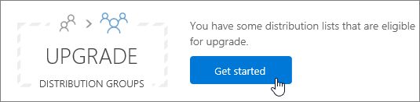

# <a name="upgrade-distribution-lists-to-microsoft-365-groups-in-outlook"></a>Atualizar listas de distribuição para Grupos do Microsoft 365 no Outlook

Você pode atualizar listas de distribuição para Grupos do Microsoft 365 com o Outlook. Essa é uma ótima maneira de dar às listas de distribuição da sua organização todos os recursos e funcionalidades dos Grupos do Microsoft 365. [Por que você deve atualizar suas listas de distribuição para grupos no Outlook](https://support.microsoft.com/office/7fb3d880-593b-4909-aafa-950dd50ce188)

Você pode atualizar DLs uma por vez ou várias ao mesmo tempo.

## <a name="upgrade-one-or-many-distribution-lists-to-microsoft-365-groups-in-outlook"></a>Atualizar uma ou várias listas de distribuição para Grupos do Microsoft 365 no Outlook

Você deve ser um administrador global ou administrador do Exchange para atualizar uma lista de distribuição. Para atualizar para os Grupos do Microsoft 365, um grupo de distribuição deve ter um proprietário com uma caixa de correio.

1. Vá até o <a href="https://go.microsoft.com/fwlink/p/?linkid=2059104" target="_blank">Centro de administração do Exchange</a>.

2. No Centro de administração do Exchange, vá para **Grupos de** \> **Destinatários.**<br/>You'll see a notice indicating you have distribution lists (also called **distribution groups** ) that are eligible to be upgraded to Microsoft 365 Groups.<br/> 

3. Selecione uma ou mais listas de distribuição (também chamadas **de grupo de distribuição)** na página **de** grupos.<br/>

4. Selecione o ícone de atualização.<br/>

5. Na caixa de diálogo de informações, selecione **Sim** para confirmar a atualização. O processo começa imediatamente. Dependendo do tamanho e do número de DLs que você está atualizando, o processo pode levar minutos ou horas.<br/>Se a lista de distribuição não puder ser atualizada, uma caixa de diálogo aparecerá dizendo isso. Veja [Quais listas de distribuição não podem ser atualizadas?](#which-distribution-lists-cant-be-upgraded).

6. Se você estiver atualizando várias listas de distribuição, use a lista drop-down para filtrar quais listas de distribuição foram atualizadas. Se a lista não estiver completa, aguarde  um pouco mais e selecione Atualizar para ver o que foi atualizado com êxito.<br/>Não há aviso informando quando o processo de atualização foi concluído para todas as DLs selecionadas. Você pode descobrir isso procurando para ver o que está listado em **Disponível para atualização** ou **DLs atualizadas.**

7. Se você selecionou uma DL para atualização, mas ela ainda aparece na página como Disponível para atualização, ela falhou ao atualizar. Veja [o que fazer se a atualização não funcionar.](#what-to-do-if-the-upgrade-doesnt-work)

> [!NOTE]
> Se você estiver recebendo os emails de resumo de grupos, você pode notar, na parte inferior, que às vezes ele se oferecerá para permitir que você atualize quaisquer listas de distribuição qualificadas das que você é o proprietário. See [Have a group conversation in Outlook](https://support.microsoft.com/office/a0482e24-a769-4e39-a5ba-a7c56e828b22) for more information about digest emails.

## <a name="what-to-do-if-the-upgrade-doesnt-work"></a>O que fazer se a atualização não funcionar

As listas de distribuição que não conseguem atualizar permanecem inalteradas.

Se uma ou mais **listas de** distribuição qualificadas não for atualizada, abra um [tíquete de suporte.](../contact-support-for-business-products.md) O problema precisará ser escalonado para a equipe de Engenharia de Grupos para que eles descubram o problema.

É possível que a lista de distribuição não seja atualizada por causa de uma paralisação de serviço, mas é bastante improvável. Se você quiser, aguarde um pouco e tente atualizar a DL novamente.

## <a name="how-to-use-powershell-to-upgrade-several-distribution-lists-at-the-same-time"></a>Como usar o PowerShell para atualizar várias listas de distribuição ao mesmo tempo

Se você tiver experiência com o uso do PowerShell, talvez queira usar essa rota em vez de usar a interface do usuário. Temos um conjunto de cmdlets que ajudarão você a atualizar as listas de distribuição. Confira a seguir.

### <a name="upgrade-a-single-dl"></a>Atualizar uma única DL

Para atualizar uma única DL, execute o seguinte comando:

```PowerShell
Upgrade-DistributionGroup -DlIdentities \<Dl SMTP address\>`
```

Por exemplo, se você quiser atualizar uma DLs com endereço SMTP dl1@contoso.com, execute o seguinte comando:

```PowerShell
Upgrade-DistributionGroup -DlIdentities dl1@contoso.com`
```

> [!NOTE]
> Você também pode atualizar uma única lista de distribuição para um grupo do Microsoft 365 usando o cmdlet [New-UnifiedGroup](https://go.microsoft.com/fwlink/?LinkID=786379) PowerShell

### <a name="upgrade-multiple-dls-in-a-batch"></a>Atualizar várias DLs em um lote

Você também pode passar várias DLs como um lote e atualize-as juntas:

```PowerShell
Upgrade-DistributionGroup -DlIdentities \<DL SMTP address1\>, \< DL SMTP address2\>,
\< DL SMTP address3\>, \< DL SMTP address 4\>
```

Por exemplo, se você quiser atualizar cinco DLs com endereço SMTP `dl1@contoso.com` `dl2@contoso.com` e, e, execute o seguinte `dl3@contoso.com` `dl4@contoso.com` `dl5@contoso.com` comando:

`Upgrade-DistributionGroup -DlIdentities dl1@contoso.com, dl2@contoso.com, dl3@contoso.com, dl4@contoso.com, dl5@contoso.com`

### <a name="upgrade-all-eligible-dls"></a>Atualizar todas as DLs qualificadas

Há duas maneiras de atualizar todas as DLs qualificadas.

> [!NOTE]
> O Upgrade-DistributionGroup cmdlet não recebe dados do pipeline, por esse motivo é necessário usar o operador "foreach-object" para ser executado {} com êxito.

1. Obter as DLs qualificadas no locatário e atualize-as usando o comando de atualização:

```PowerShell
Get-EligibleDistributionGroupForMigration | Foreach-Object{
    Upgrade-DistributionGroup -DlIdentities $_.PrimarySMTPAddress
}
```

2. Obter a lista de todas as DLs e atualizar apenas as DLs qualificadas:

```PowerShell
Get-DistributionGroup| Foreach-Object{
    Upgrade-DistributionGroup -DlIdentities $_.PrimarySMTPAddress
}
```

## <a name="faq-about-upgrading-distribution-lists-to-microsoft-365-groups-in-outlook"></a>Perguntas frequentes sobre como atualizar listas de distribuição para Grupos do Microsoft 365 no Outlook

### <a name="which-distribution-lists-cant-be-upgraded"></a>Quais listas de distribuição não podem ser atualizadas?

Você só pode atualizar listas de distribuição gerenciadas na nuvem, simples e não aninhadas. A tabela a seguir lista listas de distribuição **que NÃO PODEM** ser atualizadas.

|**Propriedade**|**Qualificado?**|
|:-----|:-----|
|Lista de distribuição gerenciada local.  <br/> |Não  <br/> |
|Listas de distribuição aninhadas. A lista de distribuição tem grupos filho ou é membro de outro grupo.  <br/> |Não  <br/> |
|Listas de distribuição com **o membro RecipientTypeDetails** diferentes de **UserMailbox**, **SharedMailbox**, **TeamMailbox**, **MailUser**  <br/> |Não  <br/> |
|Lista de distribuição que tem mais de 100 proprietários  <br/> |Não  <br/> |
|Lista de distribuição que tem apenas membros, mas nenhum proprietário  <br/> |Não  <br/> |
|Lista de distribuição que tem alias contendo caracteres especiais  <br/> |Não  <br/> |
|Se a lista de distribuição estiver configurada para ser um endereço de encaminhamento para a Caixa de Correio Compartilhada  <br/> |Não  <br/> |
|Se a DL faz parte da **Restrição de Remetente** em outra DL.  <br/> |Não  <br/> |
|Grupos de segurança  <br/> |Não  <br/> |
|Listas de Distribuição Dinâmica  <br/> |Não  <br/> |
|Listas de distribuição que foram convertidas **em RoomLists**  <br/> |Não  <br/> |
|Listas de distribuição **onde MemberJoinRestriction** e/ou **MemberDepartRestriction** está **fechado**  <br/> |Não  <br/> |

### <a name="check-which-dls-are-eligible-for-upgrade"></a>Verificar quais DLs estão qualificados para atualização

Se quiser verificar se uma DL está qualificada ou não, você pode executar o comando abaixo:

`Get-DistributionGroup \<DL SMTP address\> | Get-EligibleDistributionGroupForMigration`

Se você quiser verificar quais DLs estão qualificados para atualização, execute o seguinte comando:

`Get-EligibleDistributionGroupForMigration`

### <a name="who-can-run-the-upgrade-scripts"></a>Quem pode executar os scripts de atualização?

Pessoas com direitos de administrador global ou do Exchange.

### <a name="why-is-the-contact-card-still-showing-a-distribution-list-what-should-i-do-to-prevent-a-upgraded-distribution-list-from-showing-up-in-my-auto-suggest-list"></a>Por que o cartão de visita ainda está exibindo uma lista de distribuição? O que devo fazer para impedir que uma lista de distribuição atualizada seja aparecendo na minha lista de sugestões automáticas?

- For Outlook: When someone tries to send an email in Outlook by typing the Microsoft 365 group name after migration, the recipient will be resolved as the distribution list instead of the group. O cartão de visita do destinatário será o cartão de visita das listas de distribuição. Isso é devido ao cache de destinatário ou cache de nome nick no Outlook. O email será enviado com êxito para o grupo, mas pode causar confusão para o remetente.<br/>Você pode executar as etapas neste tópico, informações sobre a lista de Preenchimento Automático do [Outlook](https://go.microsoft.com/fwlink/?LinkID=798736) para redefinir o cache, o que corrigirá esse problema.

- Para o Outlook na Web: no caso do Outlook na Web, o destinatário da lista de distribuição continuará no cache. Você pode seguir as etapas em Remover nome sugerido ou endereço de [email](https://support.microsoft.com/office/9E1419D9-E88F-445B-B07F-F558B8A37C58) da Lista de Conclusão Automática para atualizar o cache para ver o cartão de visita do grupo.

### <a name="do-new-group-members-get-a-welcome-email-in-their-inbox"></a>Os novos membros do grupo recebem um email de boas-vindas em sua caixa de entrada?

Não. A configuração para habilitar mensagens de boas-vindas é definida como false por padrão. Essa configuração afeta os membros existentes e novos do grupo que podem ingressar após a conclusão da migração. Se o proprietário do grupo permitir posteriormente usuários convidados, os usuários convidados não receberão um email de boas-vindas em sua caixa de entrada. Os membros convidados podem continuar trabalhando com o grupo.

### <a name="what-if-one-or-some-of-the-dls-are-not-upgraded"></a>E se uma ou algumas das DLs não são atualizadas?

Há alguns casos em que a DL é qualificada, mas não pode ser atualizada. A DL não é atualizada e permanece como uma DL.

- Quando o administrador aplicou a Política de Endereço de **Email** de Grupo para os grupos em uma organização e tentou atualizar DLs que não cumprem os critérios, a DL não é atualizada

- DLs com **MemberJoinRestriction** ou **MemberDepartRestriction definido** como **Closed**, não puderam ser atualizados

### <a name="what-happens-to-the-dl-if-the-upgrade-from-eac-fails"></a>O que acontece com a DL se a atualização do EAC falhar?

A atualização só acontecerá quando a chamada for enviada ao servidor. Se a atualização falhar, suas DLs estarão intactas. Eles funcionarão como antes.
