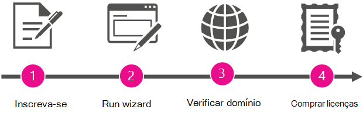

# Tornar-se o administrador e comprar o Microsoft 365 para sua organizaçãoBecome the admin and purchase Microsoft 365 for your organization

A Microsoft facilita para as pessoas da sua organização se inscreverem e usarem ferramentas de produtividade e serviços sem terem que esperar que o departamento de TI faça a implantação formal.Microsoft makes it simple for people in your organization to sign up and use productivity tools and services without waiting for formal deployment by your IT department.
  
Sua organização pode permitir que as pessoas continuem a usar esses serviços "como são". Mas, se as pessoas se inscreveram para o Reuniões do Skype como um desses serviços, você pode destacar um administrador para atualizar e obter uma solução de reunião mais completa com o Skype for Business e os aplicativos do Office, espaço de armazenamento e compartilhamento, e muito mais.Your organization can let people continue to use these services "as is." But if people signed up for Skype Meetings as one of those services, you can assign an admin to upgrade and get a more complete meeting solution with Skype for Business and Office applications, file storage and sharing, and more.
  
## Por que se tornar o administrador e comprar o Microsoft 365 para sua organização?Why become the admin and buy Microsoft 365 for your organization?

Quando um funcionário se inscreve para o Reuniões do Skype com uma conta corporativa, ele não pode gerenciar o serviço. E ele recebe somente os recursos mais básicos: reuniões ilimitadas, mas apenas com no máximo dez participantes (após 60 dias, o número máximo de participantes é três).When an employee signs up for Skype Meetings with their work account, they can't manage the service. And they get only the most basic features: they can have unlimited meetings but only with 10 or fewer participants (after 60 days, the maximum participants is three people). 
  
Quando você configura um administrador para o serviço e adquire o Microsoft 365 para seus usuários, eles obtêm recursos mais avançados.When you set up an admin for the service and buy Microsoft 365 for your users, they get more advanced features. E você obtém a capacidade de gerenciar os serviços, permitindo impor políticas e adicionar novos usuários.And you get the ability to manage the services, so you can enforce policies and add new users.
  
Como bônus, você obtém suporte por telefone 24 horas por dia, sete dias por semana.As a bonus, you get 24/7 phone support.
  
## Como se tornar o administradorHow to become the admin

Para se tornar o administrador, comprove ser o proprietário do domínio com o qual as pessoas se inscreveram (como contoso.com).To become the admin, you'll first prove that you own the domain that people signed up with (like contoso.com). Em seguida, você atualizará para o Microsoft 365 para todos na empresa que já estão usando reuniões do Skype.Then you'll upgrade to Microsoft 365 for everyone in the company who is already using Skype Meetings. Um assistente de instalação orienta você pelas etapas.A wizard walks you through the steps.
  
> [!NOTE]
> Tornar-se o administrador e atualizar para o Microsoft 365 fazem parte do mesmo processo.Becoming the admin and upgrading to Microsoft 365 are part of the same process. Você não pode atualizar sem antes se tornar o administrador e não pode gerenciar os serviços como um administrador, a menos que você também atualize para o Microsoft 365.You can't upgrade without first becoming the admin, and you can't manage the services as an admin unless you also upgrade to Microsoft 365. 
  
 **Por que pedimos para você provar que é o proprietário do domínio?****Why do we ask you to prove that you own the domain?** Porque todos os usuários que se inscrevem com um endereço de email no mesmo domínio (digamos, diogo@contoso.com e sara@contoso.com) estão agrupados pelo nome de domínio.Because everyone who signs up with an email address on the same domain (say, rob@contoso.com and sara@contoso.com) is grouped together by the domain name. Decidimos que grupo cada pessoa pertence à parte de domínio de seus endereços de email (como contoso.com), para que as pessoas da mesma organização possam trabalhar em conjunto.We decide what group each person belongs to by the domain portion of their email addresses (like contoso.com), so people from the same organization can work together. Como pertencem ao mesmo grupo, podem colaborar entre si.Because they belong to the same group, they can collaborate with each other.
  
Para se tornar o administrador do grupo, verifique se você é o proprietário do domínio no qual todos em sua organização estão agrupados.To become the admin for the group, you verify that you own the domain that everyone in your organization is grouped under. Se você tiver a autoridade para comprovar a propriedade do domínio (ao entrar onde o domínio é gerenciado), faz sentido que você possa gerenciar os serviços do Microsoft 365 para pessoas que usam esse domínio.If you have the authority to prove domain ownership (by signing in where the domain is managed), it makes sense that you can manage Microsoft 365 services for people using that domain.
  
Depois de se tornar o administrador, você poderá adicionar novos usuários ou impor políticas, se desejar.After you become the admin, you can also add new users or enforce policies, if you like.
  
## Visão geral das etapasOverview of the steps

  
Um assistente orienta você ao longo do processo, mas aqui está um resumo de cada etapa.A wizard guides you through the process, but here's a summary of each step.
  
|||
|:-----|:-----|
||**Inscrever-se** Antes de se tornar o administrador, você já deverá estar conectado no Reuniões do Skype com seu endereço de email corporativo.**Sign up** Before you can become the admin, you must already be signed up for Skype Meetings with your work email address.    |
||**Executar o assistente** Depois de se inscrever, execute o assistente seguindo um destes procedimentos:**Run the wizard** After you've signed up, run the wizard by doing one of the following:     Execute o assistente **tornar-se o administrador** que aparece depois de selecionar **administrador** no inicializador de aplicativos.Run the **Become the admin** wizard that appears after selecting **Admin** in the app launcher .     OUOR     Opte por **atualizar para o Microsoft 365** em reuniões do Skype e selecione a assinatura do Microsoft 365 para a qual você deseja atualizar.Choose to **Upgrade to Microsoft 365** in Skype Meetings, and then select the Microsoft 365 subscription you want to upgrade to.    |
||**Verificar a propriedade do domínio** Em seguida, você verificará o Microsoft 365 que você possui ou gerencia o nome de domínio (como contoso.com) que está associado aos endereços de email da sua organização.**Verify domain ownership** Next, you'll verify to Microsoft 365 that you own or manage the domain name (like contoso.com) that's associated with your organization's email addresses. Somente o proprietário do nome do domínio tem autoridade para fazer isso.Only the owner of the domain name has the authority to do this.    |
||**Comprar licenças** Na última etapa do assistente, você comprará as licenças da Microsoft 365 para cada pessoa em sua organização que se inscreveu para reuniões do Skype com seus emails de trabalho.**Buy licenses** In the last step in the wizard, you'll buy Microsoft 365 licenses for each person within your organization who's signed up for Skype Meetings with their work email.    Por exemplo, se dois usuários se inscreveram para o Reuniões do Skype com os emails corporativos deles, você precisará comprar duas licenças, uma para cada.For example, if two users have signed up for Skype Meetings with their work email, you'll need to buy two licenses—one for each of them.    > [!NOTE]> não é possível gerenciar o Microsoft 365 até que você tenha comprado as licenças.> [!NOTE]> You can't manage Microsoft 365 until after you've bought the licenses.           |

## Sua assinatura do Microsoft 365Your Microsoft 365 subscription

Depois de verificar o domínio e comprar as licenças, sua organização será atualizada para o Microsoft 365.After you've verified the domain and bought licenses, your organization is upgraded to Microsoft 365. Isso também transfere (para a assinatura paga) as configurações pessoais da assinatura de Reuniões do Skype em uso pelos usuários individuais.This also transfers (to the paid subscription) the personal settings from the Skype Meetings subscription that individual users were using.
  
A assinatura do Microsoft 365 para a qual sua organização é atualizada depende de qual assistente você usou:The Microsoft 365 subscription that your organization is upgraded to depends on which wizard you used:
  
|||
|:-----|:-----|
|**Como o assistente foi iniciado****How the wizard was launched**   |**Opções de assinatura****Subscription options**   |
|Usando o bloco Administrador no inicializador de aplicativosBy using the Admin tile in the app launcher    |Microsoft 365 Business BasicMicrosoft 365 Business Basic    |
|Escolhendo **atualizar para o Microsoft 365 for Business** em reuniões do SkypeBy choosing **Upgrade to Microsoft 365 for business** in Skype Meetings    |Microsoft 365 Business Basic ou Microsoft 365 Business StandardMicrosoft 365 Business Basic or Microsoft 365 Business Standard    |
   
## O que vem a seguir?What's next?

Agora que você é o administrador, convém fazer o seguinte:Now that you're the admin, you may want to do the following:
  
|\*\*\*\*Tarefa\*\*\*\*\*\*\*\*Task\*\*\*\*|\*\*\*\*Detalhes\*\*\*\*\*\*\*\*Details\*\*\*\*|
|:-----|:-----|
|Adicionar ou remover licençasAdd or remove licenses    |Você pode [adicionar mais licenças](../../commerce/licenses/buy-licenses.md) para usuários que não estão usando o Microsoft 365 ainda ou [remover licenças de usuários](../manage/remove-licenses-from-users.md) que não deseja usar a assinatura do Microsoft 365 da sua organização.You can [add more licenses](../../commerce/licenses/buy-licenses.md) for users who aren't using Microsoft 365 yet, or [remove licenses from users](../manage/remove-licenses-from-users.md) that you don't want using your organization's Microsoft 365 for business subscription.    |
|Entre em contato com outras pessoas que já se inscreveramContact others who already signed up    |Chegue aos outros usuários e informe-os de que você está gerenciando sua assinatura do Microsoft 365 e que eles foram atualizados.Reach out to the other users and let them know that you're managing their Microsoft 365 subscription and that they've been upgraded. [Siga estas etapas](../add-users/add-users.md) para ver uma lista de **Usuários Ativos** e os endereços de email.[Follow these steps](../add-users/add-users.md) to see a list of **Active Users** and their email addresses.    |
|Começar a usar o Microsoft 365Start using Microsoft 365    |Visite a [Central de informações do Office 365](https://support.office.com/learn/office365-for-business) e aprenda a entrar, verificar emails, compartilhar documentos e muito mais.Visit the [Office 365 Learning Center](https://support.office.com/learn/office365-for-business) and learn how to sign in, check email, share documents, and more. Você e seus usuários podem usar este site para começar a usar o Microsoft 365.You and your users can use this site to get started with Microsoft 365.    |
|Gerenciar sua assinatura do Microsoft 365Manage your Microsoft 365 subscription    |Visite [o centro de ajuda de administração do Microsoft 365](../admin-home.md) e aprenda tarefas administrativas comuns, como adicionar e remover usuários, redefinir senhas e configurar dispositivos móveis.Visit [Microsoft 365 Admin help center](../admin-home.md) and learn common administrative tasks like adding and removing users, resetting passwords, and setting up mobile devices.    |

## Ainda precisa de ajuda?Still need help?

[Chamar o suporte da MicrosoftCall Microsoft support](../contact-support-for-business-products.md)
