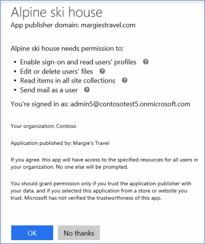

# Ativar ou desativar o recurso Aplicativos Integrados

Quando o recurso Aplicativos Integrados está ativado, os usuários em sua organização podem permitir que aplicativos de terceiros acessem suas informações do Office 365. Por exemplo, quando alguém usa um aplicativo de terceiros, esse aplicativo pode solicitar permissão para acessar o calendário e editar arquivos que estão em uma pasta do OneDrive.

## Ativar ou desativar o recurso Aplicativos Integrados

Veja aqui como ativar ou desativar o recurso Aplicativos Integrados.

1. No centro de administração, vá para a página [suplementos &amp; de serviços](https://go.microsoft.com/fwlink/p/?linkid=2053743) de **configurações** \> e selecione **aplicativos integrados**.

2. Na página **aplicativos integrados** , selecione a opção para ativar ou desativar aplicativos integrados.

## Obter mais informações sobre Aplicativos Integrados

Um aplicativo integrado pode ser criado em sua organização ou pode vir de outra organização do Office 365 ou de terceiros.

Quando o recurso Aplicativos Integrados está ativado e um aplicativo é usado, o aplicativo solicita permissão para definir o nível de acesso necessário ao acessar as informações do usuário. Um usuário pode fornecer acesso somente aos aplicativos que ele possua e que acessam suas informações do Office 365. Não é possível permitir que um aplicativo acesse quaisquer outras informações do usuário.

Existem dois tipos de permissões que são usados durante o uso do recurso Aplicativos Integrados no Office 365: permissões de usuário e permissões de administrador. Por exemplo, quando sua organização está habilitada para Aplicativos Integrados e um usuário usa um aplicativo de terceiros, o aplicativo pode solicitar a permissão do usuário para ler os detalhes do perfil do usuário, editar ou excluir seus arquivos, ler itens contidos em conjuntos de sites e enviar emails em nome desse usuário.

Se um administrador registrar um aplicativo para todos os usuários em uma organização, ele deverá ter permissão para permitir que o aplicativo acesse informações e recursos na organização. Depois disso, quando outros usuários na organização usarem esse aplicativo, não será pedida a sua permissão. Quando um administrador registra um aplicativo, esse administrador precisa ter certeza de que ele confia no fornecedor daquele aplicativo. Para obter mais detalhes sobre como registrar um aplicativo, consulte [Adicionar, Atualizar e Remover um Aplicativo](https://go.microsoft.com/fwlink/p/?LinkID=518600).

Se o recurso Aplicativos Integrados estiver desativado, os aplicativos que já foram instalados e têm permissão para acessar informações não serão desinstalados, e as permissões não serão removidas. Mesmo com o recurso Aplicativos Integrados desativado, administradores ainda podem registrar aplicativos para disponibilizá-los aos usuários e permitir que esses aplicativos acessem as informações do usuário. Para detalhes sobre como remover um aplicativo registrado e suas permissões, consulte [Adicionar, Atualizar e Remover um Aplicativo](https://go.microsoft.com/fwlink/?LinkID=518600&amp;clcid=0x409).

