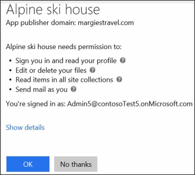

# Ativar ou desativar o recurso Aplicativos IntegradosTurning Integrated Apps on or off

Quando o aplicativos integrados está ativado, os usuários em sua organização podem permitir que aplicativos de terceiros acessem suas informações do Microsoft 365.When Integrated Apps is turned on, users in your organization can allow third-party apps to access their Microsoft 365 information. Por exemplo, quando alguém usa um aplicativo de terceiros, esse aplicativo pode solicitar permissão para acessar o calendário e editar arquivos que estão em uma pasta do OneDrive.For example, when someone uses a third-party app, that app might ask for permission to access their calendar and to edit files that are in a OneDrive folder.

## Ativar ou desativar o recurso Aplicativos IntegradosTurning Integrated Apps on or off

Veja aqui como ativar ou desativar o recurso Aplicativos Integrados.Here's how to turn Integrated Apps on or off.

1. No centro de administração do Microsoft 365, vá para a página [suplementos de serviços &amp; ](https://go.microsoft.com/fwlink/p/?linkid=2053743) de **configurações** \> e selecione **aplicativos integrados**.In the Microsoft 365 admin center, go to the **Settings** \> [Services &amp; add-ins](https://go.microsoft.com/fwlink/p/?linkid=2053743) page, and then select **Integrated apps**.

2. Na página **aplicativos integrados** , selecione a opção para ativar ou desativar aplicativos integrados.On the **Integrated Apps** page, select the option to turn Integrated Apps on or off.

## Obter mais informações sobre Aplicativos IntegradosMore info on Integrated Apps

Um aplicativo integrado pode ser criado de dentro de sua própria organização ou pode vir de outra organização ou de terceiros.An integrated app can be created from within your own organization, or it can come from another organization or a third-party.

Quando o recurso Aplicativos Integrados está ativado e um aplicativo é usado, o aplicativo solicita permissão para definir o nível de acesso necessário ao acessar as informações do usuário.When Integrated Apps is turned on and an app is used, the app asks for permission to set the level of access it needs when it accesses the user's information. Um usuário pode fornecer acesso somente aos aplicativos proprietários que acessam suas informações da Microsoft 365.A user can give access only to apps they own that access their Microsoft 365 information. Não é possível permitir que um aplicativo acesse quaisquer outras informações do usuário.They can't give an app access to any other user's information.

Há dois tipos de permissões que são usadas ao usar aplicativos integrados no Microsoft 365: permissões de usuário e permissões de administrador.There are two kinds of permissions that are used when using Integrated Apps in Microsoft 365: user permissions and admin permissions. Por exemplo, quando sua organização está habilitada para Aplicativos Integrados e um usuário usa um aplicativo de terceiros, o aplicativo pode solicitar a permissão do usuário para ler os detalhes do perfil do usuário, editar ou excluir seus arquivos, ler itens contidos em conjuntos de sites e enviar emails em nome desse usuário.For example, when your organization is enabled for Integrated Apps and a user uses a third-party app, the app might ask for the user's permission to read their user profile details, edit or delete their files, read items contained in site collections, and send email as that user.

Se um administrador registrar um aplicativo para todos os usuários em uma organização, ele deverá ter permissão para permitir que o aplicativo acesse informações e recursos na organização.If an admin registers an app for all users in an organization, he or she is asked for permission to let that app access information and resources in the organization. Depois disso, quando outros usuários na organização usarem esse aplicativo, não será pedida a sua permissão.After this, when other users in the organization use that app, they won't be asked for permission. Quando um administrador registra um aplicativo, esse administrador precisa ter certeza de que ele confia no fornecedor daquele aplicativo.When an admin registers an app, that admin must make sure that they trust that app's publisher. Para obter mais detalhes sobre como registrar um aplicativo, consulte [Adicionar, Atualizar e Remover um Aplicativo](https://go.microsoft.com/fwlink/p/?LinkID=518600).For details on registering an app, see [Adding, Updating and Removing an Application](https://go.microsoft.com/fwlink/p/?LinkID=518600).

Se o recurso Aplicativos Integrados estiver desativado, os aplicativos que já foram instalados e têm permissão para acessar informações não serão desinstalados, e as permissões não serão removidas. Mesmo com o recurso Aplicativos Integrados desativado, administradores ainda podem registrar aplicativos para disponibilizá-los aos usuários e permitir que esses aplicativos acessem as informações do usuário. Para detalhes sobre como remover um aplicativo registrado e suas permissões, consulte [Adicionar, Atualizar e Remover um Aplicativo](https://go.microsoft.com/fwlink/?LinkID=518600&amp;clcid=0x409).If Integrated Apps is turned off, apps that have already been installed and have permission to access information won't be uninstalled, and the permissions won't be removed. Even though Integrated Apps is turned off, admins can still register apps to make them available to their users and allow those apps access to the users' information. For details on removing a registered application and it's permissions, see [Adding, Updating and Removing an Application](https://go.microsoft.com/fwlink/?LinkID=518600&amp;clcid=0x409).

