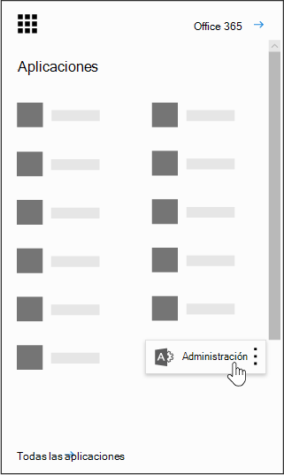

# Power BI em sua organizaçãoPower BI in your organization

Esta página descreve como os usuários em sua organização podem usar o Power BI para Office 365 e como você pode controlar a forma de aquisição desse serviço por sua organização.This page describes how users in your organization can use Power BI and how you can control how your organization acquires this service.

## O que é Power BI?What is Power BI?

O Microsoft Power BI permite aos usuários visualizar dados, compartilhar descobertas e colaborar de maneiras novas e intuitivas. Para saber mais, veja o [site do Power BI](https://powerbi.microsoft.com/en-us/).Microsoft Power BI enables users to visualize data, share discoveries, and collaborate in intuitive new ways. To learn more, see the [Power BI Web site](https://powerbi.microsoft.com/en-us/).
  
## As Power BI atendem aos requisitos de conformidade nacionais, regionais e específicos do setor?Does Power BI meet national, regional, and industry-specific compliance requirements?

Para saber mais sobre Power BI conformidade, consulte o [Centro de Confiação da Microsoft.](https://go.microsoft.com/fwlink/?LinkId=785324)To learn more about Power BI compliance, see the [Microsoft Trust Center](https://go.microsoft.com/fwlink/?LinkId=785324).
  
## Como os usuários podem se inscrever para obter o Power BI?How do users sign up for Power BI?

Como administrador, você pode se inscrever para obter o Power BI por meio do [site do Power BI](https://powerbi.microsoft.com/en-us/).As an administrator, you can sign up for Power BI through the [Power BI web site](https://powerbi.microsoft.com/en-us/). Você também pode se inscrever por meio da página serviços de compra no Microsoft 365 de administração.You can also sign up through the purchase services page on the Microsoft 365 admin center. Ao se inscrever no Power BI, um administrador pode atribuir licenças de assinatura a usuários que precisam ter acesso.When an administrator signs up for Power BI, they can assign user subscription licenses to users who should have access.
  
Além disso, usuários individuais em sua organização podem se inscrever no Power BI por meio do [site do Power BI](https://powerbi.microsoft.com/en-us/). Quando um usuário em sua organização se inscreve no Power BI, uma licença do Power BI é atribuída automaticamente a ele.Additionally, individual users in your organization may be able to sign up for Power BI through the [Power BI web site](https://powerbi.microsoft.com/en-us/). When a user in your organization signs up for Power BI, that user is assigned a Power BI license automatically.
  
## Como usuários individuais em minha organização podem se inscrever?How do individual users in my organization sign up?

Há três cenários que podem se aplicar aos usuários em sua organização:There are three scenarios that might apply to users in your organization:
  
### Cenário 1: Sua organização já tem um ambiente de Microsoft 365 existente e o usuário que se ins inscrever no Power BI já tem uma conta Microsoft 365.Scenario 1: Your organization already has an existing Microsoft 365 environment and the user signing up for Power BI already has a Microsoft 365 account.

Neste cenário, se um usuário já tiver uma conta do trabalho ou da escola no locatário (por exemplo, contoso.com), mas ainda não tiver o Power BI, a Microsoft simplesmente ativará o plano para essa conta e o usuário será notificado automaticamente sobre como usar o serviço do Power BI.In this scenario, if a user already has a work or school account in the tenant (for example, contoso.com) but does not yet have Power BI, Microsoft will simply activate the plan for that account, and the user will automatically be notified of how to use the Power BI service.
  
### Cenário 2: sua organização tem um ambiente de Microsoft 365 existente e o usuário que se ins inscrever no Power BI não tem uma conta Microsoft 365.Scenario 2: Your organization has an existing Microsoft 365 environment and the user signing up for Power BI doesn't have a Microsoft 365 account.

Nesse cenário, o usuário tem um endereço de email no domínio da sua organização (por exemplo, contoso.com), mas ainda não tem uma conta Microsoft 365.In this scenario, the user has an email address in your organization's domain (for example, contoso.com) but does not yet have a Microsoft 365 account. Neste caso, o usuário pode se inscrever no Power BI e obterá uma conta automaticamente.In this case, the user can sign up for Power BI and will automatically be given an account. Isso permite que o usuário acesse o serviço do Power BI.This lets the user access the Power BI service. Por exemplo, se uma funcionária chamada Nancy usar seu endereço de email de trabalho (por exemplo, Nancy@contoso.com) para se inscrever, a Microsoft adicionará Automaticamente Nancy como usuário no ambiente Microsoft 365 Contoso e ativará o Power BI dessa conta.For example, if an employee named Nancy uses her work email address (for example, Nancy@contoso.com) to sign up, Microsoft will automatically add Nancy as a user in the Contoso Microsoft 365 environment and activate Power BI for that account.
  
### Cenário 3: Sua organização não tem um ambiente Microsoft 365 conectado ao seu domínio de email.Scenario 3: Your organization does not have a Microsoft 365 environment connected to your email domain.

Não há ações administrativas que sua organização precise tirar proveito Power BI.There are no administrative actions your organization needs to take advantage of Power BI.
  
> [!IMPORTANT]
> Se sua organização tiver vários domínios de email e você preferir que todas as extensões de endereço de email sejam no mesmo locatário, antes que qualquer usuário crie seu locatário principal, adicione todos os domínios de endereço de email a esse locatário antes que qualquer usuário crie seu locatário principal.If your organization has multiple email domains and you prefer all email address extensions to be in the same tenant, before any users create your primary tenant, add all email address domains to that tenant before any users create your primary tenant. Não há mecanismo automatizado para mover usuários entre locatários após a criação.There is no automated mechanism to move users across tenants after they have been created. Para obter mais informações sobre esse processo, consulte If I have multiple [domains, can I](#if-i-have-multiple-domains-can-i-control-the-tenant-that-users-are-added-to) control the tenant that users are added to? later in this article and [Add a domain to Office 365](../setup/add-domain.md) online.For more information on this process, see [If I have multiple domains, can I control the tenant that users are added to?](#if-i-have-multiple-domains-can-i-control-the-tenant-that-users-are-added-to) later in this article and [Add a domain to Office 365](../setup/add-domain.md) online.
  
## Como isso mudará minha maneira de gerenciar identidades dos usuários em minha organização hoje?How will this change the way I manage identities for users in my organization today?

Se a sua organização já tiver um ambiente Microsoft 365 existente e todos os usuários em sua organização têm contas Microsoft 365, o gerenciamento de identidade não mudará.If your organization already has an existing Microsoft 365 environment and all users in your organization have Microsoft 365 accounts, identity management will not change.
  
Se sua organização já tiver um ambiente de Microsoft 365 existente, mas nem todos os usuários em sua organização têm contas Microsoft 365, criaremos um usuário no locatário e atribuiremos licenças com base no endereço de email de estudante ou trabalho do usuário.If your organization already has an existing Microsoft 365 environment but not all users in your organization have Microsoft 365 accounts, we will create a user in the tenant and assign licenses based on the user's work or school email address. Isso significa que o número de usuários que você gerencia a qualquer momento específico crescerá à medida que os usuários em sua organização se inscreverem no serviço.This means that the number of users you are managing at any particular time will grow as users in your organization sign up for the service.
  
Se você estiver gerenciando seu diretório local e usar o AD FS (Serviços de Federação do Active Directory), a Microsoft não adicionará usuários a seu locatário, e os usuários que tentarem ingressar no locatário receberão uma mensagem para contatar o administrador da organização.If you are managing your directory on-premises, and use Active Directory Federation Services (AD FS), Microsoft will not add users to your tenant, and users attempting to join your tenant will receive a message to contact their organization's admin.
  
Se sua organização não tiver um ambiente Microsoft 365 conectado ao seu domínio de email, não haverá nenhuma alteração na forma como você gerencia a identidade.If your organization does not have a Microsoft 365 environment connected to your email domain, there will be no change in how you manage identity. Os usuários serão adicionados a um novo diretório de usuários somente na nuvem, e você terá a opção de assumir o controle como administrador do locatário e gerenciá-los.Users will be added to a new, cloud-only user directory, and you will have the option to elect to take over as the tenant admin and manage them.
  
## Qual é o processo para gerenciar um locatário criado pela Microsoft para meus usuários?What is the process to manage a tenant created by Microsoft for my users?

Se um locatário for criado pela Microsoft, você poderá solicitá-lo e gerenciá-lo seguindo estas etapas:If a tenant was created by Microsoft, you can claim and manage that tenant by following these steps:
  
1. Ingresse no locatário [inscrevendo-se no Power BI](https://go.microsoft.com/fwlink/?LinkId=522448) com um domínio de endereço de email que corresponda ao domínio de locatário que você deseja gerenciar. Por exemplo, se a Microsoft tiver criado o locatário contoso.com, você precisará ingressar no locatário com um endereço de email que termine com @contoso.com.Join the tenant by [signing up for Power BI](https://go.microsoft.com/fwlink/?LinkId=522448) using an email address domain that matches the tenant domain you want to manage. For example, if Microsoft created the contoso.com tenant, you will need to join the tenant with an email address ending with @contoso.com.

1. Solicite o controle de administração, verificando a propriedade do domínio: quando estiver no locatário, você poderá se autopromover à função de administrador, verificando a propriedade de domínio. Para fazer isso, siga estas etapas:Claim admin control by verifying domain ownership: once you are in the tenant, you can promote yourself to the admin role by verifying domain ownership. To do so, follow these steps:

::: moniker range="o365-worldwide"

3. Vá para <a href="https://admin.microsoft.com" target="_blank">https://admin.microsoft.com</a>.Go to <a href="https://admin.microsoft.com" target="_blank">https://admin.microsoft.com</a>.

::: moniker-end

::: moniker range="o365-germany"

3. Ir para <a href="https://portal.office.de" target="_blank">https://portal.office.de</a>Go to <a href="https://portal.office.de" target="_blank">https://portal.office.de</a>

::: moniker-end

::: moniker range="o365-21vianet"

3. Acesse <a href="https://portal.partner.microsoftonline.cn" target="_blank">https://portal.partner.microsoftonline.cn</a>.Go to <a href="https://portal.partner.microsoftonline.cn" target="_blank">https://portal.partner.microsoftonline.cn</a>.

::: moniker-end

4. Selecione o ícone do inicializador de aplicativos no canto superior esquerdo e escolha **Administrador**.Select the app launcher icon in the upper-left and choose **Admin**.

    
  
5. Leia as instruções na página **Tornar-se o** administrador e selecione **Sim, quero ser o administrador**.Read the instructions on the **Become the admin** page and then select **Yes, I want to be the admin**.

    > [!NOTE]
    >  Se essa opção não aparecer, já há um administrador no local.If this option doesn't appear, there is already an administrator in place.
  
## Se eu tiver vários domínios, posso controlar o locatário ao que os usuários são adicionados?If I have multiple domains, can I control the tenant that users are added to?

Se você não fizer nada, será criado um locatário para cada domínio e subdomínio de email de usuários.If you do nothing, a tenant will be created for each user email domain and subdomain.
  
Se você quiser que todos os usuários estejam no mesmo locatário independentemente de suas extensões de endereço de email:If you want all users to be in the same tenant regardless of their email address extensions:
  
- Crie antecipadamente um locatário de destino ou use um locatário existente e adicione todos os domínios e subdomínios existentes que você deseja que sejam consolidados nesse locatário. Em seguida, todos os usuários com endereços de email terminados nesses domínios e subdomínios ingressarão automaticamente no locatário de destino quando se inscreverem.Create a target tenant ahead of time or use an existing tenant, and add all the existing domains and subdomains that you want consolidated within that tenant. Then all the users with email addresses ending in those domains and subdomains will automatically join the target tenant when they sign up.

> [!IMPORTANT]
> Não há mecanismos automatizados com suporte para mover os usuários entre locatários depois que eles forem criados.There is no supported automated mechanism to move users across tenants once they have been created. Para saber mais sobre como adicionar domínios a um único Microsoft 365 locatário, consulte [Adicionar um domínio a Office 365](../setup/add-domain.md).To learn about adding domains to a single Microsoft 365 tenant, see [Add a domain to Office 365](../setup/add-domain.md).

> [!IMPORTANT]
> Para obter mais informações e orientações sobre como gerenciar locatários, consulte [O que é Power BI administração?](/power-bi/service-admin-administering-power-bi-in-your-organization).For more information and guidance on managing tenants, see [What is Power BI administration?](/power-bi/service-admin-administering-power-bi-in-your-organization).
  
## Como posso impedir que os usuários insuem meu locatário existente?How can I prevent users from joining my existing tenant?

Há etapas que você pode seguir como administrador para impedir que os usuários insumentem seu locatário existente.There are steps you can take as an admin to prevent users from joining your existing tenant. Se você impedir os usuários de ingressar no locatário, as tentativas dos usuários de entrar falharão e serão direcionadas para entrar em contato com o administrador da organização. Você não precisa repetir esse processo se já tiver desabilitado a distribuição automática de licenças antes (por exemplo, Office 365 Education para alunos, professores e funcionários).If you block users from joining the tenant, users' attempts to sign in will fail and they will be directed to contact their organization's admin. You do not need to repeat this process if you have already disabled automatic license distribution before (for example, Office 365 Education for Students, Faculty, and Staff).
  
As etapas exigem o uso do Windows PowerShell. Para começar a usar o Windows PowerShell, consulte o [Guia de Introdução do PowerShell](/powershell/scripting/overview).These steps require the use of Windows PowerShell. To get started with Windows PowerShell, see the [PowerShell getting started guide](/powershell/scripting/overview).
  
Para executar as etapas a seguir, você deve instalar a versão mais recente de 64 bits do [módulo Azure Active Directory V2 PowerShell](https://www.powershellgallery.com/packages/AzureADPreview/2.0.2.5).To perform the following steps, you must install the latest 64-bit version of the [Azure Active Directory V2 PowerShell Module](https://www.powershellgallery.com/packages/AzureADPreview/2.0.2.5).
  
Após escolher o link, selecione **Executar** para executar o pacote de instalação.After you select the link, select **Run** to run the installer package.
  
**Desabilitar o ingresso automático do locatário**: use este comando do Windows PowerShell para impedir que novos usuários ingressem em um locatário gerenciado:**Disable automatic tenant join**: Use this Windows PowerShell command to prevent new users from joining a managed tenant:
  
Para desabilitar o ingresso automático no locatário para novos usuários:  `Set-MsolCompanySettings -AllowEmailVerifiedUsers $false`To disable automatic tenant join for new users:  `Set-MsolCompanySettings -AllowEmailVerifiedUsers $false`
  
Para habilitar o ingresso automático no locatário para novos usuários:  `Set-MsolCompanySettings -AllowEmailVerifiedUsers $true`To enable automatic tenant join for new users:  `Set-MsolCompanySettings -AllowEmailVerifiedUsers $true`
  
> [!NOTE]
> Esse bloqueio impede que novos usuários em sua organização se inssuem para Power BI.This blocking prevents new users in your organization from signing up for Power BI. Os usuários que se inscreverem no Power BI antes de desabilitar novas inscrições para sua organização ainda manterão suas licenças.Users that sign up for Power BI prior to disabling new signups for your organization will still retain their licenses. Consulte o guia Como remover Power BI para usuários que já se [inscreveram?](#how-do-i-remove-power-bi-for-users-that-already-signed-up) para obter instruções sobre como você pode remover o acesso ao Power BI para usuários que se inscreveram anteriormente no serviço.See the [How do I remove Power BI for users that already signed up?](#how-do-i-remove-power-bi-for-users-that-already-signed-up) for instructions on how you can remove access to Power BI for users that had previously signed up for the service.
  
## Como posso permitir que os usuários participem do meu locatário existente?How can I allow users to join my existing tenant?

Para permitir que os usuários ingressem em seu locatário, execute o comando oposto conforme descrito na pergunta acima:  `Set-MsolCompanySettings -AllowEmailVerifiedUsers $true`To allow users to join your tenant, run the opposite command as described in the question above:  `Set-MsolCompanySettings -AllowEmailVerifiedUsers $true`
  
## Como posso verificar o bloqueio foi ativado em meu locatário?How do I verify if I have the block on in the tenant?

Use o seguinte script do PowerShell:  `Get-MsolCompanyInformation | fl allow*`Use the following PowerShell script:  `Get-MsolCompanyInformation | fl allow*`
  
## Como impedir que meus usuários existentes comecem a usar o Power BI?How can I prevent my existing users from starting to use Power BI?

**Desabilitar a distribuição automática de licenças:** Use esse script do Windows PowerShell para desabilitar as distribuições automáticas de licenças a usuários existentes.**Disable automatic license distribution:** Use this Windows PowerShell script to disable automatic license distributions for existing users. Você não precisa repetir esse processo se já tiver desabilitado a distribuição automática de licenças antes (por exemplo, Office 365 Education para alunos, professores e funcionários).You do not need to repeat this process if you have already disabled automatic license distribution before (for example, Office 365 Education for Students, Faculty, and Staff).
  
Para desabilitar as distribuições automáticas de licenças a usuários existentes:  `Set-MsolCompanySettings -AllowAdHocSubscriptions $false`To disable automatic license distribution for existing users:  `Set-MsolCompanySettings -AllowAdHocSubscriptions $false`
  
Para habilitar a distribuição automática de licenças a usuários existentes:  `Set-MsolCompanySettings -AllowAdHocSubscriptions $true`To enable automatic license distribution for existing users:  `Set-MsolCompanySettings -AllowAdHocSubscriptions $true`
  
> [!NOTE]
> O *sinalizador AllowAdHocSubscriptions* é usado para controlar vários recursos de usuário em sua organização, incluindo a capacidade de os usuários se inscreverem no Serviço de Gerenciamento de Direitos do Azure.The *AllowAdHocSubscriptions* flag is used to control several user capabilities in your organization, including the ability for users to sign up for the Azure Rights Management Service. A alteração desse sinalizador afetará todos esses recursos.Changing this flag will affect all of these capabilities.
  
## Como faço para permitir que os meus usuários existentes se inscrevam no Power BI?How can I allow my existing users to sign up for Power BI?

Para permitir que os usuários existentes se inscrevam no Power BI, execute o comando oposto conforme descrito na pergunta acima:  `Set-MsolCompanySettings -AllowAdHocSubscriptions $true`To allow your existing users to sign up for Power BI, run the opposite command as described in the question above:  `Set-MsolCompanySettings -AllowAdHocSubscriptions $true`
  
## Como remover o Power BI para usuários que já se inscreveram?How do I remove Power BI for users that already signed up?

Se um usuário se inscreveu no Power BI, mas você não deseja mais que ele tenha acesso ao Power BI, você pode remover a licença Power BI para esse usuário.If a user signed up for Power BI, but you no longer want them to have access to Power BI, you can remove the Power BI license for that user.
  
::: moniker range="o365-worldwide"

1. No centro de administração, vá para a página **Usuários** \> <a href="https://go.microsoft.com/fwlink/p/?linkid=834822" target="_blank">Usuários ativos</a>.In the admin center, go to the **Users** \> <a href="https://go.microsoft.com/fwlink/p/?linkid=834822" target="_blank">Active users</a> page.

::: moniker-end

::: moniker range="o365-germany"

 1. No centro de administração, vá para a página **Usuários** \> <a href="https://go.microsoft.com/fwlink/p/?linkid=847686" target="_blank">Usuários ativos</a>.In the admin center, go to the **Users** \> <a href="https://go.microsoft.com/fwlink/p/?linkid=847686" target="_blank">Active users</a> page.

::: moniker-end

::: moniker range="o365-21vianet"

 1. No centro de administração, vá para a página **Usuários** \> <a href="https://go.microsoft.com/fwlink/p/?linkid=850628" target="_blank">Usuários ativos</a>.In the admin center, go to the **Users** \> <a href="https://go.microsoft.com/fwlink/p/?linkid=850628" target="_blank">Active users</a> page.

::: moniker-end

2. Encontre o usuário para o que você deseja remover a licença e selecione seu nome.Find the user you want to remove the license for, then select their name.

3. Na guia **Licenças e Aplicativos,** des limpar a **caixa** de Power BI Microsoft.On the **Licenses and Apps** tab, clear the **Microsoft Power BI** check box.

4. Selecione **Salvar alterações**.Select **Save changes**.

## Como posso saber se novos usuários ingressaram no meu locatário?How do I know when new users have joined my tenant?

Os usuários que ingressarem em seu locatário como parte desse programa receberão uma licença exclusiva, que você poderá filtrar dentro no painel do usuário ativo, no painel do administrador.Users who have joined your tenant as part of this program are assigned a unique license that you can filter on within your active user pane in the admin dashboard.
  
Para criar essa nova exibição, no centro de administração, siga as etapas para em [Criar um exibição de usuário personalizado.](../add-users/create-edit-or-delete-a-custom-user-view.md#create-a-custom-user-view)To create this new view, in the admin center, follow the steps to in [Create a custom user view](../add-users/create-edit-or-delete-a-custom-user-view.md#create-a-custom-user-view). Em **Licença de produto atribuída,** selecione Microsoft **Power BI**.Under **Assigned product license**, select **Microsoft Power BI**. Depois que a nova exibição tiver sido criada, você poderá ver todos os usuários em seu locatário que se registraram neste programa.After the new view has been created, you will be able to see all the users in your tenant who have enrolled in this program.
  
## Devo estar preparado para outras questões?Are there any additional things I should be prepared for?

Você poderá experimentar um aumento nas solicitações de redefinição de senha. Para obter informações sobre esse processo, consulte [Redefinir uma senha de usuário](../add-users/reset-passwords.md).You might experience an increase in password reset requests. For information about this process, see [Reset a user's password](../add-users/reset-passwords.md).
  
Você pode remover um usuário de seu locatário por meio do processo padrão no centro de administração.You can remove a user from your tenant via the standard process in the admin center. No entanto, se o usuário ainda tiver um endereço de email ativo de sua organização, ele poderá reingressar, a menos que você bloqueie o ingresso de todos os usuários.However, if the user still has an active email address from your organization, they will be able to rejoin unless you block all users from joining.
  
## Por que 1 milhão de licenças para a Microsoft Power BI aparecer no meu locatário?Why did 1 million licenses for Microsoft Power BI show up in my tenant?

Como uma organização qualificada, os usuários em sua organização estão qualificados para usar o serviço do Microsoft Power BI, e essas licenças representam a capacidade disponível para novos usuários do Power BI em seu locatário.As a qualifying organization, users in your organization are eligible to use the Microsoft Power BI service and these licenses represent the available capacity for new Power BI users in your tenant. Não há qualquer cobrança por essas licenças.There is no charge for these licenses. Se você optou por permitir que os usuários se inscrevam no Power BI, eles receberão uma dessas licenças gratuitas disponíveis quando concluirem o processo de assinatura.If you've chosen to allow users to sign up for Power BI themselves, they will be assigned one of these available free licenses when they complete the sign up process. Você também pode optar por atribuir essas licenças a usuários por meio do centro de administração.You can also choose to assign these licenses to users yourself through the admin center.
  
## Isso é gratuito? Serei cobrado por essas licenças?Is this free? Will I be charged for these licenses?

Essas licenças são para a versão gratuita do Power BI. Se você estiver interessado em recursos adicionais, confira a versão do Power BI Pro.These licenses are for the free version of Power BI. If you're interested in additional capabilities, take a look at the Power BI Pro version.
  
## Por que um milhão de licenças?Why 1 million licenses?

Escolhemos um número grande o suficiente para que a maioria das organizações tenha licenças amplas para fornecer esse benefício sem demora para seus usuários.We chose a number that was large enough that the majority of organizations would have ample licenses to provide this benefit without delay to their users.
  
## E se eu precisar de mais de um milhão de licenças?What if I need more than 1 million licenses?

Contate o representante de contas da Microsoft para obter mais informações, caso necessite adquirir licenças adicionais.Contact your Microsoft account representative for more information if you will need to acquire additional licenses.