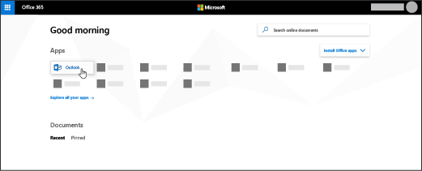

# Configurar o Outlook para ler emails

Sua assinatura do Microsoft 365 vem com um Outlook baseado na Web, mas se sua assinatura incluir aplicativos cliente do Office, você também obterá o Outlook que pode instalar em seu computador ou dispositivos pessoais.
  
## Configurar uma conta de email no Outlook

Na primeira vez que você abrir o Outlook, um Assistente de Conta Automática será aberto. Caso não, escolha **Arquivo** e **Adicionar Conta.**
  
1. Na página **Contas de Email,** escolha **Adicionar Próxima** \> **Conta.**
    
2. Na página **Configuração Automática de** Conta, insira seu nome, endereço de email e senha e escolha **Próximo** \> **Concluir.**
    
Leia [o artigo completo.](https://support.microsoft.com/office/6e27792a-9267-4aa4-8bb6-c84ef146101b)
  
## Como instalar os aplicativos do Office, incluindo o Outlook?

1. Vá para [admin.microsoft.com/OLS/MySoftware](https://admin.microsoft.com/OLS/MySoftware.aspx).
    
2. Entre com sua conta corporativa ou de estudante.
    
3. Em Gerenciar instalações, selecione **Instalar**.
    
## Configuração de conta de email no Outlook 2016 para Mac

Na primeira vez que você abrir o aplicativo Outlook, o assistente Configurar minha Caixa de Entrada será aberto. No assistente: 
  
1. Na página **Configurar minha Caixa de Entrada,** selecione Adicionar **Conta.**
    
2. Na página **Contas,** selecione **Exchange ou Office 365.**
    
3. Na página **Inserir informações da sua conta do Exchange,** insira seu nome, endereço de email e senha e selecione Adicionar **Conta.**
    
Leia [o artigo completo.](https://support.microsoft.com/office/6e27792a-9267-4aa4-8bb6-c84ef146101b#PickTab=Outlook_for_Mac) 
  
## Como acessar meus emails online?

Depois de entrar no Microsoft 365, selecione **Outlook**.
  

  
Não consegue encontrar o aplicativo que está procurando? No iniciador de aplicativos, selecione **Todos** os aplicativos para ver uma lista em ordem alfabética dos aplicativos do Microsoft 365 disponíveis para você. Nesse local, você pode pesquisar um aplicativo específico. 
  
## Como saber se minha assinatura inclui aplicativos do Office?

O Microsoft 365 Business Standard e o Microsoft 365 Apps para Empresas incluem aplicativos do Office. Para obter detalhes, [consulte planos do Microsoft 365 para empresas](https://go.microsoft.com/fwlink/p/?LinkId=723731)ou planos do Office [365 Enterprise.](https://go.microsoft.com/fwlink/p/?LinkId=800029)
  
## Como determinar qual assinatura eu tenho?

Para determinar sua assinatura, veja [Qual é a minha assinatura?](../admin-overview/what-subscription-do-i-have.md)
  

