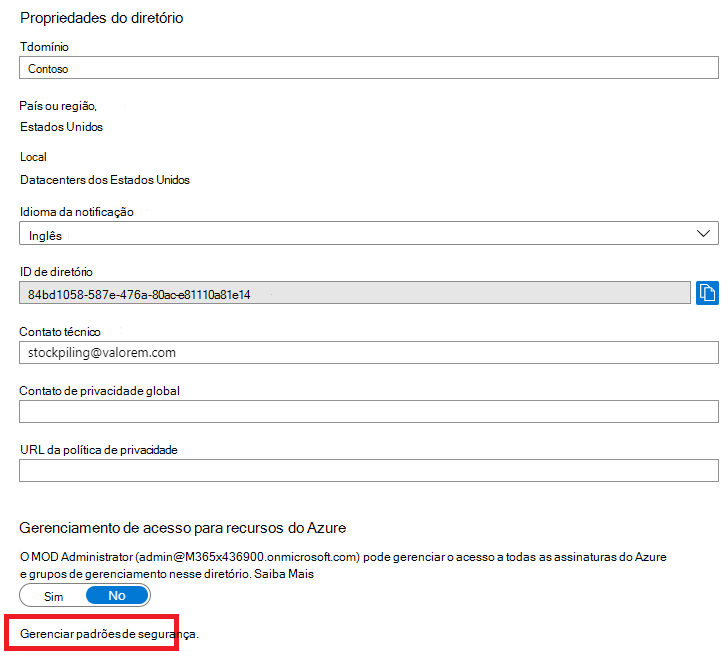
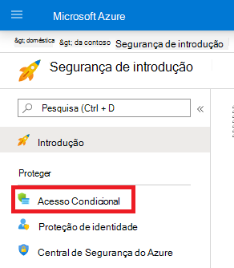
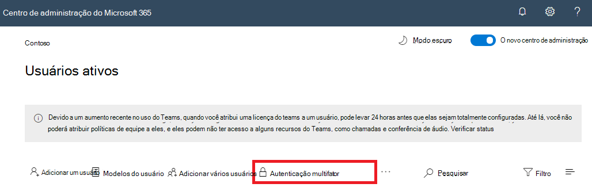

# Autenticação multifator para Microsoft 365

As senhas são o método mais comum de autenticar uma entrada em um computador ou serviço online, mas elas também são mais vulneráveis. As pessoas podem escolher senhas fáceis e usar as mesmas senhas para várias entradas em diferentes computadores e serviços.

Para fornecer um nível adicional de segurança para os logins, você deve usar a MFA (autenticação multifator), que usa uma senha, que deve ser forte, e um método de verificação adicional baseado em:

- Algo que você tem com você não é facilmente duplicado, como um telefone inteligente.
- Algo que você tem exclusivamente e biológica, como digitalização, face ou outro atributo biométrico.

O método de verificação adicional não é empregado até que a senha do usuário tenha sido verificada. Com a MFA, mesmo que uma senha de usuário forte seja comprometida, o invasor não tem seu telefone inteligente ou impressão digital para concluir a entrada.

## Suporte da MFA no Microsoft 365
Por padrão, tanto o Microsoft 365 quanto o Office 365 dão suporte à MFA de contas de usuário usando:

- Uma mensagem de texto enviada a um telefone que exige que o usuário digite um código de verificação.
- Uma chamada telefônica.
- O aplicativo de telefone inteligente Microsoft Authenticator.

Em ambos os casos, a entrada MFA está usando o método "algo que você tem com você não é facilmente duplicado" para a verificação adicional.
Há várias maneiras nas quais você pode habilitar a MFA para o Microsoft 365 e o Office 365:

- Com padrões de segurança
- Com políticas de acesso condicional
- Para cada conta de usuário individual (não recomendado)

Essas formas se baseiam no seu plano Microsoft 365.
    
|Plano  |Recomendação  | Tipo de cliente |
|---------|---------|----------|
| Todos os planos do Microsoft 365 | Use os padrões de segurança, que requerem MFA para todas as contas de usuário.   Você também pode exigir a MFA em uma conta por usuário, mas isso não é recomendado. | Pequena empresa |
| Microsoft 365 Business Premium    Microsoft 365 E3    Azure Active Directory (Azure AD) licenças Premium P1 | Use as políticas de acesso condicional para exigir a MFA de contas de usuário com base na associação de grupo, aplicativos ou outros critérios. | Pequena empresa para empresas |
| Microsoft 365 E5    Licenças do Azure AD Premium P2 | Use a proteção de identidade do Azure AD para exigir a MFA com base nos critérios de risco de entrada. |  Corporativo |
||||

### Padrões de segurança

Os padrões de segurança são um novo recurso para assinaturas pagas ou de avaliação do Microsoft 365 e Office 365 criadas após 21 de outubro de 2019. Essas assinaturas têm os padrões de segurança ativados, que:

- Requer que todos os usuários usem a MFA com o aplicativo Microsoft Authenticator.
- Bloqueia a autenticação herdada.

Os usuários têm 14 dias para se registrar na MFA com o aplicativo Microsoft Authenticator em seus smartphones, que começa na primeira vez em que eles entram depois de os padrões de segurança terem sido habilitados. Após 14 dias, o usuário não poderá entrar até que o registro da MFA seja concluído.

Os padrões de segurança garantem que todas as organizações tenham um nível básico de segurança para a entrada do usuário, que é habilitado por padrão. Você pode desabilitar os padrões de segurança em favor da MFA com políticas de acesso condicional.

Habilite ou desabilite os padrões de segurança no painel de **Propriedades** do Azure AD no portal do Azure.

Você pode usar os padrões de segurança com qualquer plano do Microsoft 365.

Para obter mais informações, confira esta [visão geral dos padrões de segurança](https://docs.microsoft.com/azure/active-directory/fundamentals/concept-fundamentals-security-defaults). 

### Políticas de Acesso Condicional

As políticas de acesso condicional são um conjunto de regras que especificam as condições sob as quais as entradas são avaliadas e permitidas. Por exemplo, você pode criar uma política de acesso condicional que declare:

- Se o nome da conta de usuário for membro de um grupo para usuários a quem são atribuídas as funções de administrador do Exchange, de usuário, de senha, de segurança, do SharePoint ou global, exija a MFA antes de permitir o acesso.

Essa política permite exigir a MFA com base na associação ao grupo, em vez de tentar configurar contas de usuário individuais para a MFA quando elas são atribuídas ou não a essas funções de administrador.

Você também pode usar as políticas de acesso condicional para recursos mais avançados, como a solicitação de MFA de aplicativos específicos ou que a entrada é feita de um dispositivo compatível, como o laptop executando o Windows 10.

Configure as políticas de acesso condicional do painel de **segurança** para o Azure AD no portal do Azure.

Você pode usar políticas de acesso condicional com:

- Microsoft 365 Business Premium
- Microsoft 365 E3 e e5
- Licenças do Azure AD Premium P1 e do Azure AD Premium P2 

Para pequenas empresas com o Microsoft 365 Business Premium, você pode facilmente usar as políticas de acesso condicional com as seguintes etapas:

1. Crie um grupo para conter as contas de usuário que requerem MFA.
2. Habilite a política **exigir MFA para administradores globais** .
3. Crie uma política de acesso condicional com base em grupo com estas configurações:
    - Atribuições > usuários e grupos: o nome do grupo da etapa 1 acima.
    - Atribuições > aplicativos ou ações em nuvem: todos os aplicativos de nuvem.
    - Controles de acesso > conceder > conceder acesso > exigem autenticação multifator.
4. Habilitar a política.
5. Adicione uma conta de usuário ao grupo criado na etapa 1 acima e teste.
6. Para exigir a MFA de contas de usuário adicionais, adicione-as ao grupo criado na etapa 1.

Essa política de acesso condicional permite que você distribua o requisito da MFA para seus usuários em seu próprio ritmo.

As empresas devem usar [políticas de acesso condicional comuns](https://docs.microsoft.com/azure/active-directory/conditional-access/concept-conditional-access-policy-common) para configurar as seguintes políticas:

- [Exigir MFA para administradores](https://docs.microsoft.com/azure/active-directory/conditional-access/howto-conditional-access-policy-admin-mfa)
- [Exigir MFA para todos os usuários](https://docs.microsoft.com/azure/active-directory/conditional-access/howto-conditional-access-policy-all-users-mfa)
- [Bloquear autenticação herdada](https://docs.microsoft.com/azure/active-directory/conditional-access/howto-conditional-access-policy-block-legacy)

Para mais informações, confira esta [visão geral do Acesso Condicional](https://docs.microsoft.com/azure/active-directory/conditional-access/overview).

### Azure AD Identity Protection

Com o Azure AD Identity Protection, você pode criar uma política de acesso condicional adicional para [exigir a MFA quando o risco de entrada for médio ou alto](https://docs.microsoft.com/microsoft-365/enterprise/identity-access-policies#require-mfa-based-on-sign-in-risk).

Você pode usar a proteção de identidade do Azure AD e políticas de acesso condicional com base em risco com:

- Microsoft 365 E5
- Licenças do Azure AD Premium P2

Para obter mais informações, confira esta [visão geral da Azure Active Directory Identity Protection](https://docs.microsoft.com/azure/active-directory/identity-protection/overview-identity-protection).

### MFA de uma conta de usuário individual (não recomendado)

Você deve usar os padrões de segurança ou as políticas de acesso condicional para exigir a MFA de suas entradas de conta de usuário. No entanto, se qualquer um desses não puder ser usado, a Microsoft recomenda a MFA de contas de usuário com funções de administrador, especialmente a função de administrador global, para qualquer assinatura de tamanho. 

Habilite a MFA para contas de usuário individuais no painel de **usuário ativo** do centro de administração do Microsoft 365.

Após a habilitação, na próxima vez que o usuário entrar, ele será solicitado a registrar a MFA e a escolher e testar o método de verificação adicional.

### Usando esses métodos juntos

Esta tabela mostra os resultados da ativação da MFA com padrões de segurança, políticas de Acesso Condicional e configurações de conta por usuário.

|| Habilitado | Desabilitado | Método de autenticação secundária |
|:-------|:-----|:-------|:-------|
| **Padrões de segurança** | Não é possível usar políticas de Acesso Condicional |   Pode usar políticas de Acesso Condicional | Aplicativo Microsoft Authenticator |
| **Políticas de Acesso Condicional** |Se alguma delas estiver habilitada, você não poderá habilitar os padrões de segurança | Se todas estiverem desabilitadas, você poderá habilitar os padrões de segurança | Especificado pelo usuário durante o registro da MFA |
| **Configuração de conta por usuário (não recomendado)** | Substitui os padrões de segurança e as políticas de acesso condicional que exigem MFA em cada entrada | Substituído por padrões de segurança e políticas de acesso condicional | Especificado pelo usuário durante o registro da MFA|
||||

Se os padrões de segurança estiverem habilitados, todos os novos usuários serão solicitados a registrar o registro MFA e o uso do aplicativo Microsoft Authenticator na próxima entrada.

## Maneiras de gerenciar as configurações da MFA

Há duas maneiras de gerenciar as configurações da MFA.

No portal do Azure, você pode:

- Habilitar e desabilitar padrões de segurança
- Configurar políticas de acesso condicional

No centro de administração do Microsoft 365, é possível definir as configurações do serviço por usuário e da MFA.

## Sua próxima etapa

[Configurar a MFA para o Microsoft 365](set-up-multi-factor-authentication.md)

