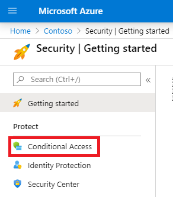

# Autenticação multifator para Microsoft 365Multi-factor authentication for Microsoft 365

As senhas são o método mais comum de autenticar uma entrada em um computador ou serviço online, mas elas também são mais vulneráveis.Passwords are the most common method of authenticating a sign-in to a computer or online service, but they are also the most vulnerable. As pessoas podem escolher senhas fáceis e usar as mesmas senhas para várias entradas em diferentes computadores e serviços.People can choose easy passwords and use the same passwords for multiple sign-ins to different computers and services.

Para fornecer um nível adicional de segurança para os logins, você deve usar a MFA (autenticação multifator), que usa uma senha, que deve ser forte, e um método de verificação adicional baseado em:To provide an additional level of security for sign-ins, you must use multi-factor authentication (MFA), which uses both a password, which should be strong, and an additional verification method based on:

- Algo que você tem com você não é facilmente duplicado, como um telefone inteligente.Something you have with you that is not easily duplicated, such as a smart phone.
- Algo que você tem exclusivamente e biológica, como digitalização, face ou outro atributo biométrico.Something you uniquely and biologically have, such as your fingerprints, face, or other biometric attribute.

O método de verificação adicional não é empregado até que a senha do usuário tenha sido verificada.The additional verification method is not employed until after the user’s password has been verified. Com a MFA, mesmo que uma senha de usuário forte seja comprometida, o invasor não tem seu telefone inteligente ou impressão digital para concluir a entrada.With MFA, even if a strong user password is compromised, the attacker does not have your smart phone or your fingerprint to complete the sign-in.

## Suporte da MFA no Microsoft 365MFA support in Microsoft 365
Por padrão, tanto o Microsoft 365 quanto o Office 365 dão suporte à MFA de contas de usuário usando:By default, both Microsoft 365 and Office 365 support MFA for user accounts using:

- Uma mensagem de texto enviada a um telefone que exige que o usuário digite um código de verificação.A text message sent to a phone that requires the user to type a verification code.
- Uma chamada telefônica.A phone call.
- O aplicativo de telefone inteligente Microsoft Authenticator.The Microsoft Authenticator smart phone app.

Em ambos os casos, a entrada MFA está usando o método "algo que você tem com você não é facilmente duplicado" para a verificação adicional.In both cases, the MFA sign-in is using the “something you have with you that is not easily duplicated” method for the additional verification.
Há várias maneiras nas quais você pode habilitar a MFA para o Microsoft 365 e o Office 365:There are multiple ways in which you can enable MFA for Microsoft 365 and Office 365:

- Com padrões de segurançaWith security defaults
- Com políticas de acesso condicionalWith Conditional Access policies
- Para cada conta de usuário individual (não recomendado)For each individual user account (not recommended)

Essas formas se baseiam no seu plano Microsoft 365.These ways are based on your Microsoft 365 plan.
    
|PlanoPlan  |RecomendaçãoRecommendation  | Tipo de clienteType of customer |
|---------|---------|----------|
| Todos os planos do Microsoft 365All Microsoft 365 plans | Use os padrões de segurança, que requerem MFA para todas as contas de usuário.Use security defaults, which require MFA for all user accounts.   Você também pode exigir a MFA em uma conta por usuário, mas isso não é recomendado.You can also require MFA on a per-user account basis, but this is not recommended. | Pequena empresaSmall business |
| Microsoft 365 Business PremiumMicrosoft 365 Business Premium    Microsoft 365 E3Microsoft 365 E3    Azure Active Directory (Azure AD) licenças Premium P1Azure Active Directory (Azure AD) Premium P1 licenses | Use as políticas de acesso condicional para exigir a MFA de contas de usuário com base na associação de grupo, aplicativos ou outros critérios.Use Conditional Access policies to require MFA for user accounts based on group membership, apps, or other criteria. | Pequena empresa para empresasSmall business to enterprise |
| Microsoft 365 E5Microsoft 365 E5    Licenças do Azure AD Premium P2Azure AD Premium P2 licenses | Use a proteção de identidade do Azure AD para exigir a MFA com base nos critérios de risco de entrada.Use Azure AD Identity Protection to require MFA based on sign-in risk criteria. |  CorporativoEnterprise |
||||

### Padrões de segurançaSecurity defaults

Os padrões de segurança são um novo recurso para assinaturas pagas ou de avaliação do Microsoft 365 e Office 365 criadas após 21 de outubro de 2019.Security defaults is a new feature for Microsoft 365 and Office 365 paid or trial subscriptions created after October 21, 2019. Essas assinaturas têm os padrões de segurança ativados, que:These subscriptions have security defaults turned on, which:

- Requer que todos os usuários usem a MFA com o aplicativo Microsoft Authenticator.Requires all of your users to use MFA with the Microsoft Authenticator app.
- Bloqueia a autenticação herdada.Blocks legacy authentication.

Os usuários têm 14 dias para se registrar na MFA com o aplicativo Microsoft Authenticator em seus smartphones, que começa na primeira vez em que eles entram depois de os padrões de segurança terem sido habilitados.Users have 14 days to register for MFA with the Microsoft Authenticator app from their smart phones, which begins from the first time they sign in after security defaults has been enabled. Após 14 dias, o usuário não poderá entrar até que o registro da MFA seja concluído.After 14 days have passed, the user won't be able to sign in until MFA registration is completed.

Os padrões de segurança garantem que todas as organizações tenham um nível básico de segurança para a entrada do usuário, que é habilitado por padrão.Security defaults ensure that all organizations have a basic level of security for user sign-in that is enabled by default. Você pode desabilitar os padrões de segurança em favor da MFA com políticas de acesso condicional.You can disable security defaults in favor of MFA with Conditional Access policies.

Habilite ou desabilite os padrões de segurança no painel de **Propriedades** do Azure AD no portal do Azure.You enable or disable security defaults from the **Properties** pane for Azure AD in the Azure portal.

Você pode usar os padrões de segurança com qualquer plano do Microsoft 365.You can use security defaults with any Microsoft 365 plan.

Para obter mais informações, confira esta [visão geral dos padrões de segurança](https://docs.microsoft.com/azure/active-directory/fundamentals/concept-fundamentals-security-defaults).For more information, see this [overview of security defaults](https://docs.microsoft.com/azure/active-directory/fundamentals/concept-fundamentals-security-defaults). 

### Políticas de Acesso CondicionalConditional Access policies

As políticas de acesso condicional são um conjunto de regras que especificam as condições sob as quais as entradas são avaliadas e permitidas.Conditional Access policies are a set of rules that specify the conditions under which sign-ins are evaluated and allowed. Por exemplo, você pode criar uma política de acesso condicional que declare:For example, you can create a Conditional Access policy that states:

- Se o nome da conta de usuário for membro de um grupo para usuários a quem são atribuídas as funções de administrador do Exchange, de usuário, de senha, de segurança, do SharePoint ou global, exija a MFA antes de permitir o acesso.If the user account name is a member of a group for users that are assigned the Exchange, user, password, security, SharePoint, or global administrator roles, require MFA before allowing access.

Essa política permite exigir a MFA com base na associação ao grupo, em vez de tentar configurar contas de usuário individuais para a MFA quando elas são atribuídas ou não a essas funções de administrador.This policy allows you to require MFA based on group membership, rather than trying to configure individual user accounts for MFA when they are assigned or unassigned from these administrator roles.

Você também pode usar as políticas de acesso condicional para recursos mais avançados, como a solicitação de MFA de aplicativos específicos ou que a entrada é feita de um dispositivo compatível, como o laptop executando o Windows 10.You can also use Conditional Access policies for more advanced capabilities, such as requiring MFA for specific apps or that the sign-in is done from a compliant device, such as your laptop running Windows 10.

Configure as políticas de acesso condicional do painel de **segurança** para o Azure AD no portal do Azure.You configure Conditional Access policies from the **Security** pane for Azure AD in the Azure portal.

Você pode usar políticas de acesso condicional com:You can use Conditional Access policies with:

- Microsoft 365 Business PremiumMicrosoft 365 Business Premium
- Microsoft 365 E3 e e5Microsoft 365 E3 and E5
- Licenças do Azure AD Premium P1 e do Azure AD Premium P2Azure AD Premium P1 and Azure AD Premium P2 licenses 

Para pequenas empresas com o Microsoft 365 Business Premium, você pode facilmente usar as políticas de acesso condicional com as seguintes etapas:For small businesses with Microsoft 365 Business Premium, you can easily use Conditional Access policies with the following steps:

1. Crie um grupo para conter as contas de usuário que requerem MFA.Create a group to contain the user accounts that require MFA.
2. Habilite a política **exigir MFA para administradores globais** .Enable the **Require MFA for global admins** policy.
3. Crie uma política de acesso condicional com base em grupo com estas configurações:Create a group-based Conditional Access policy with these settings:
    - Atribuições > usuários e grupos: o nome do grupo da etapa 1 acima.Assignments > Users and groups: The name of your group from Step 1 above.
    - Atribuições > aplicativos ou ações em nuvem: todos os aplicativos de nuvem.Assignments > Cloud apps or actions: All cloud apps.
    - Controles de acesso > conceder > conceder acesso > exigem autenticação multifator.Access controls > Grant > Grant access > Require multi-factor authentication.
4. Habilitar a política.Enable the policy.
5. Adicione uma conta de usuário ao grupo criado na etapa 1 acima e teste.Add a user account to the group created in Step 1 above and test.
6. Para exigir a MFA de contas de usuário adicionais, adicione-as ao grupo criado na etapa 1.To require MFA for additional user accounts, add them to the group created in Step 1.

Essa política de acesso condicional permite que você distribua o requisito da MFA para seus usuários em seu próprio ritmo.This Conditional Access policy allows you to roll out the MFA requirement to your users at your own pace.

As empresas devem usar [políticas de acesso condicional comuns](https://docs.microsoft.com/azure/active-directory/conditional-access/concept-conditional-access-policy-common) para configurar as seguintes políticas:Enterprises should use [Common Conditional Access policies](https://docs.microsoft.com/azure/active-directory/conditional-access/concept-conditional-access-policy-common) to configure the following policies:

- [Exigir MFA para administradoresRequire MFA for administrators](https://docs.microsoft.com/azure/active-directory/conditional-access/howto-conditional-access-policy-admin-mfa)
- [Exigir MFA para todos os usuáriosRequire MFA for all users](https://docs.microsoft.com/azure/active-directory/conditional-access/howto-conditional-access-policy-all-users-mfa)
- [Bloquear autenticação herdadaBlock legacy authentication](https://docs.microsoft.com/azure/active-directory/conditional-access/howto-conditional-access-policy-block-legacy)

Para mais informações, confira esta [visão geral do Acesso Condicional](https://docs.microsoft.com/azure/active-directory/conditional-access/overview).For more information, see this [overview of Conditional Access](https://docs.microsoft.com/azure/active-directory/conditional-access/overview).

### Azure AD Identity ProtectionAzure AD Identity Protection

Com o Azure AD Identity Protection, você pode criar uma política de acesso condicional adicional para [exigir a MFA quando o risco de entrada for médio ou alto](https://docs.microsoft.com/microsoft-365/enterprise/identity-access-policies#require-mfa-based-on-sign-in-risk).With Azure AD Identity Protection, you can create an additional Conditional Access policy to [require MFA when sign-in risk is medium or high](https://docs.microsoft.com/microsoft-365/enterprise/identity-access-policies#require-mfa-based-on-sign-in-risk).

Você pode usar a proteção de identidade do Azure AD e políticas de acesso condicional com base em risco com:You can use Azure AD Identity Protection and risk-based Conditional Access policies with:

- Microsoft 365 E5Microsoft 365 E5
- Licenças do Azure AD Premium P2Azure AD Premium P2 licenses

Para obter mais informações, confira esta [visão geral da Azure Active Directory Identity Protection](https://docs.microsoft.com/azure/active-directory/identity-protection/overview-identity-protection).For more information, see this [overview of Azure AD Identity Protection](https://docs.microsoft.com/azure/active-directory/identity-protection/overview-identity-protection).

### MFA de uma conta de usuário individual (não recomendado)MFA for an individual user account (not recommended)

Você deve usar os padrões de segurança ou as políticas de acesso condicional para exigir a MFA de suas entradas de conta de usuário. No entanto, se qualquer um desses não puder ser usado, a Microsoft recomenda a MFA de contas de usuário com funções de administrador, especialmente a função de administrador global, para qualquer assinatura de tamanho.You should be using either security defaults or Conditional Access policies to require MFA for your user account sign-ins. However, if either of these cannot be used, Microsoft strongly recommends MFA for user accounts that have administrator roles, especially the global administrator role, for any size subscription. 

Habilite a MFA para contas de usuário individuais no painel de **usuário ativo** do centro de administração do Microsoft 365.You enable MFA for individual user accounts from the **Active user** pane of the Microsoft 365 admin center.

Após a habilitação, na próxima vez que o usuário entrar, ele será solicitado a registrar a MFA e a escolher e testar o método de verificação adicional.After being enabled, the next time the user signs in, they will be prompted to register for MFA and to choose and test the additional verification method.

### Usando esses métodos juntosUsing these methods together

Esta tabela mostra os resultados da ativação da MFA com padrões de segurança, políticas de Acesso Condicional e configurações de conta por usuário.This table shows the results of enabling MFA with security defaults, Conditional Access policies, and per-user account settings.

|| HabilitadoEnabled | DesabilitadoDisabled | Método de autenticação secundáriaSecondary authentication method |
|:-------|:-----|:-------|:-------|
| **Padrões de segurança****Security defaults** | Não é possível usar políticas de Acesso CondicionalCan’t use Conditional Access policies |   Pode usar políticas de Acesso CondicionalCan use Conditional Access policies | Aplicativo Microsoft AuthenticatorMicrosoft Authenticator app |
| **Políticas de Acesso Condicional****Conditional Access policies** |Se alguma delas estiver habilitada, você não poderá habilitar os padrões de segurançaIf any are enabled, you can’t enable security defaults | Se todas estiverem desabilitadas, você poderá habilitar os padrões de segurançaIf all are disabled, you can enable security defaults | Especificado pelo usuário durante o registro da MFAUser-specified during MFA registration |
| **Configuração de conta por usuário (não recomendado)****Per-user account setting (not recommended)** | Substitui os padrões de segurança e as políticas de acesso condicional que exigem MFA em cada entradaOverrides security defaults and Conditional Access policies requiring MFA at each sign in | Substituído por padrões de segurança e políticas de acesso condicionalOverridden by security defaults and Conditional Access policies | Especificado pelo usuário durante o registro da MFAUser-specified during MFA registration|
||||

Se os padrões de segurança estiverem habilitados, todos os novos usuários serão solicitados a registrar o registro MFA e o uso do aplicativo Microsoft Authenticator na próxima entrada.If security defaults are enabled, all new users are prompted for MFA registration and the use of the Microsoft Authenticator app at their next sign-in.

## Maneiras de gerenciar as configurações da MFAWays to manage MFA settings

Há duas maneiras de gerenciar as configurações da MFA.There are two ways to manage MFA settings.

No portal do Azure, você pode:In the Azure portal, you can:

- Habilitar e desabilitar padrões de segurançaEnable and disable security defaults
- Configurar políticas de acesso condicionalConfigure Conditional Access policies

No centro de administração do Microsoft 365, é possível definir as configurações do serviço por usuário e da MFA.In the Microsoft 365 admin center, you can configure per-user and service MFA settings.

## Sua próxima etapaYour next step

[Configurar a MFA para o Microsoft 365Set up MFA for Microsoft 365](set-up-multi-factor-authentication.md)

